# 第12章：混合处理器

在整本书中，我们探讨了使用PostCSS，看到了在没有标准预处理器的情况下，我们如何构建一个更高效的满足我们需求的预处理器。 继续下去 -- 不再需要时间来构建处理器了吗？ 我们如何管理过渡？

这些都没问题，因为有Pleeease库！ 在本章中，我们将使用Pleeease的功能将预处理器和后处理器组合成一个进程，混合现有的系统，如Sass，LESS和Stylus。 在接下来的几页中，我们将看一些例子，并告诉你使用Pleeease有多么容易。

本章将讨论以下技术主题：

- 使用Pleeease库的好处
- 安装和配置
- Pleeease功能介绍
- 使用Node或命令行编译代码
- 设置配置文件
- 转换WordPress的安装并测试结果

让我们开始吧！

## 迈出第一步

当开发网站时，开发人员几乎总是有机会从头开始设计和构建; 我们可以决定使用的配色方案，网站结构及整体外观。

有时候，我们需要在现有的网站使用新技术。 这种情况下许多人想到的问题可能是：从哪里开始？ 当然，这将取决于许多因素，其中一个因素可能是在这样的网站实现中是否存在预处理器，如Sass或LESS。

PostCSS的灵活性和强大功能使我们能够轻松地从LESS或Sass转换到使用PostCSS。 在本章中，我们将探索一些可以用来开始转换过程的技巧。 我们将探讨一些可用的插件选项，然后看看将CMS系统（如WordPress）转换为使用PostCSS。

> 为什么选择WordPress？ 它是从Sass编译而来，但也使用PostCSS来处理浏览器前缀，我们将在本章后面使用附加插件来进行相应构建。

让我们开始这个旅程，我们的第一步是探索一些可以用来帮助我们开始从使用Sass到PostCSS的过渡过程的插件。

## 探索转换过程

回想一下第10章，花点时间来构建一个自定义处理器。

这一章的关键主题是汇集了我们前面章节涉及的一些插件，来创造我们的处理程序。到目前为止，使用的所有插件都是基于纯PostCSS，所以他们不能编译原始Sass代码。

我们简要地看一下CSStyle库，作为解决这个问题的一个可能的方法。这是一个强大的库，用于使用BEM原理生成干净的代码，但它要求代码使用特定的格式编写。 通常，这并没有什么问题。 每个开发人员的乌托邦应该是生产清洁，高效的代码，对吧？

但只有一个小问题，现实！ 使用CSStyle重写一个大型，复杂的电子商务网站而不花费大量的工作是不切实际的; 我们需要一个漫长的过渡期才能实现这种变化。 这不是不可能的，但是如果你的网站使用了多个样式表，使用BEM样式符号最好从头开始，或者至少使用在定义的块中。

所以如果对于我们的需求来说，使用CSStyle不是一个实用的解决方案，我们怎么完成这个改变？ 有一个更实用的解决方案可供我们使用 - 它可能需要更长时间，但是过渡更加平滑，并允许我们在一个更易于管理的转换过程中对我们的代码进行较小的更改：

- 我们首先介绍一个任务运行器来编译现有的处理器代码--对于使用诸如Sass或LESS之类的库都有Gulp或Broccoli插件，允许我们编译代码。
- 一旦我们转换到使用任务运行器，我们就可以介绍插件来处理核心进程，例如管理浏览器前缀，创建源映射，以及压缩我们的样式表
- 然后我们可以将我们现有的样式表分成更小的块，并在编译期间将每个文件导入主文件。 然后就可以使用PostCSS插件来代替现存的预处理器功能。 例如，我们可以使用`postcss-simple-varsto`创建新变量来替换现有的基于Sass的示例。

这个过程中的后续步骤应该是迭代的，直到一切都被转换，并且允许我们去除对现有处理器的任何依赖。 到目前为止，我们使用了相当多的Gulp任务文件，所以我们应该对它的基本使用相当熟悉。 如果我们使用Sass和Gulp，任务文件可能和这里的看起来很像：

	var gulp = require('gulp');
	var postcss = require('gulp-postcss');
	var sass = require('gulp-sass');
	var autoprefixer = require('autoprefixer');
	var cssnano = require('cssnano');
	    gulp.task('css', function () {
	        var processors = [ autoprefixer, cssnano ];
	        return gulp.src('./src/*.scss')
	          .pipe(sass().on('error', sass.logError))
	          .pipe(postcss(processors))
	          .pipe(gulp.dest('./dest'));
	});

在这个例子中，我们使用Sass和PostCSS的Gulp插件。Sass代码是在PostCSS添加浏览器前缀之前编译的，代码在最后被压缩。

这个过程的好处是，我们可以控制转换比率。 我们不必一次性转换全部，并且可以选择性地在过程中的每个点来转换。 虽然仍然会有对外部库的依赖，但这是暂时的; 我们可以在所有内容都转换为使用PostCSS时删除该依赖关系。

### 选择我们的插件

假设我们已经在转换过程中使用任务运行器，那么接下来我们要做什么呢？

好了，现在是时候基于我们网站提供的功能来选择我们需要使用的插件了。 下面是帮助你开始的更有用的插件：

| 插件名称 | 插件作用 |
| ------- | ------- |
| postcss-mixins | 如果您的代码中包含了Sass的混合宏，这个插件格式和其非常相似，所以可以在编辑器中使用搜索和替换处理。  地址：https:// github.com/postcss/postcss-mixins |
| postcss-nested | 嵌套是Sass中一个很重要的概念，那么`postcss-nested` (地址：https://github.com/postcss/postcss-nested)插件是一个不错的选择，可以复制Sass的嵌套功能。  加上这个，`postcss-nested-props`和`postcss-nested-vars`插件可以用于打开任何属性和变量的嵌套|
| postcss-sassy- mixins | 如果当我们有可重用代码块，我们可以使用混合宏来处理，帮助我们在样式表中减少重复的代码块。   借用Sass的这个重要概念，这个插件实现了Sass类似的功能，并且允许我们在Sass和PostCSS中轻松转换。地址：https://github. com/andyjansson/postcss-sassy-mixins |
| postcss- simple-extend | 如果元素有共同样式，我们可以通地扩展功能删除一些重复样式，这种做法在Sass中非常可见。在PostCSS使用`postcss-simple-extend`( https://github.com/davidtheclark/postcss- simple-extend )插件可以完美的实现类似功能。|

根据你的需求，也有其他插件可用。 大多数可用的插件是服务于Sass的，但这只是因为它比较成熟; 毫无疑问，随着时间的推移，服务于其他处理器如LESS或Stylus的插件也将变得可用。

> 从http：//postcss.parts可以看到PostCSS插件目录的更多细节。

添加单个插件是一个完全可以接受的选择，但如果我们添加的不仅仅是几个插件用来模仿Sass代码怎么办？ 有两个可用的选项，在我们的列表中没有涵盖 —— 使用PreCSS或Pleeease库。

Pleeease库设计用于处理一些较为琐碎的任务，这些任务在编译代码时是不友好的。 虽然不是所有支持的任务都适用，但至少适合三种情况：压缩代码，添加浏览器前缀和生成源映射。

与之对比，PreCSS库可能更有用，因为它是一个模拟Sass功能的插件集合。 而且比较好的是，我们只需要安装一个插件来处理更改; PreCSS使用单个接口来抽象PostCSS样式到有效CSS的手动转换。我们将在本章的稍后部分中更详细地探讨使用它，现在，让我们先将注意力转移到Pleeease库。

## Pleeease简介

Pleeease库（可从http://pleeease.io/获得）旨在简化预处理器的使用，并将在一个库中使用多个工具的优势结合在一起。 这意味着我们可以在编译代码时将它配置为除PostCSS之外的三个处理器中的任意一个，例如Sass，LESS或Stylus。 编译还可以包括我们可能需要执行的所有典型任务，例如生成源映射，添加浏览器前缀和压缩结果。

该库很容易安装。以最简单的版本，我们可以使用配置文件在命令行编译。 或者，我们可以使用几个插件中的任何一个插入任务运行器，如Gulp或Grunt。 让我们花一点时间来更详细地探讨这一点，从安装和配置插件开始。

### 安装和配置Pleeease

Pleeease库基于Node.js; 它可以很容易的通过命令行手动安装和使用，或者通过任务运行器（如Gulp）安装。 让我们开始来让所有设置可用：

第一步：我们将从安装Pleeease库开始。为此，继续启动一个Node.js命令提示符会话，然后将工作文件夹更改为我们的项目目录。

第二步：在提示符下，输入`npm install -g pleeease-cli`，然后按Enter。等待Node完成安装。

此时，Pleeease库已安装并配置为从命令行可用。如果Node提示需要更新的元素，则可能需要运行`npm update -g n` 使您的版本保持最新。 如果是Windows用户，那么有一个方便的PowerShell脚本：https://github.com/felixrieseberg/npm-windows-upgrade，帮助你完成这个过程。

> 您可能会收到关于`graceful-fs`和`lodash`的已弃用模块的警告：就这个示例来说，这些可以被忽略。

假设我们没有遇到安装Pleeease的任何问题（忽略上面提到的一些警告），那么我们现在就可以开始使用Pleeease。 在接下来的几页中，我们将手动编译以及使用Gulp作为我们喜欢的任务运行器。我们将看到在命令行使用`.pleeeaserc`文件执行基本编译是多么容易。

> 基于本章的目标，我们将集中使用Sass;如果你的偏好是使用LESS，你可以使用`gulp-less`作为替代。 同样，如果使用Stylus，那么`gulp-stylus`插件也将与Pleeease配合良好。

### 手动编译代码

使用Pleeease库编译代码的最简单的方法是使用`.pleeeaserc`配置文件。

这类似于（简化的）JSON文件，其外观如下所示：

	{
	    "in": ["foo.css", "bar.css"],
	    "out": "baz.css",
	    "browsers": ["last 3 versions", "Android 2.3"]
	}

看起来很简单，不是吗？ 我们只需要指定我们的源文件（`in`），以及我们想要的输出（`out`）。 在这个例子中，我们更进一步，指定所需的浏览器支持的水平。这主要是为了确保已应用了正确的浏览器前缀。

此设置使用与Autoprefixer相同的配置：我们可以同样在Browserslist查询列表：https://github.com/ai/browserslist#queries找到有效查询。

如果我们不想使用任务运行器，或者我们希望保持我们的流程简单，这是一个有用的编译方法。 唯一的缺点是，我们不能绑定任何其他可以自动化的任务，例如用`.min.cssextension`重命名编译的样式表。为此，我们需要使用一个任务运行器，如Gulp。

如果我们使用任务运行器，将带来许多益处，例如自动化进程来调整图像大小，重命名编译的样式表，检查我们的代码一致性。 在我们这样做之前，让我们来介绍一个有用的提示。Pleeease网站包括一个在线演示（可在http://pleeease.io/play/获取）。我们可以使用它来帮助我们熟悉使用库，然后才开始编译生产站点的代码：

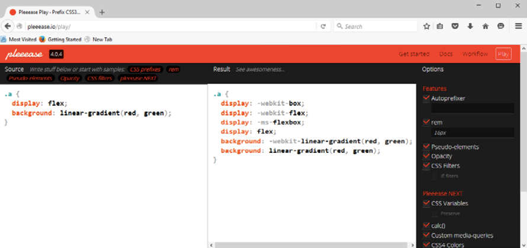

好吧，说的已经足够了：是时候开始实用！ 对于一些任务，在命令行编译可能就足够了，但在现代这个自动化时代，为什么还要花时间执行可以轻松实现自动化的手动过程？

### 使用任务编译代码

不知道你有没有猜到，我是使用Node.js的粉丝。我选择Gulp作为任务运行器。我曾经使用Grunt，但我发现Gulp在有些时候更容易使用。我不知道为什么！ 但无论如何，两者都可以和Pleeease配合使用，所以如果你的偏好不是Gulp，那也只需要对有些代码稍作修改。

让我们来完成使用Gulp运行我们的编译过程所需的步骤：

第一步：启动Node.js命令终端，然后更改工作文件夹到我们的项目区。

第二步：在提示符下，输入这些命令，按Enter键：

	npm install gulp-pleeease

保持Node.js命令提示会话打开，我们将很快需要它。

第三步：从这本书附带的代码中提取`T65 – using gulp-pleeease `文件夹，复制到我们的项目根目录。

第四步：将`package.json`和`gulpfile.js`文件复制到我们项目的根目录，然后从`T65 – using gulp-pleeease`下的`src`文件下复制`example.css`放 在我们项目根目录下的`src`文件夹。

第五步：回到Node.js命令终端，然后在提示符下输入`gulp`，按Enter键：

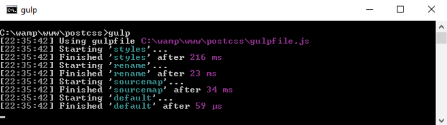

假设编译成功，Gulp将在我们项目区域的根目录下的目标文件夹中生成现在熟悉的文件。 观察结果，我们可以看到它已经压缩了文件，添加了浏览器前缀，并将`blue`和`red`颜色属性转换为等价的`hex`值。

让我们好好利用这个技巧，并创建一个简单的网页作为我们如何使用Pleeease的例子。 当检查我们的Gulp文件时，我们将看到，我们使用的插件还不及我们以前练习中使用的一半，因为Pleeease从它的插件中添加了支持。

### 使用Pleeease创建Demo

在本书的许多演示中，我们不得不导入一系列插件来管理不同的任务，如压缩代码或检查一致性。

这种方法没有什么技术上的错误，但它是低效的。毕竟，如果一个就够了我们为什么使用要六个工具？ 我们试图在整本书中保持一个插件对应一个任务的工作规则，所以为什么我们违反约定？

使用Pleeease的好处在于它已经包含了对其他一些需要单独插件的任务的支持; 这意味着我们可以删除Gulp任务文件中引用的一些插件。 Pleeease只是一个通过一个公共接口抽象支持六个其他插件的层。

让我们在一个简单网页中以编译样式的形式来使用：

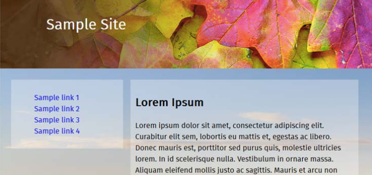

让我们开始吧：

第一步：从本书附带的代码中提取`TXX – creating a page using pleeease`文件夹并保存到我们项目的根目录。

第二步：从`css – completed version`文件夹中复制`styles – pre compile.css`文件重命名为`styles.css`，并且放置到我们项目根目录下的`src`目录。

第三步：从`tutorial`文件夹根目录中复制`gulpfile.js`和`package.json`文件到项目的根目录。这些应该替换所有已经存在于我们项目根目录的文件。

第四步：启动Node.js命令终端，然后更改工作文件夹到项目区。

第五步：在提示符下，输入`gulp`，按Enter键。Pleeease将会运行并编译我们的代码，并在我们项目根目录下的`dest`文件夹中输出有效的样式表文件。

第六步：完成后，将`dest`文件夹的内容复制到`tutorial`文件夹下的`css`文件夹中。

如果我们尝试通过双击`webpage.html`预览我们的工作结果，我们应该看到一个网页，类似于这个演示开始时的屏幕截图。 然而，真正的成果是在Gulp任务文件中。与我们在之前的演示中创建的其他示例相比，我们完全删除了一个任务，并减少了超过一半的插件数量！

## 和其他处理器一起编译代码

但是有一个问题。到目前为止，我们使用Pleeease的所有工作都是基于PostCSS的; 如果我们使用一个处理器如Sass作为生成我们的代码的基础呢？

不幸的是，这是Pleeease不支持的地方。虽然它包括对Sass，Stylus和LESS的支持，但仍然处在实验性阶段。 导致问题的一个例子是嵌套; 当配置为使用Sass时，Pleeease尚未支持嵌套。 这降低了使用Pleeease的吸引力。但是，使用PostCSS的一个主要原因是删除对Sass等库的任何依赖！

针对这一点，我们需要使用`gulp-sass`插件。 这是`libsass`库的一个包装器。 为了实现这一点，我们将添加一个这样的任务到我们的Gulp任务文件：

当使用这种方法时，我们可以预先编译我们的Sass代码到有效的CSS然后使用PostCSS插件进行转换。 麻烦的是，它似乎是一种低效的编译我们代码的方式。有一个更好的选择，是PreCSS库提供的一种形式。

## 使用PreCSS

好吧...可能你会问，为什么它是更好的选择？

简单的答案是，我们可以直接编译类似于Sass代码，而不使用libsass等外部库。 不同之处在于，它工作方式类似Sass代码，而不是直接使用Sass编译代码。

这不是一个问题，但我们可以使用文本编辑器的搜索和替换轻松地执行要修改的代码，使其兼容PreCSS。 库源码可从https://github.com/jonathantneal/precss获取; 开发者甚至提供了一个我们使用的在线演示：https://jonathantneal.github.io/precss/，以便我们可以在提交代码之前尝试更改。

在这一点上，我们将打破惯例。 不再是产生一个简单的网页，让我们更进一步，使用内容管理系统，如WordPress。 为什么？ 由于两个原因：WordPress已经使用PostCSS和Sass。对于继续使用相同的工具有很好的意义！ 在此基础上，让我们深入了解，并更详细地使用两者。

## WordPress中安装转换器

我们现有的所有示例都是基于单页; 许多开发人员可能使用内容管理系统，如WordPress。

幸运的是，我们可以应用到目前为止我们使用到的许多相同的原则来为WordPress提供样式。 事实上，我们可以使用一些类似Sass的插件，来创建核心样式表作为下载的每个 WordPress的主题。 我们将使用的主题是Twenty Sixteen，自2015年12月以来和下载的当前版本的WordPress共同工作; 它也可以从https://wordpress.org/themes/twentysixteen/下载。

对于本章的剩余部分，我们将探讨一些可用于将PostCSS纳入WordPress主题的提示和技巧。 这里要注意的一点是，我们已经介绍了一些可以使用的任务。如果足够细心并合理规划，可以在为CMS应用程序创建样式表时轻松地重复使用。 我们将探讨一些我们可以使用的提示和技巧。这些将针对Twenty Sixteen主题，它们也可以同样用于为WordPress开发的其他主题。

> 下一个例子假定对WordPress有一些了解，以及有一些使用Sass或LESS的基础。 如果你是一名新手，我建议去阅读一些相关的主题文档。

让我们开始吧。 我们的第一个任务是建立我们的环境。 在我们设置我们的环境之前，我强烈建议您有一个本章下载代码的副本。很多的讨论将要参考这些代码！

## 配置生产环境

为了获得本章的最佳内容，我们需要首先进行WordPress的安装。如果没有安装过，有两种方法可供选择：

- 我们可以使用Web服务器将WordPress安装为本地托管的应用程序，例如WAMPSever（http://www.wampserver.com/en）或Apache（http：//www.apachefriends.org-if你是Linux或Mac用户）
- 我们可以使用自己的网络空间上安装的WordPress版本

为了本书的目的，我们将使用前者来获取WordPress，转到http：//www.wordpress.org并点击屏幕右侧（靠近顶部）的蓝色下载WordPress按钮。

我将假设我们的WordPress已经本地安装在`C:\wamp\www\wordpress`下，使用您选择的本地Web服务器，按照https://codex.wordpress.org/Installing_WordPress上的说明。 我的首选是使用WAMPServer（可从http://www.wampserver.com/en获得），但如果您想使用不同的网络服务器或文件夹，请相应地调整步骤。

好了，WordPress安装，配置，准备好了，让我们开始吧。下一步是查看我们可用于开始转换过程的选项。

> 本章其余部分给出的步骤将面向Windows，因为这是作者通常使用的平台; 如果您使用Linux或Mac设备，请相应调整。

## 考虑转换过程

当使用一般WordPress样式表时，应该从哪里开始呢？

首先，我们不应该因为它的大小而退却。 是的，我知道这可能听起来很疯狂（毕竟，Twenty Sixteen主题有3920行！），但是有了一些规划，我们可以轻松地把它变成更易于管理的东西。

如果我们只用PostCSS实现一个任务，那么该任务应该使用`postcss-import`插件来使我们的代码变得更容易管理。 如果你碰巧使用了Sass或LESS之类的处理器，那么它们的原理也是一样的。 在我们的主`style.css`中，我们可以创建一系列`import`语句，将每个块分割成单独的文件。

一旦我们把样式表破解成更易于管理的块，我们的代码中就可以做事情了。 我们应该总是认为它是一个迭代过程，直到我们耗尽所有可能的替代品，不再需要站点，或者我们迁移到不同的解决方案。 在接下来的几页中，我们将介绍可能出现的一些想法和注意事项，这有助于您开始对主题进行更改。 所以不用多说，我们从哪里开始呢？

首先，明确的一点是使用Autoprefixer; WordPress充分利用CSS3样式，其中一些特性仍需要浏览器前缀。 但是，这里的一个考虑是，由于我们将从原始样式表向后工作，我们将需要删除现有的浏览器前缀，并设置我们的任务运行器自动添加它们。 使用WordPress中的现有样式表是必要的，但我们应该只做一次！ 可能有一个选择是创建一个mixin管理浏览器前缀，但这不是最佳实践。 Autoprefixer将在每次编译时更新样式。

我们已经对使用早期示例中的Autoprefixer比较熟悉。同样，我们也可以压缩缩小我们的代码，这将有助于减少带宽使用。 添加这样的功能应该很容易。我们可以使用之前的演示相同的任务，只要我们设置正确的任务顺序。 我们需要让它直接编译`style.css`（这是WordPress样式表的主要文件），但是由于我们的处理器将面向使用WordPress，这不会是一个问题。

我们可以看到的另一个领域是在像素基础上对`rem`单位的支持。 许多开发人员对于使用`rem`作为度量单位有自己的看法; 一些人说像素值工作得很好，但它的适用性将取决于它应用的地方。 除此之外，Gulp有一个合适的插件，如果我们需要它，我们可以使用它来提供这个功能。

一种真正影响我们的代码的方式是使用嵌套。 这是一种常用的预处理器技术，如Sass，并涉及以嵌套格式编写代码。 最大的好处是删除重复的代码。 它是一种形式的速记法（一般说法），并在编译时转换为有效的CSS。

还有一个有用的技术是使用变量; 这些工作方式与脚本或编程语言大致相同。 现在在实现目标之前，不要担心：他们很容易使用。 我们需要提供一个位置名称及其所代表的值的列表; 我们可以在代码中搜索和替换每个值，并用适当的变量替换它。 为什么这样？ 很简单：如果你以后改变颜色，你只需要在一个地方改变它; PostCSS将在编译阶段自动为您更改所有其他实例。

如果你想真正深入WordPress的核心代码，它的代码库很值得研究https://core.trac.wordpress.org/browser/trunk/。 如果你仔细看，你应该甚至能看到PostCSS的使用！

好吧，说了足够多了：让我们来一些代码吧！ 我们在下一个演示中做出更改的目的仅仅是我们将PostCSS插件（或Gulp）用于我们的过程。 我们将首先探索我们需要做的更改，并将这些同你的想法一起，作为使用PostCSS的一部分。

## 修改代码

虽然我们只介绍了几个想法，但仍然有几个步骤要经过; 最关键的（保持你的理智！）是每个块逐步完成，而不是一次完成。

我们的大部分更改将使用我们在早期演示中创建的任务; 为此，我们将添加PreCSS库（从https://github.com/jonathantneal/precss），以及`postcss-import`和`gulp-pixrem`插件。 有了这些，我们就可以开始了- 我们的第一个任务是将代码拆分为多个更易于管理的样式表。

### 拆分样式

这个过程的关键是拆分我们的样式表。 为此，我们将使用`postcss-import`插件，来自https://github.com/postcss/postcss-import：

第一步：我们将一如既往地启动一个Node.js命令终端，将工作文件夹更改为项目的根目录。

第二步：在提示符处，继续输入此命令，然后按Enter键：

	npm install postcss-import --save-dev

第三步：等待Gulp完成安装过程。

接下来，我们需要将样式表分成单独的块; 最方便的方法是根据`style.css`顶部的列表将其拆分为多个部分：

第一步：在我们项目根目录的`src`文件夹中，创建一个名为`css`的新文件夹。

第二步：继续，在`Twenty Sixteen` 文件夹中打开一个`style.css`的副本。它位于`C:\wamp\www\wordpress\wp-content\themes\twentysixteen\`。

第三步：将其保存到项目根目录的`src`文件夹中

第四步：在第53行或第53行附近，添加以下行：`@import“css / variables.css”;`。 先不要管它用来做什么。这将在本章后面进行解释。

第五步：找到第54到252行，然后将它们复制到一个新创建的文件`normalize.css`中，并放到根`src`文件夹中的`css`文件夹中

第六步：在`src`文件夹中的`style.css`文件中，添加这些`import`语句，如下面所示：

第七步：重复此过程，直到将所有片段提取到自己的文件（1到15）。使用与每个主要部分相同的名称保存它们。

> 注意，保存文件时，您不需要拆分第11至15节到它们的子部分。将它们保存在它们各自的文件中。

第八步：我们有最后一步要执行：我们需要Gulp任务文件！在这本书下载的代码中，继续从`T68 - converting a WordPress theme`文件夹中提取一个`gulpfile.js`和`package.json`文件，然后保存到我们项目的根目录。

第九步：快速查看下`gulpfile.js`文件，特别是第31到35行：

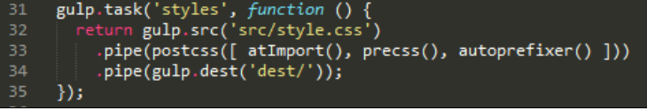

注意，我们为何不像以前的练习那样直接编译`style.css`？因为它不是最理想的，但因为WordPress主题默认使用`style.css`，这可以作为我们的编译过程的一部分。

### 添加浏览器前缀

我们的下一个任务是安装对添加浏览器前缀的支持。在某种意义上，我们已经涵盖了如何实现这一点。 我们以前的演示中大多数（如果不是全部的话）已经包括使用Autoprefixer插件实现浏览器前缀的支持。

提醒一下，Autoprefixer可从https://github.com/postcss/autoprefixer获取; 在https://autoprefixer.github.io/有一个在线版本，我们可以用来测试更改。

如果我们看一下我们在上一个例子中下载的Gulp任务文件，我们可以看到autoprefixer插件已经作为运行PostCSS的一部分被调用：

但是，在这个阶段我们应该注意几个关键点。

当使用Autoprefixer插件时，它使用来自“Can I Use”网站的数据（http://www.caniuse.com）来更新已经过期的浏览器前缀。 有必要花时间浏览你的样式表，以确保它没有包括浏览器前缀。如果有的话，需要删除。

我们可以手动删除它们，或更有效的方式是使用`postcssremove-prefixes`插件，可从https://github.com/johnotander/postcss-remove-prefixes获取。 我们可以将它添加到我们的Gulp任务文件，或直接从命令行运行它。 关键是首先完成删除，以便Autoprefixer可以管理浏览器前缀。

WordPress已经使用Autoprefixer来管理浏览器前缀。你可以在https://core.trac.wordpress.org/browser/trunk/Gruntfile.js中的Gruntfile看到证明。 当然，它使用Grunt，但是对于使用Gulp或者其他可用的与PostCSS兼容的任务运行器的人来说，这个过程非常相似：

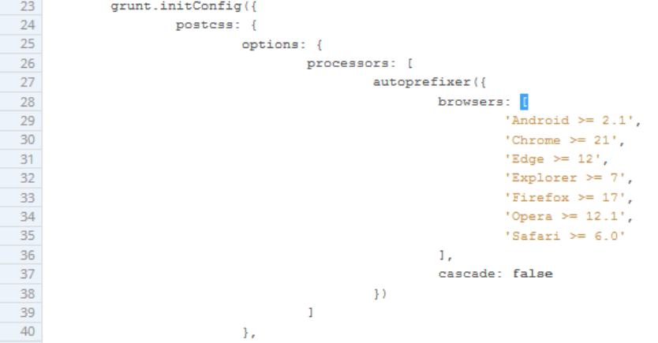

虽然在我们的Gulp任务文件中设置Autoprefixer是非常容易的。如果我们花时间删除任意浏览器前缀，然后可以成功地在编译时自动添加。 `postcss-remove-prefixes`插件将删除一些简单的例子，如下面的例子，所以我们留下了无前缀的版本，然后Autoprefixer可以在编译期间更新：

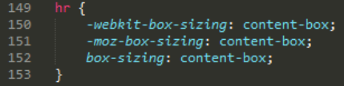

我们应该执行的最终核心任务是检查我们的代码的一致性。现在，这应该是一个非常熟悉的任务，因为我们已经从早期的演示中设置了一个合适的任务，可以很容易地重用于编译WordPress主题 。 现在是重新审视这项任务的时候了。 为了确保它能正常工作，我们需要稍微修改设置，让我们现在就开始。

### 检查代码的一致性

如果我们看看在这些更改开始时保存的Gulp任务文件，我们应该看到这个配置对象：

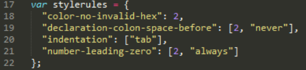

稍微进一步是任务，这里有两个变化：我们已经硬编码目标文件，并且已经调整的顺序，以允许存在`pxrem`任务。 缩进设置也已在配置对象中更改。在编译时，样式表使用`tabs`缩进。

这将抛出很多警告，我们可以手动更改3000多个条目，或更改缩略图的检查方式。 希望我们喜欢这个无脑的工作，至少在短期内如此！

除了这两个变化，剩下的任务没有改变：

好吧，让我们改变一下：有一个我们应该运行得更核心的任务，来压缩我们的代码。 我们已经在许多演示中使用它，但让我们花一点时间在编译WordPress主题的上下文中重新访问它。

### 压缩代码

如果我们必须对使用PostCSS执行的前四个关键任务进行排名，那么下一个任务肯定在该列表的顶部。 压缩我们的代码是节省带宽使用的关键 —— WordPress主题不是轻量级的！

我们的Gulp文件已经有这个内置：`package.json`文件有适当的参考集。 如果我们更详细地看一下任务文件，我们应该看到类似这样的东西：

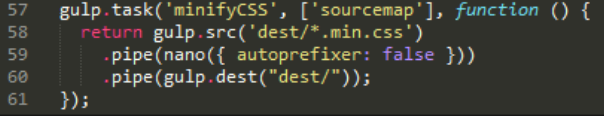

看起来很熟悉？ 它几乎是我们在早期演示中使用的现有任务的直接副本。 我们关闭了autoprefixer，因为这在我们的Gulp文件中的其他地方被使用。

让我们继续。 WordPress使用Sass作为主要的预处理器; 我们可以使用Pleeease库来编译Sass和PostCSS代码，但一个更干净的选择是使用PreCSS库。 这个摘要支持一些模拟Sass代码的插件（但可以说没有Sass包袱）。让我们更详细地看看这个。

### 创建变量

Sass（和其他处理器）的一个关键特性是能够使用变量作为值的占位符。 这些变量在编译时转换为有效的CSS样式。

你可能会问，为什么使用它们？ 答案很简单，当你要更改字体集（font family）或颜色，你想要在成千上万行使用到它们的代码里来逐一更新吗？ 我希望答案否定的--并且确实如此：我们有更重要的事情要做！ 其中之一是安装插件，来实现以PreCSS的形式添加变量支持。

我们已经在早期的演示中安装了PreCSS，接下来需要做的是确保它被正确地添加到我们的Gulp任务文件（它已经在我们附带的`package.json`文件中）：

我们真正需要做的是改变我们的样式表。让我们看看需要做什么：

第一步：我们需要创建一个文件来存储我们的变量。 在我们项目根目录下的`src`文件夹下的`css`子文件夹中创建一个空白文件，并将其标记为`variables.css`。

第二步：打开`variables.css`文件，加入下面这些值：

	/**
	* 0 - Variables
	*/
	/**
	* 0.1 - Colors
	*/
	$lightgray: #d1d1d1;
	$almostblack: #1a1a1a;
	$verydarkgray: #686868;
	$white: #ffffff;
	$verylightgray: #f7f7f7;
	$strongblue: #007acc;
	/**
	* 0.2 - Fonts
	*/
	$Monserrat: Montserrat, "Helvetica Neue", sans-serif;
	$OpenSans: "Open Sans", sans-serif;
	$Merriweather: Merriweather, Georgia, serif;
	$Inconsolata: Inconsolata, monospace;
	/**
	* 0.3 - Font Sizes
	*/
	$baseSize: 16px;

第三步：保存文件，如果我们回顾一下分割样式表的内容，你会注意到，我们已经有了一个主样式表的链接：

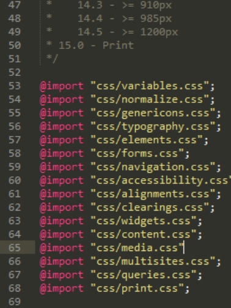

第四步：此文件中的值将替换代码中的占位符，以生成有效的CSS。

第五步：下一个任务有点麻烦，我们必须处理每一个我们引入的样式表，用变量替换现有的相等的值。 这个截图显示了部分示例。这里`font-family`值已更新，但边框值尚未更改：

第六步：当每个文件被更改，就可以保存它们，然后准备下一个练习。

没有简单的方法来绕过它，改变WordPress主题样式表可能需要大量的耐心！ 管理它的最好方法是使用编辑器的搜索和替换功能，如Sublime Text 3（作者偏好的编辑器）有一个非常有用的工具来替换多个文件中的文本; 使用它将有助于减少更新每个文件所需的手动工作。

### 添加支持rem单位

下一个任务可能引起争论 -- 改变我们的代码以使用`rem`单位，自动添加`px`降级。

一些开发人员声称像素值也可以很好地工作; 有人说这取决于你在哪种场合下指定一个值，使用某个度量单位。 无论如何，我们可以使用PostCSS自动添加像素降级支持。 此插件的源代码可从https://github.com/gummesson/gulppixrem获得。 让我们来探讨添加对`rem`单位的支持需要什么：

第一步：打开一个Node.js命令终端，或者如果上一个会话仍然可用，还原到它。

第二步：确保工作文件夹设置为项目文件夹的根目录，然后在提示符下输入此命令并按Enter键：

	npm install gulp-pixrem --save-dev

第三步：Gulp将安装该插件，等待它完成安装

第四步：我们的Gulp任务文件已经就绪，如果我们仔细看代码，我们可以看到它在第39行调用：

现在，我们一切就绪。下一个任务是通过我们创建的各种样式表开始工作，并用等效的`rem`替换所有`px`值。

这是一个无关紧要但确很必要的任务。插件将为我们的代码中找到的`rem`单位添加`px`降级值。 依照改变的值，它可以按照我们的需求做的尽可能多。 值需要做一些改变，以确保代码顺利编译，但剩余的改变可以慢慢做。

当编译代码时，我们将得到类似于这个例子的代码，这份摘要来自Widgets部分（第10节）：

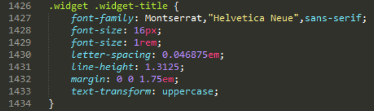

简单地将样式表转换为使用像素降级支持很容易。关键是，我们需要在`rem`、`px`或`em`单位等中做出选择。

接下来，我们可以设置两个任务作为我们编译过程的一部分。如何模仿Sass嵌套样式的能力，以及创建微循环以自动生成某些样式？ 如果你对这些不熟悉，也不要担心。让我们进一步深入，看看这些行为能带来什么意义。

### 样式表中的嵌套规则

当使用诸如Sass处理器时，样式的嵌套是一个常见的特征。如果我们有一堆非常相似的选择器样式，我们不希望重复地创建它。

我们可以接受这种重复，但更明智的选择是提取出选择器的核心部分，然后嵌套后代内的块。这是`typography.css`文件的例子：

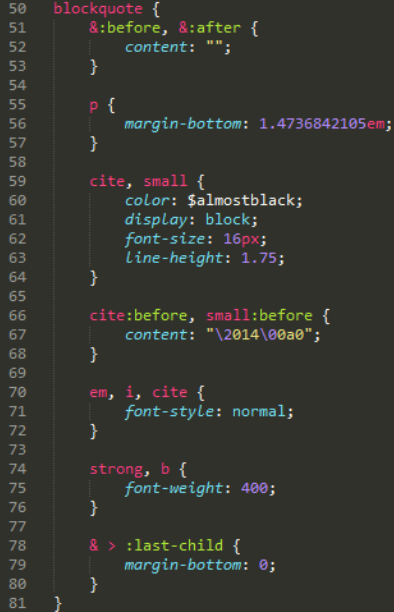

我们的目的是避免写相同的重复的父样式。我们可以专注子样式！ 虽然代码看起来更长，但它更容易阅读; 我们可以将具有共同父级的样式组合在一起。

这个技术很容易上手，但是又很难正确掌握; 如果你不熟悉它，那么我建议看看我的两本书，《SASS SASS Essentials》和《SASS CSS How-to》，可以在https://www.packtpub.com/找到。

一旦编译完成，代码将显示为正常的CSS。 但是有一件事要注意：要克服嵌套一切的诱惑; 嵌套的使用最好能为你大量代码带来真正的不同！

### 样式表中的循环规则

我们可以对我们的代码进行更多的改变。看看我们在本章前面创建的`media.css`文件，特别是第158行到结束：

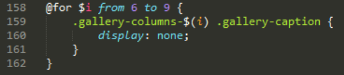

我已经听到你们在问，这是什么意思，为什么我们可以在代码中使用这样的编程循环？ 在这种情况下，我们借用Sass的一个特性，即创建循环; 这个功能，加上字符串拼接，可以让我们自动创建规则。

> 字符串拼接在我们的代码中创建一个占位符，它将在编译时用确定值进行转换。

代码编译完成后，看起来像这样：

这是一个需要掌握的更先进的特性，但值得为此花费时间。 如果应用正确，它可以节省大量的创建样式的时间！

现在让我们思考些别的。我们的介绍涵盖了一些有助于你开始的概念; 还有介绍了除必备的基础知识外，一些我们可以在以后的日子用到的想法。让我们花一点时间考虑更多相关细节。

### 考虑未来特性

在过去几页中，我们介绍了一些领域，在这些领域中PostCSS可以帮助我们更好地管理WordPress样式表。 重要的是，应该使用什么并没有硬性和快速的规则，但每个样式表都有自己的需求。

我们所覆盖的内容只停留在表面。对于那些熟悉Sass的人，可能会问为什么我们不使用Sass mixins。其实，我们并没有阻止这样做：这里只是提供了一些选项，让我们在转换阶段跟快速和容易的取得成果。

让我们暂停一下，考虑一些其他的想法，将有助于你开始更新样式表：

- 添加mixins：这是常见的选择，但是需要好的设计; 它可以创建在我们的代码中随意重用的代码块。
- 颜色降级：虽然不是我们到目前为止使用的PreCSS包的一部分，但颜色降级也是一个选项。 核心WordPress
主题使用标准HEX记法; 我们可以使用等效RGB更新它，并使用PostCSS插件添加HEX值。 如果我们喜欢，我们甚至可以使用一个插件，如`postcss-rgba-hex`，从`RGBA`颜色转换为纯`HEX`。 你可能喜欢使用前者，或者有需要使用前者格式的场合。
- 字体支持：如何在PostCSS中结合font-magician插件？ 如果我们去看之前创建的变量文件，它包含许多
非标准字体（至少对Windows）; 这意味着我们的WordPress主题看起来会有点平淡！ 幸好，我们可以使用font-magician插件为非标准字体提供font-face支持; 它们的大多数，如Inconsolata，Open Sans和Merriweather可从Font Squirrel网站http://www.fontsquirrel.com获取。

我们选择了三种方法来帮助扩展你的主题。 使用一个任务运行器，如Gulp，我们只会受到Gulp插件的丰富度的限制。 我们不必只限于PostCSS插件; 这将限制我们可以做什么，也意味着我们可能错过有用的功能。关键是要考虑你想做什么变化，并计划如何和何时使它们。过程应该是迭代的，这将有助于管理变化！

## 编译和测试修改代码

在过去几页中，我们介绍了一些关键任务，可以用来完美的编译WordPress主题。

理想情况下，我们会尽可能自动化，或者至少在有意义的任务上如此，例如删除几乎没有价值的手工任务。 然而，关键是要充分考虑这些任务应该执行的顺序; 接受到的有效样式表不同，排序也不同...好吧，只能归类为垃圾之间的区别！ 是的，这可能看起来有点极端，但如果任务顺序不正确，那么你可以得到编译文件将破坏你的主题。

先把它放一边，让我们来编译我们的代码。为了这个练习的目的，我们将使用在本书附带下载的代码中提供的预编辑文件的副本。

> 安全起见，在继续之前，你可能需要保存位于项目根目录的`src`文件夹中创建的源文件的副本。

为了更好的展开我们的讨论，这里提供一个Twenty Sixteen主题的截图：

让我们开始吧：

第一步：我们将从下载代码中提取` T68 - converting a WordPress theme`下`src`文件夹，将其保存到项目根目录。 确保这个文件夹中没有其他文件！

第二步：接下来，确保我们早期下载的`gulpfile.js`和`package.json`文件仍然存在，在编译起见两者都需要。

第三步：继续，启动一个Node.js命令终端，然后更改工作文件夹到我们项目区的根。

第四步：在提示符下，输入`gulp`，按Enter; Gulp将执行每个任务，并在我们项目区的根目录下的`dest`文件夹中输出一个编译好的主题文件。

第五步：将它复制到`Twenty Sixteen`文件夹的根目录，可以在`C:\wamp\www\wordpress\wp-content\themes\twentysixteen`找到。如果你使用Linux或OSX，请更改相应的路径。

我们现在有了一个完全编译的样式表！ 有一些注意点，例如，我们在本节前面介绍的任务的顺序不匹配`gulpfile.js`文件中显示的顺序。 让我们现在来说明这些点：

- 包括的任务类型可以分为两组。有些被描述为核心，例如压缩文件或提供源映射;这些在任何网站都通用。 第二个是自定义任务，这些将特定于某些网站，并可能包括编译变量或嵌套代码的请求。 它的创建由你来规划，以便你可以在未来的项目中重用它们。
- 对于Gulp任务文件中应该包含什么，没有正确或错误的答案; 要包括的任务，以及它们被调用的顺序最终由你自己的需求决定。 在我们的例子中，我们使用这个顺序，从上到下：

| 任务名称 | 任务作用 |
| ------- | ------ |
| styles | 将编译代码和原样式代码合并到一个文件中，通过运行PreCSS，更新浏览器前缀 |
| pxrem | 当基础代码就绪之后，通过运行这个，可以在合适的地方将`px`单位做为`rem`的降级处理 |
| lint | 检查代码的一致性 |
| rename | 将编译后的代码重新命令，在文件后面添加`.min.css`，表示这代码是压缩后的代码 |
| sourcemap | 创建一个合适的映射文件 |
| minifyCSS | 压缩编译后的代码，并且以正确的扩展名展示 |

我们完成了最艰难的工作，是时候看一下我们劳动的成果了。 样式表现在在我们的WordPress安装的主题文件夹中。剩下的工作就是测试它！ 我们可以使用自动化测试工具，如Quixote（可从http://www.quixote-css.com/获得），但这不属于本书的范围。 作为替代，我们可以简单地启动我们的本地WordPress安装，并检查看看它是什么样子。这是一个有用的方法，来衡量我们的主题是否有什么不对的地方。

我们的演示中，我们使用Twenty Sixteen主题。 开箱即用，这是一个非常直白的主题。 虽然这似乎不太多，但我们已经做了大部分的困难工作，以在使用WordPress时实现PostCSS工作流。 衡量成功的关键点事基本主题应该与WordPress随附的原始版本相同。 如果是这样，意味着我们现在可以集中在一段时间内操纵我们的样式表，以进一步开发这个（或任何其他）主题中的样式。

## 小结

使用PostCSS的成功将部分取决于你的代码从现有的处理器（如Sass）中获得何种好处。 这将来自规划和采用迭代方法转换代码。 我们已经介绍了很多提示和想法来帮助实现这个过程，所以让我们花一点时间来回顾一下我们学到的东西。

我们开始探索转换过程，并介绍了我们可能用来帮助到该过程的一些插件。 然后我们继续介绍Pleeease库，学习安装和配置它，然后在一个快速演示中使用它。

接下来我们快速讨论了为什么Pleeease不如我们一开始想的那么有用，然后我们使用PreCSS库作为转换到PostCSS的更好的备选方案。

然后，我们探索了深度使用PreCSS来改变WordPress的标准主题。 我们发现了一些提示和技巧，可以用来在进行初始更改时快速取得成功。 接着，我们编译我们的代码，并在标准的WordPress安装下检查它，以确保它仍然按照我们的期望工作。

好了，我们已经讲了很多！ 通过仔细规划和使用迭代方法，我们可以从使用处理器（如Sass）转换到使用PostCSS。 然而，有时我们的代码可能无法正常工作，有一些地方我们的代码可能会异常，关于这些我们将在下一章讨论。