# 第14章：为将来新特性做准备

掌握CSS是一项基本技能，技术在不断发展，为了有所作为，我们必须跟上变化。 PostCSS是一个伟大的工具，让我们既能使用当前的CSS规则，也能使用未来的规则。 在本章中，我们将看到一些CSS语法，它们构成了通常被称为CSS4的CSS语法，同时也将看到我们如何使用当前的CSS3类提供等效的支持。

我们将在本章中涵盖下列主题：

- 了解当前支持未来CSS标准的一些风险
- 探索使用cssnext为未来的CSS语法提供支持
- 使用一些现有的插件将CSS4标准转换为当前CSS3代码
- 检查我们如何可以更改现有的插件以添加更多的新CSS4选择器支持

让我们开始吧！

## 支持CSS4

样式表已经存在超过35年，我们现在所知的CSS版本的原始版本来自80年代的SGML。

自从1996年发布原始的CSS标准以来，我们已经走过了很长时间。在过去几年中，CSS4的标准已经开发出来，具有新的特性如`:not`或`:matches`伪类以更好地定位目标元素，自定义属性（或变量 ），以及基于位置的链接，例如`local-link`。 在接下来的几页中，我们将探讨这些CSS4的功能，看看我们如何使用当前的CSS3等效代码为它们提供支持。

我们首先需要明白一件小事情 -- CSS4 ...不存在。你一定会感到疑惑。 而且，在网上也能看到很多关于它的内容！ 是的，它是真的：CSS4作为标准确实存在，但不是作为一个单一的实体。 让我解释一下。

先前的CSS迭代基于创建单个全局标准，而不管浏览器制造商如何支持组成标准的元素。 正是由于这个原因，多年来我们不得不严重依赖浏览器前缀，现在我们仍然这样做，但是大多数浏览器提供商已经从许多更常见的属性，如`border-radius`或 `box-shadow`中删除了前缀。

不过，这里的关键区别在于，我们决定将CSS4作为一系列模块。CSS作为一个标准已经变得非常重，导致开发所需的时间变得不可控。 这就是为什么我们看到了CSS模块化的谈论，如自定义属性或选择器 -- 这些可以演变为独立的标准，我们可能不再将CSS称为版本X，而只是CSS。

> 本章中对CSS4的任何引用都纯粹是为了识别我们通过使用PostCSS插件和当前的CSS3标准来实现的下一代样式。

好了，先把这些放一边：PostCSS提供了对一些常见的我们通常称之为CSS4的元素的良好支持。 让我们来看看什么是可用的。

## 转换CSS4 样式

为CSS4划分一系列模块的想法是为了使它更容易（并且最终更快）地更新每个标准; 至少在一段时间内，这意味着模块将处于不稳定的状态。

这就是说，有一些明确的样式，我们可以使用当前的CSS3样式 -- 一个例子是CSS4选择器。 虽然它在本书写作时仍处于草稿状态，但PostCSS插件已经可以以`postcss-selector-not`的形式提供支持（从https://github.com/postcss/postcss-selector-not获取）。与之对应的postCSS插件`postcss-selector-matches`（可从https://github.com/postcss/postcss-selector-matches获取)也是可用的 --这两个插件旨在实现`:not`和`:matches`伪选择器这些都是新的CSS4标准。

> 有关正在不断发展的CSS4选择器的更多信息，请参阅http://css4-selectors.com/selectors/上的完整列表。 它同时包含可用的浏览器支持 —— 此列表将随着选择器被批准使用而更新。

除此之外，有一小部分插件为即将到来的CSS4标准提供了支持。 除了`:matches`和`:not`插件，我们还可以使用下列任何一种：

| 插件名称 | 插件作用 |
| ------- | ------- |
| mq4-hover-shim | 目前是测试版，此插件为Media Queries Level 4的悬停媒体功能提供有限的支持。 它可从https://github.com/twbs/mq4-hover-shim获得。 |
| host | 在使用Shadow DOM？ 如果你想让`:host`选择器与伪类正常工作，那么这个插件就是为你量身打造。 资源在https://github.com/vitkarpov/postcss-host获取。|
| pseudo-class-anylink | 你是否经常需要在你的代码中添加伪选择器，如`:link`或`:visited`？ 这个PostCSS插件提供帮助。 我们现在可以在CSS中使用`:any-link`伪类。 前往https://github.com/jonathantneal/postcss-pseudo-class-any-link了解更多详情。 |
| postcss-initial | PostCSSInitial插件将指定的属性值重置为它在代码中初始设置的值（而不是由浏览器）。 更多详细信息，请前往https://github.com/maximkoretskiy/postcss-initial。 |
| font-variant | 这个插件将`font-variant`设置转换为等效的`font-feature`值，它是为特殊情况设计的，这些情况下不可能使用正常手段实现，例如，斜线零来区分`0`和`O`—— 前者等于零。插件可以在https://github.com/postcss/postcss-font-variant获取。 |
| postcss-inputrange | 这个插件允许我们设置输入范围元素的样式。 我们需要提供无前缀的CSS样式，插件将自动对所有前缀提供支持，以允许此元素跨不同浏览器设置样式。这个插件资源可以在https://github.com/jonathantneal/postcss-input-range下载 |

好了，让我们继续：可以开始演示了！ 让我们来看下`postcss-selector-matches`特性，看看我们如何使用它。

### 验证电子邮件地址

你的网站有多少次需要提交电子邮件，而你又不能100％确定访客留下的是有效的电子邮件地址？

初略来看，从任何现在可用的多个顶级域名网站提交的任何请求可能都必须有一个有效的电子邮件地址; 更关键的是，它们要是有效的！

为了达到这个目的，我们可以使用`:invalid`和`:valid`属性来设置`<input>`字段的样式，虽然他们可能无法判断`.design`是否是一个有效的TLD（是的，它是），他们至少可以确保具有TLD，`@symbol`和收件人的名称。

> 你可以在你的浏览器中执行测试，以衡量对这些CSS4选择器的支持 —— 查看CSS4选择器网站：http://ss4-selectors.com/。

让我们使用`postcss-selectors-matches`插件实现一个简单的PostCSS例子，看看我们如何为这样的字段添加样式：

第一步：我们仍然启动一个Node.js命令终端，然后将工作文件夹更改为我们的项目区域。

第二步：在提示符处，继续输入此命令，然后按Enter键：

	npm install postcss-selector-matches --save-dev

保持窗口打开，我们还会需要它。 如果一切顺利，我们应该看到如下所示：

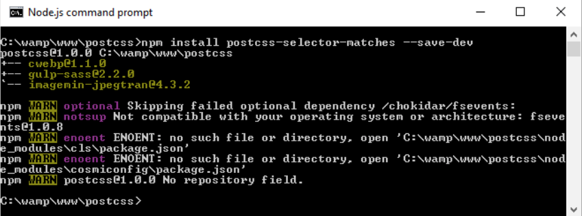

第三步：接下来，从本书附带下载的代码中提取`T69 - matches pseudo-selector`文件夹的副本，并将其保存到项目区域的根目录。

第四步：从`T69 - matches pseudo-selector`中的`css—completed version`文件夹复制`matches-pre-compile.css`，并将其保存到我们项目区域根目录下的`src`文件夹。

第五步：从`T69 - matches pseudo-selector`文件夹复制`gulpfile.js`和`package.json`文件到我们项目区域的根目录，并重命名它为`matches.css`

第六步：切换到到Node.js命令终端，然后输入`gulp`，按“Enter”键。

第七步：如果一切顺利，PostCSS将执行并将我们的代码编译成有效的CSS。 我们应该看到熟悉的文件出现在`dest`文件夹中。

第八步：将此`dest`文件夹的内容复制到`T69 - matches pseudo-selector`下的`css`文件夹，然后尝试在浏览器中预览`matches.html`文件。 如果一切顺利，我们应该看到类似这样的东西：

这是一个简单的演示。 在这个阶段没有必要使用`:matches`，因为它最终产生更多的不必要的代码！ 但它确实显示了应用该技术是多么容易，并且它提供了有效的CSS，如在我们的例子的情况下：

好吧，让我们改变一下：我们将继续在下一个演示中展示范围主题，但这次看一个更时尚的例子，我们可以真正改变我们选择的元素的外观。

范围输入元素是传统上很难实现的元素风格，通常我们可能最终使用jQuery UI来改变它的外观！ 而不是使用CSS4，我们可以使用一系列新的CSS属性来应用样式，而不使用任何额外的库。 让我们更详细地看看这个。

### 支持 range输入框

一个常见的问题是，有多少次你必须创建一个网站，其中需要选择一个从1到100的值？ 或者从几乎透明到完全不透明选择一个特定的不透明的颜色？

好吧，也许还有很多问题想说，但明眼人应该知道，我当然指的是使用滑块，我们可以调整以选择一个特定的值。 有不同的方式来添加这些到一个页面里，但在需要一些样式的帮助，也许最容易接受的工具是jQuery UI！

如果在我们的网页中需要使用jQuery UI提供的其他功能会很好，但如果我们只需要它的滑块怎么办？ 这有点过分。幸运的是，我们可以使用`postcss-input-range`插件解决这个问题，可以从https://github.com/jonathantneal/postcss-input-range获取。 现在，让我们举一个简单的例子来说明如何用样式表示一个进度条：

第一步：我们将从安装`postcss-input-range`插件开始，为此，继续并启动Node.js命令提示符，然后将工作文件夹更改为我们的项目区。

第二步：在命令提示符中输入下面的命令，按“Enter”

	npm install postcss-input-range --save-dev

如果一切顺利，我们将看到如下截图的样子：

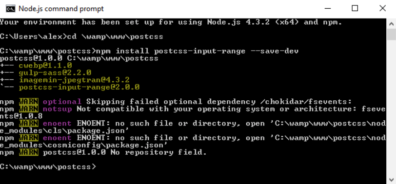

第三步：接下来，从本书附带下载的代码中提取`T70 - using range input`文件夹的副本。 并保存在我们的项目区。

第四步：在`T70 - using range input`下的`css`文件夹中，复制`range – precompile.css`文件到我们项目区的`src`文件夹中，并重命名为`range.css`

第五步：从`T70 - using range input`文件夹中复制`gulpfile.js` 和 `package.json`文件到项目区域

第六步：切到Node.js命令提示符窗口，输入`gulp`，并按“Enter”键

第七步：Gulp现在将运行我们的编译过程，如果一切正常，我们应该看到熟悉的样式表文件出现在`dest`文件夹下，以及`maps`子文件夹下的一个映射文件。 将这些拷贝到`T70 - using range input`下的`css`文件夹中。

第八步：如果顺利的话，在浏览器中预览结果，我们可以看到如下面截图所示样子：

这个演示没有什么复杂的，我们只是简单地绘制范围元素的样式。 例如，我们可以添加数据列表来定义某些值来实现滚动，如一天的特定时间。

浏览器支持仍然有限，但如果想了解哪些是可用的，请查看http://demo.agektmr.com/datalist/; CSS专家Chris Coyier在他的网站http://www.css-tricks.com上也有一些关于使用范围输入的文章。

我们的演示中的真正神奇之处出现在编译后的代码， 范围输入样式的一个关键元素是`range-thumb`属性，这是我们用来选择滑块上的值的旋钮。 下面两个例子是我们的代码现在看起来的样子，其中对Firefox添加了支持：

支持Internet Explorer（已被Edge取代）：

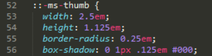

当使用这个插件时，我们不必担心添加浏览器前缀。 我们的原代码只包含非前缀版本; 相关前缀将在编译时添加，直到在我们对输入元素进行样式化时不再需要它们为止。

> 如果你想定制新的范围输入元素，请查看http://danielstern.ca/range.css/--这是一个有用的工具！

在以上两个演示的过程中，我们简要讨论了使用PostCSS带来的可能性。 当运行时，我们使用相同格式的Gulp任务文件来合并每个插件的支持，为每个演示生成必要的CSS 样式表。 这里没有什么奇怪的，对吧？ 毕竟，它遵循了我们前面介绍的相同的原则，如一个插件对应一个任务...那么，我们是否可以做的更好？

是的，现在你应该知道，如果可以，我总是喜欢做到更好。 是否还记得我曾经说过的，最好是在我们的运行器中一对一地创造任务？ 我们的（Gulp）文件中的每个任务是否与特定插件相关？ 好吧，正如有人曾经说过的，规则就是用来打破的 - 是时候抛弃规则，考虑一种不同的方法，比如未来的语法...

## 使用cssnext支持未来特性

支持CSS4的关键是我们必须应付它不断演进的状态，直到模块完成标准化。 如果我们沿用目前的方法，需要不断更新我们使用的CSS4属性的插件，这显然是不可持续的！

我们可以使用单个插件包（这里需要cssnext）来管理对一系列新功能的支持。 带来的好处是，默认情况下将启用所有的功能，并且只会在需要时才在代码中启动。 当一个新的特性被支持的时候，我们可以简单地忽略编译过程而不影响最终结果。

花时间去了解cssnext是值得的--让我们来深入更多的细节。

### 使用cssnext创建一个简单网站

cssnext插件是我们每个任务一个插件的准则的一个例外; 我们使用插件名来调用它，但实际上，它将在同一时间执行大量的转换。

该插件可从http://cssnext.io/获取。 值得注意的是，旧版本同时存在; 我们在这个演示中使用较新的版本。 在PostCSS变得像现在流行之前，cssnext插件本身就已经是一个完整的系统。

插件包含的选项并不仅仅包含专注于CSS未来的插件，所以开发人员重写了cssnext以使它更简单。 同时，它被设计为集成到PostCSS，以便我们可以在我们的处理器中和其他插件同时使用。

> 插件甚至有自己的playground，我们可以使用它来测试所做的更改是否产生了所需的效果，可以从http://cssnext.io/playground/获取。 

让我们更详细地探索这个插件 - 我们将安装它，然后为我们的下一个演示建立代码。

### 创建Demo

在下一个演示中，我们将创建一个可用于网站的基本模板。它不会特别关注样式，这里的目的是探索实现更改的容易程度！

让我们深入进去看看我们需要做什么：

第一步：我们将从启动Node.js命令提示符会话开始，然后更改工作文件夹到我们项目区的根目录。

第二步：在命令提示符输入这个命令，然后按Enter键：

	npm install postcss-cssnext --save-dev

如果一切顺利，我们将看到类似这样的截图：

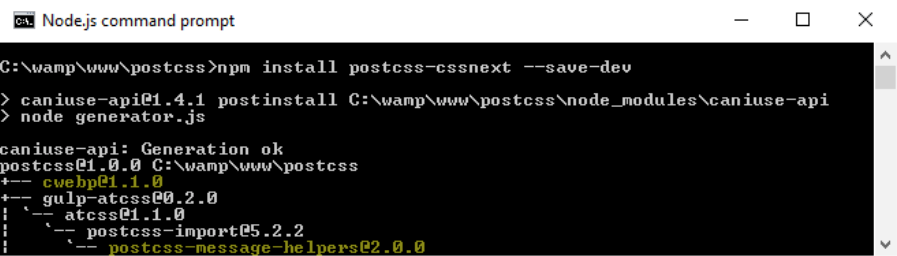

第三步：接下来，继续并从本书附带下载的代码中提取`T71-working with cssnext`文件夹的副本， 保存到我们项目区的根目录下。

第四步：从`T71 - working with cssnext`文件夹中，保存`styles.css`文件的副本到我们项目区域根目录的`src`文件夹，然后复制`package.json`和`gulpfile.js`文件到我们项目区域的根目录。

第五步：切换回我们刚刚打开的命令提示符，输入`gulp`并按Enter。

第六步：Gulp会运行并编译我们的文件，当它完成后，我们会看到当前熟悉的文件显示在我们项目区域根目录下的`dest`文件夹中。

第七步：将项目根目录的`dest`文件夹的内容复制到`T71 - working with cssnext`文件夹下的`css`文件夹中。

第八步：在浏览器中预览`T71- working with cssnext`文件夹内的`sitepage.html`。 如果一切顺利，我们应该看到类似这个截图：

我们现在已经看到了我们网站的模板。有几个地方，我们已经利用cssnext的力量做出了改变。 为此，继续从`T71-working with cssnext`的文件夹下的`css`文件夹中打开`styles.css`文件的副本，保存到我们的项目区域。让我们探讨已做了哪些更改：

- **Autoprefixer**：该插件涵盖了为支持任何未来的样式而提供的浏览器前缀; 基本文件中的所有内容都已删除，并且将在编译期间被添加
- **Media query ranges / custom queries**: 当范围不明确时，我们可以开始使用`>=`或`<=`来更好地表达我们应用的查询的一部分范围。 同时，我们可以使用自定义查询在文件顶部定义预设范围，这可以在整个样式表中使用。
- **Nesting**：现有的预处理器如Sass或LESS的追捧者都熟悉嵌套原理; 简单地说，它允许我们在彼此之间嵌套样式。 然后，我们可以调整用于这些规则的选择器，以便在编译时将每个规则转换为有效的CSS。
- **Custom selectors**：保持预处理器主题，我们可以在代码的顶部创建自定义值，并适当地应用它们。
- **#rrggbbaa colors**：传统上，十六进制色值被表示为三位或六位数值; 使用cssnext，我们可以将它们展开为四位或八位数值。 cssnext插件将把它们转换成标准的RGBA值，同时用相同的HEX值作为后备机制。
- **rem units**：早些时候，开发人员使用像素值来表示元素或字体大小。 像素值不遵循浏览器中的用户设置，因此可能无法按预期调整大小。 为了解决这个问题，引入了em单位; 为了简化计算，又引入了rem单位。 今天，一些开发人员认为像素值应该是主流方案; cssnext插件提供像素和rem单位，可以在浏览器支持的地方使用。

你首先想到的，可能是需要包括一些插件，或一个详细的配置对象; 但不是这样！ 相反的，我们在Gulp任务文件中需要的是：

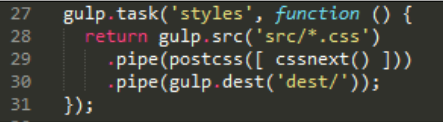

我一直是崇尚保持简单。cssnext就是这样一个完美的例子！ 虽然我们可能需要定期更新插件以保持最新，但我们不需要再更改我们的Gulp文件。

插件将简单地转换那些被插件支持的样式，并且留下所有没有被插件覆盖的样式。 这样做的优点是，我们可以直接让它运行，或者如果我们想要禁用不再需要的功能，那么我们只需在配置对象中禁用它：

	cssnext(input, { 
	    features: { customProperties: false }
	})

为了证明我们所做的改变，我们已经从这里移动了我们的（无响应的）模板：

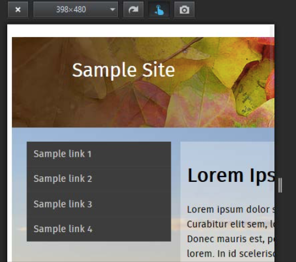

...到这个视图，我们的内容更好地适合较小的屏幕：

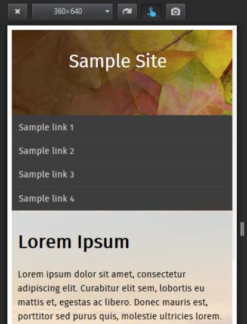

即使它只改变了一小部分，却直接负责使我们的模板响应，它表明，将cssnext纳入我们的流程比你想象的更容易！

好吧，让我们继续：我们要看更多插件，但有一个小插曲。 我们将首先看一下使用插件为在CSS4中引入的新颜色提供支持，然后再使用它作为解决很久以前就已修复的关键字问题的基础！

## 创建CSS4扩展功能插件

在本章的整个过程中，我们已经介绍了一些插件提供对即将到来的CSS4标准的支持，并探讨了如何使用
cssnext插件包来管理为使用这些新的样式而做的转换。

我们还可以做的更多，PostCSS的伟大之处在于，我们完全可以编写自己的插件，以支持CSS4属性。 为了证明这一点，在接下来的几页中，我们将修复CSS中的一些问题，改变现有的CSS4颜色插件来添加对不同颜色的支持; 我们也将为我们的下一个演示添加一些颜色！

### 添加支持CSS颜色特性

下一个演示的基础是颜色`rebeccapurple`，这是对Eric Meyer的女儿Rebecca的致敬，她的女儿Rebecca在2014年6月的第六个生日去世了， 癌症。

从事CSS样式开发工作的人都知道，Eric一直是web标准的主要倡导者，特别是CSS。 我们经常说，很难找到一个从事开发的没有读过Eric的书的人！ 社区建议添加`rebeccapurple`作为Rebecca的记忆的颜色（这是她最喜欢的颜色），以纪念埃里克的贡献。 CSS工作组宣布这项更改已获批准，将作为即将实施的CSS4标准的一部分。

为了使更改作用于尚不支持的浏览器，开发人员Maxime Thirouin创建了一个PostCSS插件，将`rebeccapurple`颜色转换为更加兼容的`rgb(102，51，153)` 。此插件的源代码位于https： //github.com/postcss/postcss-color-rebeccapurple。

让我们看一下这个插件的一些细节：

第一步：我们将从安装`postcss-color-rebeccapurple`插件开始，首先启动一个Node.js命令提示符，并更改工作文件夹到我们的项目根目录。

第二步：在命令提示符中输入下面命令：

	npm install postcss-color-rebeccapurple –save-dev

接着按Enter。如果一切顺利，我们将看到下面截图这样：

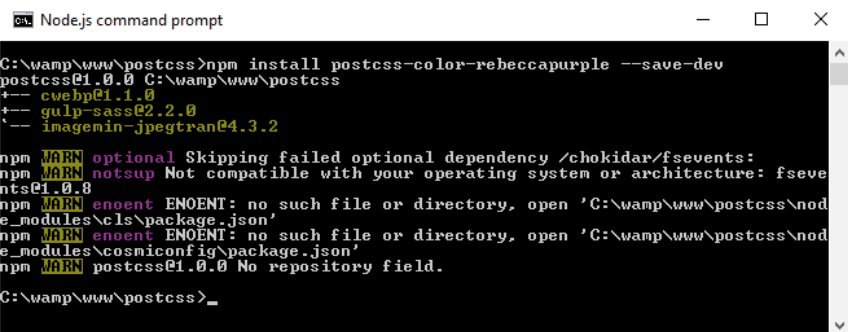

保持窗口打开，我们将很快再次用到它。

第三步：接下来，从本书附带下载的代码中提取`T72-adding rebeccapurple color`文件夹的副本，保存文件夹到我们项目区的根目录。

第四步：从`T72-adding rebeccapurple color`文件夹中复制`style--pre-compile.css`到项目区的`src`文件夹，重命名为`styles.css`

第五步：从`T72 - adding rebeccapurple color`文件夹中复制`gulpfile.js`和` package.json`文件到项目根目录

第六步：返回Node.js命令提示符会话，输入`gulp`并按Enter键。

第七步：编译结束后，从项目根目录下的`dest`文件夹中复制内容到`T72 - adding rebeccapurple color`下的`css`文件夹中

第八步：尝试预览结果。如果一切顺利，我们应该看到这个简单的框，它已经使用颜色`rebeccapurple`进行了回填：

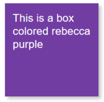

为了验证它的工作原理，查看`T72 - adding rebeccapurple color `下`css`文件夹中的`.css`文件 - 我们应该看到编译后的RGB值：

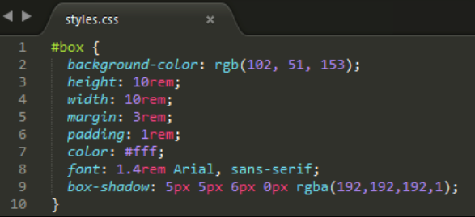

我们也可以使用网站，如ColorHexa.com快速检查验证这一点。找到http://www.colorhexa.com/663399; 搜索rebecca purple将显示相同的页面。

这里有一个好的选择。 抛开这个插件的存在理由，我们可以使用它作为支持CSS4色彩模块标准的附加颜色的基础。

我们需要做的更改相对简单，并且可以轻松地形成新插件的基础。 让我们来看看涉及的内容; 对于这个演示，我们将使用`burlywood`，这是棕色的浅色：

第一步：我们从编辑我们的CSS文件开始。在我们的项目的根目录下的`src`文件夹中打开`styles.css`，并更改如所示的高亮的行：

	#box {
		background-color: burlywood;
		height: 10rem;

第二步：我们需要更新`rebeccapurple`插件文件，使用新颜色来替换现有的颜色。我们将从初始声明开始：

	var postcss = require("postcss")
	var color = require("color")("burlywood").rgbString()

> 插件的`index.js`文件在`node_modules\postcss-color-rebeccapurple\`文件夹下

第三步：我们需要更改进行颜色实例检查的代码：

	    if (value && value.indexOf("burlywood") !== -1) {
	     decl.value = value.replace(/(burlywood)\b/gi, color)
	    }
	})

第四步：继续并保存文件。是的，插件名称不代表颜色，但这只是一个测试，所以没关系。

第五步：启动Node.js命令提示符，然后将工作文件夹更改为我们的项目区。 在提示符下，输入`gulp`，然后按Enter键。

第六步：将根`dest`文件夹的内容复制到`T73 - adding support for new color`中的`css`文件夹下。

第七步：运行`testpage.html` 。如果一切顺利，我们可以看到如前的已编译的RGB值：

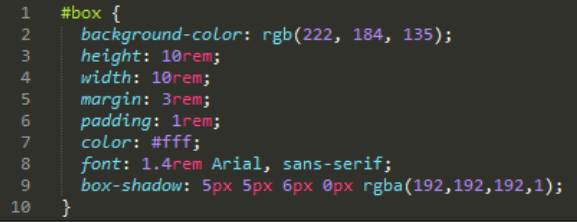

第八步：尝试从`T73-adding support for new color`文件夹中重新运行`testpage.html`文件; 我们应该看到颜色的变化（是的，它绝对不是紫色！）：

我们可以使用如前相同的原则验证显示的颜色确实是`burleywood`。查看http://www.colorhexa.com/deb887，其清楚地示出了`HEX`和`RGB`值：

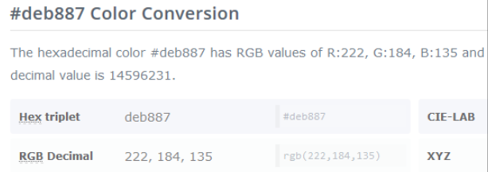

现在剩下的工作就是将它转换为插件。 这应该很容易做：尝试取现有`rebeccapurple`插件的副本，然后执行搜索并替换为您选择的颜色。 这不是完美的方式，但是一个开始 —— 下一部分将使用我们在第8章创建PostCSS插件中学到的，将其转换为一个完整的在NPM存储库可用的插件。

> 要获得CSS4模块颜色的列表，请查看谷歌 —— 有很多链接;可以从这里开始：
https://github.com/segundofdez/css4-colors/blob/master/less/colors.less。

好了，转换焦点：索然本章是关于向前看的，但我们还是需求留出一点时间向后看看。

为什么？在CSS的设计中的一些错误已经被CSS工作组承认。 由Jonathan Neal提供的PostCSS插件实现了对这些问题的短期修复 - 它们将在未来版本的CSS中正确地修复！

### 回到过去

当开发代码时，我一般遵循的原则是只为现代浏览器进行开发。 这是理想化的，或当前加上一个以前的版本。 在这方面，对像Firefox或Chrome来说不是问题，但IE则不一样。 如果可能，我们希望IE的旧版本可以不考虑...但这要另说了！

我们要思考的一个例外不是浏览器支持，而是尝试去纠正属性命名的一些问题。 CSS工作组承认一些属性名称在发布时未正确定义， 可以在https://wiki.csswg.org/ideas/上查看完整列表，这是定期更新的。

为了实现这一点，作为本节第二个演示的前身，我们将为PostCSS安装Time Machine插件（对应本节的标题！）。 它提供了CSS中的一些错误的短期修复。 然后我们将使用这个灵感来设计一个快速和肮脏的插件来修复CSSWG网站上列出的但是不是由Time Machine插件修复的另一个错误。

> 插件资源可以从https://github.com/jonathantneal/postcss-time-machine获取

对于这个演示，我们将重复使用创建的简单示例，从添加未来的颜色支持到CSS当前来显示`rebeccapurple`颜色。 该演示的编译结果使用RGBA函数 —— CSSWG已经声明RGBA不应该存在，而应该添加Alpha通道作为`RGB()`函数的第四个通道。 作为我们演示的一部分，我们将解决这个问题 —— 插件将允许我们按照我们的意图来编写，同时将其编译为可以被任何浏览器理解的代码。

让我们从安装实例中使用的插件看是：

第一步：我们开始安装插件，所以，启动一个Node.js命令提示符会话，然后将工作文件夹更改为我们的项目区域。

第二步：在命令提示符中输入下面命令，并按Enter键：

	npm install postcss-time-machine --save-dev

如果一切顺利，我们将看到如截图这样 -- 保持会话打开，我们将很快用到它：

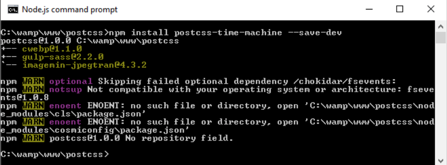

第三步：接下来，从本书附带的代码下载中提取`T74 - going back in time`文件夹的副本， 保存文件夹到我们项目区的根目录。

第四步：从`T74-going back in time`文件夹中复制`style--pre-compile.css`到项目区的`src`文件夹，重命名为`styles.css`

第五步：从`T74-going back in time`文件夹中复制`gulpfile.js`和` package.json`文件到项目根目录

第六步：返回Node.js命令提示符会话，输入`gulp`并按Enter键。

第七步：顺利的话，我们会看到编译后的文件出现在`dest`文件夹中 --复制它们到`T74 - going back in time`下的`css`文件夹中

此时，尝试预览我们的演示结果，如果一切都顺利，我们应该看到与前一个相同的框，但这次使用带有稍浅阴影的rebecca purple作为其颜色：

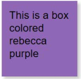

如果我们看下CSS样式，足够敏锐的话可能会发现， 为何我们使用`194`作为`alpha`值，但代码却显示`0.8`？ 答案很简单：这个插件设计为使用`0`到`255`区间的值，包括`alpha`通道。 只需将`194`除以`255`：

答案是`0.8`。 好吧，你会得到像`0.76078`的东西，但如果我们舍入到小数点后一位，这将变为`0.8`：

现在，在我们继续之前，有一些事情我们应该考虑：这个插件的实际应用。 这并不是为一个好主意泼冷水，但实际被采用可能需要一点时间 —— 一个团队的开发人员可能会写不同的样式，包括函数，如`rgba()`，背景混合模式或`hsla()` 所以可能需要一些时间来改变心态！

这就是说，如果我们想遵守预期的标准，并且可以管理心态的改变，不能键入我们可能已经做了一段时间的函数名称。 我们甚至可以进一步创建我们自己的插件 —— Time Machine不包括所有属性的修补程序，所以让我们来创建一个管理CSS中的`background-blend-mode`属性错误的插件。

### 创建自己的插件

Time Machine插件没有修复的一个属性是`background-blend-mode`函数 —— 这通常用于在层互相重叠时计算最终颜色像素。

这个bug就如它的名字所示 - CSS工作组（CSSWG）已经承认所有混合模式变体的名称中应该没有`blend-mode`，在这种情况下，`background-blend-mode`将被写为`background-blend`。

这个问题很容易解决，这是一个很好的尝试创建自己的插件的机会！ 我们将在采取不同的路线，供一些读者参与！

为了帮助你，第8章创建PostCSS插件值得再看看; 当创建插件时，我们可以使用这个代码：

	var postcss = require('postcss');

	module.exports = postcss.plugin('backgroundblend', function 
	backgroundblend(options) {
	    return function (css) {
	        options = options || {};
	        // Processing code will be added here
	        css.eachDecl('background-blend', function (decl) {
	            if (decl.prop.indexOf('background-blend') !== -1) {
	                decl.prop = 'background-blend-mode';
	            }
	        });
	    };
	});

大部分的代码都是样板，但是这个工作的关键是这个摘录：

	css.eachDecl('background-blend', function (decl) {
	    if (decl.prop.indexOf('background-blend') !== -1) {
	        decl.prop = 'background-blend-mode';
	    }
	});

简而言之，我们依次解析每个CSS规则 —— 如果包含任何背景混合，我们只需用`background-blend-mode`替换每个实例。

为了证明它的工作原理，我们可以使用下面的代码来测试我们的插件是否工作：

	<!DOCType html>
	<head>
	<meta charset="utf-8">
	<title>Demo: Creating new plugin to change blend-mode</title>
	<link rel="stylesheet" type="text/css" href="css/styles.css">
	</head>
	<body>
	    

	</body>
	</html>

如果顺利，我们将看到如下面截图所示的样子：

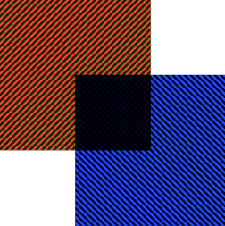

如果你遇到困难，那么本书随附的代码下载中提供了完整的版本; 快速查看`T75 - back in time change`文件夹中`styles- pre-compile.css`将显示如下：

编译时，我们可以清楚地看到它显示的版本，我们可以看到：

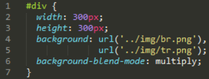

它是一个快而脏的插件，在将其投入生产使用之前可能需要更多的开发工作 —— 例如，它纯粹适用于`background-blend`模式，而我们应该支持名称中包含混合模式的任何属性！

## 小结

创建CSS样式打开了新世界的大门：我们需要确定的只有什么是我们必须支持的！ 在本章的整个过程中，我们探讨了一些可能的选项，我们可以使用更新的CSS4样式 —— 让我们花一点时间来回顾我们学到的。

我们一开始快速介绍了我们所知的CSS4 —— 然后我们探索了一些使用更加兼容的CSS等效代码来支持更新样式的插件。

接下来是一个简单的演示，探索一些新的CSS4伪类，以及我们如何在一个（理论）上下文中使用它们。 然后我们进一步实践，练习使用CSS的新范围输入样式。

再下来，我们接触了cssnext插件包，它提供了支持CSS4的抽象层; 我们看到实施起来很容易，如果项目中不再需要该功能，我们也可以轻松地关闭。

我们下一个演示涉及到颜色，我们首先使用rebeccapurple插件展示了添加CSS4中的一种新颜色是多么容易，然后修改它以提供对我们的项目中需要的其他颜色的支持。 然后，我们回顾一下在CSS发布时所犯的一些错误，以及我们如何（有一点想象力）提供一个临时的解决方法，直到这些错误在未来版本的CSS中被修复。

我们现在已经到了这本书的末尾 - 我希望你喜欢我们PostCSS世界的旅程，希望这本书将有助于提高你作为未来的PostCSS开发人员或用户的技能。