# 第1章: PostCSS简介

无论是美化 HTML 元素，还是创建复杂的页面动画，都离不开 CSS，CSS 是一个网站不可或缺的组成部分。如果一个网站没有使用 CSS 美化页面的样式，没有使用 JavaScript 响应用户的行为，那么这样的网页一定会失色不少。为网站开发精美的 CSS 样式往往会花费开发者大量的时间和精力，而开发者为了减少开发时间和避免重复工作，通常会选择预处理器自动化地构建 CSS 样式，比如为特殊属性添加浏览器前缀等。但是，使用预处理器的缺点也很明显，相对于预处理器自身的庞大和复杂，开发者实际使用的功能却很少，也就是说大材小用了。

PostCSS 的模块化风格就是为解决这一问题而来，使用它你可以创建流式、快速的 CSS 处理器，而且没有一丝冗余的功能。在本章节中，我们先会介绍 PostCSS 的安装和使用方式，最后介绍 PostCSS 的架构模式，主要内容包含以下几个部分：

- 思考为自己创建预处理器的优势所在
- 介绍 PostCSS 的基础知识和优秀特性
- 配置 PostCSS 的开发环境
- 创建一个使用 PostCSS  的示例
- 探索 PostCSS  的工作方式和架构模式

下面就让我们开始吧！

> 本书所有的动手实践部分都是基于 Windows 系统设计和演示的，如果您使用的是其他操作系统，请根据您的开发环境进行适当的调整。

## 编译之美

问大家一个问题：Sass、Stylus、Haml 和 Less，它们之间有哪些共性呢？

答案就是：它们都是从一种源码格式编译为另一种源码格式的编译器，或者用官方术语称之为转换器（transpiler）。转换器的起源可以追溯到上个世纪八十年代，在那一时期出现了很多不同格式的转换器，其中 Digital Reasearch 在 1981 开发的 XLT86 是最早一代的转换器。

近期来看，众所周知的预处理器 Sass 诞生于 2006 年，Alexis Sellier 创建的 LESS 诞生于 2009 年。它们的工作机制很类似：接收一组样式并将其编译为原生的 CSS 代码。开发者可以直接使用它们提供的丰富功能，比如变量、混合宏（mixin）、函数等等。这些转换器可能并不会减少开发者编写的代码数量，却可以帮助开发者以更可靠的方式管理代码，实现代码复用，进而提高代码的可维护性。

但是，在使用这些预处理器时常常会遇到下列问题：

- 使用这些预处理器前先要安装一堆依赖，比如使用 Sass 需要安装 Ruby；使用 Less 需要安装 JavaScript 相关的库
- 项目中往往只使用了预处理器的极少数功能呢，但开发者被强制安装一个庞大的预处理器，比如 Sass
- 使用预处理器编译样式实际上是很慢的，虽然初始的编译过程只有几秒钟，但随着项目体量的增长会对编译时间造成严重影响

由此看来，预处理器就不是那么迷人了！那么是否有一种方式或工具可以避免上述所有问题呢，并且同时还可以移除安装时的一堆依赖呢？

当然，那就是让我们自己来创建一个样式处理器！当您第一次听别人这么说的时候，一定会觉得很疯狂。不要担心我们的想法有多么天马行空，请听我详细解释一下为什么这是一个比预处理器更加优秀的方案。

## PostCSS介绍

在本章开始的时候，曾提到过我们将会创建属于自己的预处理器，在这里有一点我要反悔了。请听我慢慢解释，我们到底要做什么呢？

实际上，我们在做一个预处理器的同时还会做一个后处理器。之所以这么做，是因为我们选择的工具允许我们同时创建这两个处理器，这个工具就是 PostCSS，您可以前往 https://github.com/postcss/postcss 下载它。目前，业界已经有公司将 PostCSS 应用到线上产品中，比如 Twitter、Google、Bootstrap、CodePen 以及 WordPress（限制性使用部分功能）。

PostCSS 是一个基于 Node.js 构建的第三方模块，所以它可以与现有的大量 Node.js 插件协同时运行，而且在本书中我们将会使用大量的插件来演示 PostCSS 的使用方式。下面让我们花点时间探索一下使用 PostCSS 给前端开发带来的增益效果。

### PostCSS 的优势

当大家说到 PostCSS 时，到底是在指什么呢？简而言之，PostCSS 这个术语可以指代两件事：一是 PostCSS 核心工具，二是基于 PostCSS 创建的插件系统。PostCSS 核心工具并不能直接用于处理样式，只有配合它的插件，才能完成相关的编译工作。下面让我们看看在实际开发中怎么使用 PostCSS：

- PostCSS 的模块化架构意味着我们可以自由选择需要的插件，进而减少整个工具的体量，使真个工具保持轻量、可扩展；
- 现有的处理器趋向于两种不同的类型：预处理器和后处理器，这就限制了开发者的选择。PostCSS 可以让开发者在同一个处理流程中同时包含这两种操作，也就是编译前的预先处理和编译后的后置处理。也就是说，使用 PostCSS 我们可以同时使用预处理器和后处理器，充分利用它们的优势进行开发工作；
- PostCSS 可以无缝融合到现有的通用任务执行工具中，比如 Gulp、Grunt、Broccoli，通过这些工具 PostCSS 可以实现更广泛的自动化任务；
- PostCSS 完全使用 JavaScript 编写而成，编译时无需添加其他依赖，不用安装 Ruby、LibSass 之类的底层工具，其唯一的依赖就是 Node.js，对大多数的前端工程师来说，他们已经安装过该工具了；
- 无需再学习新的编程语言，前端工程师通常都能在工作中熟练使用 JavaScript 处理开发任务；
- 可以根据需要随时添加或移除插件，这是其它大型工具所无法实现的；
- 开发门槛低，这意味着无论是按照自己的需求创建插件还是修改现有插件都很轻松
- PostCSS 的编译速度极快，下面图片中的测试使用了 postcss-benchmark 插件（详见 https://github.com/postcss/benchmark），测试内容包括解析代码、嵌套规则、混合宏、变量和数学计算。显而易见，PostCSS 轻松取胜：

- PostCSS 本身是功能完备的，不用像 Sass 一样考虑版本更新，不用考虑下载最新的 LibSass 等问题；

### PostCSS的陷阱

使用自定义的处理器有一些注意事项，其中最重要的就是理解：PostCSS 既不是预处理器也不是后处理器，它更像是编译 CSS 的瑞士军刀。下面让我们看看使用 PostCSS 的潜在的一些陷阱：

- 虽然使用 PostCSS 不需要学习新的编程语言，但还是会让我们的开发流程增加一定的复杂度；
- PostCSS 的灵活性意味着开发者可能会将其用作预处理器或后处理器，这种浅显的用法会让开发者无法真正掌握 PostCSS 的能力，所以开发者应该更积极地去使用 PostCSS 处理更多有关样式的问题；
- 从使用现有的预处理器切换为使用 PostCSS 转换代码会有一定的痛点，所以不要直接进行转换，应该尝试渐进性地转换到使用 PostCSS 进行编译；
- PostCSS 要求传入的 CSS 必须在语法上保持正确，否则编译时容易出错，即使是一行简单的注释都不容忽视；
- 使用 PostCSS 的优势在于与类似 Gulp 的任务处理工具的无缝融合，但开发者是否使用 Gulp 则是不确定的；

如果你已经使用类似 Sass 的预处理器开发了网站，那么可以使用独立的工具编译代码，但通常来说使用 Node.js 和 Gulp 是更好的处理方式。听起来还不错吧？那么该如何迁移到 PostCSS 的开发环境中呢？

很简单，我们可以从部分代码开始使用 PostCSS 进行编译。这里的关键是不使用 PostCSS 执行最初的编译，而是对编译后的 CSS 再次编译，比如添加浏览器前缀或压缩 CSS 代码等。一旦这一步完成了，就可以继续将 PostCSS 的其他插件融合到编译流程中，这些插件所包含的功能类似于 Sass 内置的功能。一旦我们将现有的代码都转换成了插件所支持的格式，那么就可以完全切换到使用 PostCSS 的编译环境中了，最终可以放心地在项目中移除 Sass。

### 消除误解

在这里有必要花点时间回应业界对 PostCSS 的一些误解，虽然很多开发者将其视为预处理器或后处理器，但这不是创建 PostCSS 的初衷：

- 将 PostCSS 视为后处理器，或者将其视作是预处理器的相反处理，都是一种误导；PostCSS 有能力应对各种不同的使用场景，既可以处理已经被预处理器编译过的代码，也可以处理纯粹的 CSS 代码；
- PostCSS 不应该被视为是一个处理某个流程的工具，比如处理类似 Sass 的循环或条件语句。在 PostCSS 中有大量的插件可以处理这些事情，但这些功能不足以概述 PostCSS 的全貌，它可以在开发者的开发工作流中处理更多的任务；
- 如果你发现某些时候 PostCSS 所编译的结果不符合预期，那么很有可能是使用的插件出现了问题，而不是 PostCSS 本身出现了问题。虽然 PostCSS 这个项目还很年轻，但其生态中已经有了大量的插件，非常值得一试；

前面的预热已经很完美了，接下来让我们少说多做，用实际代码演示 PostCSS 的安装和使用方式。

### 准备工作

在开始之前，我们需要一些准备工作。第一，需要一个本地的 Web 服务器，这虽然并不是必须的，但有助于提升学习效果。就我个人而言，喜欢使用 WAMP 服务器（适用于 PC，http://www.wampserver.com/en）；对于使用 Mac 的用户来说，可以尝试使用 MAMP（http://www.mamp.info/en）；或者也可以使用跨平台的 Apache Web 服务器（http://www.apachefriends.org）。无论你使用上述哪一个服务器，它们的默认配置可以满足我们的开发需求。

第二，需要在本地创建一个项目目录。假设你已经搭建了 WAMP 作为本地 Web 服务器，那么就可以像下图所示，在 `c:\wamp\www` 目录下创建一个名为 `postcss` 的文件夹：

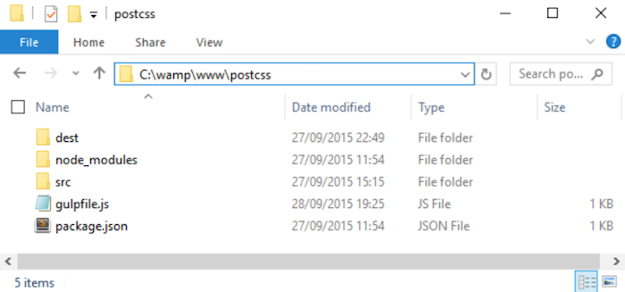

完成上面的准备工作后，就让我们开始安装 PostCSS 吧！

## 搭建开发环境

学习 PostCSS 的第一步就是使用 Node.js 的工具安装它，通常我们会使用某种任务执行工具来做这件事。对于本书中的所有练习，我们都会使用 Gulp 作为任务执行工具。当然，你也可以根据自己的喜好选择 Grunt 或 Broccoli。

> 当使用 Node.js 时，请确保使用的是 Node.js 的命令行工具，而不是 node.exe，这是因为使用 node.exe 并不能完美地运行本书中的代码示例。

接下来，让我们安转一下 Node.js 和 Gulp:

第一步：首先需要安装 Node.js，通过 http://nodejs.org 可以获取适合各种操作系统的安装包。确认下载的版本适合你的操作系统之后，你就可以开始安转它了：

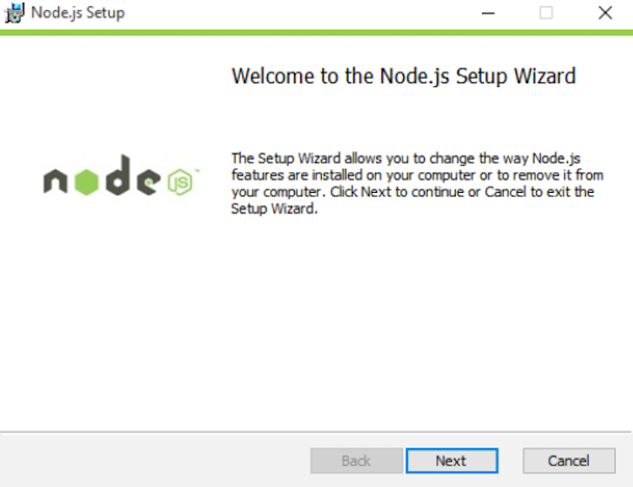

安装 Node.js 时，接受默认配置即可，这足够我们用来演示本书中的代码。

第二步：接下来，打开 Node.js 命令终端并输入以下命令，输入完成后按下回车键执行：

    node -v

输出结果就是所安装的 Node.js 的版本信息，这是一种快速检查 Node.js 安装是否正确的方式：

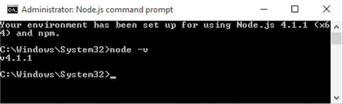

第三步：现在我们已经安装好 Node.js 了，还需要创建一个 `package.json`文件描述项目中所用到的依赖信息。在命令行中输入以下命令，输入完成后按下回车键执行：

    npm init

第四步：创建 `package.json` 时，Node.js 会在命令行中向开发者提问一些问题。你可以参考下面中的回答，也可以按下回车键选择默认配置（每个问题的默认配置信息会使用中括号标注）：

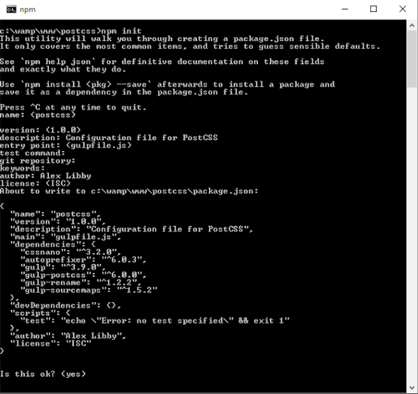

现在我们已经安装好了 Node.js 并在项目中创建了一个空的 `package.json` 文件，接下来我们添加第三方依赖，第一个需要添加的就是 Gulp：

1. 回到 Node.js 命令行环境中（如果已经关闭了之前的命令行窗口，那么你需要新建一个）；
2. 在命令行中将当前的工作路径切换到 `c:\wamp\www\postcss`；
3. 在命令行中输入以下命令，输入完成后按下回车键执行，该命令将会在全局环境中安装 Gulp：`npm install -global gulp`；
4. 安装完成后，需要将 Gulp 安装到项目中。在命令行中输入以下命令，输入完成后按下回车键执行。该命令在将 Gulp 安装到当前项目的同时还会更新`package.json` 的配置信息：`npm install --save-dev`；

安装完成后，Gulp 就可以直接使用了，接下来我们就要在 Node.js 和 Gulp 的基础上安装 PostCSS 了。

> 使用 `--save-dev` 的小提示：这一参数用于指定在开发阶段所需要的第三方依赖，如果是线上产品所需要的第三方依赖，可以使用 `--save` 进行安装。

### 安装 PostCSS

现在就是最有趣的步骤了——安装 PostCSS。从 https://github.com/postcss/postcss 可以查看 PostCSS 的项目信息，通过一个 Gulp 插件我们就可以将其安装到 Node.js 的开发环境中。让我们开始吧：

第一步：回到 Node.js 命令行环境中（如果已经关闭了之前的命令行窗口，那么你需要新建一个）；

第二步：在命令行中输入以下命令，输入完成后按下回车键执行：

    npm install --save-dev gulp-postcss

如果一切顺利，我们将会看到如下图所示的信息：

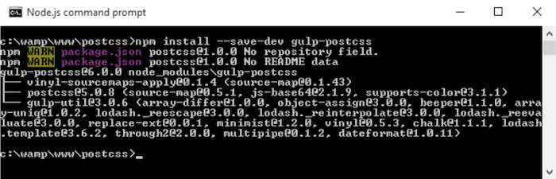

只安装 PostCSS 并不能处理任何任务，为了让它变得更加实用，我们将会安装三个插件。稍后我们在书中会详细介绍使用插件的方式，但在这里先做简单的演示，不用太担心安装过程发生了什么神秘的事情：

第一步：在命令行中输入以下命令，输入完成后按下回车键执行：

    npm install --save-dev autoprefixer

第二步：让我们看一下 `package.json` 文件，如果一切顺利，我们将会看到如下图所示的信息：

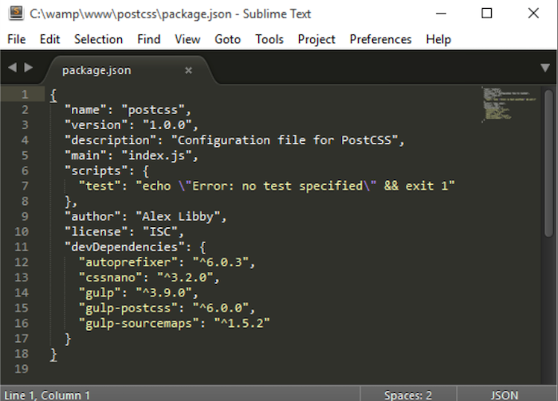

> 为了在 Sublime Text 中方便地查看 JSON 文件，建议安装并使用第三方主题，比如 MonokaiJSON Plus（https://github.com/ColibriApps/ MonokaiJsonPlus）。

PostCSS 现在已经安装完成，但还不能够直接使用，需要为它编写配置文件。接下来我们将通过一个简单示例来演示如何为它编写配置文件，在这里示例中会为 CSS 代码添加浏览器前缀并对最终生成地代码进行压缩。

## 使用PostCSS创建一个简单示例

PostCSS 是一个迷人地工具，它的模块化架构使其可以驾驭多种使用场景，甚至是多种场景的复合场景。在本书中，我们将会演示 PostCSS 在多种场景下的使用方式，并最终实现在同一套工作流下创建包含预处理器和后处理器地处理器。

为了让大家了解 PostCSS 的工作方式，我们在这里创建了一个简单的处理器。它会自动为 CSS 属性添加浏览器前缀，并自动压缩最终生成地代码。

在上文中，我们已经安装了相关的插件，下面就来动手创建一个 Gulp 的配置文件：

第一步：新建一个文件并添加下图中的代码，完成后将其保存在项目的根目录下并命名为 `gulpfile.js`：

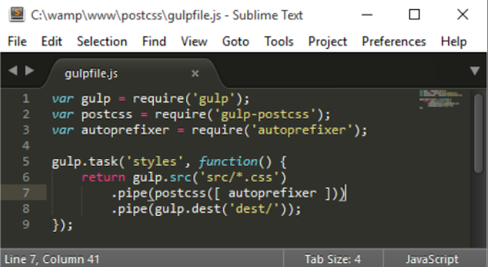

第二步：在项目地根目录下创建一个名为 `dest` 的文件夹，实际上该文件夹会在编译过程中自动被创建；

第三步：新建一个文件，添加以下代码，完成后将其保存根目录下的 `src` 文件夹中并命名为 `example.css`：

    body {
        display: flex;
        background: green;
    }

第四步：回到命令行输入以下命令，输入完成后按下回车键执行：

    gulp styles

通过上面地命令，Gulp 将会自动执行 `gulpfile.js` 中的指令：

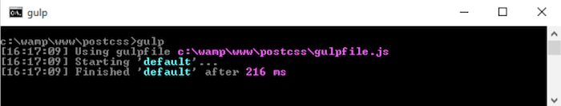

第五步：差不多一秒钟地时间（基本察觉不到），我们就能在项目根目录下的 `dest` 文件夹中看到编译之后地 `example.css`;

第六步：最后在编辑器中打开编译后的 `example.css` 查看编译后代码，如果一切顺利，就会看到：

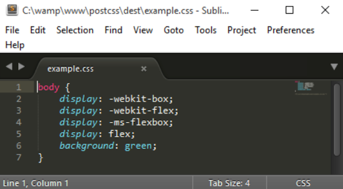

完美！PostCSS 已经安装好了，但我们任何时间需要添加浏览器前缀时，只需运行我们的工作流工具即可…… 

### 添加 Source Map 功能

这就是 PostCSS 吗？PostCSS 能够胜任的工作远不止添加浏览器前缀！还记得我们之前说过 PostCSS 常常被误用为预处理器或后处理器吗？

使用 PostCSS 的一大好处就是可以有选择性地对代码进行处理，此外也不需要安装额外的依赖，比如使用 Sass 就需要安装 Ruby，总而言之，最终我们所创建的处理器会非常轻巧和快速。在上一个示例中，我们创建了一个名为 `styles` 的任务，接下来我们会将使用任务名为 `default` 的任务代替它执行相关的任务，使用 `default` 任务便于我们通过一条命令执行多个任务。这意味着执行 `gulp` 命令即可完成多个任务，无需再指定特定的命令名。

> 在接下来的练习示例中会默认使用这种方式调用和执行 Gulp 任务。

让我们开始扩展之前的编译流程吧，先让它支持 Source Map 功能。在这里我们会使用 Florian Reiterer 开发的 Source Map 插件（https://github.com/floridoo/gulp-sourcemaps）：

第一步：首先，打开命令行工具并切换到项目的根目录下；

第二步：输入以下命令，输入完成后按下回车键执行：

    npm install --save-dev gulp-sourcemaps

第三步：打开“使用 PostCSS创建一个简单示例”一节所创建的 gulp 配置文件，然后添加 `gulp-sourcemaps` 插件：

    var autoprefixer = require('autoprefixer'); 
    var sourcemaps = require('gulp-sourcemaps');

第四步：接下来需要添加一行命令用于生成 Source Map（还是在这个文件之中），代码如下所示：

    .pipe(postcss([ autoprefixer ]))
    .pipe(sourcemaps.init())
    .pipe(sourcemaps.write('maps/'))
    .pipe(gulp.dest('dest/'));

第五步：保存上述文件内容，然后在命令行中输入以下命令，输入完成后按下回车键执行：

    gulp styles

第六步：如果一切顺利，在 `dest` 目录下找到一个名为 `maps` 的目录，该目录下存储着 Source Map 文件。

通过在编译流程中自动生成 Source Map 文件，我们向创建更强有力的开发工具迈出了重要的一步。

> 值得注意的是，如果在本书中你看到“项目目录”这样的描述或引用，那么它指的就是当前项目的根目录。

不过，我们可以做的还有很多：虽然这里生成的 CSS 体积很小，但仍然值得进行压缩以减少浪费不必要的带宽。使用 PostCSS 可以轻松胜任压缩任务，下面就让我们来看一下如何使用 `cssnano` 插件压缩 CSS 代码。

### 压缩样式

压缩样式是样式开发过程中的重要组成部分，应该是每个开发者工作流中必备的流程。压缩样式可以有效减少对带宽的占用，这一流程对小型网站的收益可能并不是很明显，但对大型网站的影响则是显而易见的。

幸运的是，使用 PostCSS 压缩样式是轻而易举的事情。在接下来的教程中，我们将会使用 `cssnano`（http://cssnano.co/）和 `gulp rename`（https://github.com/hparra/gulp-rename）两个插件实现压缩样式的功能，安装和使用方式如下：

第一步：打开命令行工具输入以下命令，输入完成后按下回车键执行：

    npm install -–save-dev cssnano
    npm install -–save-dev gulp-rename

完成后不要关闭命令行窗口，稍后我们还会继续使用它。

第二步：切换到之前创建的 `gulpfile.js` 文件，并将以下代码添加文件的最后一个 `}` 之后，大概在第十二行左右：

    gulp.task('rename', ['styles'], function () { 
        return gulp.src('dest/example.css') 
            .pipe(postcss([ cssnano ])) 
            .pipe(rename('example.min.css')) 
            .pipe(gulp.dest("dest/")); 
    });
    
    gulp.task('default', ['styles', 'rename']);

第三步：在 `gulpfile.js` 的顶部，需要添加两条声明，否则我们的代码会报错。具体的声明代码如下所示：

    var sourcemaps = require('gulp-sourcemaps');
    var rename = require('gulp-rename');
    var cssnano = require('cssnano');

第四步：细心的读者会发现 `gulpfile.js` 现在存在问题：在文件的最后我们引用了 `styles` 这个任务，但还没有对其进行声明和编写。解决这个问题很简单，那就是将第八行的代码修改为：

    gulp.task('styles', function() {

第五步：保存文件并切换回命令行窗口，输入以下命令，输入完成后按下回车键执行：

    gulp

第六步：Gulp 的编译结果如下图所示：

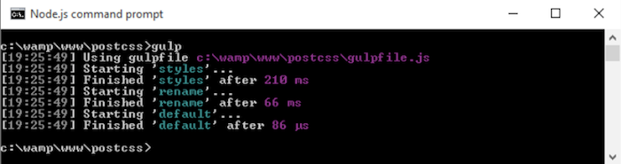

如果一切顺利，可以在项目目录下的 `dest` 文件中看到如下图所示的文件：

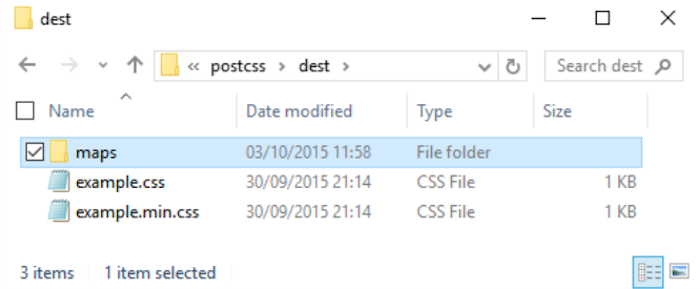

在项目的根目录下，不仅有包含 Source Map 的 `maps` 文件夹，现在还增加了一个经 `cssnano` 压缩后的样式文件，该样式文件经压缩后还会静 `rename` 插件重命名。

不幸的是，我们现在还存在一个问题，如果你查看一下 `maps` 文件夹的内容，会发现 Source Map 所针对的是为压缩版本的样式文件，而不是压缩版本的样式文件。为了解决这个问题，我们需要在 `gulpfile.js` 中添加如下内容：

    .pipe(rename('example.min.css'))
    .pipe(sourcemaps.init())
    .pipe(sourcemaps.write('maps/'))
    .pipe(gulp.dest("dest/"));

现在再尝试运行 Gulp，如果一切顺利，就会发现已经有了针对压缩版本样式的 Source Map：

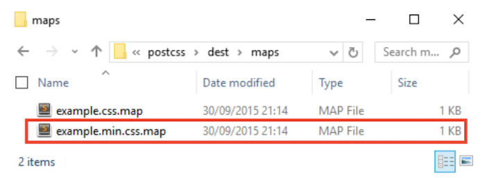

让我们继续完成 Gulp 的配置文件吧，目前还剩下最后一步：添加 `watch` 功能，便于文件内容发生变化后自动执行编译流程。

### 自动化编译

使用 Gulp 添加 `watch` 功能非常简单，添加之后可以减少大量的人力工作，只需启动一次 Gulp 任务，即可持续监视并处理内容发生变化的文件。

与其他功能有所不同的是，使用 Gulp 的 `watch` 功能无需添加任何插件，只需将下面高亮部分的代码添加到 `gulpfile.js` 文件中即可：

    gulp.task('default', ['styles', 'rename', 'sourcemaps']);
    
    var watcher = gulp.watch('src/*.css', ['default']); 
    watcher.on('change', function(event) { 
        console.log('File ' + event.path + ' was ' + event.type + ', running tasks...'); 
    });

添加完成上述代码后，我们的 `gulpfile.js` 文件的全貌应该类似于下图：

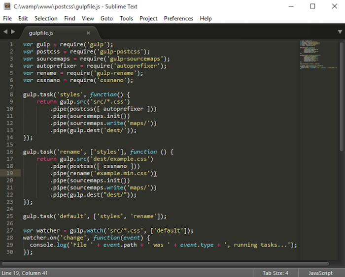

比对无误后就可以保存 Gulp 的配置文件并像之前一样重新运行 `gulp` 命令了。现在运行 `gulp` 命令之后，Gulp 会监视 `src` 目录下的文件变动并自动执行编译。在配置文件中，我们为日志信息添加了一段事件处理器，用于输出编译信息，你可以根据自己的需要修改这一段代码。

现在已经有了一个初级的构建工具，在接下来的几个章节中我们将会继续往这个工具中添加功能，直至创建一个属于我们自己的处理器。接下来我们还需要了解一个小功能，虽然它并不是必要的，但是对开发样式很有帮助，它就是代码审查功能，用于保障代码的有效性。

## 代码审查

毫无疑问，代码审查应该存在于任何开发者的工作流中。实现代码审查有多种方式，主要取决于你所使用的构建工具。使用 PostCSS 实现代码审查非常简单，只需安装配套的审查插件到上面实现的处理器中即可，在这里我们使用 `stylelint` 插件来实现（http://stylelint.io/）。

为什么要做代码审查？简而言之，保持代码风格的一致性。当你参与到团队开发时，这种代码审查的作用就会愈加明显，其核心作用就是约束团队中每个成员的代码风格，保证编译结果的一致性。将代码审查功能添加到我们的工作流中，有助于减少人力工作，实现任何时间任何人的编译结果具有一致性。

从这一目标出发，让我们看看如何实现代码审查功能：

第一步：首先是打开命令行工具并切换到项目的根目录下；

第二步：在命令行中输入以下命令，输入完成后按下回车键执行：

    npm install stylelint

如果一切顺利，我们将会看到如下所示的输出结果：

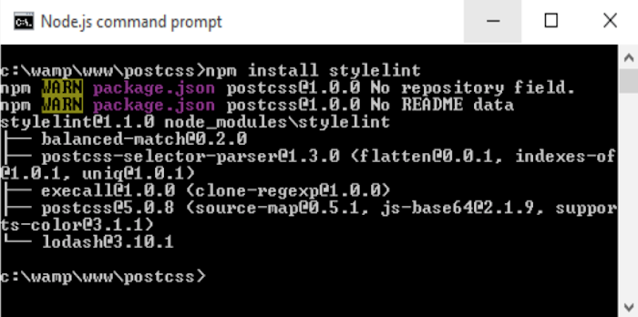

第三步：接下来，需要安转第二个插件 `postcss-reporter`（https://github.com/ postcss/postcss-reporter），它可以向命令行或屏幕输出 `stylelint` 代码审查的结果：

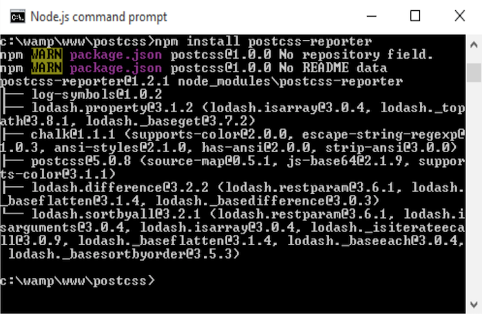

第四步：安装完成上述插件之后，需要更新 Gulp 的配置文件 `gulpfile.js`，将如下代码添加到该文件中声明变量的地方：

    var cssnano = require('cssnano'); 
    var stylelint = require('stylelint'); 
    var reporter = require('postcss-reporter');

第五步：紧接在上面的代码后面，添加下面这段代码。这段代码增加了一个新的 Gulp 任务，用于执行代码审查功能，并在适当的时候通知开发者错误信息：

    gulp.task("lint-styles", function() { 
        return gulp.src("src/*.css") 
            .pipe(postcss([ stylelint({ 
                "rules": { 
                    "color-no-invalid-hex": 2, 
                    "declaration-colon-space-before": [2, "never"], 
                    "indentation": [2, 2], 
                    "number-leading-zero": [2, "always"] 
                } 
            }), 
            reporter({
                clearMessages: true, 
            }) 
        ])) 
    });

编写完上述代码后，需要将 `gulpfile.js` 中的：

    gulp.task('default', ['styles', 'rename']);

修改为：

    gulp.task('default', ['lint-styles', 'styles', 'rename']);

第六步：修改项目根目录 `src` 文件夹中的 `example.css` 文件，修改其中的一个 `color` 值为 `#fff1az`；

第七步：回到终端输入以下命令，输入完车后按下回车执行：

    gulp

第八步：Gulp 解析我们的现有代码，预期这里会抛出一个提醒：

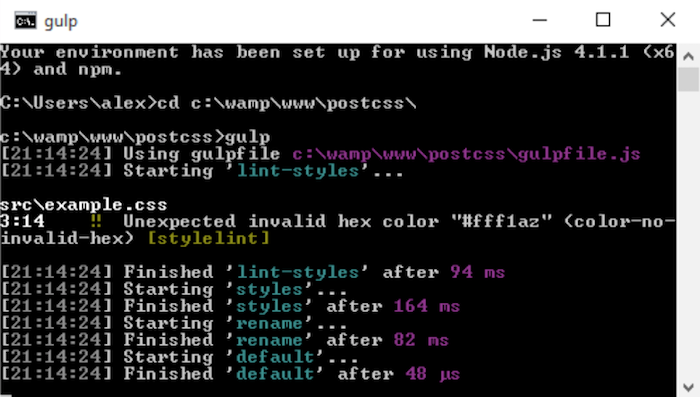

从命令行中可以得到明确的反馈：`#fff1az` 不是一个有效的数值！Stylelint 之所以会提示这个问题，是因为我们在配置中规定了相关的规则：

    .pipe(postcss([ stylelint({
        "rules": {
            "color-no-invalid-hex": true,
            …
        }
    }),

让我们花点时间了解一下这个插件是怎么工作的：其核心是 `stylelint` 提供了一组代码审查的规则（详见 https:// cdn.rawgit.com/stylelint/stylelint/1.0.0/docs/rules.md)），开发者从中选取需要的规则写入到 `gulpfile.js` 中，这样每次运行 Gulp 任务时就会通知 `stylelint` 检查这些规则，比如 `-no-invalid-hex` 规则。我们可以为 `stylelint` 添加任意数量的规则，最终实现输出结果的一致性。

> 如果你对这些规则的工作机制很好奇，可以阅读 https://cdn.rawgit.com/ stylelint/stylelint/1.0.0/docs/user-guide.md，更多有关 `stylelint` 的使用示例可以查看 https://cdn.rawgit.com/ stylelint/stylelint/1.0.0/docs/rules.md。

在下一章节，我们会继续了解如何使用 PostCSS 编译 CSS 代码，但在这之前，先让我们来深入了解一下 PostCSS 的工作机制，然后聊一聊如何从 Sass 的开发环境迁移到 PostCSS 的开发环境。

## PostCSS 运行机制

到目前为止，我们已经讲解了配置和使用 PostCSS 的基础知识，接下来有必要花些时间了解一下 PostCSS 的工作机制，这有助于我们更好地理解如何使用 PostCSS，也有助于我们开发自己的 PostCSS 插件。

PostCSS 本身并不处理任何具体的任务，只有当我们为其附加各种插件之后，它才具有实用性。

PostCSS 就像是一个使能器（enabler），它可以不用完全替代现有的预处理器或后处理器，而只是作为它们的补充工具。PostCSS 的工作机制主要包含解析代码、执行插件、渲染结果三部分：

PostCSS 会将 CSS 代码解析成包含一系列节点的抽象语法树（AST，Abstract Syntax Tree）。树上的每一个节点都是 CSS 代码中某个属性的符号化表示。换言之，如果你写了条件语句并对应三种结果，那么在抽象语法树中就会有一个包含三个分支的节点，每个分支就是符号化表示的结果。

> AST的一个示例：http://jointjs.com/ demos/javascript-ast。这个示例演示了使用纯JavaScript来分解一个简单的算术函数。

编译后的抽象语法树会被传递给后续的插件做进一步的处理，在经插件处理和生成最终的 CSS 之前，样式代码实际上会是一段冗长的字符串。基于这些特性，我们可以创建自己的插件，相关的插件模板和 API 可以从 PostCSS 在 GitHub 的主页获取。

在插件处理阶段，我们需要做好的一件事就是使用符合业务需求的插件，坚持单一职责原则。实际上，如果一个插件所能承担的任务越多，那么它的使用效果会越不理想，因为它很有可能在项目中承载了过多不会被使用到的功能，造成职责不清晰。

### 从 Sass 迁移到 PostCSS

假设我们要使用 PostCSS 进行开发了，那么首要面临的问题就是：我们如何将现有的开发环境迁移到 PostCSS 的开发环境呢？

简而言之，不要直接将现有代码迁移到 PostCSS 开发环境，这很有可能会出问题，相反，我们应该渐进式地切换到 PostCSS 的开发环境中，从容易实现的地方开始使用 PostCSS。创建 PostCSS 开发环境需要做不少工作，但不必担心，下面会介绍一些技巧帮助你避免迁移过程中的陷阱。

迁移的核心是理清 PostCSS 开发环境切实需要的功能，然后为它创建一个初始化的构建流程（可以使用 Gulp 或 Grunt），然后逐步根据需求往流程中添加插件，直至实现完整的编译器。

在上面的基础上，我们可以更进一步，使用插件让 PostCSS 解析 Sass 风格的代码。Autoprefixer 可以是我们使用的第一个插件，接下来可以添加 `postcss-mixins` 和 `postcss-partial-import`。在第十一章《自定义语法》中我们将会使用这些插件模仿 Sass 语法，并最终实现替代类似 Sass 或 LESS 的预处理器。总而言之，在 JavaScript 的生态环境这一切想法都切实可行且易于操作。

> 现在 PostCSS 中用于模仿 Sass 语法的插件已经被打包在了 PreCSS 包中，我们将会在第十章《创建自定义的预处理器》对此做详细介绍。

在接下来的几个章节中，我们将会学习到创建样式编译器所需要具备的基本要素，比如变量、混合宏等，也将会学习到如何在 Sass 或 LESS 中使用它们，然后使用 PostCSS 的相关插件实现相同的功能，生成最终的 CSS 代码。最终，我们的目标是将所有的插件集成为一个属于自己的样式处理器。

## 小结

CSS 开发是与互联网兴起同时期的技能，创建一个精美的 CSS 样式需要高超的技能、坚持不懈的耐心，并投入大量的时间。类似 Sass 和 LESS 的预处理器帮助了开发者更高效地处理样式，但仍然存在某些缺陷；PostCSS 为开发者提供了一个定制化的编译方式，同时消除了现有处理器的历史包袱。在本章中，我们已经了解了 PostCSS 的一些核心概念，接下来再让我们回顾一下这些概念。

在介绍 PostCSS 之前，我们先是了解了编译的历史，然后介绍了使用 PostCSS 的优势和难点，以及它是怎样无缝融入你的开发工作流的。

我们讲解 PostCSS 的安装方式时，还介绍了如何将其融入构建工具 Gulp 中，之后使用一个实际案例演示了 PostCSS 的编译过程，从中讲解了如何选择合适的插件、如何摆脱重复的人力工作。在代码编译工作中，我们还添加了 watch 功能、代码审查功能，从而确保编译的一致性。

最后，我们介绍了 PostCSS 的工作机制、组织架构，进一步了解了如何从纯 CSS 或使用预处理器的开发环境迁移到使用 PostCSS 的开发环境中。

现在我们已经对 PostCSS 颇为熟悉了，是时候真正地在项目中使用它了。在接下来的几个章节中，我们将会探索现有预处理器的几个常规概念，比如变量、函数和混合宏，并讲解如何在 PostCSS 使用这些功能、如何避免预处理器所存在的历史包袱。