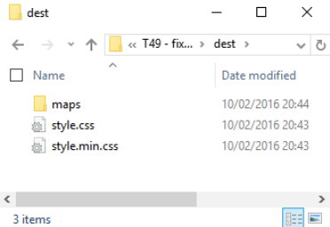
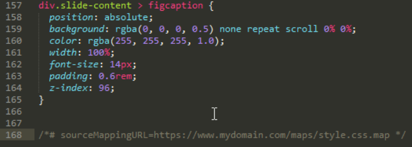
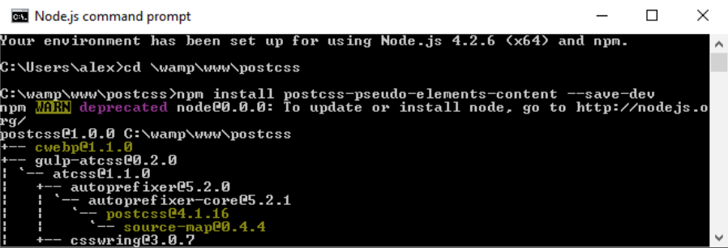
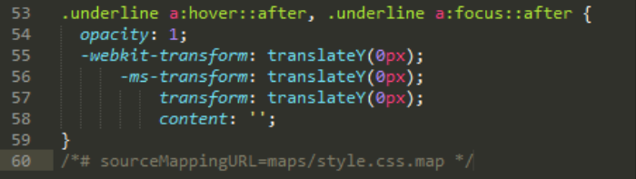
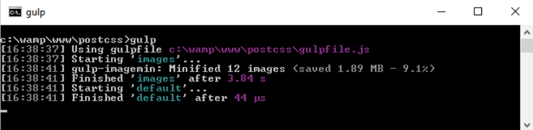
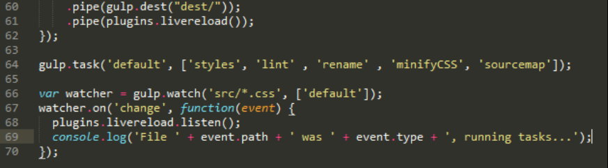
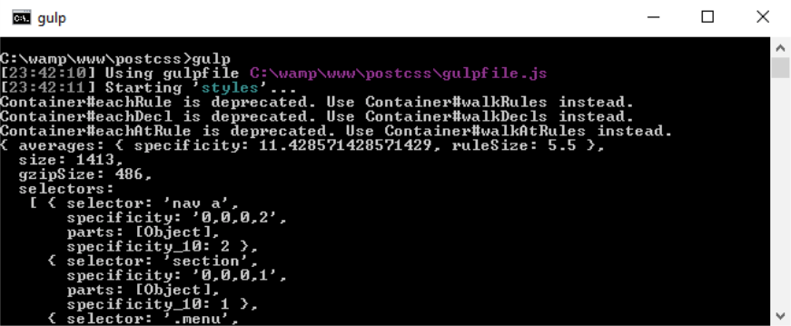
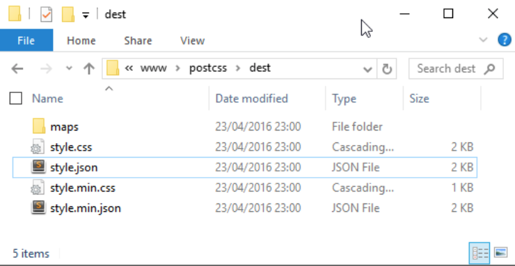
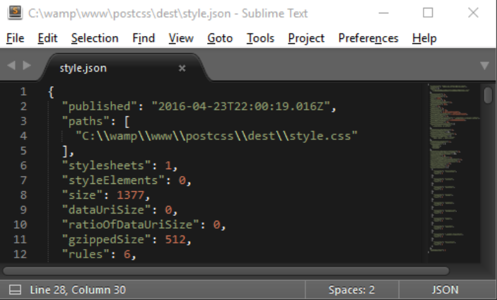
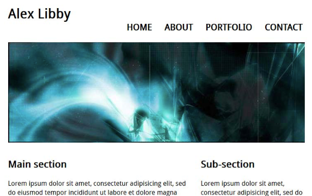

# 第10章：自制处理器

使用 PostCSS 的一大优势就在于它的模块化风格——当我们只需要使用其中几个简单的功能时，它不会强制我们安装庞大的依赖库。在本章中，我们将会总结前几章讨论过的话题，然后根据自己的需求创建一个功能完备的预处理器。

我们将会使用它编译一个简单网站的代码，并且会在 CMS 系统（比如 WordPress）上使用它，然后了解如果扩展它，使它能够与框架（比如 CSStyle）协同工作。在本章中，我们将会讲解以下几个主题：

- 创建自定义处理器
- 优化输出结果
- 添加 source map 和浏览器前缀功能
- 在一个简单的网站系统上测试最终的预处理器
- 扩展预处理器的功能，配合 CSStyle 框架的使用

让我们开始吧！

## 创建处理器

许多使用类似 Sass、LESS 和 Stylus 等预处理器的开发者，通常都需要安装完整的依赖库，但实际上开发者很少会使用这些处理器的全部功能。

使用 PostCSS 就不会有这样的问题，它的一个重要特点就是高度的灵活性，从此处理器功能臃肿远超实际需求的弊端就不复存在。我听见有人问，灵活性难道不也是一种缺点吗，尤其是在项目初始时需要反复决策哪些功能应该被添加到处理器中。

通过本章的讲解，我们将会整合前面几章示例中处理器的多种功能，进而改善和扩展它们。处理器没有绝对的优劣之分，每一个处理器都与众不同，选择哪一种处理器完全取决于我们的需求。

随着开发经验的增多，你会在项目中找到可以复用的通用元素，最终，就可以根据自己的需求创建一个自定义处理器。接下来，先让我们看一下最近几个示例中使用到的处理器，并从中借鉴开发处理器的方法和技巧。

## 探索处理器

在本书前几章我们创建示例时，一直都专注于安装插件以及是否将文件放在了正确的位置。这其中忽略了很多细节，比如这些文件的背后执行了什么逻辑？为什么构建工具的任务具有一定的顺序？我们选择某个插件背后的原因又是什么……以及其它一些你已经明白的知识点。

在接下来的几节中，我们将会通过分析最近使用到的处理器的方式，尝试回答上面的这些问题。你会发现选择插件的原因不是一成不变的，而是根据工作的性质和个人的需求综合决策的。

在深入探索之前，让我们先从 `package.json` 开始快速回顾一下处理器的构成吧。

### package.json

`package.json` 文件中记录了项目中使用的 PostCSS 插件，此外还有可能包含编译时使用到的配置信息：

    {
        "name": "postcss", 
        "version": "1.0.0", 
        "description": "Configuration file for PostCSS",
        "main": "index.js", 
        "scripts": {
            "test": "echo \"Error: no test specified\" && exit 1" 
        }, 
        "author": "Alex Libby", 
        "license": "ISC", 
        "dependencies": { 
            "postcss": "^5.0.8" 
        },

文件的上半部包含了一些基础属性，用于向使用者介绍项目的版本、基础信息、创建者、依赖信息和授权信息等。

        "devDependencies": { 
            "autoprefixer": "^6.0.3", 
            "cssnano": "^3.2.0", 
            "gulp": "^3.9.0", 
            "gulp-postcss": "^6.0.0", 
            "gulp-rename": "^1.2.2", 
            "gulp-sourcemaps": "^1.5.2", 
            "postcss-reporter": "^1.3.0", 
            "stylelint": "^2.3.7"
        }
    }

相对来说，下半部分对于开发者是核心部分，这里列出了项目中使用到的所有插件。在我们的很多项目中，都安装了插件，安装插件时就会往 `package.json` 文件添加相关的信息，主要包括插件名称和使用的最低版本号（以符号 `^` 表示）信息。

值得注意的是，我们可以手动添加或删除插件信息，甚至可以根据需要从其他项目中拷贝 `package.json` 文件——如果新项目和现有项目高度类似，那么这种方式会非常有用。安装插件时，如果 `package.json` 中没有相关插件的信息，则系统会自动添加相关信息到该文件中。

### Gulp 配置文件

`gulpfile.js` 是一切魔力的来源，该文件包含了所有的任务信息，用于处理项目中的所有样式文件。除了样式文件，该文件也是我们从随书附录代码中直接拷贝过来的。下面就让我们花一些时间探索其背后的细节。

`gulpfile.js` 文件由多个小节组成。在我们的示例代码中，首先是定义了一系列的变量，用于引用相关的插件：

    'use strict';

    var gulp = require('gulp');
    var postcss = require('gulp-postcss');
    //var autoprefixer = require('autoprefixer');
    var cssnano = require('gulp-cssnano');
    var sourcemaps = require('gulp-sourcemaps');
    var rename = require('gulp-rename');
    var stylelint = require('stylelint');
    var reporter = require('postcss-reporter');
    var rucksack = require('rucksack-css');

第一个任务，也是最重要的任务：查找并编译源文件，生成有效的 CSS 文件后保存到 `dest` 目录下。在使用插件编译源代码之前，我们指定了源代码的链接地址。在这个示例中，我们使用的插件 Rucksack 通过配置信息指定了支持降级处理而不支持浏览器前缀功能：

    gulp.task('styles', function () { 
        return gulp.src('src/*.css') 
        .pipe(postcss([ rucksack({ fallbacks: true, autoprefixer: true }) ])) 
        .pipe(gulp.dest('dest/')); 
    });

下面的这个大块头任务实际上并不复杂，它的主要功能是根据代码规范检测编译后代码的一致性，如果代码审查中出现任何问题，会使用 repoter 插件将所有的提醒或错误输出到屏幕上。这里的 `['styles']` 参数很关键，其功能是告诉 PostCSS 在执行当前任务前，先执行 `styles` 任务：

    gulp.task("lint-styles", ['styles'], function() { 
        return gulp.src("dest/*.css") 
            .pipe(postcss([ stylelint({ 
                "rules": { 
                    "color-no-invalid-hex": 2, 
                    "declaration-colon-space-before": [2, "never"], 
                    "indentation": [2, 2], 
                    "number-leading-zero": [2, "always"] 
                } 
            }), 
            reporter({ clearMessages: true, }) 
        ]))
    });

接下来的两个任务相对比较简单。下面这个任务的功能是压缩编译后的代码，并将其重命名为以 `.min.css` 为扩展名的文件名：

    gulp.task('rename', ['lint-styles'], function () { 
        return gulp.src('dest/*.css') 
            .pipe(postcss([ cssnano() ])) 
            .pipe(rename('style.min.css')) 
            .pipe(gulp.dest("dest/")); 
    });

下面的任务用于为样式文件创建指定格式的 source map，便于 PostCSS 将其保存到项目的 `dest` 目录之下：

    gulp.task('sourcemap', ['rename'], function () { 
        return gulp.src('dest/*.css') 
            .pipe(sourcemaps.init()) 
            .pipe(sourcemaps.write('maps/')) 
            .pipe(gulp.dest("dest/")); 
    });

最后两步在 Gulp 的任务文件中占有十分重要的作用。下面的任务显式声明了开发者在Node.js 命令行内执行 `gulp` 命令时 Gulp 依次执行的各项任务：

    gulp.task('default', ['styles', 'lint-styles', 'sourcemap']);

最后一个任务并不是强制要求实现的，它的作用是在检测到代码发生变化后，自动重新执行 Gulp 配置文件中的任务。为了保持一致性，最好使任务列表的执行顺序与所有任务在配置文件中出现的顺序保持一致：

    var watcher = gulp.watch('src/*.css', ['styles', 'lint-styles', 'rename', 'sourcemap']); 

    watcher.on('change', function(event) {
        console.log('File ' + event.path + ' was ' + event.type + ', running tasks...'); 
    });

实际的编译流程远超这两个文件的内容，此外还应该考虑如何构建开发环境。从 Gulp 配置文件可以看出，我们使用了一个有进有出的资源处理方式。在整个编译过程中，我们从 `src` 目录加载要编译的资源，然后将编译后的资源输出到 `dest` 目录。

这是编译流程的重要组成部分——毕竟在没有规划的项目结构中使用 PostCSS 毫无益处。我们在这里维护了两个独立的目录，用于区别编译前后的资源，未来我们可能会扩展编译流程，增加类似压缩图片的功能。项目的具体结构只取决于实际需要，没有绝对的对与错。

## 问题剖析

设置好 Gulp 的配置文件和 `package.json` 文件后，是否就可以开始了呢？虽然我们的处理器在整本书的示例中表现得都不错，但是还有很多细节需要完善：Gulp 配置文件不应该是一成不变的，应该周期性地对其进行回顾和完善，从而保持最佳的执行效率。

> 要想查看更新后的 Gulp 配置，请查看随书代码的 `T49 – fixing issues in Gulpfile` 目录。

我们的 Gulp 配置文件还存在以下问题：

- 部分任务名称不规范，举例来说，`styles` 任务的名称应该表现出这是一个使用了 Rucksack 的任务。
- source map 的使用存在问题：目前我们使用了单独的插件生成 source map。在 Gulp 4 中，由于 Gulp 内置了该功能，我们将不再需要该插件，所以无需一个独立的插件来生成 source map。
- 在 `rename` 任务中，编译后的文件强制重命名为了 `style.min.css`，这并不满足所有的需求，所以我们将会对其进行动态重命名。
- 同样是在 `rename` 任务中，我们实际上合并了两个任务，理想情况下，它们应该独立存在于两个流程中。
- 看一眼配置文件第十六行的处理器列表代码，现在它还不是很糟糕，但随着时间的增长，它将会变得冗长而且难以阅读。我们需要改变调用 PostCSS 的方式，使用数组的方式替代直接传名的方式。
- 创建 source map 时，我们现在的流程同时创建了压缩和未压缩两个版本的文件。这是客观需求吗？这一问题来自于 `cssnano`，它会压缩所有查找到的 `.css` 文件。这并不是必须要做的事情，所以需要对此进行改进。
- 将 cssnano 作为 PostCSS 的一个任务来使用是存在问题，虽然这种使用方式有意义，但应该让其保持独立以满足我们的需求。
- 我们应该决定以何种方式处理浏览器前缀，是使用独立的插件，还是使用包型插件内置的插件？
- 编译后，我们的处理器生成了两份压缩文件，其中一个的命名是正确的，而另一个文件的命名表示的却是未压缩文件。

在接下来的几节中，我们将会修正和完善现有的 Gulp 配置文件。之所以要对我们的配置任务做这么多的修改，是因为这些问题很有可能突然出现在未来的项目开发中。简而言之，周期性地回顾产品流程是很重要的工作任务，它有助于确保开发环境的简洁和高效。

接下来就让我们修复和完善我们的 Gulp 配置文件，然后再使用它测试我们的示例站点。

### 修改 Gulp 配置文件

实际上需要解决的问题并不是很多，这是因为它们都不会影响编译流程，只是在一些极端情况下才会影响开发需求，我们需要做的就是在细节上完善整个流程，进而提高编译流程的执行效率。

> 请注意，接下来的练习中所标注的行号都是 `T48 – existing processor` 目录下文件未经修改时的行号。如果你想拷贝一份这些文件，请在开始以下练习之前完成。

需要改动的地方不是很多，让我们从编译源代码开始吧：

第一步：从随书代码的 `T48 – existing processor` 目录下拷贝一份 `gulpfile.js` 文件，然后将其保存到我们项目的根目录下。

第二步：首先要做的事情就是启用 `autoprefixer` 插件，它在文件的第五行，不过目前被注释掉了，我们需要做的就是去除注释。

第三步：在文件的第十六行左右，找到这一句代码：

    .pipe(postcss([ rucksack({ fallbacks: true, autoprefixer: true }) ]))

我们将不再使用兼容性代码，并且要使用独立的 `autoprefixer` 插件，所以修改成如下所示：

    .pipe(postcss([ rucksack(), autoprefixer() ]))

第四步：接下来需要修改的是 `lint` 任务。在这里一共要做两处修改，第一处是在 Rucksack 的声明之后、文件的第十三行左右添加以下代码：

    var stylerules = { 
        "color-no-invalid-hex": 2, 
        "declaration-colon-space-before": [2, "never"], 
        "indentation": [2, 2], 
        "number-leading-zero": [2, "always"] 
    };

第五步：第二处是将整个 `lint` 任务替换为以下代码：

    gulp.task('lint', ['styles'], function() { 
        return gulp.src("dest/*.css") 
            .pipe(postcss([ stylelint({ "rules": stylerules }), 
            reporter({ clearMessages: true }) 
        ])) 
    });

第六步：对于重命名任务，有三处需要修改的地方。第一处，移除第 38 行处的 `cssnano`，最终在新的任务中将其一拆为二。

第七步：该任务有一个前提条件，需要将第 36 行修改为：

    gulp.task('rename', ['lint'], function () {

第八步：接下来，使用如下代码替换第 39 行处的重命名代码：

    .pipe(rename(renameFunction))

第九步：对于下一个任务 sourcemap，我们只有一处需要改动的，就是使用下面的代码替换第 47 行处的代码：

    gulp.task('sourcemap', ['rename'], function () { 
        return gulp.src(sourceMapLocation)

第十步：之前已经说要拆分压缩任务了，我们需要做的就是在 sourcemap 任务的下面添加如下代码：

    gulp.task('minifyCSS', ['sourcemap'], function () { 
        return gulp.src('dest/*.min.css')
            .pipe(cssnano({ autoprefixer: false })) 
            .pipe(gulp.dest("dest/"));
    });

第十一步：在上面我们修改了一些任务名称，所以接下来需要更新默认任务和监听函数，这些任务名称大概位于第 50 和 52 行。使用以下名称替代它们：

    ['styles', 'lint' , 'rename' , 'sourcemap', 'minifyCSS']

第十二步：由于监听函数执行了两次全部的任务，所以我们也需要对它进行更新。使用如下代码替换现有代码，最终监听函数在监听到文件变动后，会直接执行默认任务，而默认任务本身包含了所有需要执行的任务：

    gulp.task('default', ['styles', 'lint' , 'rename' , 'minifyCSS', 'sourcemap']);

    var watcher = gulp.watch('src/*.css', ['default']); 
    watcher.on('change', function(event) {

第十三步：更新工作接近尾声了，最后需要做的就是在文件顶部添加声明信息，确保所有的任务工作正常。在第 4 步添加的 `stylerules` 之后，添加以下代码：

    var renameFunction = function (path) { 
        path.extname = ".min.css"; 
        return path; 
    };

    var sourceMapLocation = ['dest/*.css', '!dest/*.min.css'];

现在，我们已经更新完了 Gulp 的配置文件，接下来从 `T49 – fixing issues in Gulpfile` 目录下的 `src` 目录中复制一份 `style.css` 文件到项目的 `src` 目录下。如果一切顺利，在执行编译命令之后，我们的 `dest` 目录就会包含如下图所示的文件，其中 `maps` 目录中包含着一个 `style.css.map` 文件：

此时，你一定对上面的更新有所疑问，接下来我们就对更新过程中的核心概念进行深入探索。

> 如果你在更新 Gulp 配置文件的过程中遇到了问题，可以将其与随书代码 `T49 - fixing issues in Gulpfile` 目录内的 Gulp 配置文件进行比对。

### 更新背后的原因

在上面的示例中，我们对 Gulp 配置文件做了诸多更新。值得注意的是，其中没有一项更新是必须要做的。在更新之前，配置文件运行的非常完美，既然所有的更新都是非必需的，那么我们为什么要更新配置文件呢？

答案非常简单：使用类似 Gulp 的构建工具，其核心就是使工作流程自动化，使开发者获得所需的资源。就这一目标来说，之前的配置文件做的很好，但是它在此之外还生成了额外的文件，没有如预期一样压缩相应的文件，此外，Gulp 配置文件的某些任务包含了一些冗余的操作。我们的更新就是对整个流程的进一步打磨——虽然 Gulp 配置文件运行良好，但我们通过对某些流程的调整，在整体上改善了编译的效率。

我们的更新是从如何添加浏览器前缀开始的——之前的配置文件使用 Rucksack 插件添加浏览器前缀。Rucksack 插件同时提供了降级兼容插件，但是我并不需要兼容低版本浏览器，所以使用 Rucksack 这么大型的插件处理浏览器前缀会在无形中增加一堆冗余的插件。

> PostCSS 中另一个可以处理浏览器前缀的插件是 `doiuse`，其托管地址是 `https://github.com/ anandthakker/doiuse`。

`lint-styles` 任务运行的很好，我们对它改造的重点是提高代码的可读性。我们将该任务的配置信息移到了配置文件的顶部，并调整了任务的格式。这意味着以后再次修改审查规则时，就不再需要调整和审查任务有关的代码了。

其余更新工作的重点是细分角色，将扮演多种角色的任务独立到单一的任务中，并调整了输出结果中与预期不符的地方——编译流程既生成了扩展名正确的压缩资源，也生成了一个冗余的、经原始资源压缩后的文件；于此相似的是，编译过程还生成了两份冗余的 source map 文件。更新后的编译过程不会压缩原始文件，只会压缩生成一份压缩文件和一份未压缩的样式文件。

## 优化输出结果

PostCSS 系统非常善于与其他插件（比如基于 Gulp 的插件）或其他编译工具（比如 Grunt 和 Broccoli）协同工作。PostCSS 的开放性为开发者配置编译流程提供了无限的可能性，可以说是只有想不到的，没有配置不了的。在这里有一个微小但很重要的原则：我们既要优化整个流程的输出结果（已经完成），也要确保整个流程包含的功能都是我们需要的。

那么我们还可以添加哪些功能呢？比如说压缩图片。在本章之前我们已经介绍了使用  `postcss-responsive-type` 插件创建响应式内容的知识，压缩图片也是创建响应式内容的一个通用任务。该任务可以根据不同的尺寸自动调整图片尺寸，从而便于开发者在响应式网站上使用恰当尺寸的图片。

无论如何，这一切都取决于你。日积月累，随着经验的增长，你会在 PostCSS 生态中找到一系列最适合自己的插件。我们并不是简单地选择和使用插件，而是找出工作流程中最常使用的插件，并将其作为自定义处理器的基础。对于特定项目所依赖的功能，我们应该在需要时才添加相关的插件。

[http://postcss.parts]( http://postcss.parts) 是一个非常值得参考的 PostCSS 插件网站，每个 PostCSS 用户都应该去看一下并尝试它们列出来的插件。接下来，我们将会从改善 source map 功能开始，为自定义处理器添加一系列的实用功能。

### 优化 source map

如果回顾一下更新之前的 Gulp 配置文件，我们会发现虽然它运行正常，但存在一个重大缺陷：编译流程最终生成了一个多余的 source map 文件，而且该文件本身没有压缩却被命名为了 source map 的压缩版本。这显然不是我们需要的结果，所以现在的配置文件使用了以下的代码修复了这一问题：

    var sourceMapLocation = ['dest/*.css', '!dest/*.min.css'];
        ...
        gulp.task('sourcemap', ['rename'], function () {
            return gulp.src(sourceMapLocation)
        ...
    });

这一版本的代码相比之前优秀了很多，它只会生成一个不会被压缩的 source map 文件。话虽如此，但我们仍然可以继续优化它，探索其他方向的可用性。作为一个初学者，这个示例非常适合做为入门练习。

编译代码和生成 source map 时，我们需要控制资源在不同使用场景下的 URL 格式，比如测试环境和线上环境。在理想情况下，我们会使用一个相对文件结构避免这种问题，对于那些不能使用这种结构的场景，我们使用以下的代码解决：

    .pipe(sourcemaps.write('maps/', {
        sourceMappingURLPrefix: 'https://www.mydomain.com/'
    }))

结果如下面的截图所示：

归根结底，source map 的配置方式是由项目的实际需求决定的。如果项目需要，我们甚至可以将多个文件编译进一个大型的文件。

此外需要注意的是，在 Gulp 4 中将会内置 source map 功能，这意味着我们无需再引用额外的插件。因为这些变动会影响我们的自定义处理器，所以需要留心相关的变更。

> 更新后的 Gulp 配置文件位于随书代码的 `T50 - adjusting source map settings` 目录下。

优化 source map 的编译流程是一个相对简单的工作，接下来我们将提高难度，处理另一个核心问题：浏览器前缀。我们在之前的章节已经介绍了浏览器前缀的基础知识，所以接下来了解如何优化针对浏览器前缀的处理方式。

### 浏览器前缀

浏览器前缀是每个设计者不可忘却的梦魇，这是因为添加和更新浏览器前缀实在是过于冗杂和繁琐。

通过之前的介绍和配置，使用 `autoprefixer` 任务已经可以减轻开发者维护浏览器前缀的负担：该任务既会自动添加恰当的浏览器前缀，也会自动删除已经无用的浏览器前缀。虽然这一个任务还不错，但我们可以做的更好！这一次，重点不在于代码上，而在于我们的选择上：

第一：你知道自己需要支持的哪些浏览器版本吗？`autoprefixer` 使用了 [http://caniuse.com/](http://caniuse.com/) 的数据（足够满足大多数的需求）来决定支持哪些版本。不过，我们可以使用 Browserslist 的数据（托管在 https://github.com/ai/browserslist）决定支持哪些浏览器版本。举例来说，我们可以使用 `> 5%` 来表示只支持全球占有率在 5% 以上的浏览器版本：

    .pipe(postcss([ rucksack(), autoprefixer({browsers:['last 2 versions']}) ])

第二： 为了保持一致性，我们需要禁用 Rucksack 中的 `autoprefixer`——就我个人而言会禁用它，进而避免与其他添加浏览器前缀的插件产生冲突（cssnano 也可以生成浏览器前缀）。为了修正这一问题，需要改动以下两行代码：

    .pipe(postcss([ rucksack({autoprefixer: false  }),
    autoprefixer({browsers: ['last 2 versions']}) ])

虽然这并不是强制要求的，但它会让工作流程更加清晰。如果我们想成为一个纯粹主义者，可以将该任务一分为二，坚持一个任务只做一件事的原则：

第一：虽然 `autoprefixer` 可以去除冗余的浏览器前缀，但更实用的方法是使用 `postcss-remove-prefixes` 和 `postcss-unprefix`。原因很简单，当代码中缺少某些浏览器前缀时，使用 `autoprefixer` 并不是最佳的选择。通过添加这两个插件，可以确保在执行 `autoprefixer` 前代码是简洁的。

第二：如果你使用 Sass 编译代码并且使用了 Compass 库，可以检查一下代码是否已经使用了 Compass 添加浏览器前缀。如果是，那么建议使用 `autoprefixer` 替代，因为后者在删除代码时更高效。此外，我们还可以在使用 Gulp 编译 Sass 代码的同时执行 PostCSS 插件，更多相关信息将在后续章节进行介绍。

毋庸置疑开发者需要支持的浏览器前缀会一直发生变化，只要我们细心规划，选择恰当的插件，就可以安全应对各种变化，我们的代码将会在每次编译之后生成合理的浏览器前缀。

继续我们的教程：我确信你一定熟悉无所不在的伪选择器，比如 `:hover`。伪选择器将会被整合进我们的基础处理器，也将会被十分小心的对待。PostCSS 系统中拥有一系列可用于处理伪选择器的插件，接下来就让我们深入探究它们。

### 伪选择器

设计网站时，伪选择器是构成页面交互的重要元素。伪选择器既可以创建简单的鼠标悬停效果，也可以用于创建新的元素，比如 `:range` 和 `:placeholder`。虽然最新的浏览（即使是 IE8）都支持绝大多数的选择器，但是在使用 CSS 选择器时，并不是所有的浏览器都支持相同的格式，有的是单冒号，有的则是双冒号。

为了同时支持这两种风格并保持代码的一致性，PostCSS 提供了一系列的插件供我们使用。接下来，我们先来看一些处理伪选择器的插件，然后详细演示使用 `postcss-pseudo-elements-content` 插件处理伪选择器的方式：

- 你是否经常需要添加 `focus` 伪选择器？如果是，那么你可以尝试一下 `postcss-focus` 插件，其托管地址是 [https://github.com/postcss/postcss-focus](https://github.com/postcss/postcss-focus)，该插件的作用是在代码编译过程中，自动添加 `:focus` 伪选择器，最终添加的 `:focus` 样式和已有的 `:hover` 样式一致。
- 与上面讨论的如何自动添加 `focus` 伪选择器不同的是，Jonathan Neal 创建了一个插件用于支持 `:enter` 伪选择器，该插件在编译中将所有的 `:enter` 转换为 `:hover` 和 `:focus` 伪选择器，更多信息请参考 [https://github.com/jonathantneal/postcss-pseudo-class-enter](https://github.com/jonathantneal/postcss-pseudo-class-enter)。
- 接下来要介绍的插件可用于替代直接为链接编写样式，简而言之，它就是一个提供了简写功能的插件。它会为所有与链接相关的元素自动添加样式。看看 [https://github.com/jedmao/postcss-all-link-colors](https://github.com/jedmao/postcss-all- link-colors) 上的示例，你就知道怎么使用它偷懒了。
- 对于那些经常需要美化表单按钮的开发者，肯定会对 [https://github.com/andrepolischuk/postcss-pseudo-class-any-button](https://github.com/andrepolischuk/postcss-pseudo-class-any-button) 感兴趣：它提供了一个 `:any-button` 选择器（并不是规范制定的选择器）。编译之后，该选择器将会被转换成不同的类型，包括一个纯按钮和三个不同类型的输入框（reset、submit、和 button）。

这只是 PostCSS 生态中用于处理伪选择器的一部分插件。我们已经讨论了不少，了解这些插件的最好方式就是在实战中使用它们。顺着这个想法，接下来就让我们在实战中体验一下  `postcss-pseudo-elements-content` 插件。该插件只有一个功能：如果代码中需要 `:content` 属性的伪选择没有该属性，则自动为其添加该属性。

### 更新代码

使用　PostCSS 插件可以帮助开发者更好地处理伪选择器，我们的项目具体使用哪些插件，一方面取决于插件是否具有普适性，另一方面也取决于它们是否可以融入我们的基础处理器。

其中一个适合添加到基础处理器中的就是 `postcss- pseudo-elements-content` 插件，它托管在 [https://github.com/omgovich/postcss-pseudo-elements-content](https://github.com/omgovich/postcss-pseudo-elements-content) 上，功能是解析代码并为适当的伪选择器添加 `content` 属性。无需任何配置即可使用，接下来就让我们尝试一下吧：

第一步：我们的练习还是从安装插件开始。首先打开Node.js 命令行窗口，并将路径跳转到项目的根目录下。

第二步：在Node.js 命令行窗口中，输入以下命令并按下回车键执行：

    npm install postcss-pseudo-elements-content --save-dev

如果一切顺利，我们将会看到如下面截图所示的结果：

第一步：打开随书代码并复制 `T51 - adding before and after content` 目录下的 `style.css` 和 `content.html` 文件，将 `style.css` 文件复制到项目根目录下的 `src` 目录中，将 `content.html` 保存到项目的根目录下。

第二步：复制一份 `gulpfile.js` 文件到我们项目的根目录下，然后用编辑器打开，然后将以下代码添加到第十一行：

    var pseudoContent = require('postcss-pseudo-elements-content');

第三步：稍微向下一点位置是第一个任务，我们需要对其稍作调整以支持新的插件。需要更改的代码如下所示：

     gulp.task('styles', function() {
        return gulp.src('src/*.css')
            .pipe(postcss([ autoprefixer(), pseudoContent() ]))

第四步：在Node.js 命令行窗口中，输入 `gulp` 命令并按下回车键执行。如果一切顺利，我们将会在 `dest` 目录中看到编译后生成的样式和 source map 文件。

第五步：将生成后的文件复制到项目根目录的 `css` 目录下，然后预览 `content.html` 就会看到如下图所示的菜单栏：

从某种角度上说，该插件可以被视为是简写插件，其精妙之处体现在为伪选择器之后添加了 `-c` 标志：

    .underline a:hover::after-c, .underline a:focus::after-c {
         opacity: 1;
         transform: translateY(0px);
    }

编译完成后，该样式就会被自动添加 `content: ''` 属性：

虽然使用插件处理如此简单的工作的实用性仍在争论之中，但它至少确保了编译时代码的一致性。

真正是否需要使用此类插件，完全取决于你的代码中是否拥有过多的伪选择器：如果是，则可以安装这些插件做为一个基础工具；如果不是，则可以手动地对它们进行逐一处理。

到目前为止，我们一直在讨论如何改善文本，但是没有图片的纯文本网站是没有吸引力的。幸运的是，PostCSS 生态中有很多插件可以用来处理图片。我预感到有一个示例正在靠近，让我们探索一下它吧。

### 处理图片

如果我们认为自定义处理器只能编译 PostCSS 代码，那就太妄自菲薄了——我们已经了解了使用类似 Gulp 的编译工具实现无限的可能性，比如添加类似 `autoprefixer` 和 `cssnano` 的任务。

一个非常值得添加的功能就是压缩图片体积。无论图片优化前后压缩多少你都愿意手动处理图片压缩吗？我觉得你一定不会愿意这么做。自动压缩意味着我们可以为任务配置处理流程的参数。通过 `gulp-imagemin` 插件我们就可以实现这一功能，其托管地址是 [https://github.com/sindresorhus/gulp-imagemin](https://github.com/sindresorhus/gulp-imagemin)。接下来就让我们如何压缩图片：

第一步：打开Node.js 命令行窗口并将路径跳转到项目的根目录下。

第二步：在Node.js 命令行窗口中，输入以下命令，每行命令输入完成后按下回车键执行：

    npm install gulp-imagemin --save-dev
    npm install imagemin-jpegtran --save-dev

不要关闭 Node.js 命令行窗口，我们稍后还会用到它。

第三步：从随书代码的 `T52 - optimizing images` 目录下复制一份 `gulpfile.js` 和 `package.json` 文件到项目的根目录下。

第四步：在项目的根目录下创建一个名为 `img` 的目录，该目录将会作为现有的 `dest` 目录的临时目录。

第五步：搜索一些 JPEG 格式的大型图片，体积最好在数兆字节左右，数量最好在四到六张左右。

第六步：回到Node.js 命令行窗口，输入 `gulp` 命令并按下回车键执行。下图是我测试图片压缩的结果：

如果一切顺利，我们将会在 `img` 目录下看到压缩后的图片。这将会是我们自定义处理器中一个非常有用的功能，接下来就让我们深入探索一下这个任务。

#### 解析图片处理流程

图片压缩是网站性能优化的重点——如果页面文字花了几秒钟、图片需要更长的时间才能显示出来，那么用户会毫不留情的关闭网页。使用这种方法压缩图片有以下几点需要考虑：

第一：它并不是很快。虽然在这里压缩了一些每个大小在 2MB 的图片并没有花很多时间，但是当需要压缩大量的图片时就会发现压缩速度存在瓶颈。

第二：我们只支持了 JPEG 格式的图片。此外通常还需要优化 SVG 和 PNG 图片，这就需要我们修改代码。如果我们查找以前的代码，就会找到：

    var images = require('gulp-imagemin');
    var jpegtran = require('imagemin-jpegtran');

后一个插件是在安装 `gulp-imagemin` 时自动安装的。如果想要处理 SVG 和 PNG 插件，那么还需要对其进行修改：

本地测试看起来压缩图片并没有预期的显著效果，我认为当存在大量大型图片时，压缩效果才会显现出来。此外值得一试的是修改压缩等级——在此之前要确保源图片的体积尽可能大。

当我们的图片完成优化之后，我们就可以探索更深层次的性能优化问题了，比如：

- 在开发工作需要面向多种平台的当下，我们需要考虑图片的响应式问题。托管在 [https://github.com/azat-io/postcss-responsive-images](https://github.com/azat-io/postcss-responsive-images) 的 `gulp-responsive` 插件就可以帮助我们创建响应式图片。
- 我们可能想要使用精灵图。幸运的是，使用 PostCSS 增加精灵图功能非常简单：你可以了解一下 `postcss-sprites` 插件来处理这个任务。
- 你可能会想要使用资源管理器解析 URL，那么向你推荐插件 `postcss-assets` 处理这个任务，该插件的源码和详细信息请参考 [https://github.com/assetsjs/postcss-assets](https://github.com/assetsjs/postcss-assets)。

有一点非常值得注意：虽然这些插件可以压缩 HTML，但这么做并不实用。它并不能带来重大的性能改进，反而会降低代码的可读性。最好的做法是优化 HTML 文件中链接的外部资源，从而获得最显著的性能优化效果。

在我们测试自定义处理器前，还有一件非常值得考虑的功能：自动重载。添加自动重载功能意味着，我们无需在页面变化时手动刷新即可自动更新页面内容。实现这一功能必须使用 Chrome 浏览器来实现，所以并不适用于任何人：让我们来深入探索自动重载的功能吧。

## 添加重载功能

添加自动重载功能可以减少开发者修改代码后手动刷新页面的时间。手动刷新页面一直以来都是一个开发痛点，特别是开发复杂的 CSS 样式时。

这一功能的缺点就是只支持 Chrome 浏览器——如果这对你不是问题，那么实现重载功能只需要以下步骤：

第一步：首先从随书代码的 `T53 – adding livereload capabilities` 目录下复制一份 `gulpfile.js` 和 `package.json` 文件，然后将其保存到项目的根目录下。

第二步：从 `T53 – adding livereload capabilities` 目录下的 `src` 目录中复制一份 `style.css` 到项目根目录的 `src` 目录下。

第三步：打开 Node.js 命令行窗口并跳转到项目的根目录下。

第四步：在Node.js 命令行窗口中，输入 `npm install gulp-livereload –save-dev` 并按回车键执行，该命令用于安装重载插件。

第五步：从 [http://bit.ly/IKI2MY](http://bit.ly/IKI2MY) 下载并安装 Chrome applet for LiveReload。

第六步：在 `sourcemap` 任务的最后添加一行：

    .pipe(plugins.livereload());

第七步：删除第 60 行末尾的分号。

第八步：将下面代码添加到 `watch` 任务中：

    plugins.livereload.listen();

第九步：我们的配置文件将会如下图所示，上面的修改主要发生在第 61 行和第 68 行：

现在，我们可以通过修改样式代码来测试重载功能可以正常运行。如果一切顺利，Gulp 将会在样式代码变化时自动启动和编译代码。如果我们在浏览器中打开了一个开发中的网页，那么网页也会自动通过该插件自动刷新页面。

> 如果你想了解该插件的更多信息，请参考其位于 GitHub 的官方文档 [https://github.com/vohof/gulp-livereload](https://github.com/vohof/gulp-livereload)。这个示例的完整版代码位于随书代码的 `T53 - adding livereload capabilities` 目录内。

做得不错！我们几乎快要完成既定目标了。在测试自定义处理器之前，我认为需要给你一些灵感进行自由发挥，或者将其添加到你的处理器中——所有插件的安装方式和本书之前介绍的安装方式如出一辙。

## 扩展处理器的功能

经过前面几个小节的介绍，我们已经了解了一系列优化处理器的方式，其中也包括一些扩展功能。虽然我们的学习可以一直围绕 PostCSS 插件展开，但这会在无形中束缚我们的拓展能力。

有时候，我们会想要走的更远一点——创建自定义处理器不仅和编译代码有关，也和开发环境及衍生的处理流程有关。接下来，我们将会安装 `postcss-stats` 插件，并用一个示例演示如何扩展我们的插件和开发环境。

该插件可以为编译后的项目提供静态分析数据，其分析能力是基于 CSS Stats 系统（在线地址 http://www.cssstats.com）实现的。

> 学习这个示例时，你将会看到一些“已废弃”的提醒信息，这是因为在写作本书的时候，这一插件还在持续的开发和更新之中。不过无需对此做过多的担心，该插件可以在我们的示例中正常运行。

该插件的源代码托管在 GitHub 上，地址是 [https://github.com/cssstats/postcss-cssstats](https://github.com/cssstats/postcss-cssstats)，安装方式和之前一样，让我们来试一试吧：

第一步：打开 Node.js 命令行窗口，将路径跳转到项目的根目录下。

第二步：安装插件需要在命令行中输入以下命令，输入完成后按下回车键执行：

    npm install postcss-cssstats --save-dev

不要关闭 Node.js 命令行窗口，我们稍后还会用到它。

接下来，我们需要更新 `gulpfile.js` 和 `package.json` 文件——从随书代码的 `T54 - using cssstats` 目录下复制这两份文件。然后将其粘贴到项目的根目录下：

第一步：准备好相关的文件后，让我们开始测试吧——从 `T54 - using cssstats` 目录下复制一份 `style.css` 文件并将其粘贴到项目目录的 `src` 目录下。

第二步：重新打开 Node.js 命令行窗口，输入 `gulp` 并按下回车键执行。

第三步：PostCSS 将会编译我们的代码——如果一切顺利，我们将会在 `dest` 目录下看到编译后生成的文件，此外还会在命令行中看到如下图所示的信息：

我打赌你会想知道这些文字意味着什么，接下来就让我为你稍作解释。

简而言之，我们安装了一个报表系统，它能记录代码的详细数据，这些数据包括选择器、颜色值、CSS 权重、声明等的数量。这种方式即可以用于快速获取代码数据，也可以用于生成代码文档。其便利性背后的核心在于其配置方式——看一下 `gulpfile.js` 文件，我们会发现在文件顶部调用了该插件：

    var reporter = require('postcss-reporter');

然后在 `styles` 任务的末尾添加了以下代码：

            .pipe(postcss([ cssstats( function(stats) {
                console.log(stats);
            }) 
        ]))
        .pipe(gulp.dest('dest/'));
    })

虽然这种做法获取数据很方便，但却不便于存储这些数据。我们完全可以对此加以改进，不必在编译过程中获取数据，而是从编译后的文件中获取数据。让我们看一下如何实现：

第一步：打开 Node.js 命令行窗口，然后切换到项目的根目录下。

第二步：在命令行中，输入 `install gulp-stylestats --save-dev` 并按下回车键执行。

第三步：接下来需要编辑上一个练习中使用的 `gulpfile.js` 和 `package.json` 文件。在编辑器中打开 `gulpfile.js`，然后将以下代码添加到 `sourcemap` 任务之后：

    gulp.task('stylestats', ['minifyCSS'], function () {
        gulp.src('dest/*.css')
            .pipe(stylestats({
                type: 'json',
                outfile: true
            }))
            .pipe(gulp.dest('dest/'));
    });

第四步：更新 `default` 任务：

    gulp.task('default', ['styles', 'lint', 'rename', 'minifyCSS', 'sourcemap', 'stylestats']);

第五步：回到 Node.js 命令行窗口，输入 `gulp` 并按下回车键执行——假设我们的 `src` 目录下存在一个 `style.css` 文件，那么就会在项目根目录下的 `dest` 目录看到如下图所示的文件：

第六步：此外，我们还需要修改传递给 Gulp 配置文件的参数，只生成未压缩的 JSON 文件，避免其生成压缩版 JSON 文件。找到并在编辑器中打开它，其格式将会如下所示：

虽然一直都在看代码，但实际上我们已经随意操纵内容了，比如说使用 jQuery 检索内容并使用恰当的样式和格式将其渲染到屏幕上。我相信你也会认为这是查看信息的最简单方式了。使用该插件需要一些基础的配置信息。一旦通过了编译流程，我们可以使用它查看任意标准的 CSS 文件。

> `gulp-stylestats` 插件提供了诸多的配置参数，更多使用信息请参考 [https://github.com/t32k/stylestats](https://github.com/t32k/stylestats)。

好了，现在我们已经拥有了一个完整的处理器。不过希望未来，可以使用前面的几个练习，为处理器添加一个可运行的样式指南。在进入旅程的下一个阶段之前，我们还有一个任务必须完成——测试自定义处理器……

## 测试最终的预处理器

在整本书中，我们讨论了一系列不同的插件和概念，并使用它们创建了一个处理器。在本章的最后几页，我们将这些概念聚合到了最终版的处理器中。

距离完成还有重要的一步——我们已经编译了几个简单的示例，看起来一切顺利，但这还不足以表示成功。为了对处理器做进一步的验证，我们还需要使用处理器编译一个真实的示例。

巧合的是，在随书代码中有一个网页示例恰好可以为我们所用——让我们看看处理器编译它的样式文件会怎么样。在这里，我们首先将会运行常规任务，然后再添加一些插件模拟真实的场景：

第一步：首先复制一份随书代码的 `T55 - testing our processor` 目录，然后将它保存到项目的根目录下。

第二步：从项目根目录下的子目录复制 `gulpfile.js` 和 `package.json` 文件。

第三步：打开 Node.js 命令行窗口，然后将路径跳转到项目的根目录下。

第四步：在命令行中，输入以下命令，输入完每行命令行按下回车键执行：

    npm install postcss-nesting --save-dev
    npm install postcss-short-color --save-dev
    npm install postcss-pixrem

第五步：从 `T55 – testing our processor` 目录下的 `css – completed version` 目录中复制 `site.css` 文件到项目根目录下的 `src` 目录中。

第六步：回到命令行窗口，输入 `gulp` 命令并按下回车键执行，然后等待编译完成。

第七步：编译完成之后，将 `dest` 目录下的文件复制到 `T55 – testing our processor` 目录下的 `css` 目录中。

第八步：预览编译后的结果——如果一切顺利，我们将会看到如下图所示的结果：

你可以尝试调整浏览器窗口的大小，或者启用浏览器的响应式设计模式（如果可用的话）——我们将会看到内容会随窗口尺寸发生变化。简而言之，这表示我们成功了。

那么问题来了，为什么会这样？如果我们看一眼编译结果，就会看到多出了三个插件以及一堆编译后的代码。接下来就让我们分析一下这个示例的结果。

### 示例分析

如果我们仔细查看一下 Gulp 配置文件，并不会在其中发现特别之处，大部分的任务都在本书前几章讲过。

关键之处就在于，我们使用之前配置好的标准处理器，它并不能应对所有的使用场景，所以它被当做一个基础处理器，用户继续在它的基础之上按需增加其他的插件。这种做法的好处的大部分的配置都是预先设定的，从而让我们的开发工作保持了高度的一致性。剩下需要做的工作就是安装基础处理器所没有的插件（少之又少），在这里所需要安转的三个插件，如下高亮所示：

    gulp.task('styles', function () {
        return gulp.src('src/*.css')
            .pipe(postcss([ rucksack({ fallbacks: true }), autoprefixer(), shortcolor, nesting, pixrem ]))
            .pipe(gulp.dest('dest/'));
    });

在使用插件之前，需要现在 Gulp 配置文件顶部声明它们：

    var nesting = require('postcss-nesting');
    var shortcolor = require('postcss-short-color');
    var pixrem = require('pixrem');

接下来让我们依次介绍下这些插件：

- **Rucksack:**该插件用于处理响应式、媒体查询问题，为 `RGBA` 提供转换为 `HEX` 的兼容性方法，以及提供 `@font-face` 兼容性解决方案。
- **Pixrem:**该插件的托管地址是 [https://github.com/robwierzbowski/node-pixrem](https://github.com/robwierzbowski/node-pixrem)，其作用是为 `rem` 值提供兼容性解决方案。
- **Nesting:**该插件的托管地址是 [https://github.com/jonathantneal/postcss-nesting](https://github.com/jonathantneal/postcss-nesting)，可以用于转换嵌套形式的 CSS 代码。
- **Shorthand Color:**在之前的示例中，我们使用该插件将 `background-color` 和 `color` 属性合并为了一个简写属性，更多信息请参考 [https://github.com/jonathantneal/postcss-short-color](https://github.com/jonathantneal/postcss-short-color)。

当然，我们可以继续添加其他的插件并使用它们编译代码——需要使用嵌套语法的使用场景还有很多，比如使用样式控制导航菜单。衡量是否成功的关键在于对于处理器默认配置的改动程度——在上面的示例中，我们无需做过多改变。虽然我们添加了额外的插件，也需要改动处理器中的一行代码，但是完全不需要改变其他任务。

到此为止，我们已经成功完成了开发自定义处理器的过程。严格意义上来说，我们的开发将会一直持续下去；这有助于处理器一直保持更新。接下来，让我们花些时间深入了解一下创建自定义处理器过程中使用到的技巧。

## 诀窍

在创建自定义处理器的时候，根据项目体积和特性的不同，整个工程看起来异常艰难。下面列出的诀窍，有助于你规划和创建自定义处理器：

- 每一个处理器都是独一无二的——不要害怕尝试。处理器必须满足你的开发需求，所以如果某个插件无法实现某个功能，不妨换一个试试，要记住条条大路通罗马。
- 不要陷入常规陷阱，不要将 PostCSS 视为一个预处理器或后处理器。它不属于这两者，但可以完成这两者的功能。单独的 PostCSS 并不能做什么，其能力体现在你所使用的插件上。
- 从小开始做起——模块化是 PostCSS 的设计初衷，所以从哪里开始动手是毫无束缚的，比如添加浏览器前缀。随着时间的推移，你可以继续向处理器添加其他插件，这并不会影响现有的功能。当然，你也可以替换掉那些老旧或不再使用的流程。
- 持续更迭——不要尝试一次性完成大型任务，比如为 WordPress 写样式。这样做容易丧失耐心和动力，甚至在从 PostCSS 获益之前就会放弃项目。
- 只有项目的基础结构发生变化且不无法与 PostCSS 协同工作时，才需要规避使用处理器。不过，PostCSS 的灵活性一般不会让这样的事情发生——你应该周期性地检查处理器的功能，从而释放出其最佳性能。无论是变更、废弃或添加心插件，你都应该对处理器进行检查，以确保最佳性能。
- 任何处理器都不应该被限制于 PostCSS 插件——虽然我们一直聚焦于 PostCSS，但对于你选用的任务管理器还有数以千计的其他选择。如果一个插件可以帮你自动处理乏味的工作节省你的时间，那么你就应该考虑是否可以将其添加到你的处理器中。
- 就我个人而言，如果一件事可以被自动化处理，那么就可以为它创建一个自动化任务——我们生活在一个时间宝贵的是年代，所以手动调整图片尺寸之类的事情毫无价值，这些工作都应该被自动化地处理。
- 虽然可以使用构建工具完成，但是不要忘记目录结构的存在。没有比在不同环境下编译文件更糟糕的事情了，尤其是目录结构还款的时候。Gulp 可以自动处理大量的文件，所以变动越少或需要复制的文件越少，则编译流程的稳定性越好。

希望这些诀窍有助于你创建自己的处理器。在 PostCSS 中，没有两个处理器是完全相同的。值得注意的是，在 PostCSS 生态中有大量的可能性等待被探索。无论是你想创建简单的还是复杂的处理器，只要是符合项目的需要就行。

在我们结束创建自定义处理器的旅程之前，还有一个问题非常值得思考。我们的处理器完全构建于 PostCSS 之上，它将会经历一段不可避免的过渡时期，比如将使用 Sass 或 LESS 开发的代码转换为使用 PostCSS 开发。

为了帮助开发者渡过这一阶段，我们可以使用 CSStyle——该库可以与 Sass 和 PostCSS 协同工作，非常适于处理过渡阶段的工作。在接下来的两章中，我们将会学习如何创建自定义语法，并探索如何使用同一个流程处理 PostCSS 和 Sass 代码。在此之前，先让我们通过下面的简单示例了解一下 CSStyle。

## CSStyle

回顾一下我们在第三章讲过的 BEM 概念，或者说编写 CSS 时的块、元素和修饰词概念。使用 BEM 的核心优势就在于降低 CSS 的复杂程度，否则将会看到如下美化按钮的样式：

    #maincontent .button .red.large:hover

虽然这个示例被刻意丑化了，但你要看清其背后的实质：层次化的权重既不利于管理，也不利于在未来的项目中复用。

接下来让我们看一看可以替换它的 BEM 方式——它可以将选择器减少为一到两个，不过其弊端在于需要记忆约定规则：

    .component {
        /* 表示一个组件 */
    }

    .component__element {
        /* 表示构成组件的某一部分的样式 */
    }

    .component--modifier {
        /* 表示组件的某种状态 */
    }

那么，我们该如何规避这个问题呢？我们可以考虑使用 CSStyle。使用 CSStyle 的原因有多个，请听我一一道来。

### CSStyle 的优势

CSStyle（[http://csstyle.io/](http://csstyle.io/)背后的核心是模块化代码块，与 BEM 有异曲同工之妙。它们的不同之处在于，使用 CSStyle 不需要记忆大量的约定规则，只需要使用代码块对代码进行约束即可，从而提高了代码的可读性。

我们既可以使用 Sass 创建站点，也可以使用 PostCSS。在这里，我们首先使用 Sass 进行开发，然后从小的方面向 PostCSS 进行过渡。接下来就让我们通过一个简单的示例实战演练一番，从实战中理解这种过渡的便捷性——在此之前，你可以打开 [http://codepen.io/alibby251/pen/pgmqjJ](http://codepen.io/alibby251/pen/pgmqjJ) 预览一下我们将要创建的示例：

这么简单的示例肯定无法获奖，但可以向你清晰地展示整个过渡流程而又不会产生冗余的代码。接下来就让我们动手吧：

第一步：首先，复制随书代码 `T56 - using csstyle with sass` 目录下的文件到我们项目的根目录下。

第二步：将 `T56 - using csstyle with sass` 目录下的 `src` 目录中的内容拷贝到项目根目录的 `src` 目录下。

第三步：接下来使用 `T56 - using csstyle with sass` 目录下的 `gulpfile.js` 和 `package.json` 文件替换项目根目录下的同名文件。

第四步：打开 Node.js 命令行窗口，将路径跳转到项目的根目录下。

第五步：在命令行窗口中，输入 `gulp` 并按下回车键执行。如果一切顺利，我们将会在项目根目录下的 `dest` 目录中看到编译后的 `style.css` 文件。

第六步：将 `dest` 目录下的文件拷贝到 `T56 - using csstyle with sass` 目录下的 `css` 目录中。

现在，使用浏览器预览一下效果吧。如果一切顺利，我们将会看到三个按钮，这三个按钮就是在练习开始前提到的 CodePen 中演示的按钮。

一切看起来还不错……我们已经拥有了一个可以运行的示例和一份编译后的样式文件——不过等等……使用 Sass？如果你仔细观察，就会发现这个示例使用的是 Sass，之所以这么做的原因是：我们将以此为基础演示如何轻松过渡到使用 PostCSS，而且不过多影响样式文件和编译流程。让我们开始吧：

第一步：在项目根目录下的 `gulpfile.js` 文件中，注释掉第 5 行，取消掉第 6 和第 7 行的注释，这一步的作用将编译工具从 Sass 转换为 PostCSS。

第二步：在第 9 行，将 `sass` 任务重命名为 `style`。

第三步：在第 10 行，此处的 `gulp.src` 函数用于查找 Sass 文件，需要修改为 `src/*.css`。

第四步：将第 11 行替换为 `.pipe(postcss([nested, csstyle]))`，移除 Sass 依赖，切换到 PostCSS 的编译环境。

第五步：在第 15 行，默认任务会调用 `[sass]` 任务，需要将 `[sass]` 修改为 `[style]`。

第六步：将第 17 行的 `watch` 任务修改位监视 CSS 文件的变动，而不是监视 Sass 文件的变动：

    var watcher = gulp.watch('src/*.css', ['style']);

第七步：找到项目根目录下 `src` 目录中的 Sass 文件，将其重命名为 `style.css`。

第八步：在 `style.css` 文件中，找到并删除文件顶部的 `@import 'csstyle'` 语句。

第九步：查找并删除掉文件中所有的 `@include` 语句。

这只是一个简单的示例，如果你期待看到更多信息，那怕是让你失望了。剩余需要做的工作就是复制一份 `T57 – using csstyle with postcss` 目录下的所有文件，接着替换其中的 `gulpfile.js` 和 `package.json` 文件，然后就可以像之前一样编译文件了。

### 示例分析

从 Sass 过渡到 PostCSS 的难易程度取决于我们自己。使用 CSStyle 库可以有效降低从现有处理器（比如 Sass）转换为 PostCSS 的难度。

虽然我们的示例只是简单使用了 CSStyle（我们将在第十二章再次讨论这一话题），但其中已经包含了一些要点：

- 该库使用了组件、可选项、部件的概念，调整了创建基础组建的方式，依据样式声明顺序对基础样式进行合理覆盖，添加了新的元素（比如图标），此外还微调了代码结构。审慎设计代码结构，可以让我们在过渡到 PostCSS 的过程中减少或避免对 HTML 的修改。
- 理论上说，使用标准的 Sass 编译器编译 Sass 版本的示例是最好的方式。我们之所以选择使用构建工具（在这里使用的是 Gulp），是因为通过构建工具集中控制编译流程，便于我们更换编译流程中使用到的独立编译器。
- 当我们计划将网站过渡到 PostCSS 的开发环境时，要认真选择恰当的 PostCSS 插件，这将决定整个过渡流程的难易程度。
- 我们的示例主要聚焦于核心编译流程，并没有使用之前讲解过的一些任务，比如生成 source map 功能。之所以简化示例，原因是为了更清晰地演示过渡过程，所以一旦编译流程确定之后，就可以继续添加前几章钟讲解过的编译任务。

总而言之，使用该库是为了简化过渡到 PostCSS 开发环境的流程。实际上，我们有多种方法可以处理这种转换：使用 CSStyle 需要重新设计 HTML 结构，但可以以最小的成本更换处理器；另一种方法是使用 PostCSS 插件模仿 Sass 的语法，或者创建自定义的语法（我们将在下一章节中对此进行深入讨论）。

## 总结

创建自定义的处理器是一个无与伦比的体验——我们完全控制处理器的组成元素，随时可以自由增删处理器的组成元素。在全书中，我们探讨了许多构成一个标准处理器的基本元素；在本章中，我们聚合起这些组成元素并创建了一个自定义的处理器。让我们花一些时间回顾一下本章学到的知识吧。

首先，我们了解了之前使用过的处理器的核心元素，但此时还不理解它们的工作细节。从这一点出发，我们深入到处理器的代码细节，诊断出了处理器的一些问题，然后完善了代码修复了相关问题。

更新完处理器之后，我们通过完善现有功能，增加基础处理器或特定项目所需特性的方式，学习了优化输出结果的途径。接下来，我们了解了如何扩展现有功能，虽然这些功能并不是常规功能，但也可以与我们的处理器完美协作。

然后，我们通过一个样本网站测试了处理器的功能，并提出了一些创建处理器的技巧。最后，我们快速了解了一下 CSStyle，为下一章使用 PostCSS 创建自定义语法进行了预热。