# 第11章：管理自定义语法

尽管许多开发人员已经从使用预处理器转为使用PostCSS，但仍需注意的是PostCSS不是一个替代品，它只是一种可供选择的CSS预处理方式。为了更好地过渡，我们不应该被迫学习新的语法。只需要使用少数插件，我们就可以享受PostCSS带来的速度优势，同时仍然使用我们习惯的语法，如LESS，Sass，或Stylus。

在本章中，我们将看到使之成为可能的一些插件，并实际运行一些简单的例子，以说明在使用PostCSS时如何使用我们所熟悉的自定义语法。

本章将讨论以下技术主题：

- 介绍自定义语法
- 实现自定义语法插件的示例
- CSS解析
- 使用API将内容转换为字符串
- 为我们的代码添加语法高亮支持

让我们开始吧！

## 介绍自定义语法

W3Schools defines a CSS syntax as follows:

W3Schools定义的CSS语法如下：

> "CSS规则集由选择器和声明块组成：选择器指向您要样式化的HTML元素。声明块包含一个或多个用分号分隔的声明"

我们作为开发人员花费很多时间来制作网站;或许只是一个小的单页的联系人卡片式网站，或者是大型电子商务网站。 不管我们决定使用哪种风格，或者我们如何实现：关键是最终结果必须使用我们这些年所熟悉的相同的标准语法。

这并不意味着我们的初始资源应该是标准的CSS，事实上，如果它是唯一的选择，将会非常受限！我们当然可以使用Sass或LESS等库，但取而代之，使用API和自定义语法插件直接操作我们的样式会怎样呢？ 我们在第8章创建PostCSS插件中讨论了一些原则; 现在是时候来重新审视这一点并探索我们如何开始取消这个限制。

或许你们会问，为什么要这样做？答案很简单--现在让我们假设你在为WordPress创建主题。 WordPress的默认主题是使用Sass（和PostCSS）创建; 这意味着会有对Sass的依赖。我们可以通过使用`gulp-sassplugin`缓解这一点，但这仍然需要使用Sass库编译代码

如果我们回到开头，并使用API和自定义语法插件解析Sass代码并将其转换为等效的PostCSS会怎样？ 好吧，我们确实可能无法覆盖所有样式; 但我们至少可以开始转换一部分，并减少我们对使用Sass的依赖。让我们开始吧。 在我们陷入代码编写的困境之前，我们有一个简单的管理任务来执行：我们需要首先安装语法高亮。

## 准备开发环境

在本章中，我们将直接与PostCSS API（或插件的自有API，如果有的话）打交道。 因为我们直接工作在CSS上（而不是简单地通过一个插件的配置对象），安装PostCSS的语法高亮非常有必要。

不是每个文本编辑器都有语法高亮，但如果你碰巧使用Sublime Text，并且安装了包控制器的话（我假设在本书的所有示例里都以此为基础），就可以安装一个可用的PostCss语法高亮插件。该插件可以在https://github.com/hudochenkov/Syntax-highlightingfor-PostCSS找到。 让我们使用以下步骤安装：

第一步：打开Sublime Text，接下来按下`Cmd+ Shift+ P`(OS X)或`Ctrl+ Shift+ P`
(Linux/Windows)打开控制面板

第二步：从展示的列表项中选中Package Control: Install Package

第三步：稍等一会儿，它将展示一个新的列表；然后键入`Syntax Highlighting for PostCSS`：

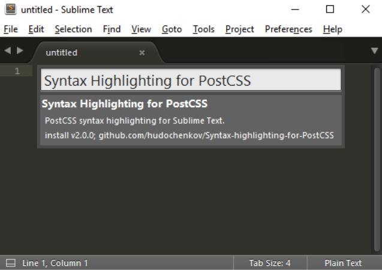

第四步：如果插件出现，点击它以进行安装；可能需要几分钟来完成。

我们当然可以简单地使用一个工作于JavaScript的语法高亮; 但这是不一样的：为PostCSS设计的语法高亮使编辑代码更容易！

我们刚刚安装的语法高亮插件带有自己的主题。 如果你切换为自己的，那么你可以这样做：使用Base16网站http://chriskempson.github.io/base16/

好吧，让我们继续; 是时候开始写代码了。 我们就从探索一些可用于解析代码的PostCSS插件开始吧。

## 实现自定义语法的插件

PostCSS生态系统已经包含100多个插件; 这个数目会继续增加。 这些插件将满足不同的需求，但有一点是一样的：他们是用来转换我们代码的过程。

现在，我们应该清楚，这种相似性处在非常高的层次; 我们不会涉及每个插件的技术细节！ 我们要说的是，如果要创造我们自己的自定义语法，我们必须遵循三个步骤：

- 我们首先会通过解析器解析代码。
- 然后我们使用任意一个插件来转换它。
- 我们最终将其字符串化，或将其转换为字符串格式的有效CSS

我们已经有了一些插件，它们允许我们在PostCSS环境中使用其他语法; 这些包括诸如LESS或JavaScript的语言：

| 插件名称 | 插件作用 |
| ------- | ------ |
| sugarss | 像Sass或Stylus语法缩进。 地址：https://github.com/postcss/ sugarss |
| postcss-less | 减少转换成有效的CSS。 地址：https://github.com/webschik/ postcss-less |
| postcss-js | 任何使用JavaScript的人可以使用这个插件在JS中编写样式或者转换React行内样式，Radium或JSS。 地址：https://github.com/postcss/ postcss-js |
| postcss-scss | 如果使用Sass，这个插件可以完美处理Sass代码。 地址：https://github.com/postcss/ postcss-scss |
| postcss-safe-parser | 插件可以完美修复CSS语法错误。 地址：https://github.com/postcss/ postcss-safe-parser |
| poststylus | 使用这个插件将Stylus转换成有效的CSS。 地址：https://github.com/seaneking/ poststylus |

虽然所有这些插件服务目的不同，但他们都遵循相同原理：他们解析代码并将其转换，然后将其格式化或者作为有效的样式表输出保存到文件里。

除了我们使用的解析器，还有一个问题：为什么我们想直接操纵我们的代码？ 有几个原因需要直接改变代码; 这里列出几个：

- 我们可能想创建一个详细说明我们的代码的事实和数字的报告供参考; 可以肯定的是，已经有能做到这一点的插件或脚本，但通过PostCSS我们可以获得编译过程中的基础知识。
- 这个想法怎么样？ 如果你碰巧使用一个应用程序，如Adobe Color CC，那么我们可以考虑使用API直接转换
特定颜色为有效的`RGB(A)`或`HEX`等效值。 我们可以使用插件来实现这一点，但是直接使用API执行此操作允许我们在选择颜色时保持灵活性。
- 没有什么阻止我们解剖现有的插件并且重整它们执行的任务，我们可以加入到任务执行文件，然后按照我们的需求进行调整。 我们可能最终考虑创建一个插件，但如果所需的步骤是非常具体的，那么插件可能不是一个有用的补充。
- 有时候可能缺少错误处理。 API包含一些有用的功能，如果我们的进程失败时，允许我们在屏幕上添加适当的格式化的消息。

除了操作现有的非PostCSS样式（例如，使用Sass创建的那些样式）之外，这些只是开始的几个想法。

说的已经够多了，需要来一个演示了！ 我们已经遇到了一些可用的插件，所以是时候把它们用好了; 其中两个特别感兴趣的是`postcss-scss`和`postcss-safe-parser`。 让我们就从`postcss-safe-parser`开始，从细节上更深入的了解下它们。

### 解析内容并修复错误

在接下来的几页中，我们将演示使用解析器插件来转换我们的代码有多么容易。我们将看到利用插件来取代对Sass的依赖（至少在基本水平）; 在我们这样做之前，让我们先探索如何使用`postcss-safe-parser`插件。

`postcss-safe-parser`插件，可从https://github.com/postcss/postcss-safe-parser获取，它非常适合用来查找和修复CSS错误。这是一个使用和安装非常简单的插件; 让我们开始吧：

第一步：我们将从安装插件开始，首先，启动一个Node.js命令终端，然后将工作目录更改为项目的根目录。

第二步：在命令提示符下，输入此命令，然后按Enter键安装插件：

	npm install postcss-safe-parser --save-dev

第三步：接下来，提取从本书附带的代码中`T58 – parsing invalid content`文件夹， 保存到项目根目录。

第四步：将`package.json`和`gulpfile.js`文件复制到我们的项目根目录。

第五步：切换回NodeJS命令窗口，然后在提示符下，输入`gulp`，按“Enter”键。

如果一切顺利，我们应该看到一个成功的编译：一个名为`output.css`的文件将在我们项目根目录被创建。

打开它。即使我们的示例只包含一个难看的选择器，文件中也包含相同的选择器，但这次没有关闭的圆括号。 我们可以看到控制台日志中输出的结果，如下面的截图所示：

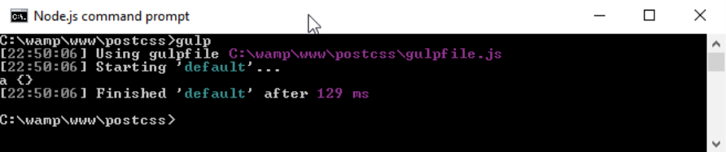

这里发生了什么？看上去非常熟悉。我们在Gulp文件中使用标准格式引用一些插件，比如我们常看到的`autoprefixer`插件。

我们感兴趣的内容是在Gulp文件默认任务中像下图一样配置：

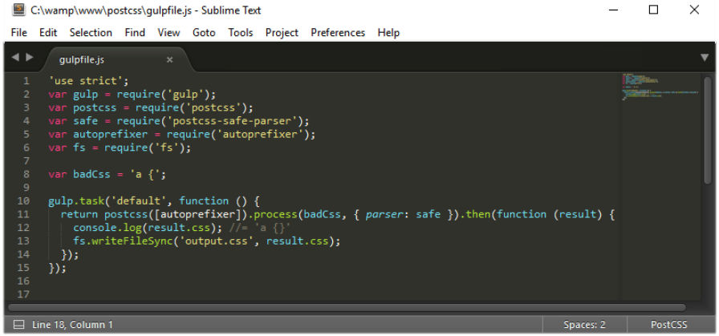

任务看起来可能有点复杂，但在现实中，我们在操纵我们的CSS之前会优先解析它。 我们首先定义一个`postcss`对象（在运行之前需要先调用`autoprefixer`）。这个处理CSS的过程就是一个AST，通过使用解析器查找并修复所有问题，然后在屏幕上输出来，并以`output.css`的文件输出到我们项目中。

> AST（Abstract Syntax Trees）是一个用图形树表示CSS样式表或代码的语法结构。

好吧，我们的例子很简单，但这是为了告诉你工作原理是怎样的。 在下一个示例中，将使用相同的原理来转换标准SCSS代码为有效的CSS代码; 注意，我们并不是在说Sass（正如之前一样），而是将SCSS代码转换为有效的CSS样式。

### 解析SCSS内容

在我们以前的演示中，我们探讨了使用PostCSS来解析我们的CSS并添加缺少的闭合括号来修复我们的代码。这是一个简单的例子; 如果你使用标准的CSS，那它已经能很完美的说明问题。但如果你的项目使用Sass将如何呢？

那么，作为我们下一个例子的一部分，我们将证明使用编译器现在已经过时;我们将使用`postcss-scss`插件（从https://github.com/postcss/postcssscss获取）直接转换我们的Sass代码，然后使用`postcss-nested`插件（可从https://github.com/postcss/postcss-nested获取）解开嵌套的样式：

第一步：我们将从安装`postcss-scss`开始。 打开NodeJS命令终端，然后将工作目录更改为
我们项目根目录。

第二步：在提示符下，输入此命令，然后按Enter键：

	npm install postcss-scss --save-dev

在完成插件安装后保持命令终端打开：

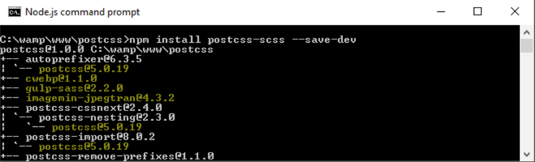

第三步：从本书附带`T59 – Parsing SCSS content`文件夹中，复制`package.json`文件将其保存到项目的根目录。

第四步：从`T59 – Parsing SCSS content`文件夹中，复制`src` 文件夹到我们项目根目录下的`src`文件夹。

第五步：在一个新文件中，添加以下代码并将其另存为`gulpfile.js`，并放到我们项目根目录的`src`文件夹中：

	'use strict';
	var gulp = require('gulp');
	var postcss = require('postcss');
	var fs = require('fs')
	var autoprefixer = require('autoprefixer');
	var nested = require('postcss-nested');

	var scss = fs.readFileSync('src/styles.scss', 'utf-8');
	    gulp.task('default', function () {
	        var syntax = require('postcss-scss');
	        postcss([ autoprefixer, nested() ]).process(scss, { 
	          syntax: syntax }).then(function (result) {
	            fs.writeFileSync('dest/styles.css', result.content);
	    });
	});

你可能发现涉及到`postcss-nested`。我们不可以调用PostCSS而不指定任何东西，所以我们将使用这个插件来解开我们的代码中的嵌套语句：

第一步：返回到NodeJS命令终端，然后添加此命令，并按Enter键：

	npm install postcss-nested --save-dev

第二步：一旦Node完成插件安装，输入`gulp`命令然后按Enter键：

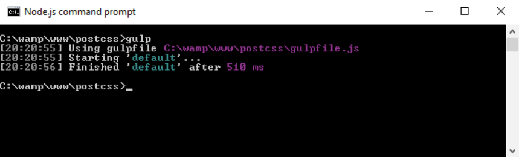

第三步：如果一切顺利，我们将看到一个编译文件出现在目标文件夹：

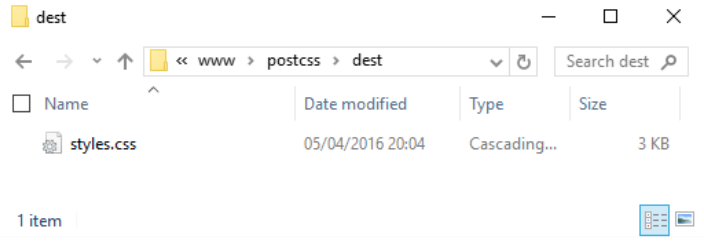

但暂停片刻：这是一个有效的CSS文件，对吧？ 绝对的。 但是...我们到目前为止不得不使用编译器产生有效的CSS代码; 我们为什么不需要立即添加一个？

### 探索发生了什么

其实，在转换过程中已经给出了答案 -- 传统意义上我们会编译我们的代码，即使标准Sass文件是当前CSS的集合。相反，我们只是使用标准的语法来重写代码将SCSS文件转换为有效的CSS。

如果我们更详细地查看我们的Gulp文件，我们可以看到对`gulp-postcss`插件的标准引用，以及声明的`fs`，`autoprefixer`，`postcss-nested`和`postcss-scss`插件。 这个演示的关键在第10行，其中我们在实例中声明一个`scss`变量，并使用Node的文件系统（`fs`）插件读取文件的内容到这个变量中。

进入任务，我们创建了一个PostCSS对象，并引入`autoprefixer`和`nested()`插件（作为变量）。 然后我们使用`postcss-scss`插件附带的语法处理我们的Sass代码，接着将内容输出为文件保存到我们项目中的`dest`文件夹中。

看到没？ 优雅而又简单; 完全不需要Sass编译器！ 这个简单的改变移除了对编译器的任何依赖，毕竟，SCSS文件只是标准的CSS文本文件，那么为什么要使用编译器呢？ 所有这些关于CSS（或更值得一提的SCSS）解析的谈论，值得花一些时间探索其中的意义，和它对整个过程的重要性。

## 解析CSS

编写任何自定义语法的核心是分析内容的能力 —— 无论是CSS，JavaScript还是别的什么; 我们显然需要
了解我们正在进行的工作，然后我们才能做出改变！ 在基本层面上，这些是我们在使用PostCSS来转换我们的CSS时必须采取的步骤：

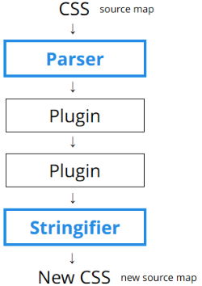

我们从CSS源开始（它带有或不带源映射），我们只解析一次，然后通过使用任意数量的指定插件（示例显示两个，但我们可以轻松使用更多）。 然后我们将输出格式化为字符串，如此，我们就可以查看屏幕上的内容或将它们保存到磁盘。

让我们先来看看如何解析示例代码。 对于下一个示例，我们将使用`postcss-value-parser`插件解析单个CSS规则（来自https://github.com/TrySound/postcss-value-parser）。原因很简单：

第一步：从本书附带的`T60 – parsing color values`文件夹中，提取`gulpfile.js`和`package.json`并保存到项目根目录下。

第二步：启动NodeJS命令终端，然后将路径切换到项目的根目录下。

第三步：我们需要安装`postcss-value-parser`插件，所以在提示符下，输入此命令并按Enter键：

	npm install postcss-value-parser --save-dev

NPM将安装该插件，完成后让命令终端一直处于打开状态：

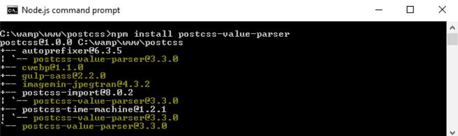

第四步：在命令终端的提示符下，键入`gulp`并按Enter; 在命令终端显示的内容看起来像这样：

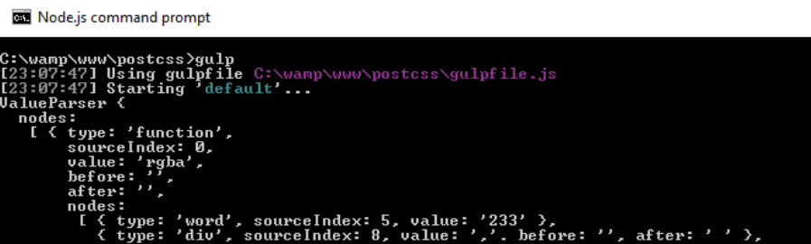

咦！ 这是什么意思？ 别担心，实际上没有这么糟糕; 这是一个AST的例子，我们在本章前面讨论过。 这给了我们深入了解CSS相关的信息，例如，值类型和它们出现在树中的位置。

然而，更强大的是，一旦我们拥有了所有这些内容，就可以随意查询和操纵内容。在操纵了内容后，需要将它转换为字符串格式，这样就可以以更智能格式在屏幕上显示，或保存到磁盘。

对于这个演示，我们使用`postcss-value-parser`插件创建了我们的AST; 我们也可以尝试使用`postcss-safe-parser`插件（从https://github.com/postcss / postcss-safe-parser获取），或`postcss-selector-parser`插件（从https://github.com/postcss/postcss-selector-parser获取），实现类似效果。

那为什么我们在演示中只使用一行CSS代码？ 事实上，解析CSS代码可以变得非常复杂。在我们的演示中显示的示例是相对直截了当的; 想象一下，如果有2,000多行代码会是什么样的！

让我们进一步开发这项功能，并使用它来实现用`HEX`替换`RGBA`的颜色值。 我们可以通过使用`postcss-unrgba`插件（从https://github.com/jonathantneal/postcssunrgba获取）轻松做到这一点，但它有几乎60行; 我们的Gulp文件是43行，很多还是评论！

### 替换RGBA颜色

我们的下一个例子是一个相对于直接的搜索和替换，它是一个完美的示例，足以证明不总是需要使用插件。我们也可以直接解析我们的代码，实现相同的效果。 让我们开始：

第一步：我们随书附带的源码中复制`T61 – changing colors`文件夹，并将其保存到我们的项目根目录。

第二步：从`T61 – changing colors`文件夹中复制`gulpfile.js`和`package.json`文件，并且放到我们项目的根目录。

第三步：从`T61 – changing colors`复制`src`文件夹，放到我们项目的根目录。

第四步：启动NodeJS命令提终端，然后将路径切换到项目的根目录。

第五步：我们现在需要安装一个额外的插件：`color-convert`（可从https://github.com/qix-/color-convert获取），将使用它们来更改颜色，并在AST中展示其中的细节。 为了这个目的，继续并启动另一个NodeJS命令终端，然后将路径切换到项目的根目录。

第六步：在命令终端提示符下，输入`npm install color-convert --save-dev`后按Enter键。

第七步：当插件完成安装后，继续输入`gulp`，然后按Enter。 如果一切顺利，我们应该看到，转换后样式表出现在我们的目标文件夹中：

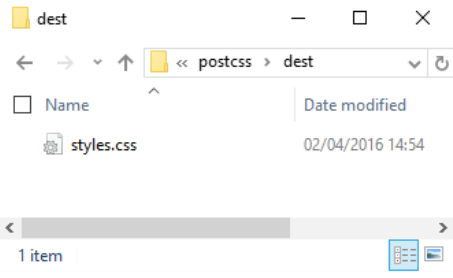

在此，我们的样式表已经被转换。 如果我们在文本编辑器中预览结果，我们可以确认`HEX`替代了原来的
`RGBA`颜色，如下面的截图所示：

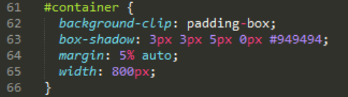

不确信？ 可以查看源文件中的相同规则; 这里它显示原始`RGBA`值：

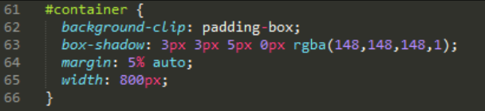

看看这是多么容易？ 有一件事需要注意： 看看我们的Gulp文件，乍看下来，我们好像还是使用了几个插件。 关键其中三个是Node（`fs`，`path`和`util`）的一部分，所以在以上值解析和颜色转换的例子中我们没有安装任何新的插件。

### 研究它是如何运作的

这段代码值得花时间仔细考虑。 它包含了一些有用的技术，从检索我们需要的值开始，将帮助你有效开始创建自定义语法。

首先阅读样式表文件的内容，然后使用`postcss-value-parser`插件解析它。我们遍历AST中的每个节点，
忽略其中类型为函数的节点或值为`rgba`的节点。剩余的就是我们要收集所有字节类型的节点，在此之后，将我们已经转换为数字的值映射为一个单维数组。

然后，它从一个函数节点转换到一个字节点，并将值从`RGBA`转换为`HEX`颜色。 同时，内容被转换为字符串，并以相同的文件名保存到目标文件夹中。

> 节点类型表示我们使用的选择器的类型 —— 比如`root`，`string`，`tag`和`attribute`。 在我们的例子中，我们使用`node.type`来显示在可代码中操作的字符串表示的选择器类型。

好吧，让我们继续：使用自定义语法的关键是理解我们需要处理的内容; 通晓这个是将您的样式转换为有效的CSS方式的一部分。 为了对这个过程更有帮助，我们会需要将我们的内容转换为可以保存到磁盘的格式。 是时候看看如何使用PostCSS API来实现这一点了。

## 使用API格式化输出

当解析CSS时，默认情况下会输出一些如下面的截图所示的东西：

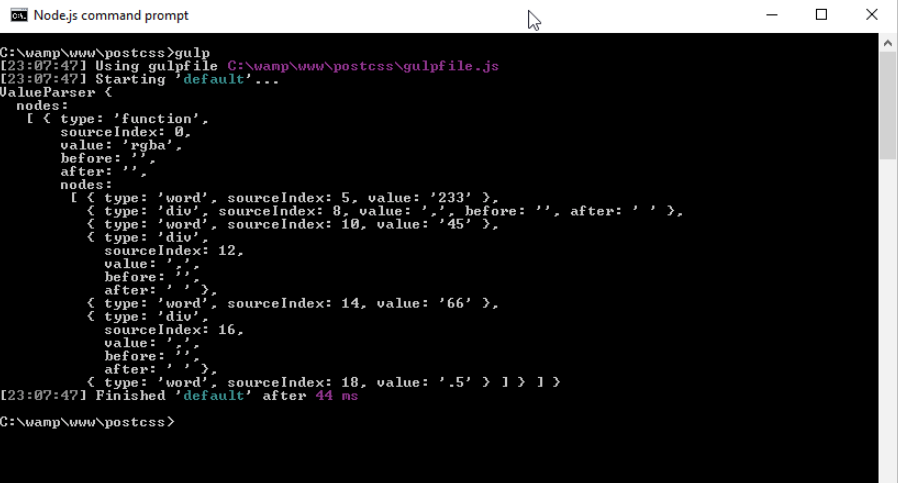

它看起来真的很丑，但事实上是AST树的标准格式。麻烦的是，如果想在代码中使用它的细节，它并没有帮助。为了解决这个问题，需要将内容转换为字符串格式：最简单的是使用`.toString()`方法，可以完美的将内容保存到磁盘上。

下一个练习的所有代码都在本书附带代码的`T62 – adding a stringifier`文件夹。

在我们的Gulp文件中使用非常容易; 让我们来看看接下来的练习：

第一步：我们将从创建一个新的Gulp任务文件开始。在你经常使用的文本编辑器中添加以下代码; 由于涉及内容比较多，所以我们将分段讨论，从声明使用的插件开始：

	'use strict';
	var gulp = require('gulp');
	var postcss = require('postcss');
	var util = require('util');
	var autoprefixer = require('autoprefixer');
	var fs = require('fs');

第二步：我们需要设置几个变量; 这些将用于存储在编译过程中生成的值：

	var newValue = 'white', result, selectors = [], root, decl;

第三步：接下来开始我们的任务。 第一步是解析一些简单的CSS，作为我们演示的基础。 然后我们得到我们的代码中的第一个子属性，并保存到变量：

	gulp.task('default', function () {
	root = postcss.parse('a { color: black }');
	decl = root.first.first;

第四步：我们想要的第一条信息是选择器计数; 下一块会使用`root.walkRules`对每个选择器计数，并将值推入选择器数组：

	// get a selector count
	selectors = [];
	root.walkRules(function (rule) {
		selectors.push(rule.selector);
	});

第五步：这里，我们准备给出我们代码的摘要报告 -- 我们使用`console.log`在屏幕上显示多个不同的值：

	console.log("\nThe declaration type is: " + decl.type);
	console.log("The value of this declaration is: " + 
	  decl.toString());
	console.log("Number of nodes in this CSS: " + 
	  root.nodes.length);
	console.log("Selectors used in this CSS: " + 
	  selectors.toString());

第六步：我们就要完成了 -- 接下来，我们使用类似搜索替换功能的PostCSS来把我们的颜色从黑色更新到白色：

	// Replace color black with white
	root.walkDecls(function (decl) {
	    if ( decl.value.match(/^black/) ) {
	        decl.value = 'white';
	    }
	});

第七步：我们可以在屏幕上显示我们的内容，但更有用的步骤是保存它到磁盘 -- 为此，我们可以使用Node.js中的`fs`插件创建我们的转换后的CSS文件及相关的源映射：

	// display content on screen and save to file
	result = root.toResult({ to: 'all.css', map: { inline: 
	false } });
	console.log("Updated color value: " + 
	  decl.value.toString() + "\n");
	fs.writeFileSync('dest/styles.css', result.css);
	fs.writeFileSync('dest/styles.css.map', result.map);
	});

第八步：将Gulp文件保存到项目的根目录，然后启动Node.js命令终端，并将工作目录更改为我们的项目目录。

第九步：在提示符下，键入`gulp`，然后按Enter键，让编译完成。如果一切顺利，我们应该看到步骤6的结果出现在屏幕上，如下：

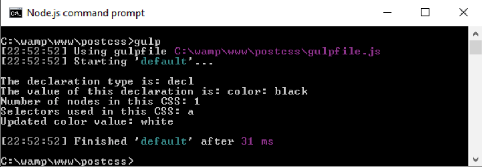

转换后的CSS文件和源映射将存在`dest`文件夹中：

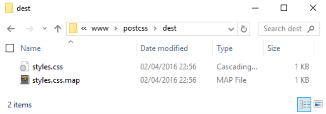

那么，这对我们有什么帮助？ 好吧，解析我们代码的能力直接带来了一些真正的可能性; 让我们暂停一下，以考虑在我们的演示中发生了什么，以及我们如何在未来的项目中利用这一功能。

### 分析示例代码

在整本书中，我们使用了各种插件来转换我们的代码。 这些都将使用某种形式的PostCSS API。 但是，我们可以不受限制地简单使用插件; 还可以直接使用API转换代码。在这一点上，应该注意，我们不是在谈论创建自定义解析器;事实上，这内容本身就已经足够形成的一本简短的书！

光是看Gulp文件就足以让一些人望而却步。 事实上，创建自定义语法来解析使用Stylus或LESS创建的代码并不容易，也不在本书的范围之内。 但是，我们可以利用一些API来查询我们的内容。 在我们的例子中，有让人感兴趣的代码块。

第一个块解析每个选择器并保持计数。 我们可以使用`.walkRules`方法遍历每个规则：

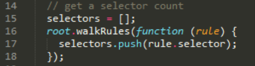

一旦我们获得了原始信息，就可以将其进行字符串化（或将其转换为字符串），然后在屏幕上显示内容：

值得注意的是，PostCSS API包含了额外的功能来字符串化表示CSS，并且是捆绑在一起的。 这些被称为`Stringify`和`Builder`命令; 这些仅仅在创建自定义语法时需要使用。 我们只需使用为此目的设计的现有插件解析我们的内容，因此使用`toString()`足以满足我们的需求。

为了更好地描述过程,尽量保持我们的例子简单。我们可以轻松添加其他功能。 API参考文档在
https://github.com/postcss/postcss/blob/master/docs/api.mdis ，可以很好地从这里开始。 例如，如何添加错误检查？ 我们已经添加一个选项，以源映射的形式; 让我们更详细地介绍一下。

### 添加Source maps

在我们的许多演示中，已经合并了创建源映射任务的CSS样式。 它到目前为止工作得很好，但它不是最后的答案，我们可以做得更好！ 如果要看更多可能性，可以去看在前面的演示中使用的Gulp任务文件中的最后一块代码（应该在第33到36行）：

	// display content on screen and save to file
	result = root.toResult({ to: 'all.css', map: { inline: false } });
	...
	fs.writeFileSync('dest/styles.css', result.css);
	fs.writeFileSync('dest/styles.css.map', result.map);

在这里，我们将转换代码保存到文件，创建了一个版本`{inline：false}`，以阻止在代码中直接创建源映射。作为替代，我们使用NodeJS的文件系统来创建基于`result.map`的源映射;这包含我们转换后的代码的内容。

使用此方法时需要注意几点； 更多详情，可以查看PostCSS站点https://github.com/postcss/postcss/blob/master/docs/source-maps.md。

是时候进行改变了：到目前为止，我们集中在编写代码，但它的展示是怎样的呢？ 这不是完全必要的，但设置代码高亮有两个方面的好处：它使编辑代码更容易，也可以使用它提供一致的主题来记录代码。 毕竟，我相信你以后至少也会去做...不是吗？

## 代码高亮语法

在我们的许多演示中，我们集中在使用插件，并且只对使用的代码配置做最小的更改。 这没有什么错，但是一如既往，我们可以做得更好。 比如,如何安装语法高亮支持？

这是一个使代码更容易阅读的简单途径，的确，早就应该安装这样的东西！ 除此之外，它很容易适配;
支持各种编辑器。 为了本章的目的，我会假设你正在使用Sublime Text; 它看起来就像这样（屏幕截图的显示使用了`Twilight Light`主题）：

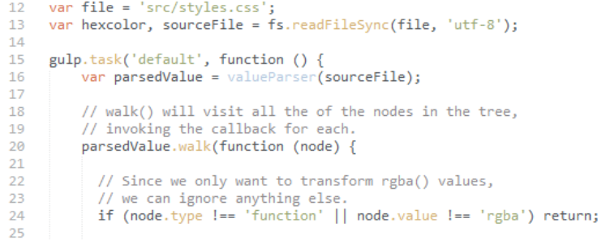

让我们来看看如何使用Sublime Text的包管理器来获得它。

### 安装主题

添加主题对于Sublime Text这样的编辑器来说很容易。让我们按以下步骤来做：

第一步：我们将从打开命令窗口开始。 添加这个命令，然后按Enter键：

	cd %APPDATA%\Sublime Text 3\Packages\User

第二步：输入这个命令，按Enter键：

	git clone git://github.com/chriskempson/base16-textmate.git Base16

第三步：打开Sublime Text。 如果一切顺利，当我们点击**Preferences| Color Scheme| User**，我们应该看到一个新的菜单项：

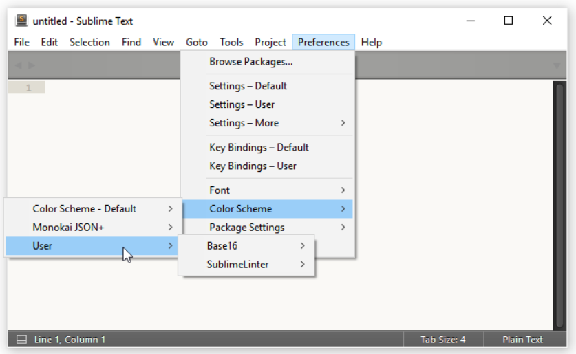

一个有用且容易的改变; 然而，它只是我们可以做到的一部分！ 要更进一步，我们可以对CSS样式应用类似的高亮效果。 如果我们想文档化我们的在线样式，这使得它更容易阅读。毕竟，彩色显然比黑白更容易阅读！ 让我们花一点时间探索如何将彩色主题应用于我们文档化的代码。

### 创建一个显示HTML主题

开发代码需要文档。 这不仅让我们自己清楚，如果未来有人需要改变我们的代码时也能更好应对！ 创建打印文件现在已经过时了，更好的方法是在线创建它，以让我们可以轻松地更新它。 同时，我们可以添加一些色彩，使其在视觉上更具吸引力，并提供更一致的格式。

我们可以手动创建这个代码，但这是一个繁琐的过程并且容易出错！ 更好的方式是，我们可以使用Midas库（可从http：//midasjs.com获取）自动创建我们的基础文档，我们可以使用在上一个练习中介绍的base16的主题之一为它带来样式。

让我们开始安装这项支持：

第一步：我们将从启动NodeJS命令终端开始，然后切换到我们的项目区。

第二步：在命令行输入该命令，按Enter键：

	npm install midas --save-dev 

第三步：完成安装后，继续并从`T63 – incorporating midas`提取`src`文件夹和`gulpfile.js`和`package.json`文件，然后将它们保存到项目的根目录。

第四步：返回NodeJS命令行，输入`gulp`，并敲Enter键

第五步：Gulp会执行并基于我们的代码编译一个HTML保存为`styles.html`，它已经使用额外的格式化标记。该文件将出现在我们项目区域内的`dest`文件夹中。

这样，如果我们要查看该文件的内容变得很简单; 这个也很容易实现！ 为此，我们将使用TimothéePoisot的Brewer主题（来自https://github.com/chriskempson/base16-builder/blob/master/
schemes / brewer.yml）; 实现它需要几个步骤：

第一步：浏览器打开https://github.com/ben-eb/midas/blob/master/templates/
template-light.css，并将其CSS文件保存到我们项目的`dest`文件夹。

第二步：在文本编辑器中打开它; 它包含一系列base16可用主题的占位符。 我们通常会使用Ruby为这些主题生成CSS，但这不是完全必要的; 也可以使用编辑器的搜索和替换功能用适当颜色来匹配每个占位符：

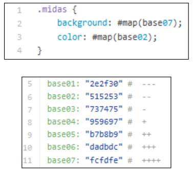

第三步：保存结果; 要使它工作，我们需要调整`styles.html`文件的内容来引用新的样式表，这样它将具有正确的
HTML结构。 完成后，它看起来像这样：

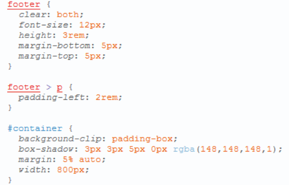

这看起来更有吸引力，我想你也会同意！ 虽然创建初始主题需要做一些工作，但在你创建更多主题时这将是一次性的过程。对CSS规则或声明所做的任何更改可以自动生成，并且HTML结果相应地更新。

## 小结

一开始，我们简要介绍了自定义语法，接着准备环境以开发代码。 然后我们介绍了用来解析内容的一些可用的插件，并探讨了为什么我们可能需要直接解析自定义语法或样式的原因，再然后，实现两个示例以展示如何操纵我们的代码。

然后，我们探讨了大多数PostCSS插件对我们代码的更改。 接着我们探讨了直接改变样式所需的一些技术，
考虑了这些变化对代码本身的影响。

接下来，我们研究了内容如何格式化为适应屏幕显示或保存到磁盘（包括创建源映射）。 我们注意到，虽然有一些具体的方法可用，但这些是保留以用于自定义语法开发的，并且我们使用的选项将足以操作我们的代码。

接下来的章节说到了如何为我们的项目添加语法高亮支持 —— 我们分析了添加这个的原因，如让代码编辑更容易，并且用一个示例快速演示了使用Midas库为我们的项目准确地生成文档。

使用不同的语法是一个很好的方法，而不再需要为有效的CSS重写现有的代码。 但有一件事：如果我们有标准的CSS和预处理器代码的混合，会如何呢？比如LESS或Stylus？ 同时存在两个我们能工作吗？ 当然！ 在下一章我们将介绍Pleeease库，它支持这一点。