# 第13章：排除解决PostCSS相关问题

对许多读者来说，PostCSS可能还有点昏头转向。毕竟，它还是一个相对比较新的库，不同于其它处理器。在这本书中，我们已经进行了一段时间的探索。在结束之前，我们再看一些最佳实践的提示和技巧，以及针对一些踩过的坑（问题）找到解决方案。

在这一章的课程中，我们来看看一些你在创建PostCSS处理器的时候可能会碰到的问题。修复这些问题其实不难，如果问题不容易解决的话，我们再来看看下一步要怎么做。

这一章我们将会讨论以下几个主题：

- 解决一些常见的问题
- 详细探索一些常见的问题
- 向别人请求帮助

下面我们开始吧！

## 解决一些常见的问题

在一个理想世界中，我们创建的任何处理器都可以完美运行，无论我们是用哪个任务构建工具来跑PostCSS任务。我们的目标是得到一个或多个成功编译的文件，如本例所示：

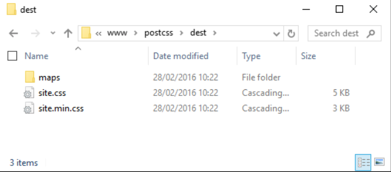

但我们都知道，事情并不可能一帆风顺。如果真是这样，那只能是我们真的太幸运了，或者我们做的事情其实非常普通。

作为一个实用主义者，我想大部分人在学习PostCSS的时候，都会碰到各种各样的问题，在这一章中，我们将探索一些比较常见的问题，以及如何解决这些问题，并整理一些常见的技巧，可以用来帮助我们更方便地使用PostCSS。我们先来详细看一看我们可能会碰到的一些比较常见的问题。

## 探索一些常见的问题

PostCSS作为一个处理系统，上手以及使用都是非常简单的，但我们在开发过程中总难免会遇到问题。这些问题各种各样的都有，当然，为了帮助你学习，我们可以探讨一些我们在开发过程中可能会碰到的问题。

这一章的目的，我们假定你已经在用Gulp了。当然在使用Grunt或者Broccoli这些任务构建工具的时候也会碰到类似的问题。所以是时候更详细地探讨这其中的问题了。

### 与操作系统不兼容

PostCSS的美妙之处在于我们可以安装一个或者几十个插件。如果我们使用如Gulp这样的任务构建工具，那么我们可以很容易地拓展它，以覆盖各种不同的使用情景。

在大多数情况下，插件可以顺利安装，但偶尔会碰到这样的情况：

这个警告信息对我们来说最重要的不是ENOENT信息，而是这条：

**notsup: Not compatible with your operating system or architecture:
fsevents@1.0.6**

应当注意的是，这只是一个warning，而不是error。这是因为使用了`fsevents`，只在MacOSX支持，在Windows或者Linux环境中不支持。在大多数情况下，可以忽略，不过你可以测试一下处理器，确保它没有对代码造成任何不好的影响，也是一个明智的做法。

> 这个错误不仅限于`fsevents`——它可能适用于其它任何包，因为在你的系统环境中不支持。

### '<name of task>'在gulp文件中找不到

我们已经创建了一个Gulp任务文件，包括一系列的任务在里面，并使用它来编译我们的样式表。在编译文件时，出现了下面这条信息：

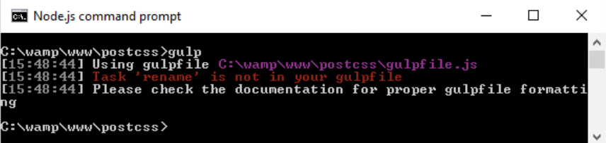

这是由于对应的Gulp任务没有在gulp文件那种。在这个声明示例中，我们调用了`rename`任务：

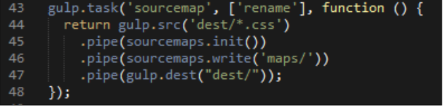

但看一下gulp文件，并没有看到`rename`任务：

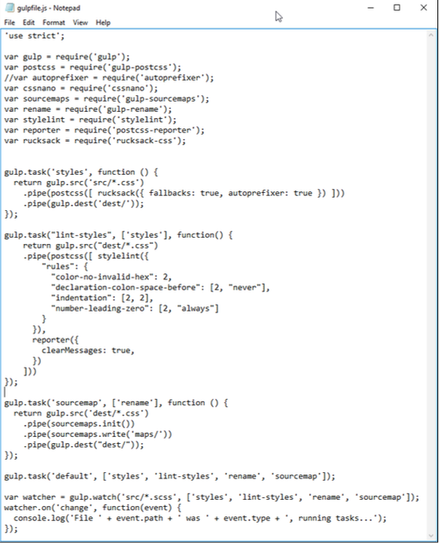

这是一个简单的修复。只是重命名`task`，使其对得上，并重新编译。注意，如果超过一个任务没有命名正确，那么处理过程将会失败，但只会显示错误的第一个命名。确保每个任务名称都已经正确输入，这样才能顺利编译。

### 找不到`<name of plugin>`模块

如果说有哪些报错会让我们手足无措，那一定是这个。我解释一下：

当你掌握了安装PostCSS插件，你会看到很多实用的命名约定是`postcss-<插件名>`。这看起来似乎很不错，但是注意，不是所有PostCSS插件都使用此命名约定。

一个很好的例子是`Rucksack`——可能会使用`psotcss-rucksack`（是的，包括我！），但是如果我们这样做，就会导致报错：

`Rucksack`只是其中的一个例子，没有使用大家都默认的命名约定。相反，它使用`rucksack-css`，因为我们期望使用的名字，已经被使用了。

这是其中一个例子，所以还是需要多阅读文档，方便以后减少尴尬：

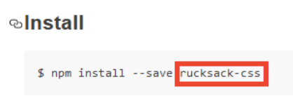

它明确声明了在安装插件的时候使用什么名字，这对我们而言是最好的...

### 引用错误：`<name of task>`未定义

我们假设gulp文件中已经有一系列任务了，但是由于一些未知的原因，我们在编译的时候报出了这个错误：

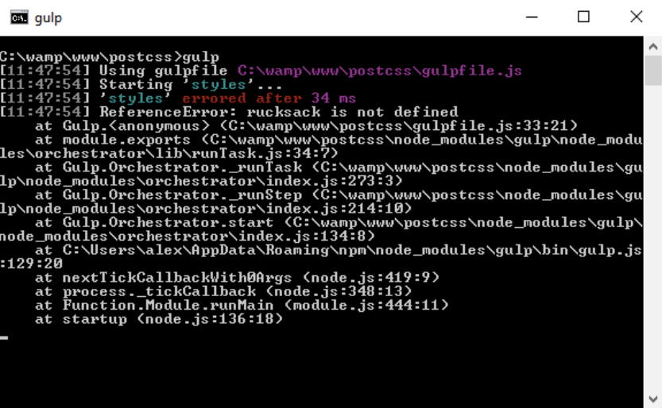

这可能是因为什么导致的呢？好吧，至少有两个可能的原因：

- 我们在任务本身引入了插件，但是忘了在文件顶部的声明中加入一个引用
- 我们在任务和相关的声明中都引入了插件，但是可能没有给它们相同的命名

修复方法是，当我们在Gulp任务文件的顶部引入声明的时候，要确保和文件后面使用的名称是一致的。

### 请提供PostCSS处理器数组对象

这个错误是大家很容易犯的，但在开发自己的处理器的过程中也容易解决。你可能会到达一个阶段，开始从主要的PostCSS调用中将一些PostCSS处理器任务移除，放到它们自己的任务中。

假设你有如下这样一个PostCSS任务：

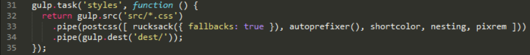

我们自然而然会去把这个任务分成单独的几个；毕竟，我提倡1:1的关系，一个任务名对应一个具体的任务。然而，如果你做得有点太过了，你可能觉得任务中不需要一个PostCSS处理器，那么你可能会出错，类似于下面这张截图：

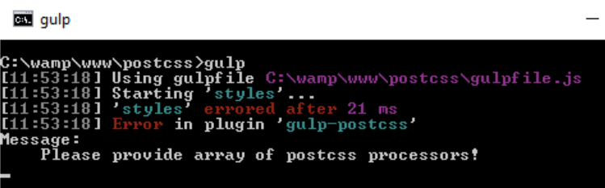

快速检查一下你的Gulp任务文件中，可能会有如下：

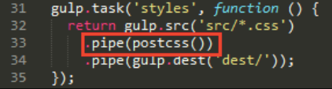

我们有个`postcss`任务，但是里面没有任何预处理器。虽然是在努力对处理器进行改编，以确保我们保持了1:1的关系，我们还是必须至少在`postcss()`任务中保留至少一个处理器，以确保它能够正确运作。

> 你会听到处理器使用几种不同的方式——它们也可以在你的Gulp任务文件中作为一个通用术语。它还可以适用于处理器任务中，应该被添加到任何`postcss()`任务。

### 条目未出现在`package.json`文件中

这个错误需要一点小技巧，但是在开发过程中修复同样很简单，你可能会想要修改Gulp任务文件，这意味着新的插件会被从另一个`package.json`文件添加到我们这里（如果已经安装了），或者重新添加（如果它们还没被安装）。

因为Gulp任务文件只是一个纯文本文件，我们可以在任何文本编辑器中编辑它——我个人最喜欢的是`Sublime Text3`（地址：http://www.sublimetext.com/3），但其它的编辑器也都是可以的。Notepad不是很好，因为它无法正确处理行尾。

除了这个，如果我们编辑`package.json`文件，删除一个条目，然后添加一个新的，我们可能会遇到这种警告：

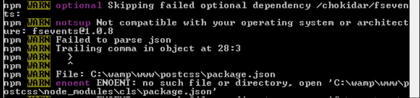

原因是非常出人意料的——一个字符就可以导致所有这些警告！罪魁祸首是在某一行的末尾多了一个逗号，所以后面没有接着另一个插件了，如下面截图的第27行所示：

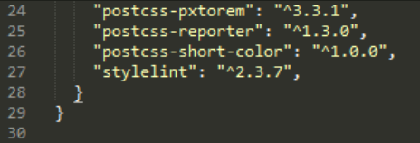

如果我们把逗号删掉，然后重新安装，我们很快会看到错误已经消失了。

### 编译的结果不如预期

最后一个错误有迷惑性——严格来说它不是一个错误！想象我们已经使用Node和Gulp创建了一个杀手级处理器应用。它包含了我们前面创建的一定数量的相似的任务，在这门书中也都使用了的。

我们输入相关命令并回车。PostCSS开始编译：目前为止没问题。看一下这里的`dest`文件夹——这是我们要的压缩版文件和资源映射？

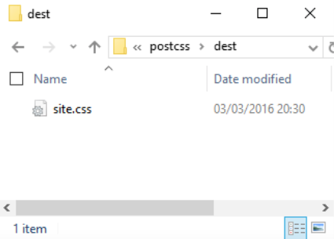

但是等等——错误在哪呢？检查编译过程输出的结果，并没有错误啊，那到底在哪里出错了？

这个奇怪的地方是，判断错误任务执行顺序造成的——尽管截图显然表示这是一个错误，它不是真正意义上的错误。我解释一下。

成功编译过程的关键（默认情况下，一个工作的处理器），在于确保我们跑的每个任务都按照正确的顺序执行了。产生这个错误，我尝试把Gulp配置文件中的`rename`任务删除，在`T45 – converting to use Rucksack`案例中，如下：

	gulp.task('rename', function () {
		return gulp.src('dest/*.css')
			.pipe(postcss([ cssnano() ]))
			.pipe(rename('style.min.css'))
			.pipe(gulp.dest("dest/"));
	});

这个任务看起来完全可以接受，但是有个问题——我们现在是有两个任务，不是一个。

这个结果是因为`styles`任务首先运行（因为在第36行的`default`任务中，它是最先被调用的）。马上就是`rename`任务（对它没有限制），接着是`sourcemap`和`lint-styles`（针对每个任务设置的限制）。

我们最终在`dest`文件夹中得到了一个编译之后的文件——`rename`和`styles`任务同时执行，因为后者没有执行，前者不能生成任何内容。

我们继续。如果还是失败，你可以看看有哪些自己无法解决的问题，是时候寻求帮助了。这里有一个方便初学者使用PostCSS的快速选项。

## 寻求别人的帮助

有这个阶段，你试图解决一个问题，但是失败了——你不知道下一步咋办...

别担心，我们有很多同伴的。首先我们要有主要的文档，地址：https://github.com/postcss/postcss/tree/master/docs。如果还没答案，Google一下。另外，还有一些其它的可能有所帮助的选项。

### 在Stack Overflow记录问题

如果你花时间研究Google，还是没有找到之前有谁碰到这个问题的，那么你可以在Stack Overflow上提问：

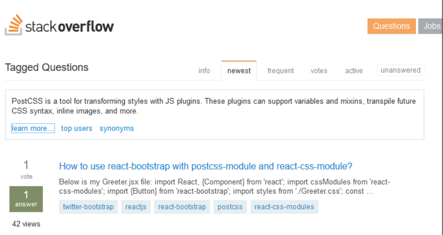

地址：http://stackoverflow.com/questions/tagged/postcss。这里列出了PostCSS标签的所有问题，开放给所有人提建议或者讨论关于业务的内容。如果你要在这里提交问题，记得详细记录一下你使用的操作系统（Windows, Mac, 还是Linux），以及所有关于报错的截图或者细节，这可以帮助你更快地解决问题。

### 找到关于PostCSS的bug

更进一步，你还可以记录一个开发需求，或者修改代码的建议——GitHub地址：https://github.com/postcss/postcss/issues。

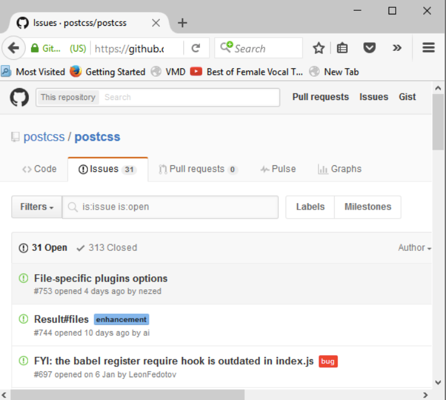

有几件事要记住：

- 不要担心你是在插件网站上提建议，而不是在PostCSS的GitHub地址——很多问题并不是PostCSS的问题，而是插件本身的问题。
- 它有助于展示——你的配置任务文件和`package.json`，有时候可能是插件间的兼容性问题，或者必须遵循一定的顺序来执行任务，以确保插件可以使用。
- PostCSS插件开发者经常在Apple Mac或者Linux系统上开发，这意味着有些你看到的错误可能是因为，使用的系统不支持插件中的一条或多条命令。
- 如果你在使用一个或者多个插件时遇到问题，先回到你的处理器任务，列出那些导致了问题的插件。即使这并不能解决问题，它可以帮你缩小范围，更好地定位问题，避免不必要的检查。
- PostCSS使用的许可证是MTI license——这实际上意味着你可以做你喜欢的软件，只要保留了这个库的版权。
- 值得注意的是，CodePen支持使用PostCSS——你可能会发现在线写代码（并自动编译）很方便，而不需要手动跑处理器。CodePen只支持有限的插件，所以不能适用于所有的情况，但起码有支持呀！(更多细节，可以看看CodePen网站上的这个blog：https://blog.codepen.io/2015/07/14/postcss-now-supported-on-codepen/。)
- 开源软件的缺点（以及PostCSS创建的插件）是插件开发者的水平不同——而同时核心系统提供的支持很好，有时候你可能会发现某个插件的支持不是很积极。不要依赖插件开发者，如果你有什么关键问题，请先通过Stack Overflow记录，在上升到插件网站之前。如果问题被确定需要进一步的开发，才会选择后者。

记住这些，祝你好运！PostCSS正在迅速获得很多大牌公司的使用，如WordPress和Google，接下来它肯定会很受欢迎哒。如果你因为在使用插件的时候碰到问题，就把它放弃了，那是非常可惜的。

记住，如果哪个插件不行了，那么看一下其它的——也许有其它可以取而代之的插件。不能完全支持的插件终究会被淘汰，留下那些支持好的能及时解决问题的。

## 小结

在学习新东西的时候，我们总避不了会碰到各种各样的问题——在这一章的学习中，我们看了一些你可能会碰到的常见的错误，并列出了对应的解决方案。我们接下来探讨了如果你碰到了无法解决的问题，可以向其它开发人员寻求帮助。

好的，我们继续：这本书中我们已经讲了很多内容，是时候接着往前看，看看CSS可能带来什么。PostCSS的伟大之处是插件已经存在，允许我们现在就开始使用将来的功能，我们会在下一章中探讨这方面。