# 第2章：创建变量和混合宏

提问一个问题: 你是否经常创建类似按钮的组件，代码书写过程中是不是经常多次进行颜色设置？这是一件令人十分头痛的事情。使用预处理器，如 Sass 或者 LESS 可以使其变得相对简单，但是需要安装许多与之相关的库。

我们是否可以采用不同的方式？答案是肯定的。在接下来的几个章节中，将会一起探索 PostCSS 的不同元素，最后将其组合为一个预处理应用。首先，看一看如何使用变量以及混合宏;在了解 PostCSS 的相关支持性问题之前，我们先探索一下最基本的如何创建它们。在这一章节中，主要包含如下几个部分:

- 使用已有预处理器创建变量以及混合宏
- 过渡到PostCSS
- 向 PostCSS 添加混合宏支持
- 审查标准预处理器和 PostCSS 之间的差异

让我们现在就开始吧！

## 变量和混合宏简介

目前为止，已经介绍了 PostCSS 安装和配置的基础 —— 虽然涉及几个步骤，但初次使用处理器也是挺简单的。如果你已经对其十分了解，也会知道有时候它也会令你产生一种无可替代的气愤。当然，小心的规划使用，其自动执行的效果会令你十分吃惊。

现在开始进行测试，使用变量、函数以及混合宏创建一些简单的示例。在使用 PostCSS 插件之前，首先使用 Sass 创建原始的版本。所有的演示都假设你已经对 Sass 有了一定的了解，如果你还不熟悉，那么可以参考我的书，出自 Packt 出版社的 Sass 概要。

> 注意: 我们将会好好利用第一章: 《PostCSS 简介》中创建的文件夹，作为收录源文件的 `src` 文件夹以及包含编译代码的 `dest` 文件夹。

好了，这个过程的第一步就是安装 Sass ，我们现在开始吧。

### 设置Sass

使用 Gulp 设置 Sass 十分简单;像安装其他插件一样，使用相同格式的命令对其进行安装。可以在 https://github.com/dlmanning/gulp-sass 上查看插件的源代码;对于 node-sass 来说这是一个轻量级的前端插件，它和用 C+写的库 —— LibSass类似。

现在开始进行安装:

第一步：像前面一样，使用Node。打开 Node.js 命令终端，切换到工作目录。

第二步：在命令提示符中输入如下命令，然后按回车键:

    npm install --save-dev gulp-sass

第三步：如果一切进行的都很顺利，我们会看到类似于此的截图:

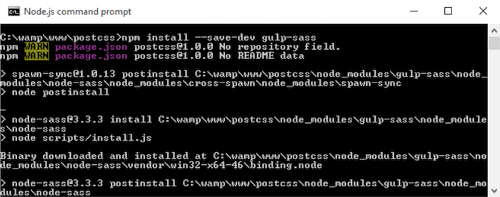

为了安全起见，我建议每次操作之后，清理或者保存 `dest` 文件夹:

第一步： 接下来，在 Sublime Text 中打开 `gulpfile.js` 的副本;我们需要进行大量的修改，将 `gulp-sass` 添加到文件中：

    var reporter = require('postcss-reporter');
    var sass = require('gulp-sass');

默认情况下，Sass 生成无压缩格式的代码; 另外，`task` 中 `{outputStyle: 'compressed'}` 又将自动压缩输出代码。这将产生冗余，移除文件头部:

    var cssnano = require('cssnano');

第二步：大约在第19行，也需要对 `cssnanoon` 引用进行移除:

    .pipe(postcss([ cssnano ]))

第三步：大约在第10行，将样式任务更为 `autoprefixer`,依赖项名称更改为 `lint-styles`:

    gulp.task('autoprefixer', ['lint-styles'], function() {
    return gulp.src('src/*.css')

之后移除如下两行代码:

    .pipe(sourcemaps.init())
    .pipe(sourcemaps.write('maps/'))

第四步：在重命名任务中，修改 `rename` 任务:

    gulp.task('rename', ['lint-styles'], function () {
      return gulp.src('dest/*.css')
        .pipe(rename('style.min.css'))
        .pipe(sourcemaps.init())
        .pipe(sourcemaps.write('maps/'))
        .pipe(gulp.dest("dest/"));
    });

第五步： 大约在第25行，我们需要添加 `lint-styles` 任务 —— 添加如下的代码块，可以检查风格的一致性:

    gulp.task("lint-styles", ['sass'], function() {
      return gulp.src("src/*.css")
        .pipe(postcss([ stylelint({
          "rules": {
            "color-no-invalid-hex": 2,
            "declaration-colon-space-before": [2, "never"],
            "indentation": [2, 2],
            "number-leading-zero": [2, "always"]
          }
        }),
        reporter({
          clearMessages: true,
        })
      ]))
    });

第六步：目前为止，差不多完成了。添加下面的任务，告诉 Gulp 如何对 Sass 文件进行编译:

    gulp.task('sass', function () {
        gulp.src('src/*.scss')
        .pipe(sass({outputStyle: 'compressed'}).on('error', 
        sass.logError))
        .pipe(gulp.dest('src/'));
    });

第七步：我们需要更多的更改。触发子任务的关键任务需要被更新，以反映我们对任务的更改:

    gulp.task('default', ['sass', 'lint-styles', 'autoprefixer', 'rename']);

第八步：最后的更改: 改变监视的对象设置，检查 Sass 文件而不是 CSS;在配置文件中作如下修改:

    var watcher = gulp.watch('src/*.scss', ['default']);

现在，我们已经建立了处理器，对Sass文件进行编译而不是CSS。可以编译任何Sass文件进行验证。如果一切都很顺利，我们的处理器将会产生有效的样式表以及自动附带源Source Map文件。下面，我们将会创建一个图片的悬停效果进行测试。

## 创建悬停效果示例

如果你之前读过我的书，你会发现我对花情有独钟，尤其是兰花。我的第一本书的封皮为蝴蝶，还是蝴蝶兰！下面我将使用一些兰花图片作为案例示范，就像后面显示的截图，我们希望得到顶部图片的运动效果。

> 如果你更加倾向于使用 Less，请跳到示例结尾使用LESS CSS书写的示例。

对于此演示，我们需要从本书附带的代码中对 `tutorial1A` 文件夹进行拷贝；在继续进行前请确保你已经完成此操作:

第一步：在 `tutorial1A` 的 `src` 文件夹中打开`style.css`文件;看看其中的内容。

第二步：在文件的顶部，有一些变量声明。定义了一些颜色样式，将`$fullsize`变量设置为了100%:

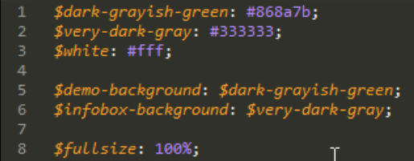

你会发现并不是所有的颜色均被赋予了值;在下面的章节中，原因将会变得愈加清晰。

第三步：随之是一个简单的混合宏，对像素进行`rem`的转换，使用`16px`作为`1rem`的基准:

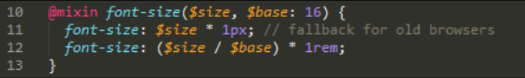

第四步：为了完成这个演示，我们需要进行字体下载。演示使用了Source Sans Pro字体，可以在 http://www.fontsquirrel.com/fonts/source-sans-pro 进行下载; 你需要在黑色的菜单栏中使用 **Generator** 选项产生一个可以在线使用的版本 (它将创建我们在演示中使用的CSS)。

第五步：现在，将 `tutorial1A` 文件夹中的 `style.scss` 进行拷贝并且存放在我们工程中的 `src` 文件夹中。

第六步：同时，也需要`img`文件夹以及`index.html`文件 —— 将它们复制到我们项目的根目录下。

第七步：打开一个 Node.js 命令提示符窗口，输入如下命令并按回车键:

    gulp

第八步：如果一切顺利，我们可以在工程的`dest`文件夹中看见编译好的 CSS 文件以及原文件 -  拷贝 `maps`文件夹以及`style.min.css` 至 `tutorial1A` 下的 `css` 文件夹中。

第九步：现在可以在浏览器中预览效果。如果一切顺利，我们应该可以在屏幕上看见两张兰花图片;将鼠标悬浮在其中任何一个之上，你会发现它飞向左边或者右边，以显示包含兰花信息的信息框:

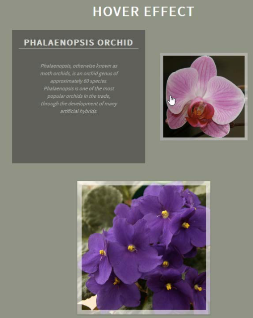

是不是十分有趣？这里使用`scale()`进行了一个简单的动画效果，在立即移动到它之后的`infobox`之前，将图片大小缩放为`0.5`(或者说是 `50%`)并移动到右侧。移除鼠标，产生相反的效果 —— 第二张图片采用了相同的原则 —— 但是方向相反; 演示中设置了`ltr`以及`rtl`两个类决定图片应该移动的方向。

### 使用 Less编辑CSS

本书附带的代码中同样有使用 LESS 预处理器生成等效代码。如果你倾向于使用LESS预处理器可以到 `Tutorial1B`文件夹中获取。当然需要使用 NodeJs进行 `gulp-less` 插件的安装，可以在 https://github.com/plus3network/gulp-less 进行获取(安装方式类似于其它插件的安装)。更新后的Gulp `task` 文件中同样包含了这个文件以及编译后的CSS代码。

## 过渡到PostCSS

目前为止，我们已经使用Sass创建了演示；当然，它不是很复杂，但是正如我经常所说的，我们得从某一点开始！

演示也可以说是一个完美的示例，因为我们可以介绍如何使用PostCSS替换我们在Sass中创建的变量以及混合宏 —— 为此，我们需要安装三个相关插件，`postcss-variables`,`postcss-mixins`以及`postcss-calc`。前两个应该说是不言自明的，第三个是我们所使用的字体混合宏所必需的。

闲谈到此为止，让我们开始改变代码；开始于添加变量的支持。

## 添加PostCSS变量支持

PostCSS插件之美在于大部分(不是所有的)可以使用相同的办法进行安装，包括PostCSS本身。我们可以使用Node.js包管理器处理这个过程。

现在开始于可以帮助我们处理变量支持的`postcss-css-variables`插件；插件的源代码可以在 https://github.com/MadLittleMods/postcss-css-variables 中进行查看。开始安装:

第一步：打开NodeJs命令终端，切换到我们项目的目录。

第二步：在提示符会话窗口中，输入以下命令，按`Enter`键:

    npm install --save-dev postcss-css-variables

第三步：如果一切顺利，会看到如下截图所示的安装结果提示:

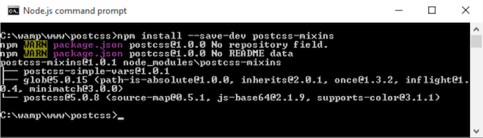

这里，Node也会在`package.json`文件中相应的添加插件条目。现在我们就可以很好地使用，切换到使用此插件来替换Sass的使用。如何做到这一点，作为下文将要讲述的内容。

## 更新悬停效果示例

如果我们第一次使用PostCSS，很自然，我们需要开始于一些简单的东西；同样的，在代码中引入变量以及混合宏是完美的开始。

接下来的练习中，我们准备创建一些变量，之后添加一个混合宏解决示例中的字体样式。现在让我们开始吧:

第一步：在工程的根目录中打开`gulpfile.js`的副本 —— 需要进行一些更改以便新插件的使用。

第二步：在`gulpfile.js`中，大约在第9行添加如下声明:

    var cssvariables = require('postcss-css-variables');

第三步：现在需要对gulp 的`task` 进行一些更改 —— 从最简单的开始，移除Sass的`var`引用，因为我们不再需要它:

    var sass = require('gulp-sass');

现在已经完成了对`post-css-variables`插件的引用，我们需要在任务中对其好好使用。如，在`autoprefixer`任务中做修改。对了，还需要删除不再使用的`lint-styles`任务:

    gulp.task('autoprefixer', function() {
      return gulp.src('src/*.css')
        .pipe(postcss([ autoprefixer, cssnano, 
          cssvariables(/* options */)]))
        .pipe(gulp.dest('dest/'));

第四步：注意我们还恢复了`cssnano`命令 —— 需要在变量声明中添加如下两行:

    var rename = require('gulp-rename');
    var cssnano = require('cssnano');

第五步：再深入一点，大约在第25行，更改高亮显示的代码，正如我们不在需要使用Sass编译代码;我们可以调整其中运行任务的顺序:

    gulp.task("lint-styles", ['autoprefixer'], function() {

第六步：下一步，可以移除Sass任务中所有的内容:

    gulp.task('sass', function () {
      gulp.src('src/*.scss')
        .pipe(sass({outputStyle: 'compressed'})
        .on('error', sass.logError))
        .pipe(gulp.dest('src/'));
    });

第七步：转向文件的最后，选择默认任务 —— 因为已经移除了Sass，我们不再需要对其进行调用。

    gulp.task('default', ['lint-styles', 'autoprefixer', 'rename']);

第八步：更改`gulp.watch`命令实现在`src`文件中寻找普通的CSS文件 —— 我们不再使用Sass，所以现在对 `scss` 格式文件的引用是无效的并且需要进行相应的更改:

    var watcher = gulp.watch('src/*.css', ['default']); watcher.on('change', function(event) {

如果一切顺利，现在我们就拥有一个可以用来编译代码的 `gulp task` 文件。继续进行，使用PostCSS对兰花示例进行转换。

第九步：保存一份本书附带的代码`Tutorial2`文件夹到本地，在`c:\wamp\www`目录下创建我们的项目，回到第一章节《PostCSS简介》。

第十步：打开 `Tutorial2` 文件夹下 `src` 文件夹下的 `style.css` 文件副本。在文件的顶部移除`1-14`行(变量以及混合宏)，现在文件开始对 `font-face` 声明。

第十一步：此处添加如下代码 —— 这些都是变量替换声明:

    :root {
      --dark-grayish-green: #868a7b;
      --very-dark-gray: #333333;
      --white: #fff;
    
      --fullsize: 100%;
    }

第十二步：更进一步,看`html,body{`声明，更改其作为声明 —— 这里注意`var`语句使用的语法；这不同于标准的Sass。我们将其改为了`post-css-variables`插件所支持的格式:

    html, body {
        width: var(--fullsize);
        padding: 0;
        margin: 0;
        height: var(--fullsize);
        min-width: var(--fullsize);
        max-width: var(--fullsize);
        overflow: hidden;
        background: var(--dark-grayish-green);
    }

第十三步：在样式表的顶部，我们添加了`fullsize`变量 —— 现在对其进行使用并相应地更新 `img` 规则:

    img {
        width: var(--fullsize);
        height: var(--fullsize);
    }

第十四步：最后需要对 `.info` 类进行修改 ——  更改`background`属性，如:

    /* ------ Hover Effect Styles ------ */
    .info {
        background: var(--very-dark-gray);
    }

现在，所有的代码更改都已经完成，保存文件。 一旦完成，打开 NodeJs 命令提示符，并切换到项目工作区。

第十五步：将文件存为`style.css`并保存到项目中的`src`文件中。

第十六步：切换到NodeJs命令提示符，输入如下命令，按`Enter`键:

    gulp

第十七步：将编译好的代码拷贝到`Tutorial2`中的`css`文件夹中。如果全部完成就可以在浏览器中预览效果，可以看到示例和第一次呈现的效果一样。

恍惚之间，已经完成了一些步骤!在本书所附带的代码中包含了先前以及现在的样式表: 均可以在`css | completed`文件夹中找到。你需要在`style.css`中对其进行重新命名以便可以正常工作。

如果你想不提交代码查看编译变量的效果，可以安装 https://madlittlemods.github.io/postcss-css-variables/playground/playground 所提供的插件。在编译产生代码之前，这是一个有助于你很好地习惯于`post-css-variables`插件的方式。

好吧，现在让我们回归正题。在实例中我们介绍了一些关键的概念，所以让我们花一些时间进行消化理解并讨论演示中我们所学到的知识。

### 进一步思考

在以上的篇幅中，我们创建了一个简单的示例，在几张兰花图片的基础上，以动画的形式展示了相应的信息框。我们所做的还没有很复杂或者说是很夸张，旨在说明使用此插件以及PostCSS的一些关键点:

虽然之前使用Sass对CSS代码进行预编译实现转换，我们也可以使用另外的预处理器，如LESS或者Stylus。关键是在任务运行的范围内尽可以多得工作，如Gulp，所以我们不需要再引入另外一种技术。

需要注意，虽然转换代码看起来十分直观，如`pre-processors`插件,并以不相同的方式进行编译，尽管Sass会进行编译。它直接从Sass到LESS进行转换，比一些简单的代码要难很多。

此示例中，理解工作原理的关键是遵循 W3C 中 CSS 自定义属性模块文档，你可以在 https://drafts.csswg.org/css-variables/ 进行获取。这里的的小诀窍是要理解CSS的特异性，或者说是元素的优先级；在这一方面，PostCSS并不简单地使用值进行变量的替换，但是基于CSS特异性进行代码编译。使用PostCSS，你会发现`:root`为元素被频繁的使用 —— 所以你需要熟悉它的工作原理！

> 关于CSS特异性工作原理的说明，你可以参考 http://vanseodesign.com/css/css-specificityinheritance-cascade/ 。如果需要我们可以考虑使用插件增加特异性 ——
在 https://github.com/MadLittleMods/postcss-increase-specificity 中检查PostCSS增加特异性的插件。

PostCSS模块化意味着我们可以选择使用的插件 —— 在本例中，我们使用了 `postcss-css-variables`插件，和`postcss-custom-properties`相比其更具有灵活性。为了提高可复用性，我们可能会考虑将变量分离为一个单独的文档，使用`postcss-constants`插件进行相关导入(可在 https://github.com/macropodhq/postcssconstants 进行查看).

如果我们使用 `postcss-css-variables` 插件，也可以在代码中存储值本身，或者放在gulp task 中；后者看起来如下所示:

    var postcss = require('postcss');
    var cssvariables = require('postcss-css-variables');
    
    postcss([
      cssvariables({
        variables: {
          '—foo-var': { '100px', isImportant: true },
          '--other-var': { value: '#00CC00' },
          '--important-var': { value: '#ffCC00' }
        }
      })
    ])
    .process(css, opts);

总之，我们在CSS变量的配置对象中对每一个变量创建引用，如`postcss-css-variables` 插件的别名。

使用这种方法创建`map`对象会有不同的好处。如，降低了问题的关注点，我们可以在`task`文件中更多的关注PostCSS代码，减少对样式表本身的关注。这可能会使得`task`文件变得很难理解；如果你要定义大量的变量，这不是一个很好的选择路线。在这种情况下，我们会转向文件的导入和在编译中引用它们。

如果在这一点有一个重要的信息，它可以变得更具有灵活性 —— PostCSS模块化性质意味着我们可以自由的选择并如何进行使用；这真的是权衡使用插件利弊的重要一点，并决定是不是最适合我们的需求，或者我们需要寻求一个更加合适的解决方案。

## 设置插件顺序

关于PostCSS需要考虑这样一个关键点: 任务运行中，调用插件的顺序。这可能听起来有点奇怪，但是当使用PostCSS时，有两个很好的理由值得你去思考这个问题:

- 第一个理由很简单 —— 编译完成后，它可以很好地帮助我们保持逻辑顺序。
- 第二个有点难于理解，与经验有关 —— 在`task`文件中按照一定的顺序定义插件，将保证它们可以正常工作。

接下来让我们探索这究竟是什么意思:

看一下文件中已经建立的gulp task ，在13-19行你会发现一个关键的不同点。在你询问之前，我告诉你不是任务的名称！不同之处是 `['lint-styles']`限制 —— 这将导致Gulp不可以运行此任务直到前一个任务完成。

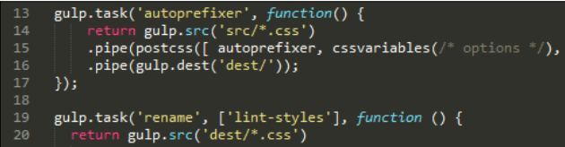

我知道这听起来像是一个常识，并且你也可能已经知道，但是在PostCSS中按照一定的顺序设置插件，将关系你文件是否可以编译成功。

简单说一个例子，当我研究这本书的时候，我经常发现要么我的原文件仅仅被产生一个未压缩的样式表，要么被压缩的样式表没有被正确的创建。这都是一些很简单的问题，但是调整顺序可以在什么时候发生以及发生什么产生很大的影响。

继续以上话题，你可能在浏览一些源站点所使用的PostCSS插件的时候也注意到类似于此的问题:

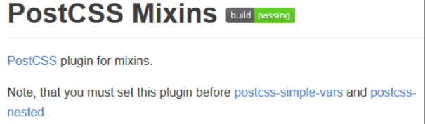

这突出说明为什么按照一定的顺序设置插件是产生有效结果的关键: 不仅仅在于任务可以以正确的方式完成，产生预期的结果，甚者说，一些插件根本就不会工作。这不应该被视为一个过失。总会有合理的理由来说明插件`X`必须放在插件`Y`之前。这里的关键是我们考虑一切的可能。它是值得去思考的，正如一些人会添加一次修补程序以移除约束条件，或者通过分叉他们自己版本的插件来进行修正。

好了，是时候切换焦点了。让我们来看一些其他的功能: 混合宏。对于新手来说，这是一个使用预处理器，如Sass，常用关键函数。使用它我们可以组合代码块。

这里是说我们可以创建任何东西，从简单的几行到复杂的、动态的代码。PostCSS会对其进行编译为可用的CSS。让我们更进一步的进行研究。

## 使用PostCSS创建混合宏

目前为止，我们的兰花示例在代码中使用了大量的变量。虽然也可以正常运行，但是某种程度上来说具有一定的局限性。毕竟，创建大量的变量处理不同的值是一笔很大的开销！

一个更为聪明的方法是使用混合宏；它可以将一些声明放在一起作为一个单一的定义，之后在多个规则集中进行克隆。预处理器使用者当然已经了解到了它的功能。PostCSS团队也创建了一个具有类似功能的插件。

在 https://github.com/postcss/postcssmixins 中可以查看插件源代码，并且可以使用本章中所讲述的方法，使用Node进行安装。我们也会结合使用`postcss-calc`插件(https://github.com/postcss/postcss-calc 进行获取)创建一个简单的混合宏，以解决我们代码中出现的像素到`rem`单位的转换。让我们在实践中感知其工作原理吧: 

第一步：一如既往，我们开始于`postcss-mixins`插件的安装；打开NodeJs命令提示符窗口，将文件夹切换到我们的项目下。

第二步：在提示符下，分别输入以下命令，并且相应的按`Enter`键:

    npm install --save-dev postcss-mixins
    npm install --save-dev postcss-calc

第三步：如果一切进行顺利，我们会在屏幕中看到类似于如下截图的输出:

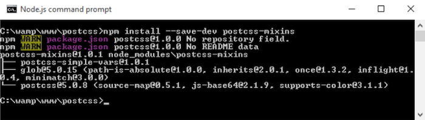

## 更新我们的悬浮效果示例

对安装的PostCSS实现混合宏支持。让我们更新文件中gulp task以及样式表对其实现使用。首先更改文件中gulp task:

第一步：打开`gulpfile.js`文件的副本，之后添加如下的`var`声明代码块(大约在第10行):

    var cssmixins = require('postcss-mixins');
    var calc = require('postcss-calc');

第二步：接下来，选择包含`autoprefixer`任务的一行:

    .pipe(postcss([ autoprefixer, cssvariables(/* options */), cssmixins(/* options */), calc(/*options*/)]))

第三步：保存文件。现在需要对本书附带的代码中例文件进行拷贝 —— 将`Tutorial3` 保存到我们的项目中。

第四步：在`src`文件夹中打开`style.css`，之后在`--root`规则声明的变量声明代码之后添加如下的代码块:

    @define-mixin fontstyle $size, $color {
      font-size: $(size)px;
      font-size: calc($size/16)rem;
      color: $color;
    }

第五步： 定义了混合宏之后，需要对代码进行调整以使用混合宏；这需要一些改变，首先需要在 `h3` 规则中声明:

    h3 {
      @mixin fontstyle 32, #fff;
      text-transform: uppercase;

第六步：之后在 `.info h3` 规则中修改前两行，如:

    .info h3 {
    @mixin fontstyle 20, #fff;

第七步：第三个也是最后一个需要修改的是`.info p`规则。如下所示:

    .info p {
      @mixin fontstyle 12, #bbb;
      padding: 50px 5px;

第八步：保存文件，之后保存到项目的`src`文件夹中。

第九步：打开一个NodeJs命令提示符窗口，切换到项目止录下，输入如下命令，按`Enter`键:

    gulp

> 你可能会在·stylelint·中看到一些选项消息: 现在你完全可以忽略，本书之后的章节将会探讨如何进行优化。

第十步：将编译后的代码拷贝到 `Tutorial3` 中的 `src` 文件夹中。一切均已完成的时候，可以在浏览器中预览效果，会看到示例的效果和第一次演示的一样。

虽然我们的示例没有出现什么不同，但在代码中会有一个明显的不同 —— 使用一个DOM监听，如Firebug进行快速浏览:

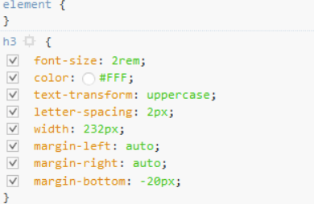

混合宏的使用产生了一些重要点。事实上，一些人可能会误认为它们只是执行了Sass简单的复制功能。我们所使用的插件并没有遵循相同的格式，尽管原则具有一致性。让我们停下来思考一下，看看如何和标准处理器进行比较。

### PostCSS与标准处理器的比较

在编译阶段。不管以静态还是动态的方式自动的插入预定义代码块到我们的样式表中。混合宏的使用都是一个伟大的方式。

需要注意的一点是，尽管最后的结果看起来相似，但是也仅仅只是在名称上具有相似性；我们所使用的混合宏插件不是复制类似于Sass中存在的可用功能。相反的，这个插件展示了PostCSS下，JavaScript强大的功能，并且应该被应用于混合宏函数的定义，作为`if`或者`while`声明的替换在PostCSS中是不可取的。

如果我们想要更改混合宏中任何一个属性名称，也是如此。一个例子，当我们需要引用多个图片，每一个都具有类似的样式类，可以应用:

    require('postcss-mixins')({
      mixins: {
        icons: function (mixin, dir) {
          fs.readdirSync('/images/' + dir).forEach(function (file) {
            var icon = file.replace(/\.svg$/, '');
            var rule = postcss.rule('.icon.icon-' + icon);
            rule.append({
              prop: 'background',
              value: 'url(' + dir + '/' + file + ')'
            });
            mixin.replaceWith(rule);
          });
        }
      }
    });

如果我们使用`@mixin icons signin`对混合宏进行调用；从我们的代码中，可以看到如下结果:

    .icon.icon-back { background: url(signin/back.svg) }
    .icon.icon-secret { background: url(signin/secret.svg) }

这是否构成了一个有趣的问题:相比CSS，使用JavaScript，我们应该在`task`文件何处设置截止点？采取这种做法虽然我们得益于标准的JavaScript，但是以简单性作为了牺牲品！

作为一名开发者，这是你需要做出的决定之一。PostCSS的灵活性在于我们不仅需要选择正确的插件，并且其顺序性也会影响我们代码的输出。在这种情况下，有一个可选的插件 —— `plugin—postcss-simple-vars—shares` ，其语法和`postcss-mixins`相同，但是不支持对属性名称的更改。

> 如果我们的混合宏使用的嵌套声明，也可以考虑使用`postcss-nested`插件；在下一个章节中我们将会进行相应讲解。

但是，回归到我们的示例中: 我们需要经典的混合宏为使用IE老版本的用户提供像素的回退。

这里我们可以使用一个可替代插件 —— `postcss-simple-mixins`(可以在 https://www.npmjs.com/package/postcss-simplemixin 获取源代码)。其设计旨在为混合宏提供一些简单的支持，但是和`postcss-mixins`没有任何关联。

> 需要注意：尽管`postcss-simple-mixins`插件现在仍可用，但是已经被弃用。它不支持嵌套或者变量的使用。

不过，决定关键在于你想要通过代码实现什么；选择正确的插件将减少冗余功能的列入，并且可以使我们的自定义处理器变得更为精简。

关于为什么选取插件很重要,这里还有另外一个原因: 而不是使用混合宏实现对IE老版本的支持，我们可以使用`postcss-pxtorem`插件在编译过程过生成`rem`值。毕竟，虽然有时大部分的浏览器对`rem`单位都支持，但是仍然有一些姗姗来迟的浏览器:

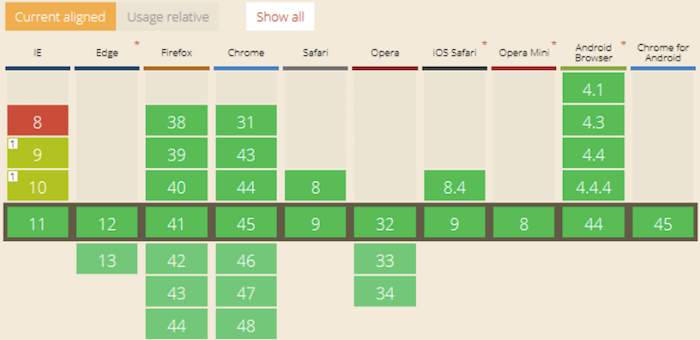

CanIUse网站(http://www.caniuse.com)获取的相关截图。

使用这个插件额外的好处就是简化了我们的代码，服务器可以解决像素到`rem`单位的等价替换的繁重工作。繁重的工作可以被转移到一个中心位置，以便使用它的任何人都可以得到一致的结果。

> 有一点需要特别注意，PostCSS也存在混合宏和函数之间的跨越。我们将在第五章函数讲解中进行更说细的介绍，管理颜色，图片以及字体。当使用颜色和媒体时，使用PostCSS使一切变得更简单。

好了，我们又该继续前进了。切换主题，看一看PostCSS另一个重要的核心部分: 创建循环。熟悉Sass或者LESS的人会感觉将相似的样式应用到相同的对象上是一件十分单调的事情；一个很好的例子，经典的社交媒体图标会频繁被应用到页面上。PostCSS有一个插件可以模仿这一功能，因此让我们开启探索之旅吧！

## 使用PostCSS循环内容

提一个问题: 你是不是会经常遇到这样的情况，许多相似的图片共享样式，但是又各自有自己独特的样式？是不是听起来很熟悉？

当然实例更具有说服力，如我们经常在互联网上看到的列表项，网格布局以及经典的社交媒体图标。我们可以选择为每一个图片应用样式，但是我也相信你一定不认为这是一个十分明智的方式！取而代之，我们可以利用`@each`声明语句访问每一项，使用字符串插值应用样式。

Alexander Madyankin的 `@each` 插件是循环遍历内容的两种方式之一；在 https://github.com/outpunk/postcss-each 可以产看源代码。另一个插件`postcss-for`(在 https://github.com/antyakushev/postcss-for 可获取)，采取了另外一种不同的方式 —— 两者的不同之处在于前者作用于对象，后者必须需要一定的数字范围应用样式。

如果采用第二个插件，我们必须在一定的数字范围之内连续的循环易产生我们需要的结果，看起来如下所示:

    @for $x from 1 to 3 {
      .grid-$x { width: $(x)px; }
    }

编译出来的CSS：

    .grid-1 {
      width: 1px
    }
    .grid-2 {
      width: 2px
    }
    .grid-3 {
      width: 3px
    }

看起来很简单是不是？但是也存在不足之处:不像Sass，默认情况下，我们不能使用变量定义范围；这个插件的使用必须在`postcss-nested`和`postcss-simple-vars`插件之前。在PostCSS中，我们将遍历所有的值(如示例中的1-3)，这一点与Sass不同。

当遇到这种情况，我们就需要对其作出判断，使用此插件还是 `postcss-custom-properties` 或者 `postcss-for-variables` 。这时就需要你充分的明白你想要实现什么以及了解各插件的功能，以便我们可以选择最有效的组合去实现。PostCSS最大的优点是其灵活性，速度以及模块化设计；但是模块化和灵活性也是致命的弱点，因为插件的选取以及使用顺序会对我们的代码产生重大的影响。

> 当然我们也可以使用另外一个插件`postcss-for`，可以在 https://github.com/xori/postcss-for 进行获取。这是对`$`变量的特殊照顾。

接下来就可以把这一切付诸实施了。为了防止大家和下一章节要讲解的嵌套相混淆，这里我们使用一组社交媒体图标，PostCSS会自动完成对其样式的设置。

### 使用 @each语句进行遍历

关于循环，如果目标为页面上的元素，我们可以选择使用`@each`语句实现`for`语句类似的效果。

这里的元素，指的是按钮或者菜单项；这些元素共享着相同的样式，但是需要单一的ID允许我们与之进行交互。不用说我们可以简单地创建一个基础类,对于每一个元素添加多个类...

但是我们也可以做的更好: 大多数的预处理器都具有内置功能，允许我们可以遍历元素并为每一个元素应用CSS样式。幸运的是，PostCSS在这一点并没有什么不同之处；我们可以
使用`postcss-each`插件实现，可以在 https://github.com/outpunk/postcss-each 进行获取。当然这也需要进行安装，我们可以使用它添加元素，如在页面的底部添加社交媒体图标并进行样式修饰。我感觉这里又要上演一个新的示例，让我们继续向下:

第一步：首先进行安装，打开NodeJs命令提示符窗口，切换到我们项目目录下。

第二步：输入以下命令进行`postcss-each`插件的安装，按`Enter`键:

    npm install --save-dev postcss-each

第三步：如果一切顺利，我们应该会看到插件安装成功的确认画面:

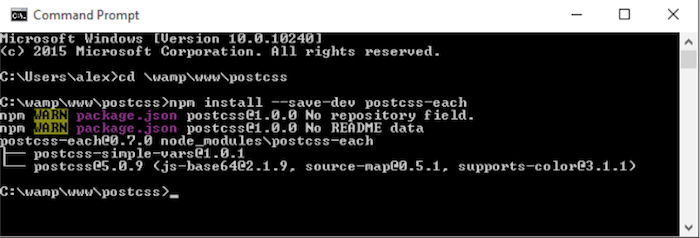

插件已经安装成功，下面就要更改我们的gulp文件:

第一步：需要在gulp文件中修改三个地方，在文本编译器中打开文件副本。

第二步：首先，移除9-11行；它们包含了`postcss-css-variables`以及`postcss-mixins`插件的变量声明。

第三步： 大约在第8行，我们应该可以看到`postcss-calc`插件的声明。紧邻这一行，添加如下一行:

    var eachloop = require('postcss-each');

第四步：在`autoprefixer`主要任务中，我们需要改变`postcss`的调用，在13行进行删除:

    cssvariables(/* options */), cssmixins(/* options */), calc(/*options*/),

现在剩下的应该如下所示(更改已经高亮显示):

    .pipe(postcss([ autoprefixer, cssnano(), foreach(/*options*/) ]))

现在，保存文件。我们已经完成了要进行示例展示所需的CSS准备工作。接下来我们需要利用一些合适的社交媒体图标。我曾经使用过 Nathan Brown设计的，可以在 http://wegraphics.net/downloads/free-stained-and-faded-social-mediaicons/ 进行获取。这里我们使用 Twitter，LinkedIn以及YouTube图片。

让我们开始吧:

第一步：首先看一下这个示例的Sass版本。这是一个简单地例子，但是正好可以说明我们如何使用`@each`函数遍历每一张图片并对其应用合适的样式:

    $social: twitter, linkedin, youtube;
    
    .social-icon {
    // shared information here
      background: 50% no-repeat;
      background-size: 100%;
      float: left;
      height: 50px;
      width: 50px;
    // unique information loops here
      @each $network in $social {
        &.#{$network} {
          background-image: url("../img/#{$network}.png");
        }
      }
    }

第二步：编译代码，到`Tutorial4`文件夹拷贝至我们的项目中。

第三步：使用`Tutorial1A`文件夹中的`gulpfile.js`进行现有文件的替换 —— 其包含了合适的命令对代码进行编译 —— 我们需要使用原始版本进行Sass代码的编译，而不是PostCSS，所以会产生此变化。

第四步：从`Tutorial4`文件夹下的`src`文件夹下进行`style.scss`文件的拷贝，之后放置我们项目中的`src`文件夹下。

第五步：之后，打开一个NodeJs命令提示符会话窗口，更改我们项目的工作文件。

第六步：在命令符中输入以下命令，按`Enetr`键:

    gulp

保持命令提示符会话窗口处于开启状态，不久我们将会再次使用。

第七步：一旦代码编译完成，将`dest`文件夹下的内容拷贝至`Tutorial4`文件夹下的`css`文件夹中。

当一切均已完成，我们就可以在浏览器中看到三个图标。这里没有太夸张: 我们在所有的图标中应用了基本的规则，之后添加单独的类对本身进行处理:

    .social-icon {
      background: 50% no-repeat;
      background-size: 100%;
      float: left;
      height: 50px;
      width: 50px;
    }
    .social-icon.twitter {
      background-image: url("../img/twitter.png");
    }
    .social-icon.linkedin {
      background-image: url("../img/linkedin.png");
    }
    .social-icon.youtube {
      background-image: url("../img/youtube.png");
    }

那么在PostCSS中得到的效果也是如此吗？结果很令人惊奇，并不需要太多的改变。

### 切换到PostCSS的使用

在我们的CSS文件中，只需要更改两处。为了更加直观的观察，我把嵌套的地方进行了拆分:

    .social-icon {
    // shared information here
      background: 50% no-repeat;
      background-size: 100%;
      float: left;
      height: 50px;
      width: 50px;
    }

需要对代码块高亮显示的部分进行修改:

    @each $media in twitter, linkedin, youtube {
    . $(img) {
        background: url('../img/$(media).png');
      }
    }

我们的gulp文件也需要相应的修改。让我们一步一步的转向PostCSS的使用:

第一步：首先需要替换gulp文件 —— 删除项目根目录下的文件，使用下载代码中`tutorial4`文件夹内容进行替换。

第二步：使用本书附带的的代码，对`compile.css`样式进行提取并将其命名为`style.css`。将其放置在项目工程中的`src`文件夹下。

第三步：回到命令提示符会话窗口，输入`gulp`并按`Enter`键。

第四步：如果一切顺利，我们可以在`dest`文件夹中看到编译好的样式表以及相应的源代码。

第五步：拷贝项目中`dest`文件夹下的内容至本地`Tutorial4`文件夹中的`css`文件夹中。

第六步：在浏览器中预览效果；如果一切顺利，我们会看到这些图标的出现:

当然，这只是一个简单的练习，但是我一直喜欢简单的事物！任何人都可以书写CSS样式，但是对于我来说，“更近一步”意味着总会可以有所改变，使其变得更好，这也就是所说的`KISS`原则，使其变得更简洁...是的，你已经获取了真谛！但是为了展示这个插件的灵活性，请尝试进行下面的练习:

- 浏览器切换至 http://dataurl.net/ ，一次下载每一个图标，并且使用该站点为每一个图片生成等效的`data-URI`代码。
- 在CSS中移除已存在的背景图片的链接，使用`dataurl.net`站点生成代码进行替换。
- 使用此章节的相同原则对代码进行编译，效果看起来一样，不是吗？我们进行了相关移除，采用了单独资源，正如我们采取了纯CSS方案...

但是，这里还存在一个问题: 当文件被编译的时候，改变了文件的大小。应该可以很明显的告知这比不包含`data-URI`的文件要大很多。这是可以预料到的结果: 我们需要在调用的资源数量与大小之间进行权衡。它仅仅告诉我们按照一定的顺序使用PostCSS插件对于结果的产生有多么的重要！

## 小结

对于使用过预处理器的人，如Sass，都会十分熟悉变量以及混合宏；这也是PostCSS的有机组成部分。这一章节中，我们对两者进行了很多的讲述，现在让我们放松一下，回顾一下我们所学的知识。

一个关于Sass中变量以及混合宏的简短介绍，为建立Sass基本示例向PostCSS的转换拉开了序幕。

接下来就开启了向PostCSS的过渡之旅。首先，在使用新插件更新悬浮示例、移除Sass依赖之前，添加了PostCSS变量支持。之后普及了PostCSS的一些优点以及对使用PostCSS的思考。接下来讲述了按照一定顺序使用PostCSS插件对代码最终产物产生的影响。

后来我们转向了混合宏的学习。更新示例之前，安装了`postcss-mixins`插件。同时，思考了标准预处理器与PostCSS的区别，并牢记PostCSS的灵活性及其强大的能力。

再者，我们又学习了循环。在使用简易的`@each`函数之前，首先探索了一下`for`语句的使用。之后用其书写了一个简单地社交媒体图标的示例。示例始于Sass，但是终止于PostCSS。

好了，又要继续前进了！在为此次旅途画上完美句号之后，我们将要开启PostCSS嵌套之旅，如何精简代码书写，或者说如何使其更便于阅读！