# 第3章：嵌套规则

如果你已经使用过预处理器，那么可能已经了解一些嵌套属性 —— 对一些相同的元素不是书写多个样式规则进行反复引用，而是可以利用嵌套创建简洁的样式规则从而编译成更为有效的CSS。

这一章节中，我们将深入领略使用嵌套的魅力，展示如何使用预处理器，如Sass 或者 LESS，进行相应的过渡，并且探索一些在预处理器，如Sass中无法使用的一些小技巧:

- 探索BEM(Block, Element,Modifier)命名规范或者标准嵌套
- 使用已有预处理器创建嵌套规则以及BEM等价物
- PostCSS插件使用的过渡
- 理解嵌套缺陷以及如何提升代码

现在，让我们开始吧！

## 嵌套简介

如果使用过预处理器，如LESS CSS或者Sass，那么嵌套就不再是新鲜概念；它是一个很有用的技术可以帮助我们减少代码书写量，并且以更可读的方式管理代码。

任何事物都有两面性，它的缺点在于经常被滥用 —— 第一次使用处理器，许多开发人员都会落入思维陷阱，认为一切都应该进行嵌套。当代码本身就很简单的时候，应该避免使用。这反而会增加本身脆弱的代码的可读性，并且在代码中进行一些样式修改的时候容易破碎。

如果嵌套使用的恰为得体，它可以变得十分有效；有助于避免父选择器的重复使用，并且可以将规则组合在一起应用于相同的选择器。如何理解这句话，我们可以看如下简单的Sass示例:

    #main p {
        color: #00ff00;
        width: 97%;
        .redbox {
            background-color: #ff0000;
            color: #000000;
        }
    }

使用GUI应用程序或者命令行编译后的结果为:

    #main p { 
        color: #00ff00; 
        width: 97%;
    }
    #main p .redbox { 
        background-color: #ff0000; 
        color: #000000; 
    }

这段代码的优越性在于我们没有尝试对相同父选择器或者后代进行单一样式的填充，这就是使用嵌套需要考虑的事情。

> 注意，Sass示例中嵌套是不是出现在代码的最后？在括号闭合前使用嵌套语句一直被认为是很好的实践。

一些开发人员禁止使用嵌套，它会导致在特定上下文进行样式定义的元素出现问题；当需要更改样式的时候，变得难于更改。在下面的章节中，我们将更多的探讨嵌套充满的风险。

暂时先撇开嵌套存在的风险，使用PostCSS的时候，我们可以采取相同的原则，这里需要使用Jonathan Neal的`postcss-nesting`插件，可以在 https://github.com/jonathantneal/postcss-nesting 进行获取。在下面的屏幕截图中，你可以看到PostCSS嵌套的样式 —— 这是作者提供的一个嵌套语句测试的在线平台，我们可以在右侧看到相应的结果:

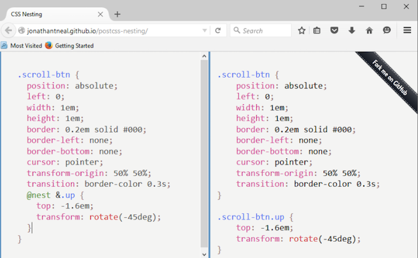

核心代码位于左侧，第五行至最后: `postcss-nesting`插件使用了 `@nest &` 作为嵌套代码中的占位符。

为了更好的说明`postcss-nesting`插件的工作原理，我们将创建一个独特的导航系统进行解释说明。导航会混合使用jQuery和CSS进行样式设置，以及使用CSS3创建的一些翻转动画效果页面。感兴趣吗？让我们现在开始吧。

## 页面导航

我一直希望可以做一些与众不同的事情；几乎类似会变得枯燥无味！带着这种思想，研究这本书的时候，我发现了Nikolay Talanov所创建的一个有趣案例，页面由一页翻转到另一页，如果浏览器支持CSS3将使用CSS3动画进行创建，不然回落至标准的jQuery翻页。

> 你可以在 http://codepen.io/suez/pen/LCHlA 看到案例效果。

为这一章的进行提供了一个完美的基础。为了演示，我没有书写相应的供应商前缀(这个工作交给Autoprefixer)，调整首页的设计，并且只使用嵌套语法。因为大多数的浏览器已经支持小难度的CSS3动画效果，所以我们已经将jQuery回退的代码移除。

### 示例的准备

我们的案例有四个页面 —— 导航将在各个页面之间，伴随着CSS3动画效果进行翻转。

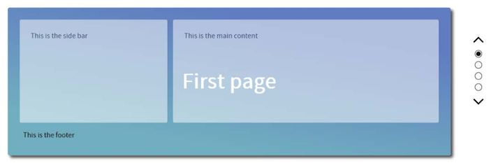

这个设计可能有些独特，但是为了更好的进行使用说明，我在首页添加了一个简单的线条说明，方便扩展到其余页以及更好的进行扩展。

如果想要亲自实践，可以在本书随带的代码`Tutorial5`文件夹下进行拷贝，在浏览器中运行 `index.html`，点击右侧的圆点或者是箭头 —— 会看到页面向上或向下翻转，这取决于你点击的方向。

### 从现有处理器进行转换

现在，我们的示例使用纯CSS书写，没有出现任何差错，但是你可能希望使用处理器，如Sass或者说LESS CSS。使用PostCSS的好处就是不使用任何依赖项就可以模仿现有CSS预处理器。

本书随带的代码中有使用Sass或者Less CSS写的本案例，Sass位于`Tutorial6A`文件夹，LESS CSS位于`Tutorial6B`文件夹，你可以进行相关参考。可以使用第二章节:创建变量以及混合宏(使用Sass)中的`Tutorial1A`，或者`Tutorial 1B`(使用LESS CSS)中的`gulpfile.js`进行代码编译。

> 你需要安装所列出的插件 —— 之前的案例已经安装了大部分的插件，但是还需要使用NPM安装`gulp-sass` 以及 `gulp-less`，安装方式和之前一样。

一旦编译，两者都会产生相同的CSS，并且教程文件夹中的`dest`文件夹的内容已经被复制到`css sub-folder`中。现在我们准备使用PostCSS进行转换 —— 首先进行`postcss-nesting`插件的安装。

## 使用PostCSS插件进行过渡

我们已经了解到使用嵌套的原则十分简单，但是真正的艺术核心在于如何恰当的进行使用。第一次使用这种技术的时候，许多开发人员陷入了嵌套的陷阱，他们会在任何代码中都进行嵌套引用。

现在，我们看看如何使用PostCSS对我们的代码进行改造。首先需要安装起重要作用的`postcss-nesting`插件:

第一步：打开Node.js命令提示符窗口，切换到项目工作区。

第二步：在窗口中输入以下命令，按`Enter`键:

    npm install --save-dev postcss-nesting

第三步：Node.js会进行插件的安装 —— 当出现如下所示的屏幕截图表示安装成功:

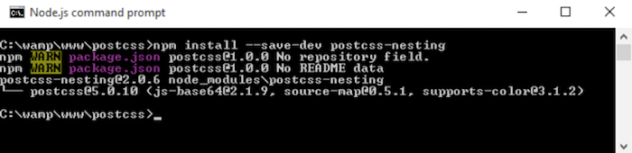

第四步：插件安装完，需要对PostCSS进行配置 —— 在项目中打开 `gulpfile.js` 的副本，准备进行编辑:

第五步：我们需要进行一些更改 —— 首先定义一个变量表示插件引用。在变量声明的最后添加高亮的代码行:

    var cssnano = require('cssnano');
    var nesting = require('postcss-nesting');

第六步：`autoprefixer`任务需要改变 —— 这次我们将对嵌套代码进行编译，并且需要添加适当的供应商前缀。选择任务的第一行代码，如下:

    gulp.task('autoprefixer', function() {
        return gulp.src('src/*.css')

第七步：之后添加嵌套的配置项目:

    .pipe(postcss([ autoprefixer, 
        nesting({ /* options */ }) ]))

第八步：默认情况下，Sass会对编译后的代码进行压缩处理 ——  但是，现在我们已经不再使用它，所以需要提供一种替代品。这里，我们重新对第二章节: 创建变量和混合宏中的`cssnano`插件进行引用。在代码的20行进行添加:

    .pipe(postcss([ cssnano() ]))

第九步：一旦供应商前缀添加完成，就需要`lint-styles`任务执行；如何做到这一点？添加如下配置参数:

    gulp.task("lint-styles", ['autoprefixer'], function() {

第十步：我们不再需要`sass`任务，对其进行整体移除 —— 并且默认的任务条目应该如下所示:

    gulp.task('default', ['lint-styles', 'autoprefixer',
    'rename']);

第十一步：最后，也很重要的是，对`rename`任务的顺序进行调整。不是在`autoprefixer`任务完成后执行，而是在`lint-styles`任务完成后执行:

    gulp.task('rename', ['lint-styles'], function () {

现在我们的`gulp`任务可以正常使用 —— 由PostCSS嵌套更换Sass,进行样式表的转换。相关的转换将作为下一个练习的一部分。

> 现在的你如果有些凌乱，可以在本书随带的代码中寻找已完成版本的`gulpfile.js` ——  仅仅需要进行拷贝，然后放置在项目的根目录中就可以进行引用。

### 将示例转换成PostCSS生产模式

使用PostCSS进行代码转换十分简单。尽管需要一些更改，相较于处理器，如Sass，其格式并没有明显的改变。下面就让我们看一看所涉及的内容:

第一步：在本书随带代码的`Tutorial6A`文件夹下打开`style.scss`的副本 —— 将其保存至我们项目的`src`文件夹下，重命名为`style.css`。

第二步：代码第19行，在`&:`前添加`@nest`，如下所示 —— 这是使用`postcss-nesting`插件进行代码嵌套正确编译所必需的:

    @nest &:before, &:after {

第三步：代码第53行，在`h2`前添加` @nest &`,如下所示:

    @nest & h2 {

第四步：代码第61行，在`&.`前添加`@nest`，如下所示:

    @nest &.page1 {

在第65行，第69行以及第73行，重复第四步。

第五步：代码第119行，在`&.`前添加`@nest`,如下所示:

    @nest &.invisible {

第六步：代码第123行，在`ul`前添加`@nest`，如下所示:

    @nest & ul {

第七步：代码第125行，在`& li`前添加`@nest`,如下所示:

    @nest & li {

第八步：代码第136行，在`&.`前添加`@nest`，所下所示:

    @nest &:after {

在代码第150行和第155行进行重复操作。

第九步：代码第179行，在`&.`前添加`@nest`，如下所示:

    @nest &.up {

在代码第183行和第187行重复此操作，最后保存文件。

现在，样式表已经转换完成。证明其可以正常工作，我们需要使用PostCSS运行，这一部分将在下一个练习中讲述。

### 代码编译

代码更改已经完成，接下来需要进行编译 —— 这里的步骤和第二章节:创建变量和混合宏 一样:

第一步：打开Node.js命令提示符窗口，或者使用之前已经打开的窗口，切换至项目。

第二步：在窗口中输入以下命令，按`Enter`键:

    gulp

第三步：完成后，我们应该看到类似于下的截图︰

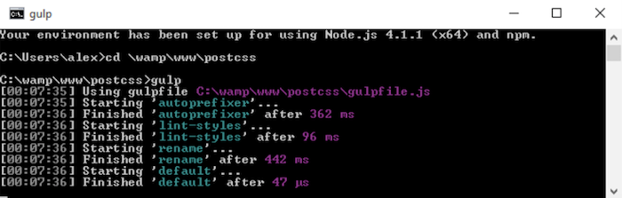

第四步：在项目的工作区，快速浏览一下`dest`文件夹，其应该包括PostCSS已经编译好的CSS以及原文件。

第五步：现在，需要从本书随带的代码中额外拷贝`Tutorial7`文件夹 —— 作为我们的项目工作区。

第六步：复制 `Tutorial7` 文件夹下的`css`文件夹下内容到我们项目中的`css`目录下 ——  完成后，我们的演示应该在没有Sass的依赖下可以正常工作。

> 注意,请确保你已经将演示扩展至屏幕的整个宽度，以便查看是否可正常工作！

尝试在浏览器中预览效果 —— 如果一切正常，我们就可以看到相同的结果，但是这次使用的是PostCSS，而不是Sass依赖。我们可以在任何项目上应用此技巧，使用`postcss-nesting`插件可以使我们编译出有效的CSS代码，不是吗？

## 探索嵌套陷阱

我们已经说过，尽管嵌套是一种很好理解的技术，但是很难被正确的使用，如下所示的Sass版本的演示:

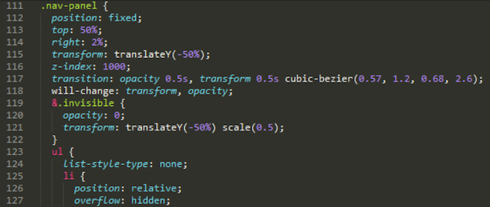

问题主要分为两个方面 —— 多层嵌套会导致特殊的多层级的代码；如果我们想要更改`.nav-panel ul li`(编译版本的25行代码)，它可能会打破我们之前的代码风格。为了更好的理解我所表达的内容，请看下面的一个示例 —— 任何开发人员都有可能创建的一个页面:

    <body>
        

            

                

                    

                        

                            <h1><a href="#">Hello World</a></h1>
                        

                        

                            

                            <ul>
                                <li>...</li>
                            </ul>
                        

                        

                            
                            <h4><a href="#">...</a></h4>
                            

                                <a href="#">...</a>
                                <ul>
                                    <li>...</li>
                                </ul>
                            

                        

                    

                

            

        

    </body>

是不是感觉不可接受，我是不会这样子做的！我建议大家应该使用语义化元素，如`<header>`, `<section>`, `<article>`, 以及 `/` 或者 `<footer>`，提供上下文和含义，而不是全部使用`
`声明！这是不好的代码的一个很好的示例。让我解释一下:

我们所看到的示例HTML结构，很可能导至这样的CSS嵌套:

    body {
        div.container {
            div.content {
                div.articles {
                    & > div.post {
                        div.title {
                            h1 {
                                a {
                                }
                            }
                        }
                        div.content {
                            p { ... }
                                ul {
                                    li { ... }
                                }
                        }
                        div.author {
                            a.display {
                                img { ... }
                            }
                             h4 {
                                a { ... }
                            }
                            p {
                                a { ... }
                            }
                            ul {
                                li { ... }
                            }
                        }
                    }
                }
            }
        }
    }

一些开发人员可能会认为这是完全可以接受的 —— 毕竟，他们看不出什么不同，又怎么知道问题的所在呢？是不是？错！这段代码在技术上可能适合我们的HTML文档的样式，但是存有以下几个问题:

- **难于阅读**：试图破解阅读是一件十分头痛的事情。
- **编译**：会产生大量重复的父选择器，代码多会延伸出大约20行。
- **渲染性能差**：举个例子，如果安装了谷歌的一个页面速度测试工具，那么很有可能触发优先显示可视内容(Prioritize Visible Content)规则，就需要额外的渲染展示屏幕上方的内容。
- **大小问题**：即使现在我们处于一个宽带连接的时代，但对内容采取傲慢的态度是一种很不礼貌的做法，我们应该尽量避免创建不应该的内容，使文件越小越好。
- **可维护性**：我们的演示代码对样式已经紧紧的绑定，这违背了创建样式表的初衷，应该在父选择器放置一些常规样式，允许样式继承到子元素，或者根据要求进行重写。

那么，我们如何才可以做到以上要求？最简单的回答就是嵌套代码的时候，明智的控制级别数 ——  一些开发人员认为不应该超过四级；个人经验认为两级就已经足够(这种情况编译后的CSS样式表将是 `div`以及`div.content`)。

当然，如果实在没有方式实现我们期望的结果，也可以使用四级嵌套；但是，如果经常需要这样做，就需要重新审视我们的代码了！

### 采取更好的方式

工作过程中，如果经常需要使用嵌套的样式，级别又多于二到三级。随着时间的推移，我们可以应用一些小技巧减少CSS特异性以及嵌套的级别。让我们看几个示例:

第一： 定义需要的类？选择器权重可以覆盖现有的选择器:

    .section-header {
        /* 基本样式 */
    }
    body.about-page .section-header {
        /* 使用更高选择器权重，覆盖基本样式 */
    }

为了避免选择器权重问题，是不是可以通过服务器的使用 —— 代码或函数产生类，用于元素的样式修饰？

    <header class="<%= header_class %>">

按照需要，输出一种或者两种类:

    </header>
    .section-header {
        /* 基本样式 */
    }
    .about-section-header {
        /* 使用相同选择器权重覆盖基本样式 */
        /* 尽可能的扩展标准的类 */
    }

第二：样式表的顺序也起着很大的作用，尽管你可能使用单一的类进行样式重写:

    <header class="section-header section-header-about">
        ...
    </header>

现有的类可能会覆盖你想覆盖的样式；两个选择器具有相同的权重，所以最后定义的规则会优先应用。修补此问题很简单，只需要对样式规则重新调整顺序，避免扩展类可以使用。

第三：考虑到减少权重对样式的影响；元素是否可以被替换或者在整体中被移除？当然，如果是使用JavaScript (或者 jQuery)代码引入的元素，最好进行移除，并且添加第二个类(或者使用一个已经被应用的类)。

第四：可能的话，对代码应用一种扁平的结构；方便对元素进行应用，如下所示:

    .module > h2 {
    }

在这个示例中，我们对`.module`父元素的所有的子元素`h2`进行了样式定义。在不需要对`h2`元素定义不同的样式时，都可以正常工作。也就是如下所示的结构:

    

        <h2 class="unique">
            Special Header
        </h2>
    

...这将导致很难轻易对样式进行应用，因为引入了CSS选择器权重：

    .module > h2 {
        /* 基本样式 */
    }
    .unique {
        /* 选择器权重不够，无法覆盖 */
    }
    .module .unique {
        /* 需要正常工作，就要改变选择器权重 */
    }

第五：为了避免这种情况的出现，提倡尽可能使用扁平结构 —— 它所带来的好处值得你去使用:

    

        <h2 class="module-header">
        </h2>
        

        

    

第六：考虑使用既定的模式库或者原子结构(如，http://patternlab.io/ )，帮助指导你如何构建一个网站 —— 他们均尽可能的避免了CSS 选择器权重以及尽可能对已有代码进行复用。

第七：当应用CSS样式，使用继承时需要格外小心 —— 如果对一个元素(或者类)多次应用基本样式，就会导致问题。为了避免此问题，如果不是必须，请尽量避免使用继承；考虑将其限制为`2-3`层，减少古怪的或者出乎意外的样式被应用。

第八：有时候代码是不受你所控制的 ——  这种情况下，不得不对其进行处理；我们可以使用低权重的选择器或者使用`!important`关键词对代码进行覆盖。现在，我们就需要对代码书写注释，说明为什么使用此选择器。理想情况下，可以和原作者进行沟通看是否可以进行更新或者更改代码移除此问题。

第九：作为最后的手段，如果你一定要进入CSS 权利的领域，并且想要进行更改，但是又不想要使用最后的手段，如使用一个ID选择器或者`!important`。我们可以尝试在已有的标记应用一个单一的类 ，但是这可能对一些情况并不适用；一个选择就是使用两个类:

    .nav .override {
    }
    .override .override {
    }
    .nav {
    }

关键就在这里，不要使用多于一个的额外的类！

第十：在我们的代码中，嵌套样式会导致过多书写具体的选择器 —— 这也是一些开发人员反对使用的原因之一，尽管嵌套可以帮助我们更好的进行阅读和理解。不使用复合选择器，我们可以通过使用符号标志效仿命名空间的格式。

    .somestyle {
        color: darkred;
        &-so {
            color: blue;
            &-ever {
                color: green;
            }
        }
    }

...编译结果为:

    .somestyle {
        color: darkred;
    }
    .somestyle-so {
        color: blue;
    }
    .somestyle-so-ever {
        color: green;
    }

第十一：如果你的样式已经对另外一种样式进行了覆盖 —— 立马停止: 为什么要采取这种方式？对一个类或者选择器元素进行重写可以有效的对样式进行定义，但是二次覆盖会导致一些问题。

我们已经看到了一些避免的方法，或者说减少CSS权重的问题，嵌套所带有的固定问题；关键在于，我们并不需要一定对代码进行嵌套，正如前端工程师Roy Tomeij所言：“嵌套代码并不创建糟糕的代码；产生的总是糟糕的程序员”！

> 你可以在 http://www.thesassway.com/editorial/sass-doesnt-create-badcode-bad-coders-do 看到Roy Tomeij的原文。

还有一种方法，虽然我们还没有接触，但是很具有优越性: 这是许多开发人员初次使用处理器时会首先采用的一种途径。感兴趣么？这就需要使用转换工具，更具体地说，如何对纯CSS进行转换更适用使用PostCSS进行编译。

### 重新审视我们的代码

思考一下以下场景:

你已经接管了一个网站，并且倾向于使用PostCSS对代码进行管理。代码使用纯vanilla CSS，所以需要进行转换，你又碰巧知道一些网站可以将纯CSS转换为Sass。毕竟，PostCSS和Sass有很大的相似性，为什么不这样子做呢？

你将结果提取到一个文本文件中，进行保存，并将其进行Sass编译处理。产生了一些新编译的CSS，将其放置到了服务器的相关位置。现在有一个使用Sass的网站。一个工作的网站，并且一个可以使用PostCSS进行转换的完美基础...不是吗？

简短的说，并不是，但是长远来说这取决于你的代码，举个例子进行解释:

使用转换器对代码进行转换是远远不够的。当然，这可以使你的代码进行工作，但是除非你的代码很简单，否则它不会产生简洁高效的代码。为了理解我的含义，对`Tutorial5`中的样式表进行查看。具体来说，为`.nav-panel`的样式规则，大约在第132行。

> 因为篇幅原因，样式表不能全部展示出来 —— 建议在文本编译器中对下载的代码进行查看！

转换过程不会出现问题，但是这看起来并不完美。举个例子，拷贝第`114-197`行代码在 http://css2sass.herokuapp.com/ 进行转换。结果看起来完美吗？肯定还有改进空间。我已经对代码进行了更改，但是我们可以做的有更多；看看我们可以如何对代码进行改进？

### 更新代码

使用CSS向Sass转换的转换器，关键需要考虑转换后的代码是不是最终的代码。

不管你的代码简单或者复杂，这应该是转换的第一步。需要考虑转换代码后，我们的工作量！举个例子，看如下代码块:

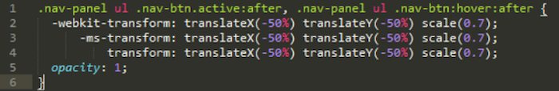

直接复制Nikolay写的示例中的234-239行代码的进行编译，作为之前我们的一个演示的基础。现在，快速看一下我调整后用在版本中的等效代码:

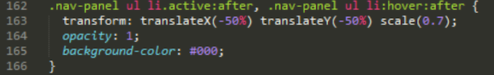

有没有看出不同之处？供应商前缀属性被去除了，大多数的浏览器(当然在一年以及18个月之内)，可以不需要供应商前缀。原始版本也受到了CSS权重影响，如果为嵌套的代码，将会变得更为十分明显。

为了进行改善，我将`nav-panel ul .nav-btn`改为了`.nav-panel ul li`。 代码变得相对简单，不需要第二个类对元素进行标识进行样式修饰。下一个合乎逻辑的步骤是对源文件中大的嵌套代码块进行分解；使用一个单一的大的代码块十分具有诱惑，但是这会影响可读性、维护性以及性能。

我们可以思考的更远，考虑移除开头的`.nav-panel`;这不仅可以使代码更具有可读性，也可以解决CSS权重问题。当然，这种改变依赖于你的代码；关键在于彻底的对代码进行检查，尽可能多的减少CSS权重问题，你的嵌套就会变得不那么糟糕！

还有另外一种方法我们可以使用，这也会解决CSS权重问题。使用Block Element Modifier(简称BEM)。这是一种很好的方式，系统的使用CSS对元素进行样式定义，它值得你花费一些时间进行了解。让我们开始看看什么是BEM吧！

## 切换到BEM

那么，什么是BEM呢？为什么它可以帮助我们减少或者移除CSS权重问题呢？BEM或者说BEM帮助我们使用一种系统命名规范对元素进行样式定义，结构如下:

- `.block`: 顶级，包含我们将要更改的元素
- `.block__modifier`: 当元素状态改变时，指定样式
- `.block__element`: 顶级容器内的元素
- `.block__element__modifier`: 当状态改变时，元素的象征性替换

这种编码风格背后的思想为: 使其变得更为便捷，易于维护。这种依据为标准的 non-BEM CSS更为简洁，但是很难推断出每一个规则背后的功能是什么。我们经常对一个元素分配多个类，一方面增加了CSS权重，另一方面减少了CSS规则的可重用性。使用BEM允许我们将组合的名称应用于样式类名中，并且移除了CSS权重的问题。

如果我们采用这个概念，可以按照如下书写样式的规则:

    .block {
        &__element {
        }
        &__modifier {
        }
    }

编译结果为:

    .block {}
    .block__element {}
    .block__modifier {}

前面使用的是普通的BEM格式，在处理器环境中，如在PostCSS中Sass构造BEM，我们可以使用`postcss-bem`插件(可以在 https://github.com/ileri/postcss-bem 进行获取)使用`@-`规则产生BEM CSS。如:

    @component ComponentName {
        color: cyan;
        @modifier modifierName {
            color: purple;
        }
        @descendent descendentName {
            color: darkred;
        }
        @when stateName {
            color: yellow;
        }
    }

这种情况下，`@component` 表示我们的块(Block),`@descendant`表示我们的Element(元素)以及 `@modifieris`表示我们的Modifier(修饰符)。编译后的代码为:

    .ComponentName {
        color: cyan;
    }
    .ComponentName--modifierName {
        color: purple;
    }
    .ComponentName-descendentName {
        color: darkred;
    }
    .ComponentName.is-stateName {
        color: yellow;
    }

使用BEM的优势在于可以帮助我们减少甚至避免CSS权重问题，尽管名字很长，我们可以将元素以及修饰符的名称结合到一个类中，不需要应用三个甚至多个单独的类。当然，也可能出现需要应用第二个类的情况，但是缜密的思考可以尽可能的帮你将可能性降到最低限度。

好了，我们应该开始编码了！下面我们将看看如何在一个简单的示例中使用BEM，以及如何使用PostCSS对代码进行编译。

### 创建一个简单的消息盒

为了进行BEM演示，我们将通过所需的CSS规则在屏幕展示一些简单的信息盒，如用于显示任务已经完成，或者当事情不对时进行警告提示。

> Rene Spronk创建的原始案例版本可以在 http://www.cssportal.com/blog/css-notification-boxes/ 进行获取。

这是一个简单的案例，但是很好的说明了BEM CSS背后的原则。 对`Tutorial8` 文件夹进行的拷贝，运行`index.html`感受我们创建的结果。这个版本使用了标准的CSS；我们将使用这个作为BEM转换的基础。

让我们开始吧:

第一步：首先对本书随带代码中的`Tutorial9`文件夹进行额外的拷贝, 放置到项目工作区。

第二步：接下来，在一个新的文件中，从第一行添加如下CSS声明，并且每一个之间应该保留一行空隙，使其一目了然。之后依次进行查阅。

第三步：我们使用核心样式为每一个对话框揭开了序幕，这是每一个消息框盒子的基本样式:

    .dlgBox {
        border-radius: 0.625rem;
        padding: 0.625rem 0.625rem 0.625rem 2.375rem;
        margin: 0.625rem;
        width: 14.5rem
    }

第四步：接下来为每一个``元素应用一个简单的样式，将对话框内标题文本设置为大写，字体为粗体:

    span {
        font-weight: bold;
        text-transform: uppercase;
    }

第五步：现在，需要添加块元素。下面是基本样式的开头部分:

    @component content {

第六步：接下来为元素的样式规则。这些规则需要作为嵌套(即，缩进)被添加。使用PostCSS插件，我们需要将其作为`@component`的`@descendant`进行添加:

    @descendent alert {
        font-family: Tahoma, Geneva, Arial, sans-serif;
        font-size: 0.6875rem;
        color: #555;
        border-radius: 0.625rem; 
    }

第七步：下面是第一个状态信息，首先以错误信息拉开序幕；主要的规则就是添加了一个错误
图标并定义了边框的样式。悬浮在盒子上时，使用`:hover`伪元素减少了透明度。

    @modifier error {
        background: #ffecec url("../img/error.png") 
        no-repeat 0.625rem 50%;
        border: 0.0625rem solid #f5aca6; 
    }

    @modifier error:hover {
        opacity: 0.8;
    }

第八步：紧跟着就是对成功信息的样式定义:

    @modifier success {
        background: #e9ffd9 url("../img/success.png") 
        no-repeat 0.625rem 50%;
        border: 0.0625rem solid #a6ca8a; 
    }

    @modifier success:hover {
        opacity: 0.8;
    }

第九步：当然我们也不可以遗忘警告提示信息，所以如下为此状态的样式定义:

    @modifier warning {
        background: #fff8c4 url("../img/warning.png") 
        no-repeat 0.625rem 50%;
        border: 0.0625rem solid #f2c779; 
    }

    @modifier warning:hover {
        opacity: 0.8;
    }

第十步：最后，也很重要的是，还有一个通知；应用BEM嵌套，它包含一个闭合括号标签:

        @modifier notice {
            background: #e3f7fc url("../img/info.png") 
            no-repeat 0.625rem 50%;
            border: 0.0625rem solid #8ed9f6; 
        }

        @modifier notice:hover {
            opacity: 0.8;
        }
    }

第十一步： 将文件保存为`style.css`,放置顶级项目区的`src`文件夹中(不是`Tutorial8`文件夹)。

就样式而言，我们简单的演示并没有完成。如果我们现在就进行预览，效果并不是很好；让我们进行修改，设置编译并且使用PostCSS进行`linting`任务。

> 如果你是一个Sass使用者，可以在Github处理器中看到此代码一个适合的版本。 代码可以在 https://gist.github.com/alibby251/45eab822a6a619467279 进行获取。注意进行编译版本以及下面将要介绍版本的相似性对比！

### 编译并且修正代码

现在代码已经完成，但是盒子看起来并不美观。大多数的样式仍旧使用PostCSS`@-`规则书写。可以通过代码编译进行修正，接下来让我们看看如何安装BEM支持。

### 安装 BEM

在PostCSS中设置BEM支持简直小菜一碟。 可以使用两个插件编译并修正代码。分别为`postcss-bem`(可以在 https://github.com/ileri/postcss-bem 进行获取)，`postcss-bemlinter`(可以在 https://github.com/postcss/postcss-bem-linter 进行获取)。两者均可以通过Node.js进行安装。 

现在这一步骤大家已经十分熟悉，事不宜迟，开始吧:

第一步：打开Node.js命令提示符窗口，切换到项目工作区。

第二步：在窗口中输入以下命令，按`Enter`键:

    npm install --save-dev postcss-bem

第三步：Node.js会进行插件安装；如果一切顺利，我们会看到如下结果，提示安装成功:

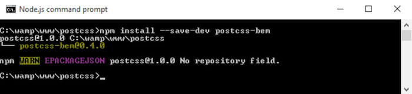

第四步：`postcss-bem-linter`插件安装过程类似，输入以下命令:

    npm install --save-dev postcss-bem-linter

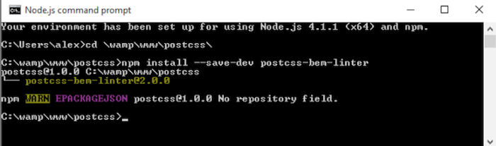

第五步：保持命令提示符窗口处于打开状态，设置为最小化。一会我们还会用到它！

现在插件安装已经完成，接下来就需要对`gulp`任务文件添加支持，以解析我们的代码:

第一步：首先，在项目的根目录移除现有的`gulpfile.js`文件。

第二步：在新文件中，添加以下代码，在根目录下保存为`gulpfile.js`。我们设置了一系列的变量，对插件进行引用:

    var gulp = require('gulp');
    var postcss = require('gulp-postcss');
    var bem = require('postcss-bem');
    var bemLinter = require('postcss-bem-linter');
    var reporter = require('postcss-reporter');

第三步：文件的第一个任务检查代码与BEM标准的一致性，在屏幕显示任何错误:

    gulp.task('lint', function() {
        return gulp.src('dest/*.css')
            .pipe(postcss([
                bemLinter({ preset: 'bem' }),
                reporter({ clearMessages: true })
            ]))
            .pipe(gulp.dest('dest/'));
    });

第四步：第二个任务将BEM代码编译为有效的CSS:

    gulp.task('bem', function() {
        return gulp.src("src/*.css")
            .pipe(postcss([bem({
                style: 'bem',
                separators: { descendent: '__' }
            })]))
            .pipe(gulp.dest('dest/'));
    });

第五步：这个任务为默认任务，当在命令提示符窗口中运行`gulp`；它会依次调用每一个任务；

    gulp.task('default', ['bem', 'lint']);

第六步：最后，我们以监视功能结束了`gulpfile.js`，当代码发生改变时，对其进行重新实时编译:

    var watcher = gulp.watch('src/*.css', ['default']);
        watcher.on('change', function(event) {
            console.log('File ' + event.path + ' was ' + 
            event.type + ', running tasks...');
    });

第七步：我们也将要取代`package.json`文件。在新文件中添加以下代码行，保存至项目的根目录。这些代码告诉`gulp`当进行代码编译时，所使用插件的版本:

    {
        "name": "postcss",
        "version": "1.0.0",
        "description": "Configuration file for PostCSS",
        "main": "index.js",
        "scripts": {
            "test": "echo \"Error: no test specified\" && exit 1"
        },
        "author": "Alex Libby",
        "license": "ISC",
        "devDependencies": {
            "gulp": "^3.9.0",
            "gulp-postcss": "^6.0.0",
            "postcss-bem-linter": "^2.0.0",
            "postcss-reporter": "^1.3.0"
        }
    }

第八步：在本书随带的代码中，` Tutorial9`下的`completed version`文件。对`css`中的`style.css`进行拷贝，保存至我们项目的`src`文件夹中。

第九步：返回之前的Node.js命令提示符窗口，输入以下命令，按`Enter`键:

    gulp

第十步：一切均已完成，代码会被检查，屏幕中会呈现结果。你会看到出现了错误，如下屏幕截图所示。如果出现此问题，现在可以进行忽略(之后我们会探索更多的细节):

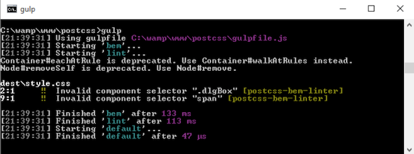

第十一步：在`Tutorial9`中，将`dest`文件夹下的内容拷贝至`css`文件夹中。一切均已完成，当在浏览器中进行预览时，会出现如下屏幕截图的结果:

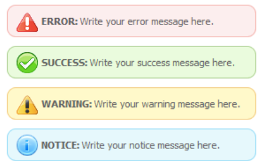

我们简单的演示展示了一些有用的消息框，可以作为更为复杂演示的基础；它很好的说明了如何使用BEM对代码进行样式定义，同时有效的避免了CSS权重问题。通过这个练习我们使用了一些有用的小技巧，接下来，我们会探讨更多的细节。

## 探索更多变化的细节

BEM样式定义原则值得你花费一些时间去了解熟悉。虽然这些原则很容易理解，但是需要时间才可以实现！让我们更为细致的看看代码。

在这个示例中，使用PostCSS插件时，BEM的关键原则是嵌套。我们创建了核心组件内容，在样式表中导致了一个空的样式规则。下一个缩进为`@descendant`，表明消息框作为警告进行样式定义。之后使用一些`@modifieris`为每一个类型的警告进行样式定义，如成功，警告，错误，或者通知(即，信息)。这包含了鼠标悬停状态时，每一个实例单独的样式。 

这对于我们意味着什么呢？意味着我们不是将每一个元素(如，一个消息框)作为一个单一的实体，应用多个类；相反，我们需要考虑每一个元素的构成部分，并且应用单一的类。等等，这并不意味着我们仍旧使用三个类(正如可能存在这种情况)？

> 想要了解更多的BEM命名约定，可以看一下在 https://en.bem.info/tools/bem/bem-naming/ 所发表的一篇文章。答案分为两种，肯定与否定: 这里的窍门是PostCSS会结合每一个嵌套的样式编译为有效的CSS;如:

    @component content {
        @descendent alert {
            font-family: Tahoma, Geneva, Arial, sans-serif;
            font-size: 0.6875rem;
            color: #555;
            border-radius: 0.625rem; 
            @modifier error {
                background: #ffecec url("../img/error.png") 
                    no-repeat 0.625rem 50%;
                border: 0.0625rem solid #f5aca6; 
            }
        }
    }

编译结果为:

    .content {}
    .content__alert {
        font-family: Tahoma, Geneva, Arial, sans-serif;
        font-size: 0.6875rem;
        color: #555;
        border-radius: 0.625rem;
    }
    .content__alert_error {
        background: #ffecec url("../img/error.png") 
            no-repeat 0.625rem 50%;
        border: 0.0625rem solid #f5aca6;
    }

细心的人会注意到，编译代码中仍然存有错误:

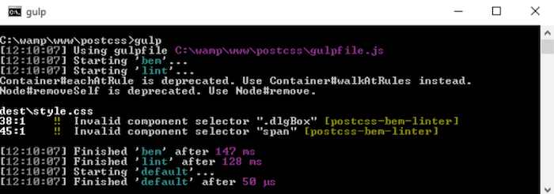

总是不断的出现错误，但是也有合理的理由。我们可以安全的忽略两个折旧的警告(这些会在后面的版本中进行修复)，但是这两个错误更值得引起我们的关注。

### 错误修复

这两个错误是`postcss-bem-limter`所导致的，没有被作为有效的BEM符号识别。这又引发了另外一个问题: 我们是否可以改变代码移除这个问题?

回答这个问题，我们需要权衡受影响的代码量以及要花费多少精力进行修正。我们的演示中，受影响的代码量很少；进行解决只需要对`.dlgBox`以及`span`等效为BEM命名样式。

这值得我们花费精力进行解决吗？如在一个小的演示中，答案显然是否定的，对于一个大型的演示，我们可能会改变这两种风格。或者，我们可以在第48行添加一个简单的指令:

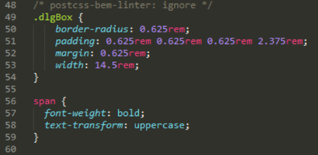

代码编译完成，错误被移除:

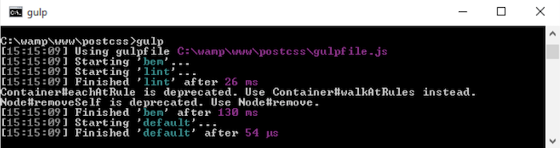

纯粹主义者可能会说这是欺骗。是的，我们的代码技术上不全为BEM。尽管作为防御，这也得由每一个开发人员做出决定；可能存有一些元素不得不保存为标准的CSS，我们不能进行转换。在这种情况下，使用PostCSS插件引入这些样式显然是一个明智的做法。我们将在第十章: 创建一个自定义预处理器中进行探索。

这里需要注意，`postcss-bem-linter`插件本身不会显示自身任何错误结果。 对于这种情况，我们需要使用另外一个插件，如`postcss-reporter`(可以在 https://github.com/postcss/postcss-reporter 进行获取，此为命令行显示)，或者`postcss-brower-reporter`(可以在 https://github.com/postcss/postcssbrowser-reporter ，在浏览器窗口显示内容)。当使用PostCSS对代码进行处理时，两者均有大量值得选择的理由帮助我们进行代码侦查调整。

## 小结

近年来，开发人员不得不经常书写代码复制一个选择器的全部或者部分代码。 一个完美的示例就是列表或者导航项的样式定义。书写额外的代码是一件十分痛苦的事情。这里我们就可以选择使用嵌套原则帮助移除此类代码。这个章节中，我们已经讲解了PostCSS中嵌套的大量技术，让我们停下脚步温习一下我们所学的知识。

在PostCSS开始引入`postcss-nesting`插件创建嵌套样式之前，我们以嵌套简介拉开了本章序幕。之后，创建了我们的嵌套示例。在开始使用现有处理器，如Sass之前，我们准备了纯vanilla CSS版本。

之后，使用`postcss-nesting`插件对我们的代码进行了转换之前，我们介绍了嵌套一些常见的陷阱以及一些使用技巧减少CSS权重。

接下来我们又对BEM进行了学习，以及如何在PostCSS中进行使用。在一个简单的示例进行相关应用之前，又介绍了一些基本的原则。我们还学习了它不适用于所有情况的原因；对于所适用的，我们又简短的了解了如何在PostCSS中进行设置自动修复我们的BEM代码。

好了，本章学习到此为止了！但是这并不是终点: 下一个章节中，我们将对如何使用媒体查询以及如何使用PostCSS进行编译为有效的CSS代码进行学习。
