# 第4章：创建媒体查询

简单使用一种设备浏览线网站日子早已远去: 从智能手机到数字电视再到笔记本，响应式网站可以工作在多种设备上。使用媒体查询是实现响应式网站的一种关键元素。本章节中，我们将探索如何使用PostCSS创建媒体查询，以及Sass或LESS类似实现的对比；同时相较于标准的预处理器，使用PostCSS将带来更为灵活的方式。本章的主要内容包含如下几个部分:

- 重温媒体查询
- 使用PostCSS实现媒体查询的基础工作
- 添加响应式支持
- 媒体查询优化
- 浏览器的兼容
- 更进一步 —— 探索CSS4媒体查询功能

让我们开始吧！

## 重温媒体查询

如果你经常使用不同的设备浏览网站，那么在样式表中看到媒体查询就不足为奇 —— 它们是响应式设计的基础，并且允许我们根据屏幕宽度，来控制屏幕内容的显示方式。

The principles behind media queries are simple. In a nutshell, we have to define the device or media, and the resolution (or width) at which point the rule (or breakpoint) either kicks in or stops being applied. Take this simple example:

媒体查询背后的原则十分简单。简而言之，我们需要在设备或者媒体的某一个分辨率（或宽度）断点下，进行某个样式的应用或者移除。如下所示:

    @media only screen and (max-width: 768px) {
        /* CSS Styles */
        ...
    }

只有在屏幕上进行浏览，并且其可用宽度为`768px`或者更少时，其中定义的样式才会被应用。这是一个简单的示例，根据要求可能会变得更简单或者更复杂；作为开发人员，我们需要准确地判断出内容在哪儿被打断以及如何创建一个合适的断点进行变更管理。

> 如果想要了解更多更新的媒体查询相关的知识，可以查阅Chris Coyier所书写的一篇文章，他主要研究媒体查询在笔记本电脑，PC端甚至可穿戴设备上的应用！文章可以在 https://css-tricks.com/snippets/css/media-queriesfor-standard-devices/ 获取。

好了，让我们开始吧: PostCSS可以很轻松的对文本以及图片的查询进行管理；我们首先对图片的处理进行研究。

## 探索PostCSS自定义媒体查询

使用PostCSS进行媒体查询切换简直小菜一碟，可以使用`postcss-custom-media`插件来帮助我们，在 https://github.com/postcss/postcss-custom-media 可以获取到。

插件的安装十分简单，和之前插件的安装遵循同样的原则，话不多说，开始进行吧:

第一步：打开命令提示符窗口，切换至工作目录。

第二步：在窗口中，输入以下命令。之后按`Enter`键:

    npm install --save-dev postcss-custom-media

第三步：使命令提示符窗口处于打开状态，之后的步骤中还会用到。

插件安装完成，就可以使用了。在演示上一个例子之前，让我们先来完成一个简单点的，你可以亲自动手实践一下。

第四步：创建一个新文件，添加以下代码，命名为`style.css`并保存至项目根目录下的`src`文件夹中:

    @custom-media --apple-watch (max-device-width: 42mm) and 
      (min-device-width: 38mm);
        @media (--apple-watch) {
            h2 {
                font-size: 0.8rem;
            }
    }

第五步：从项目的根目录中移除现有的`gulpfile.js`文件。

第六步：创建一个新文件，添加以下代码，这会形成一个新的`gulpfile.js`文件；保存至项目的根目录:

    var gulp = require('gulp');
    var postcss = require('gulp-postcss');
    var customMedia = require('postcss-custom-media');
        gulp.task('default', function() {
            return gulp.src('src/*.css')
                .pipe(postcss([ customMedia() ]))
                .pipe(gulp.dest('dest/'));
        });
    var watcher = gulp.watch('src/*.css', ['default']);
    watcher.on('change', function(event) {
        console.log('File ' + event.path + ' was ' + 
        event.type + ', running tasks...');
    });

第七步：回到我们之前打开的命令提示符窗口，输入`gulp`,按`Enter`键。

第八步：如果一切顺利，打开项目`dest`文件夹下已经编译后的`style.css`文件，我们就能看到下面的代码:

    @media (max-device-width: 42mm) and (min-device-width: 38mm) {
        h2 {
            font-size: 0.8rem;
        }
    }

事实上，以上就是使用此插件所需要了解的全部内容；让我们花点时间思考一下这个例子中涵盖了什么知识。

乍一看，你可能会感觉这个插件对我们的帮助寥寥无几 —— 这样的思考很好，但使用该插件能够带给我们一个很关键的好处。我们可以将媒体断点分离为独立的变量语句，之后在样式表顶部进行存储。这就意味着，如果我们不对某个特别的断点进行更改，就只需要写一次这样的语句，之后我们的代码将在编译阶段自动更新。

考虑到这一点，就让我们动手做一个示例吧；这里我们采用了之前一个视差滚动实例的纯CSS版本，将其转换为PostCSS版本。

### 从普通CSS开始

接下来的的几页讲述中，我们会使用一种相对较新的技术作为演示 —— 视差滚动。视差滚动是单页面应用程序，允许我们滚动内容的同时可以在内容背后显示大量固定的图片: 

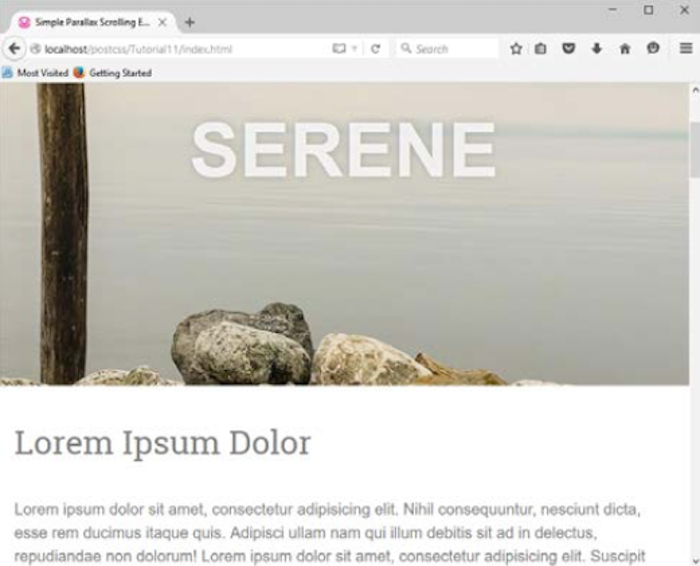

我们将使用Nick Salloum创建的一个示例，可以在 http://callmenick.com/_development/simple-parallax-effect/ 获取(我简化了一些CSS样式，移除了浏览器供应商前缀，并且减少了该示例所调用的一些独立文件的数量)。我们将从普通CSS版本开始 —— 可以在`Tutorial11`目录中拷贝项目需要的资源。尝试运行`index.html`文件；如果一切顺利，我们应该可以看到这个章节头部的屏幕截图。

使用顺利的话会产生重要的影响，上一段中的CSS文件里，我们感兴趣的部分是最后一节，大约从`133`行开始；这一段包含了下一个演示将要讲解的媒体查询。

### 使用PostCSS修改案例

如果媒体查询可以被正确的调用，就有可能打开一个新世界；我们可以对样式表进行调整，以应对从iPhone到打印机各种不同的设备。在我们的演示中，根据网站显示的宽度——大于`600px`或者`960px`,对内容应用了几条不同的规则；在PostCSS中改变这些简直小菜一碟。

> CSS3媒体查询网站有大量可获取的不同查询类型的列表；对目标电脑或者设备进行检查，会显示此设备是否支持该查询。完整的列表可以在 http://www.cssmediaqueries.com 进行获取。

要使用PostCSS，我们只需要对样式表做一些简单调整，让我们开始吧:

调整包括以下几部分:

第一步：把`Tutorial11`文件夹中`style.css`文件拷贝至项目的`src`文件夹中。

第二步：对文件进行编辑，使用PostCSS插件转换媒体查询 —— 在文件中添加`4~5`行：

    @custom-media --small-viewport all and (min-width: 600px);
    @custom-media --medium-viewport all and (min-width: 960px);

第三步：使用以下代码进行替换`161~182`行代码:

    @media (--small-viewport) {

第四步：在第200行用以下代码进行替换:

    @media (--medium-viewport) {

第五步：保存文件 —— 使用`Tutorial12`文件夹中`gulpfile.js`替换当前`gulpfile.js`文件。这个文件具有相同初始化的PostCSS任务，但是被重新命名并且添加了之前章节使用的一些任务。

第六步：之后，到我们项目的工程区对`package.json`文件进行拷贝保存 —— 这个文件包含了此次示例所需要依赖的插件。

打开命令提示符窗口，切换至项目工作区。在窗口中输入`gulp`，按`Enter`键:

第七步：一切准备就绪，在`dest`文件夹中就可以看到编译好的CSS文件 —— 对此文件进行拷贝并保存至`Tutorial12`文件夹中的`css`文件夹中。

第八步：在项目工程区运行`index.html`，预览结果 —— 如果一切正常，不会出现什么差异，唯一的不同之处在于源代码中我们使用了压缩的代码版本。

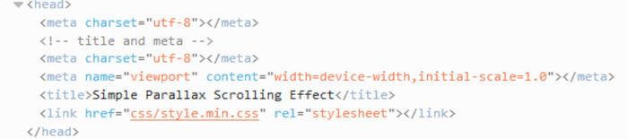

值得一提的是，示例中我们使用了媒体查询的典型格式: 我们可以根据手持设备，如Galaxy平板电脑，扩展或者改变样式表；应用相同的样式但是宽度进行相应的更改！http://cssmediaqueries.com 网站关于不同设备查询值具有一个详细的列表，我们可以进行相关查询。

如果想要知道可能存在的边界，这里有几个因素我们需要考虑：

`postcss-media-variables`: 这个插件(可以在 https://github.com/WolfgangKluge/postcss-media-variables 获取)具有相同的工作原理，但是允许我们在媒体查询中使用变量。使用这个插件的好处是使用`:root`规则可以转化宽度值；使用一个固定的值，根据此值进行其余值的运算。

    /* input */
    :root {
        --min-width: 1000px;
        --smallscreen: 480px;
    }
    @media (min-width: var(--min-width)) {}
    @media (max-width: calc(var(--min-width) - 1px)) {}
    @custom-media --small-device (max-width: var(--smallscreen));
    @media (--small-device) {}
    /* output */
    @media (min-width: 1000px) {}
    @media (max-width: 999px) {}
    @media (max-width: 480px) {}

缺点在于这是一个非标准插件，如果其余插件被运用，该插件就必须被调用两次，并按照一定的顺序进行调用 —— 这就意味着他可能只适用于一定的情况之下！

`postcss-quantity-queries`: 这个插件(可以在 https://github.com/pascalduez/postcss-quantity-queries 进行获取)基于Daniel Guillan 的Sass数量查询混合宏。可以像这样应用此规则:

    ul > li:at-least(4) { color: rebeccapurple; }

编译结果为:

    ul > li:nth-last-child(n+4),
    ul > li:nth-last-child(n+4) ~ li {
        color: rebeccapurple;
    }

这是使用此插件创建的四个伪选择器扩展之一，对导航条目进行样式修饰就是一个很完美的应用选择，或者对有序列表的奇数或者偶数元素应用不同的样式规则。

> 关于如何在CSS中使用数量查询，可以参考 Heydon Pickering 的文章 http://alistapart.com/article/quantity-queries-for-css。

好了，继续专注于我们要讲述的内容。目前为止，我们将重点放在了页面布局之中。但是我们可以进行进一步的改进 -- 创建响应式图片；下面就开始吧。

## 创建响应式图片

使任何站点具有响应式一个重要的元素就是图片 —— 如果没有图片，又何来响应式效果呢？

当然，可以使用数据统一资源标识符(URI)将图片转化为CSS等价物，但是这也具有一定的风险：使我们的样式表难于控制。现实是我们必须有一些格式的图片 -- 如果想要实现响应式，需要根据可用屏幕状态进行图片尺寸的改变。

实现图片响应式布局最简单的方式就是将`max-width`值设置为`100%`,`height:auto`以及`display:block`，删除图片元素定义的固定的宽度与高度。虽然我们可以手动进行修改，但是一件十分耗时的事情。取而代之，我们可以使用PostCSS插件，它允许我们在编译阶段对这三个值进行设置，通过一行代码添加到图片之上。

### 使用PostCSS创建响应式图片

使用PostCSS使网站具有响应式功能十分简单；这很大程度上取决于你创建响应式图片的需求，需要使用两个至关重要的插件就是`postcss-responsive-images`(可以在 https://github.com/azat-io/postcss-responsive-images 进行获取)以及`postcss-at2x`(可以在 https://github.com/simonsmith/postcss-at2x 进行获取)。

使用`postcss-at2x`插件时，我们再进行相关讲解，现在我们先来看看`postcss-responsive-images`
插件。

### 图片响应式的实现

使图片具有响应式，需要对图片添加一行基于图片的规则代码；添加此功能至本书随带代码的`Tutorial13`文件夹的副本之中。

第一步：首先，安装插件 —— 打开一个Node.js命令提示符窗口，之后运行相关命令，如下截图所示:

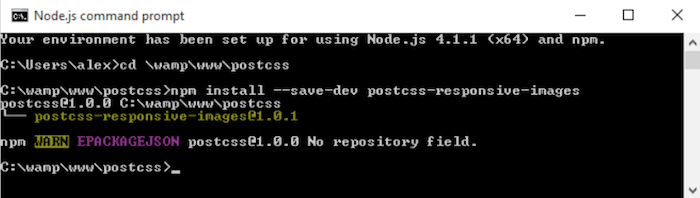

第二步：对`Tutorial13`文件夹进行拷贝，保存至我们的项目工程区。

第三步：在`Tutorial3`文件夹中的`css`文件夹中打开`style.css`，移除如下规则:

    img { 
        width: 584px; 
        height: 389px;
    }

第四步：移除之后，添加如下规则:

    #retina img { image-size: responsive; }

第五步：保存文件，拷贝至项目工程区下面的`src`文件夹中(不是`Tutorial`文件夹)。

第六步：对于这个示例，我们需要替换Gulp任务文件 —— 打开一个新的文件，添加以下代码，命名为为`gulpfile.js`，然后保存至项目的根目录下:

    var gulp = require('gulp');
    var postcss = require('gulp-postcss');
    var responsiveimages = 
        require('postcss-responsive-images');
        gulp.task('default', function() {
          return gulp.src('src/*.css')
            .pipe(postcss([ responsiveimages ]))
            .pipe(gulp.dest('dest/'));
        });
    var watcher = gulp.watch('src/*.css', ['default']);
    watcher.on('change', function(event) {
        console.log('File ' + event.path + ' was ' + 
        event.type + ', running tasks...');
    });

注意，这里gulpfile文件的关注重点是如何实现图片的响应式，所以和之前的文件相比会小很多。

第七步：打开一个Node.js命令提示符窗口，切换至项目的工作区 —— 在窗口中输入`gulp`之后按`Enter`。

第八步：Node会自行运行进行代码编译 —— 如果一切正常，高清屏图片代码编译结果如下所示:

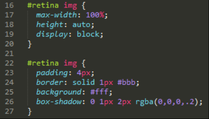

第九步：将`dest`文件夹中编译好的CSS文件进行拷贝，放置`Tutorial13`文件夹的`css`文件夹中。

第十步：对代码进行预览 —— 进行浏览器窗口的大小调整；如果一切正常，图片会自动进行调整。

尽管这个插件很容易进行安装并且使用，但为获取更好地效果，最好直接在HTML代码中进行图片引用，而不是在CSS中通过`background:`或者`content:url()`属性进行引用。

这对于我们意味着什么呢？这会产生一些限制，尽管这是一个与时间绑定的限制。我们当中的一些纯粹主义者可能会更偏爱分离出一些有用的CSS样式表属性，如一些开源的软件。

敏锐的你可能会注意到展示的图片需要进一步改善 —— 当窗口进行大小调节时，页面剪裁不可以重新进行定位，并且我们需要设置一个最小的宽度，以便重新调整大小时可以在图片周围产生一些空白区域:

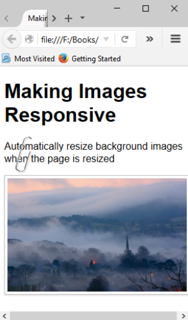

关键的原则保持不变，响应式图片的重要步骤 —— 移除图片固有的大小，使用`max-width`的值`100%`进行替换。

为了获取更为真实的响应式图片，我们可以使用新的HTML5的`<picture>`标签 —— 麻烦在于PostCSS还没有插件可以实现这些标签！

> 如果你对响应式图片十分感兴趣(在PostCSS范围之外)，可以参考一下这篇文章 https://jakearchibald.com/2015/anatomy-ofresponsive-images 。

关于PostCSS不支持`<picture>`标签问题，我们可以采取一种更为传统的方式以及使用媒体查询在不同的屏幕之间进行不同图片的切换。

我们也可以进一步的思考，针对高清屏设备，如Apple iPads或者iPhones，获取更好的图片效果。当使用PostCSS时，我们可以很轻松的实现这个效果，这需要使用Simon Smith的插件`postcss-at2x`--可在 https://github.com/simonsmith/postcss-at2x 获取。脑海中突然想到一些示例，话不多说，让我们一起探索这个插件的使用。

### 添加高清图片

高清图片，由苹果公司的营销团队所提出的术语，相较于标准的图片，相同的空间含有二倍的像素。这允许我们根据设备的相关支持，自动切换高质量的图片(或者分辨率)。

这对于由苹果公司市场营销所成就的人们最受欢迎的两个便携设备—— iPhone或者广为人们所喜爱的iPad可能会十分简单！但是，我好像偏离了话题...

技术层面，关于如何添加高清图片，有两个可选方式。详细讲解之前，我们需要重温基础的知识:

    @media (-webkit-min-device-pixel-ratio: 2), (min-resolution: 192dpi) { 
        #retina img {
            content: url("../img/mothorchid@2x.png");
        } 
    }

此代码是从`Tutorial15`文件夹中的CSS样式表中摘录，可在本书附带的代码中找到; 请尝试在浏览器中运行并预览`index.html`。

> 为了获得最佳效果，强烈建议您使用Google
Chrome —— 这是一个很好的浏览器，用于在低分辨率图像和高分辨率图像之间模拟切换的效果。

图像显示的文本为8位版本，如果想要进行切换可以进行如下操作：

第一步：按`Shift + Ctrl + I`显示开发者工具栏。

第二步：点击手机图标，以便更好地响应设计模式。

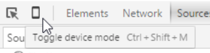

我们可以使用下拉尝试在不同的设备之间进行切换 —— 如切换至 Apple iPad; 对了，你可能需要按`F5`进行刷新显示。 如果一切顺利，兰花图像将在`8`位和`24`位版本之间切换。

### 后续步骤

一切都很顺利，但是这里并没有使用PostCSS —— 我们的选择又是什么呢？这里有两个插件可以使用：`customMedia()`或`postcss-at2x`插件。在PostCSS章节中，我们已经介绍了自定义媒体查询的使用; 为此，我们将定义一个变量，如：

    /* media query for hi-resolution image support */
    @custom-media --hi-resolution screen and 
    (-webkit-min-device-pixel-ratio: 2), (min-resolution: 192dpi);

这将与下面的查询相结合：

    @media (--hi-resolution) { 
        #retina img {
            content: url("../img/mothorchid@2x.png");
        } 
    }

编译完成，在谷歌浏览器中运行(方便其响应式设计工具的使用)，我们可以看到`8`位的图像：

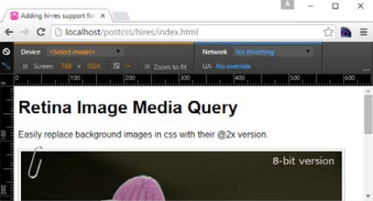

...`24`位版本的图像：

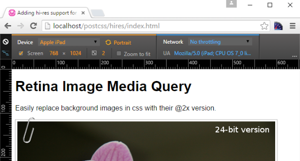

样式表视图自动显示更新后的媒体查询：

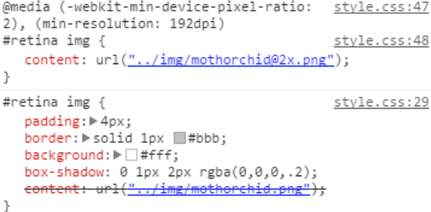

这显然已经很好，但是手动方法毕竟浪费时间 —— 取而代之，我们可以使用一个更快的路线实现类似的结果。一个可选的简单的路线就是使用`postcss-at2x`插件 —— 只需在样式规则中添加术语`at-2x`：

    #retina img { background: url("../img/mothorchid.png") at-2x; }

这会自动编译，在我们的样式表中为我们生成相应解析语句。当使用iPad或其他设备时，这是一个有用的技巧，可以支持高分辨率图像。

> 在开始此演示之前，请确保清除项目区域根目录下的`src`以及`dest`文件夹中的文件，否则可能会在编译阶段产生一些不良影响。

让我们更深入的进行探索吧。

第一步：同样的，首先安装插件 —— 打开一个 Node.js 命令提示符窗口，切换至项目工程区。

第二步：在窗口中输入屏幕截图所示的命令，按`Enter`键:

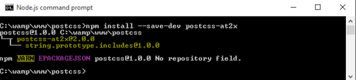

保持窗口处于打开状态，之后我们还会用到！

第三步：让我们现在设置标记，从本书随带的下载代码中拷贝`Tutorial17`文件夹，保存到项目区。

第四步：从此文件夹中拷贝`gulpfile`文件，用来替换项目区域现有的`gulpfile`文件。

第五步：从`Tutorial17`文件夹中提取`style-pre-compile.css`的副本，
然后将其复制到项目区域根目录下的`src`文件夹中，将其重命名为`style.css`。

第六步：切换回我们之前打开的Node.js命令提示符窗口，输入`gulp`，然后按`Enter`键。

第七步：PostCSS设置已经完成，开始编译代码 —— 如果一切顺利，我们应该可以在`dest`文件夹中看到编译后文件如下所示：

    #retina img {
        padding: 4px;
        border: solid 1px #bbb;
        background: #fff;
        box-shadow: 0 1px 2px rgba(0,0,0,.2);
        content: url("../img/mothorchid.png"); 
    }
    …
    @media screen and (-webkit-min-device-pixel-ratio: 2), 
    (-webkit-min-device-pixel-ratio: 2), 
    (min-resolution: 192dpi) { 
        #retina img {
        content: url("../img/mothorchid@2x.png");
        } 
    }

第八步：将`dest`文件夹的内容复制到`Tutorial17`文件夹中的`css`文件夹中。

第九步：预览效果 —— 如果一切顺利，我们应该看到类似之前的那朵兰花。同时，像上一个演示一样，强制Chrome显示高分辨率版本。

这个插件的强大之处是可以为我们创建媒体查询;而我们要做的只是在想要显示高分辨率版本的图像之中添加`at2x`标记。但是总存有一个风险，最终查询可能不是`100％`获得优化(例如，将相同的断点合并到一个块，等等);在本章节结束之前，我们将探讨提高查询的效率的一些方式。

使用高分辨率图像经常被遗忘的一个选择就是使用`image-set()`;表现原理类似，为支持高分辨率图像的设备提供不同的版本。PostCSS以`postcss-image-set`(可以在 https://github.com/alex499/postcss-image-set 进行获取)的形式提供兼容方案，它会在样式表中设置一个基本图像来使不支持`image-set()`的浏览器正常工作。

### 探索其他媒体查询的可能性

目前为止，关于使用媒体查询创建响应式内容，我们已经介绍了一些关键点; 那么使用PostCSS时，这又意味着什么呢？简单回答就是，它开启了一个可能性的世界 —— 如果你的网站需要使用媒体查询，可以使用PostCSS将我们的查询编译成有效的CSS规则。为了引起你的兴趣，这里有几个需要考虑的方面：

- 使用`bxSlider`插件创建响应式幻灯片，可在 http://www.bxslider.com 进行获取。它使用了jQuery移动每个幻灯片，但是是否可以使用CSS实现呢？
- 如何使用响应式雪碧图呢？一个经典的用例就是电子商务购物车上的信用卡图标，如果设备支持也可以实现高分辨图像。我们将在第5章 —— “颜色，图像以及字体管理”中详细介绍，如果你想尝试一下，可以查看 https://github.com/2createStudio/postcss-sprites 中的`postcss-sprites`插件。

好了，我们已经介绍了如何使用PostCSS创建响应式图像，关于文本呢？调整内容大小时，如果文本无法随之更改，页面用户体验也会变得不好。幸运的是，关于文本，我们可以应用类似的原则，可以使用Sean King提供的`postcss-responsive-type`插件 —— 下面就让我们看一下吧。

## 添加响应式文本支持

使用PostCSS创建响应式文本类似于我们已经使用的`postcss-responsive-images`插件，两种情况下，我们都需要添加一个简单的属性使我们的内容具有响应式功能。

这里我们需要使用的插件是Sean King的`PostCSS-responsive-type`(可以在 https://github.com/seaneking/postcssresponsive-type 获取)；首先，我们需要在样式表中添加`font-size`。当然，我们希望制定自己的规则，如下所示:

    html {
        font-size: responsive 12px 21px; /* min-size, max-size */
        font-range: 420px 1280px; /* range of viewport widths */
    }

这将编译为两个媒体查询 —— `480px`以及`1280px`；前者设置的字体大小为`12px`,后者为`21px`。事不宜迟，开始动手吧:

第一步：打开一个命令提示符窗口，切换至项目工程区。

第二步：在窗口中输入屏幕截图中命令，按`Enter`键:

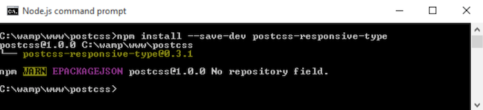

这样插件就安装好了，我们就可以开始使用它：

第一步：首先从本书附带的代码中，把`Tutorial18`复制到项目根目录下。

第二步：在一个新文件中，添加以下代码 —— 包含了示例所需的一些简单的字体样式；命名为`style.css`保存至项目的`src`文件夹中。

    @font-face {
        font-family: 'robotoregular';
        src: url('Roboto-Regular-webfont.eot');
        src: url('Roboto-Regular-webfont.eot?#iefix') 
        format('embedded-opentype'),
        url('Roboto-Regular-webfont.woff') format('woff'),
        url('Roboto-Regular-webfont.ttf') 
        format('truetype'),
        url('Roboto-Regular-webfont.svg#robotoregular') 
        format('svg');
        font-weight: normal;
        font-style: normal;
    }

    body {
        font-family: "robotoregular", sans-serif;
        font-size: responsive 12px 21px; 
        font-range: 420px 1280px; 
    }

第三步：打开项目工程区根目录下的`gulpfile.js`的副本。

第四步：`postcss-responsive-type`插件的引用声明如下所示:

    var at2x = require('postcss-at2x');
    var responsivetype = require('postcss-responsive-type');

第五步：`autoprefixer`任务也已经被修改 —— 使用了文件顶部声明的变量以及引用了`postcss-responsive-type`插件:

    gulp.task('autoprefixer', function() {
      return gulp.src('src/*.css')
        .pipe(postcss([at2x(), responsivetype(), autoprefixer]))
        .pipe(gulp.dest('dest/'));
    });

第六步：现在可以在Node.js命令提示符窗口中运行，切换至项目工程区，执行以下命令:

    gulp

第七步：代码编译完成，将`dest`文件夹的内容复制到`Tutorial18`中的`css`文件夹中; 预览结果，如果一切顺利，应该可以看到如下结果：

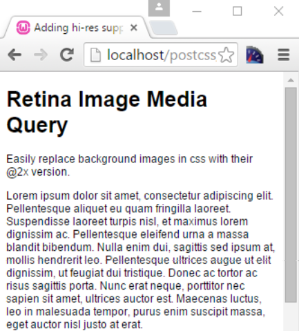

尝试调整窗口大小变大或者变小 —— 你就会发现随着窗口大小的改变，文本大小随之改变。然后我们可以使用它作为添加图像的基础;如果应用`postcss-responsive-images`和`postcss-responsive-type`两个插件，我们就可以将其作为为网站添加响应能力的坚实基础。

需要注意的一个小点 —— 代码中我们使用了像素值。历史惯例推荐使用缩放比率更好地`em`值(甚至更好的`rem`)。然而，一些开发者现在认为这个约定不再有效;不管是使用`px`、`em`或者`rem`都应该分场合。哪个值应该被使用，以及何时使用都取决于我们自己。

> 关于`px`与`rem`值的优缺点的讨论，可以看看Gion Kunz书写的这篇文章 https://mindtheshift。
wordpress.com/2015/04/02/r-i-p-rem-viva-cssreference-pixel/。

除了媒体查询使用过程中可能出现的问题之外，关于媒体查询优化还有一些我们应该探讨的关键点，以及如何为旧版本的浏览器进行某种形式的支持。我们将从优化查询开始 —— PostCSS有一些有用的插件可用于帮助维护我们的代码。

## 媒体查询优化

在本章中，我们探讨了使用PostCSS来编译我们的媒体查询；虽然选项很丰富，但我们应该注意确保我们不会创造一个怪物，减缓我们网站的运行速度！

在这方面，PostCSS提供了相应插件来帮助我们：

`postcss-mq-keyframes`（可在https://github.com/TCotton/postcss-mq-keyframes获取），这是一个简单的插件，将所有关键帧从现有查询中移动到样式表的底部。 这使我们能够合理地处理我们的关键帧规则 -- 如果我们有多个媒体查询，我们可以应用相同的规则到每个媒体查询。例如，下面突出显示的代码将被移出查询，并成为独立的规则：

    @media only screen and (min-width: 415px) {
        .pace {
            animation: pace-anim 5s;
        }
        @keyframes pace-anim {
            100% {
               opacity: 0;
            }
        }
    }

`css-mqpacker`（可在https://github.com/hail2u/node-cssmqpacker获取），这个插件解析我们的代码，并将所有相同的规则合并到一个媒体查询。但我们从这个插件中获得多少好处是有争议的；只有在更大，更复杂的网站上我们才能看到使用它带来的显著的好处！

这两个插件可以按照与我们使用过的所有其他插件相同的方式进行安装; 值得注意的是，我们不应该过度使用我们的查询。我们应该尝试设计解决内容明显断裂并变得不可用的情况，而不是为特定的平台进行设计。我们拥有的查询越少，管理我们的代码就越容易; 简单是一个网站成功的关键。

长远来看，在优化我们的代码时，我们不应该忘记一个领域 -- 我们应该支持哪些浏览器？ 我一直提倡如果可能的话，尽量使用现代浏览器。 但是，有些人可能仍然需要支持旧的浏览器（请不要告诉我包括IE6！）。接下来让我们探索PostCSS中的一个可用选项，在你不得不进行相应的支持时提供给你帮助。

## 改造对老版本浏览器的支持

对于那些仍然需要支持旧版浏览器（例如IE6-8）的用户， PostCSS可以提供帮助 -- 基于我们指定的媒体查询，我们可以使用`postcss-mqwidth-to-class`插件来生成硬编码类规则，如本例所示：

    @media (min-width: 1024px) and (max-width: 1298px) {
        .bar { float: left; }
    }

如果我们使用插件进行编译，结果如下：

    .min-width-1024px.max-width-1298px .bar { float: left; }

有人都看到这里的危险性了吗？ 代码在技术上可能是正确的，但它存在一些限制，使其不那么受欢迎：如果有一个高优先级的CSS定义，媒体类型就会被忽略（如屏幕或打印机）; 如果要向`<body>`或`<html>`标签添加类，则可能需要JavaScript的帮助。

虽然最终是由我们自行决定我们需要使用什么，但是我们应该始终注意，如果我们必须支持旧的浏览器，我们的代码不能引入新的问题！ 在这种情况下，一个更好的选择是考虑`postcss-unmq`插件（资源在https://github.com/jonathantneal/postcss-unmq）; 它会移除媒体查询，以便允许我们创建符合特定屏幕尺寸的规则。

现在，虽然IE8等浏览器确实（强制地）在被淘汰，但依然可以考虑是否我们能够更进一步，并开始摆脱使用响应式设计技术

例如，常见的合理建议是使用`rem`值替代`px`会更好。但现在也有一个变化：全盘使用`rem`单位（正如许多开发人员可能已经做的）不太可取，我们也许应该考虑不同单位的混合，以确保内容正确地自适应同时保持足够的清晰度。这是一个重要的观点，并作为我们PostCSS开发工作的一部分，所以让我们花一点时间来考虑它将带给我们什么。

## 远离响应设计

“远离响应式设计??你疯了吗？"

这个问题并没有一个完美的解答 -- 或许正如Polonius在哈姆雷特中那样，“看似疯狂，实则有因”。

简而言之，有一个很好的理由去考虑这个话题，因为使用PostCSS创建断点虽然容易，但让它们能正常工作才是我们代码成功的关键。 许多开发人员已经在线记录了要使用的不同类型的媒体查询 -- 平板电脑，台式机和笔记本电脑被广泛使用，如果硬件更改，就会引起频繁的更新或替换。

自从Ethan Marcotte在2010年推广了“响应式网页设计”这一术语之后，许多人已经接受了响应式设计作为为多种设备或平台创建内容的公认标准。 作为一个概念，它开始失去开发者的青睐; 固有的弱点是，即使只有那些选定版本的资源会被使用（诸如更大或更小版本的图像），依然需要下载多个资源。 这当然会增加带宽使用，并最终使网站浏览变慢。

那么，我们不应该使用响应式设计吗？ 嗯，不完全，它取决于你的实际情况。不要盲目添加一层复杂的媒体查询，请花一点时间考虑你是否真的需要它。

作为替代，可以考虑使用特定内容断点，取代等同的媒体; 我们不应该再为特定设备做设计，而应该去解决内容没有被正确使用的问题，并在此基础上构建我们的断点，而不是依赖一个随时可能变化的已知设备宽度。

图像，或具体的高分辨率版本，已经不再是一个问题; 请考虑使用SVG格式来取代每个低或高分辨率版本。 这样可以实现完美的缩放（设备无关），并兼具在不同设备上的可扩展性。 当然，在IE上还是有一些已知的支持问题，但大多数其他浏览器应该能够处理SVG，而不会导致太多的问题！

字体是另一个我们可以开始减少使用媒体查询的领域 -- 这里，我们应该开始考虑使用`vw`，`vh`，`vmin`或`vmax`单位; 如果调整浏览器视口大小，文本将自动调整大小。调整我们的代码需要一些手动更改; 同时，我们可以使用`postcss-vminplugin`为旧版本的Internet Explorer提供一些兼容。

希望这些能诱发你的思考 -- 这里的关键信息是，虽然PostCSS插件的媒体查询使它真的很容易实现，我们依然不应该盲目地去执行大量的媒体查询，而应该考虑是否有替代方法来实现相同的效果。

那么，让我们继续：时间往前推进; 让我们来看看如何使用CSS4带来的（众所周知的）新特性。 我们将使用一个示例，来模拟新的大于或小于运算符，它们可以用作CSS4媒体查询的一部分。

## 探索CSS4媒体查询功能

使用媒体查询时，一个已知的弊端是查询本身没有真正的语义; 大多数查询的显示类似`max-width：
1024px`，而我们真正的意思是...小于...，或...大于...

幸运的是，随着大多数人称之为CSS4的到来，将为CSS带来变化，我们将能够使用`>`，`<`或`=`符号来表达我们在代码中真正意义。 PostCSS的美妙之处在于我们现在就可以使用`postcss-media-minmaxplugin`（https://github.com/postcss/postcss-media-minmax）来模拟这个功能。我们已经知道，插件会将这些转换为更熟悉的`min-`或`max-`语句。

这是一个非常容易使用的插件 -- 我们打算打破这里的约定，并使用CodePen来演示插件的实际表现。 CodePen将支持有限数量的插件，这是其中之一 -- 是看到我们查询的实际效果的一个完美机会。在我们的示例中，我们将使用Font Awesome库来创建一些社交媒体图标 -- 我们的演示基于Amey Raut的版本：

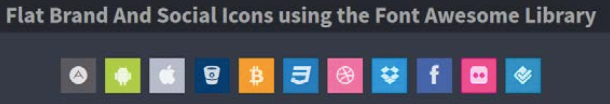

你可以在 http://codepen.io/alibby251/pen/wKNMGL 看到该示例 -- 我们感兴趣的代码是从第 70 到 79 行 -- 注意71行中`<=` 和 `>=`的使用︰

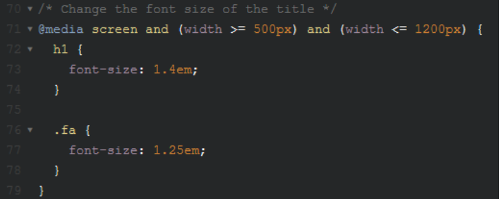

编译完看到的CSS代码:

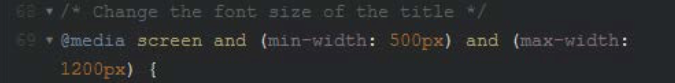

在媒体查询中使用运算符如 `<` 或 `>` 只是CSS4中的一小部分; 想了解更多细节，可以查看W3C编辑草案:http://dev.w3.org/csswg/mediaqueries/ --请注意，这里有干货！

## 小结

对于创建响应式网站的任何人，媒体查询都是此过程的核心部分。PostCSS可以帮助我们轻松地创建项目中所需的适合的媒体查询。 我们在最后几页中介绍了一些关键主题，在此，就让我们花一点时间来总结本章中介绍的内容。

在修改我们的代码以使用PostCSS作为查询基础之前，我们先对CSS中的标准媒体查询进行了快速的回顾。 然后，在我们开始实践PostCSS示例之前，我们首先通过查看PostCSS中的可用选项，将其用于实现响应式图片。 接着，通过查看其支持的高分辨率设备中的不同表现，我们介绍了常见的被应用于图片的媒体查询。

然后，我们的目标就变成实现文本的可响应，并发现尽管使用了不同的插件，应用过程都是相似的。接着，我们开始关注使用PostCSS进行查询优化，并快速回顾了一些可用的选项，以改进支持旧的浏览器。然后，我们对这一章进行了补充，并使用替代技术使我们的网站可响应，而不需要媒体查询。最后，提及了CSS4中可以使用的一小部分技术，以及如何使用PostCSS让这些技术在当前可用。

我们确实已经介绍了很多内容：并且永无止境！下一站在我们的旅程保证同样有趣; 每个网站或在线应用程序都会使用不同的字体，图像或颜色。 我们将看到如何使用PostCSS让我们的生活更容易...。