# 第5章：管理颜色、图片和字体

一个没有良好的颜色、图像以及字体的网站一定不是一个优秀的网站，将这些元素进行良好的管理和搭配能让网站变得有趣，在词汇贫乏的时候也可以更清楚地表达网站内容，对于维持网站日常流量也有帮助。

用过预处理器的用户应该会熟悉如Compass库，实用的Sass框架工具，官网地址：http://www.compass-style.org。我们能否做出类似的效果，而且更快速，还不需要添加依赖？用上PostCSS，这些都不是问题，我们可以自主选择我们的网站需要的插件，并开始根据这些需求来创建一个处理器。这一章我们将讨论如下的主题，包括:

- 可以用来处理颜色、图片和字体的插件概览
- 使用现有的预处理器创建雪碧图
- 使用现有的预处理器添加SVG支持
- 过渡到使用PostCSS
- 使用PostCSS插件操作颜色和调色板

OK~开始吧！

## 为网站添加颜色、字体及媒体元素

*百闻不如一见，come on~*

这句话最初在1920年代出现，非常贴切，对于这个数字世界 —— 一百字的描述的吸引力，如果我们把它换成一张形象的图片，也能传达同样的意思！

程序猿和设计师工作的一部分重要内容是，选用正确的图像和字体、颜色等，并将它们引入到网站中，以及正确的地方引用。我们会探讨一些可以用来修改颜色的插件和技巧，但是现在，我们先看看有哪些可用的操作图像和字体的插件。

### 维护资源链接

在维护网站的媒体资源时，通常过程是创建一个`font文`件夹，一个`images`文件夹，等等。这个过程的任何一部分失败了，那么在我们的代码中的链接就会有问题。当我们有一个特别复杂的文件夹结构的时候，这种情况发生的风险会增加。

相反，我们可以采取另一种方法：为什么不让PostCSS（或某个插件）来帮我们完成这些工作（维护资源链接的工作）呢？

我们可以使用`postcss-assets`插件来完成。如果我们指定一个名称，它会在源文件相关的文件中寻找，然后在`loadPaths`配置选项中找到指定的文件路径，最后在指定配置路径`URL`的`basePath`中进行搜索。这种方法的好处是我们只需要简单的引用图片名，然后提供的PostCSS在预先指定的位置查找相同名字的图片，最后在编译的时候换成正确的路径。

如果要改某个链接，没问题，我们增加新的图像，或者修改已经存在的图像。CSS样式将在下次编译的时候更新。我们来实践一下，在一个简单的Demo中，使用`postcss-assets`插件。

### 自动链接到对应资源

小伙伴们还记得《第四章：构建媒体查询》中的景观图吗？

首先我们的第一个示例，要重做一下这个案例，但这次使用`postcss-assets`插件（地址：https://github.com/borodean/postcss-assets），来自动插入我们所有需要的资源链接。我们注意力集中在图片和字体上，但是这也可以同样用在如videos这些媒体资源上。

这里放个之前的截图，以便大家观看：

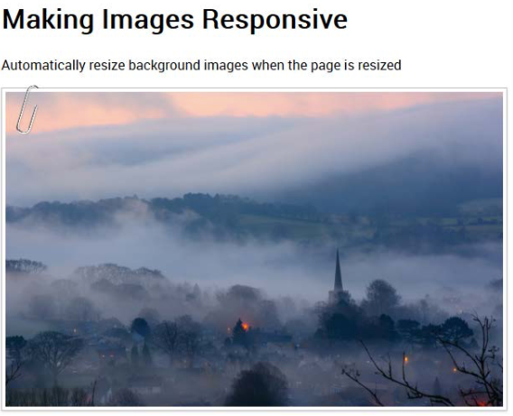

开始吧：

第一步：在本书附带的代码下载中，找到`Tuturial19`文件夹，将文件夹的内容保存在我们项目的根目录中。它包含了《第四章-构建媒体查询》中案例的修改版本。

第二步：接着，删除我们原来项目根目录中的`gulpfile.js`和`package.json`，我们这一章的案例中，我们等下会把这些配置文件更新为上一步下载的代码中对应的文件。

第三步：我们需要安装`postcss-assets`插件，所以启动一个Node.js命令行窗口，输入下面这条命令，然后回车：

	npm install postcss-assets --save-dev 

不要关闭命令行窗口，我们等下会再次用到。

第四步：从随书下载的代码中提取`gulpfile.js`和`package.json`文件的副本，然后保存在项目的根目录中。机智的你应该注意到了我们没有安装任何其它的插件，只使用了一个我们在前面的练习中已经安装的。`package.json`文件中包含了所需插件的引用和`postcs-sassets`文件。

第五步：在`Tutorial19`文件夹中，找到`styles-pre-compile. css`文件，并将它复制到我们项目的`src`文件夹中，重命名为`styles.css`。

第六步：回到Node.js命令行窗口中，输入`gulp`并回车。

第七步：如果一切顺利，我们应该已经有了一个`maps`文件夹和两份CSS样式表（一个开发版、一个压缩版）如果我们把这些复制到`Tutorial19`文件夹中的`css`文件夹，然后重跑一次案例，我们应该会看到一个相似的图片，跟前面案例开始的时候看到的景观图相似。

好了，图片以及Roboto字体正确显示出来了，但是它们是如何工作的呢？值得我们花几分钟来好好看一下代码。正确的设置可以节省很多时间！

`gulp`文件中的大多数内容你应该已经在前面的案例中看过了。我们和前面一样引入了`linting`, `renaming`, 以及`source map`这些任务，删除了`autoprefixer`任务。因为我们没有使用任何需要浏览器前缀的东西，所以这里可以不使用。

`gulp`文件的关键是它创建并替换了正确的资源链接。我们从选项配置对象——`loadPaths`开始看起，它负责指定资源位置，然后`relativeTo`告诉插件去设置相关的链接到`dest/`文件夹。在这里，`loadPaths`用于指定要使用的文件夹；我们使用`relativeTo`来让这些路径关联起来：

    var options = {
	    loadPaths: ['img/', 'fonts/'],
	    relativeTo: 'dest/'
    };

实际上`dest/`文件夹在我们的创建过程中有使用，这应该是我们的生产环境中CSS样式表的路径。下面这个简单的`task`调用了`postcss-assets`插件，在`src`文件夹中找到对应的样式表：

    gulp.task('assets', function() {
	    return gulp.src('src/*.css')
	    	.pipe(postcss([ assets(options) ]))
	    	.pipe(gulp.dest('dest/'));
    });

我们只需简单地调用这个任务，如果我们在命令行窗口中执行`gulp`命令，下面这些定义的任务都会运行：

	gulp.task('default', ['assets', 'lint-styles', 'rename', 'sourcemap']);

总之，这是一个非常简单又高效的工具，它使得我们不需要手动插入任何链接，只要我们在`configuration`对象中引入。

好吧，我们接着讲：我们前面已经用了一个简单的方法来确保我们可以拿到正确的字体或图像资源的链接。仍然有一个需要手动引用的元素是自定义字体。

我们可以使用一个Google的字体托管，但是和使用PostCSS的初衷相违。所以，我们可以在样式表中使用自定义字体名称，然后使用PostCSS在编译的时候自动添加`@font-face`声明。感兴趣不？我们下个练习一起来看下。

## 使用PostCSS管理字体

在我们之前的案例中，我们探讨了一种使用PostCSS自动添加资源链接的方法，它简化了我们在指定文件链接时的烦恼。问题是，当我们使用自定义字体时，它还是需要我们自己去写链接（我知道，人类的本质是懒惰）。这里有一个更好的选择：

进入`postcss-fontpath`插件，可以从https://github.com/ seaneking/postcss-fontpath这里获取；这是一个简单的插件，只需要关于我们的自定义字体有限的信息，然后它会在编译阶段生成完整的`font-face`声明。

所以，在探讨这个插件之前，我们先来用一下。我们看回前面的响应式图片案例，使用`fontpath`插件来处理我们的自定义字体，改变我们的样式表：

第一步：我们首先从下载的代码中拿到`Tutorial20`文件夹，然后将文件夹中的内容保存在我们项目的根目录中。

第二步：接下来，复制`Tutorial20`文件夹中的`package.json`和`gulpfile.js`文件，替换现有的这两份文件，放在我们的项目根目录中。

第三步：启动一个Node.js命令行窗口，把工作路径切换到我们的项目中。

第四步：在命令行窗口中，输入下面这行命令，然后回车：

	npm install postcss-fontpath --save-dev

因为我们前面已经安装了其它插件，如果需要安装新插件的话，用`npm install`命令（不需要执行上面的那条命令）即可；因为新的`package.json`文件会告诉NPM要去安装哪些插件（这里缺少`postcss-fontpath`插件）。不要关闭窗口，我们后面会接着用到。

第五步：从`css – completed version`文件夹中，复制`styles-pre-compile.css`，保存到`src`文件夹中，并重命名为`style.css`文件。

第六步：回到Node.js命令行窗口，输入`gulp`，然后回车。

第七步：如果一切顺利，我们会看到相似的样式表和`map`文件夹，出现在`dest`文件夹中；将它们复制到`Tutorial20`中的`css`文件夹中。

到这里，我们应该有一个可运行的案例，看起来好像没有什么不同，但在编译阶段，PostCSS已经自动地将正确的`font-face`声明加上了。

这个插件就好在它很简单，只需要添加一个简单的任务：

    gulp.task('fonts', function () {
	    return gulp.src('src/*.css').pipe(
	    	postcss([ fontpath() ])
	    ).pipe(
	    	gulp.dest('dest/')
	    );
    });

这个插件不需要指定任何额外的配置元素或规则，非常智能。尽管我们在这个示例中好像没有取得任何突破性的东西，但是它可以用来说明使用PostCSS的一些要点：

- PostCSS专注于一个单一的任务，不会去试图实现任何其它的东西。遵循单一责任原则，意味着我们可以减少重复，让插件更健壮，避免某些情况的变化导致连锁反应，最后破坏我们的处理器。这个插件好在，它只是用于针对指定的字体提供`font-face`声明，没有其它的东西了。
- 有时候，在PostCSS中选择合适的插件时，可能会有情况是当我们选择了之后发现工作不如预期。一个典型的例子是，`postcss-font-magician`插件（可以从https://github.com/jonathantneal/postcss-font-magician获取）；它有正确的提供`font-face`声明，但试图提供为谷歌托管的字体，本地字体，Bootstrap等等。

> 不幸的是，在写这篇文章的时候，最终的结果不是所有的功能都能像期望的那样工作，所以在这一点上，我们必须寻找可替代的方法。

如果你想探索更多关于PostCSS的东西，`postcss.parts`目录（在http://www.postcss.parts）提供更多内容，两个感兴趣的原因，一是`Assets Rebase`插件（https://github.com/devex-web-frontend/postcss-assets-rebase），二是PostCSS `Font Pack`插件，在https://github.com/jedmao/postcss-font-pack。我们会在《第八章——创建PostCSS插件》中详细讲讲后面这个插件。

好的，我们现在文本已经有了：虽然它看起来确实有点无聊。我们可以添加图片来让页面更好看。这里，PostCSS同样可以帮忙~

它可以在很多方面都提供帮助，而不是使用简单的颜色，比如，我们可以将颜色混合在一起使用。或者使用雪碧图？手动创建雪碧图真的非常痛苦吧？如果没有PostCSS的话。还有，我想你一定看过一些可以使用在图像上的滤镜（如`sepia`或`tint`），但发现它们的浏览器兼容性并不好，是吧？

这些只是一些PostCSS可以帮助我们的地方，我们会在这一章中接着讨论。我们接下来看看关于使用图片：我们的第一个案例会讲到创建雪碧图。在切换到使用PostCSS之前，我们先快速回顾Sass创建雪碧图。

## 创建雪碧图

我们先从简单的讲起，我相信你总有需要用到雪碧图的时候吧？如果你是一名Sass开发者，你一定会用Compass中的sprite mixins，然后使用如**Koala**这样的工具去编译吧，或者直接在命令行编译。

> 使用Compass创建雪碧图的相关文件，可以在下载的代码中找到，在`Tutorial21A`文件夹中。

过程相对简单，但你还是需要创建一个`Compass`项目，安装一个GUI应用程序（如果你正在使用），等等，确实很痛苦。我们可以使用一个在线应用，如**SpritePad**（http://spritepad.wearekiss.com/）。但这仍然是一个手动过程，容易出错。于是，我们可以使用PostCSS来帮助我们，在`gulp`文件顶部声明的普通变量，很少有需要用于生成基本的雪碧图。我们可以自己创建一个，使用`postcss-sprites`插件。

### 案例：创建一个信用卡图标

你应该也经常在e-commerce网站（国外的电子商务网站）买东西？如果你也像我一样经常网购的话，你一定经常看到各种支付方式的图标。可能非常小，但是它对于我们的网站来说是非常关键的。毕竟，如果我们使用一张特定的信用卡失败了，而在线零售商又不支持万事达卡（信用卡）呢？所以，这很难说。

这个话题先放放，这不是我们的重点。我们是要讲使用PostCSS创建雪碧图；要摆脱Sass依赖：这里我们可以使用`postcss-sprites`插件（可从https://github.com/2createStudio/postcss-sprites获取），来生成合成的图像。先来一探究竟吧。

在这个案例中，我们使用http://findicons.com/pack/2102/credit_card_debit_card 这里的信用卡图标；如果你想使用不同的图标，可以换成其它的。

本教程的所有代码都可以在`Tutorial21B`文件夹中找到，我们接下来开始安装`postcss-sprites`插件：

第一步：先开一个Node.js命令行窗口，工作路径切换到我们的项目中。

第二步：在命令行窗口中，输入截图所示的命令，回车，一旦Node确认安装成功，最小化窗口，因为我们后面还会用到这个窗口：

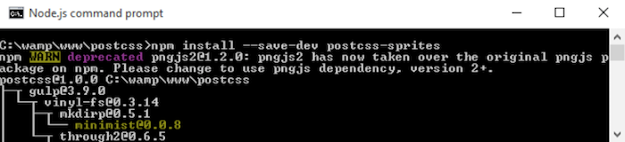

第三步：打开文本编辑器，然后添加如下四行代码，表示四个信用卡图标，我们常在e-commerce网站上看到的：

    .amex {
    	background: #fff url(img/amex.png) no-repeat 0 0;
    }
    .cirrus {
    	background: url(img/cirrus.png) no-repeat 0 0;
    }
    .delta {
    	background: url(img/delta.png) no-repeat 0 0;
    }
    .solo {
    	background: url(img/solo.png) no-repeat 0 0;
    }

第四步：将文件保存为`style.css`，然后保存到项目的`src`文件夹中。

第五步：在同一个文件夹中，在项目根目录创建一个`img`文件夹；提取下载的代码中的图标的副本，保存到`img`文件夹中。

第六步：从这本书下载的代码中，找到`gulpfile.js`文件，保存到我们项目的根目录。

第七步：回到Node.js窗口，在命令行输入`gulp`并回车。

第八步：我们的代码会被编译，如果一切顺利，我们会看到类似的样式，在`dest`文件夹中的`style.css`中看到的那样：

    .amex {
    	background-image: url(../img/sprite.png);
    	background-position: 0 0;
    	background-color: #fff;
    }
    .cirrus {
    	background-image: url(../img/sprite.png);
    	background-position: -102px 0;
    }
    .delta {
    	background-image: url(../img/sprite.png);
    	background-position: 0 -64px;
    }
    .solo {
    	background-image: url(../img/sprite.png);
    	background-position: -102px -64px;
    }

在这里，我们可以复制代码到我们的网站，包括图像，而不是使用单独的图标（每次都需要向服务器发送一次请求），我们可以缓存单个图标。这可以有更快的响应时间，而且减少服务器请求。编译后的样式可以在`dest`文件夹中找到，包含合成后的图像，在`img`文件夹中：

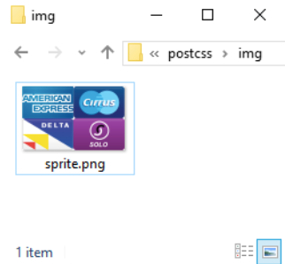

尽管这是一个简单的过程，值得注意的一个关键点是我们的`gulp`文件已经配置好了，`sprites`插件的配置对象：

    var opts = {
	    stylesheetPath: 'dest/',
	    spritePath : 'img/sprite.png',
	    path : 'src/img/'
    };

我们使用到目前为止的不是一个处理器，但是这并不意味着它是无用的，它仅仅归结为个人偏好及可读性。我们在调用每个插件的时候，最重要的是可读性强；例如在这里，我们只使用一个，但你可以想象，同时使用多个插件是什么样子：

    gulp.task('autoprefixer', function() {
	    return gulp.src('src/*.css')
		    .pipe(postcss([ sprites(opts) ]))
		    .pipe(gulp.dest('dest/'));
    });

好吧，我们改变策略，看一下在PostCSS中使用图像的另一面：使用SVG格式的图像。标准图像的伸缩性不好，尤其是用于响应式环境中；有时候我们可能会使用retina图像，但还有另一个可以考虑的方向是使用SVG图像。

## 在PostCSS中使用SVG

移动设备的迅速增长，使得创建响应式内容的需求越来越多；传统的思路是使用类似于`max-width: 100%`来控制屏幕上元素的尺寸。

一个更好的方案是使用SVG——可维护性高，也方便调整大小；如果尺寸调得太大，标准图像格式会像素化。对于以前使用Sass的同学，可能没有内置对SVG的支持。很多时候我们希望最好能在样式表中内嵌。

我们在随书下载的代码中的`Tutorial22`中的`sass`文件夹中可以找到示例。

如果我们经常在Sass中使用SVG图像，那么我们很可能会使用一个类似于`sass-svg`这样的库，地址：https://github.com/davidkpiano/sass-svg。从Sass迁移到PostCSS是非常简单的；PostCSS生态系统有很多我们可以用来操纵图像的插件。下面我们来看看如何使用`postcss-svg`插件。

### 使用PostCSS修改图标

我们将使用`postcss-svg`插件（可以从https://github.com/Pavliko/postcsssvg获取），来管理`Evil Icon`包中的一些图标（地址：https://github.com/outpunk/gulp-evil-icons）作为下个案例的一部分：

第一步：我们首先从下载的代码中复制一份`Tutorial22`文件夹的副本，保存到项目的根目录中。

第二步：在`Tutorial22`文件夹中，复制`gulpfile.js`和`package.json`文件，将其保存到项目根目录。

第三步：在同个文件夹中复制一份`style-pre-compile.css`；保存为`style.css`到`src`文件夹中。`index.html`文件同样。

第四步：在前面的案例中，我们需要一个额外的`css`文件夹，在`dest`文件夹中创建一个。

第五步：下一步，启动一个Node.js命令行窗口，把工作路径切换到我们的项目文件夹。

第六步：我们需要安装`postcss-svg`插件——在命令行中，输入下面这行命令，然后Enter：

	npm install postcss-svg --save-dev

第七步：完成之后，在命令行窗口中输入`gulp`，然后回车。

第八步：如果一切顺利，我们应该会看到两份样式表，在`/dest/css`文件夹中，以及一份`map`文件夹。HTML标签文件将会出现在`dest`文件夹中。

如果没有看到`map`或者压缩版本的样式文件，重跑一次`gulp`——有时候这些文件会在编译完成的`style.css`文件完成之后才出现。

第九步：在`Tutorial22`文件夹中，复制`dest`文件夹的内容到`css`文件夹中——如果一切顺利，在浏览器中预览应该可以看到看到这些图标出现：

尽管这个案例很简单，我们讲到了一些好用的技巧和信息；值得我们花点时间来详细看一下这个案例都涉及了哪些方面的内容。

### 更详细的探究

这个练习有几个值得关注的关键元素，CDN链接的使用，和为Evil Icons提供的样式表和图标的Node，编译后的HTML文件和自定义样式表的引用。我们将涵盖所有这些内容，但首先我们先看看`gulp`文件。

有下面这两行内容：

    var evilIcons = require("gulp-evil-icons");
    var postcssSVG = require('postcss-svg')

第一行表示使用`gulp-evil-icons`包安装的`Evil Icons`库。有许多不同的安装选项，但既然我们已经使用Gulp，我们就可以继续使用这种方式。

接下来，我们把工作扩展到两个任务，第一个编译HTML代码，来指定相关的图标文件，在`<icon>`标签语句中：

    gulp.task('icons', function () {
    	return gulp.src('src/index.html')
	    	.pipe(evilIcons())
	    	.pipe(gulp.dest('dest/'));
    });

改变颜色需要使用`postcss-svg`插件，这里通过`postcssSVG`引用：

    gulp.task('changecolor', ['icons'], function() {
	    gulp.src('src/style.css')
		    .pipe(postcss([ postcssSVG() ]))
		    .pipe(gulp.dest('dest/'));
    });

我们当然需要更新我们的`default`任务，这样我们只需要简单地在命令行跑`gulp`命令，它就会知道按照我们下面指定的顺序跑所有这些任务：

    gulp.task('default', ['icons', 'changecolor', 'lint-styles' ,'rename', 'sourcemap' ]);

最后一步也是类似的，更新我们的`watch`任务：

    var watcher = gulp.watch('src/*.*', ['default', 'icons', 'changecolor', 'lint-styles', 'rename', 'sourcemap']);

如果我们看一下HTML标签，我们可以看到一条到`Evil Icons`库的`link`标签，这是使用Node.js安装的：

    <link rel="stylesheet" href="../node_modules/gulp-evil-icons/node_modules/evil-icons/assets/evil-icons.css">

然后我们把我们自定义的内容放到一个单独的样式表中去：

    <link rel="stylesheet" type="text/css" href="css/style.css">

大概是长这样的：

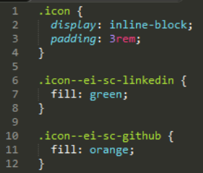

在这一步，CSS样式看起来比较简单，但是HTML标签并不是，`postcss-svg`插件已经添加了一个在线版本的图标到HTML标签中，用我们在自定义样式表中设置的那样：

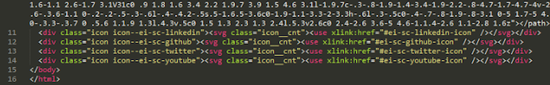

有时，有点疑惑，如果使用SVG需要额外的标签，主要的好处是：如果它是内联引入的，那么我们就可以减少额外资源的请求数量；内容如何改变都没关系，并不会影响图片质量。

### 考虑替代方案

我们在这个练习中主要讲了使用`postcss-svg`插件，作为在PostCSS系统中操纵SVG图像的第一步；接下来这方面还有更多扩展的内容，你可能感兴趣的：

- `postcss-write-svg`：这个插件（地址：https://github.com/jonathantneal/postcss-write-svg）可以让我们在CSS中写内联SVG。
- `postcss-inline-svg`：这是另一个插件（地址：https://github.com/TrySound/postcss-inline-svg），允许内联SVG图像和自定义样式。
- `postcss-svgo`：这个插件（地址：https://github.com/ben-eb/postcss-svgo）使用Node中的SVG优化工具优化内联SVG。

如果你需要为SVG文件提供降级，那么你可以尝试`postcss-svg-fallback`插件，地址：https://github.com/justim/postcss-svg-fallback。我们后面在《第八章：创建PostCSS插件》中会使用这个插件。

好了，我们改变一下策略：如果我们需要的只是一个简单的展示图片的格式，使用SVG图像可能有点重了，是吧？我们可以使用标准格式图像，或一种高质量的同时还能保持较小文件尺寸的格式。下面我们来看看来自Google的鲜为人知的`WebP`格式——我们会探索更多关于这种格式的干货，以及为什么它值得我们去关注。

## 添加WebP图像支持

操作SVG图像是一门艺术，但是在某些情况下，我们要实现的东西，还不至于一定要用到SVG~

因为，对于那些我们需要非常详细的图片的地方，我们可能会使用JPEG格式，或者PNG也是一个选择。这两种格式都没什么问题，但是，我喜欢有更多的可能性。另外，JPEG图像格式是有损的，而且不支持alpha通道；PNG图像无损，但是对于比较复杂的图像，文件会非常大。如果我们要做的只是把图像插入到页面，那么PostCSS在这里不能提供帮助；相反，考虑一种完全不同的格式如何？

来看看Google的**WebP**。你可能会想“Web什么鬼？”，因为它不是一个常见的文件格式。这可以归因于它很少被使用，支持的浏览器只有Chrome，Android和Opera。这并不意味着说它的优点就此打折。相对标准图像格式，如JPEG或PNG，这种格式可以有效地节省空间，同时保持高质量。我们可以用PostCSS来帮我们完成大部分工作。我们用一个简单的案例，来更详细探讨一下。

### 切换WebP图像

图像切换并不是什么新鲜的东西，我们在《第四章：构建媒体查询》中讲了一部分，当浏览器支持的时候，使用PostCSS来切换成高分辨率图像。

我们可以使用类似的技术，但这次处理的对象是“图像格式”，Google的WebP格式设计初衷是作为Web上无数其它图像格式的代替。在一个理想世界中，我们应该是使用`<picture>`标签来自动切换图像的：

    <picture>
	    <source srcset="../img/landscape.webp" type="image/webp">
	    
    </picture>

但是！并不是所有的浏览器中都支持，所以，我们可以使用结合PostCSS和Modernizr来应用相同的效果。这个任务我们需要的插件是`webpcss`插件（地址：https://github.com/lexich/webpcss）——我们先在Node.js命令行窗口中跑一下`npm install gulp-webp --save-dev`来安装插件。下面我们来更深入地看一下。

> 为达到最佳效果，我建议这两个案例都使用Chrome来看，浏览https://developers.google.com/speed/webp/，为Windows和其它浏览器添加支持。

### 看下文件大小方面的差异

在我们使用PostCSS之前，我们花点时间来做一个快速的测试。本教程的相关文件在`Tutorial23`文件夹中可以看到：

第一步：在本书附带的代码下载中，复制一份`landscape–original.jpg`，重命名为`landscape.jpg`。文件大小应该是`11.5MB`。

第二步：将图片保存到我们的项目根目录中，我们还需要复制一份`cwebp.exe`，放到我们项目的根目录中。

第三步：启动一个命令行窗口，工作路径切换为我们的项目，输入`gulp`，然后回车。

第四步：如果一切顺利，我们会看到转换结果，在我们的项目中可以看到新的WebP格式的图像：

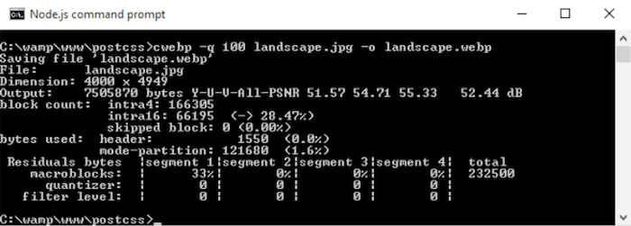

第五步：尝试对一个PNG格式的图像执行相同的内容，执行的结果是相似的，得到一个我们的`landscape`图像的PNG版本：

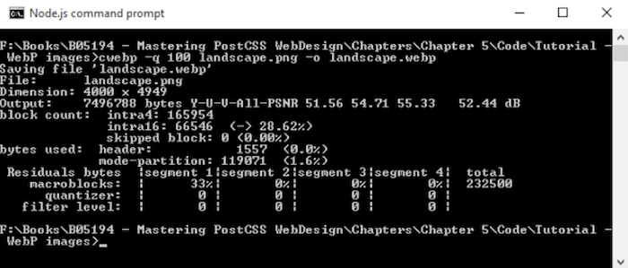

在这两种情况下，图像大小都明显减小，JPEG版本从12.5MB减少到了略大于7MB；PNG格式从巨大的25MB缩小到差不多相同的大小。

> 了解更多关于使用WebP格式的内容，可以查看Google Developers网站上的文档，https://developers.google.com/speed/webp/。

好的，下一个案例！我们现在可以使用PostCSS来创建标准JPEG格式和WebP的样式：

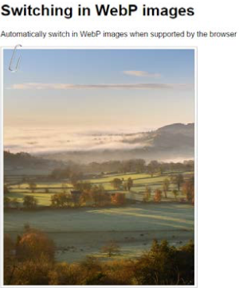

这个案例中，我们将会使用`gulp-webpcss`插件，地址：https://github. com/lexich/webpcss：

第一步：到随书下载的代码中找到`Tutorial23`文件夹，复制一份放到我们项目的根目录中。

第二步：接下来，复制`gulpfile.js`和`package.json`文件到项目根目录，用`Tutorial23`文件夹中的版本直接覆盖原有版本。

第三步：这些文件齐全之后，我们还需要安装插件，在Node.js命令行窗口中，把工作路径切换到我们的项目中，跑下面的命令，每一行输入就回车一下~：

    npm install --save-dev gulp-webp
    npm install --save-dev gulp-webpcss

注意这些命令中的参数，如果是按照不同的顺序写，会安装失败的。

第四步：复制`Tutorial23`文件夹中的`style-pre-compile.css`文件到我们项目根目录的`src`文件夹中，重命名为`style.css`文件。

第五步：启动一个Node.js命令行窗口，切换工作路径为我们的项目，然后输入`Gulp`并回车。

第六步：如果一切顺利，在查看编译后的文件时，我们会看到下面截图中的代码；转换后的图像也会出现在`img`文件夹中：

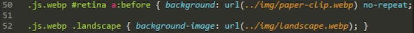

第七步：复制`img`文件夹的内容到`Tutorial23`文件夹中的`img`文件夹。

第八步：复制`dest`文件夹中的`style.css`文件，到`Tutorial23`文件夹中的`css`文件夹。

第九步：在浏览器中跑一下`index.html`文件，如果一切顺利，我们会看到类似这个练习开始位置的屏幕截图的内容。

如果我们在Google Chrome或Firefox中跑这同一个`index.html`文件，最初我们不会看到任何不同，在Chrome的开发者工具中我们才能看到编译源代码的区别：

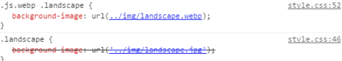

不过，真正的优点在`img`文件夹中，我们使用的原始的JPEG文件是222KB，WebP只是82KB。这下明白我说的节省空间的意思了吗？

好了，接下来我们看下一块构建网站的重头内容——操作颜色。颜色在任何网站都起着相当重要的作用，因为它们是传递给终端用户的信息的一部分。我们接下来看看使用PostCSS时有哪些可用的选项呢。

## 操作颜色和调色板

任何开发人员和设计人员都会面临的一个挑战是：网站应该用什么颜色呢——漂亮的红色，还是海蓝色，等等。但是无论他们是否负责选择颜色，或者他们是否需要选择正确的RGB或HEX使用，

先不管责任在谁，我们总是需要选择颜色的。幸好，当颜色需要更亮或更暗，或者是混合两种颜色时，我们不需要直接从默认的256-color调色板中选择：

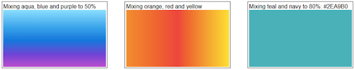

任何之前使用Sass来工作的人应该熟悉如`lighten()` `darken()` `saturate()`这些函数——PostCSS的好处是我们可以提取出类似的功能，然后摆脱Sass依赖。

它用起来非常简单，我们要结合PostCSS的两个插件来使用——`postcss-color-palette`（在https://github.com/zaim/postcss-color-palette）和`postcss-color-mix`（在https://github.com/iamstarkov/postcss-color-mix）。前者允许我们在调色盘中选中一种或多种颜色，而`postcss-color-mix`可以混合指定的颜色，来生成一种新颜色。使用这些插件是有原因的，等下就知道了；现在，我们来实际看看这些插件吧。

### 使用调色盘展示和混色颜色

在这个练习中，我们先看看混合颜色；`postcss-color-palette`允许我们通过颜色名（不是数字）选择多种颜色，然后将它们转换为十六进制的颜色值。接着我们可以创建渐变效果，或者只是简单地把颜色混合在一起（使用`postcss-color-mix`）来生成一种新颜色。

开始吧：

第一步：我们首先从随书附带的代码中提取`Tutorial24`文件夹的内容，把它保存到我们项目的根目录。

第二步：从`Tutorial24`文件夹中，复制`package.json`和`gulpfile.js`文件到项目根目录。

第三步：我们还需要样式表，为此，在相同的文件夹中复制`style–pre-compile.css`文件，并把它放到我们项目的`src`文件夹中，重命名为`style.css`。

第四步：在这里我们先需要安装插件。为此，启动一个Node.js命令行窗口，然后把工作路径切换到我们的项目中。

第五步：在命令行中，输入下面截图中的命令，然后回车，如果一切顺利，我们会看到插件正确安装了：

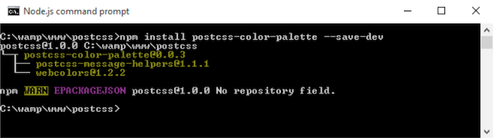

第六步：重复第五步，但这一次，跑下面截图的命令：

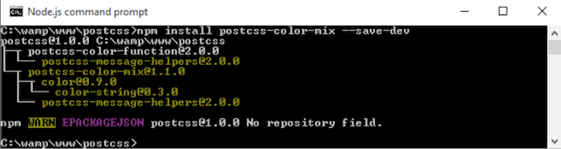

第七步：在窗口中，输入`gulp`，然后回车。PostCSS会编译样式，并把编译的结果输出到`dest`文件夹中。

第八步：复制`dest`文件夹的内容（会有压缩前和压缩后两份样式表，以及一个资源映射文件）到`Tutorial24`文件夹中的`css`文件夹。

第九步：在浏览器中预览`Tutorial24`文件夹中的`index.html`文件，如果一切顺利，我们会看到混合后的颜色，如下面的截图所示：

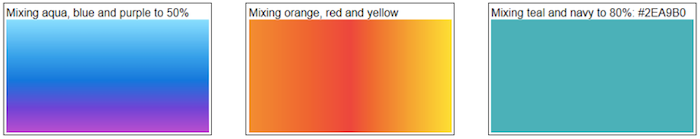

好吧，我选择的颜色当然不是专业的，只是用来帮助大家理解：我们使用正确的颜色名作为首选，然后允许PostCSS来将它们便以为有效的十六进制值。这样，我们花点时间来看看我们这个案例的代码——它涉及到了几个关键点，我们在使用这些插件的时候应该注意的。

### 案例的详细解析

我们创建的案例遵循了本书中大多数其它案例都遵循的原则；我们首先声明变量来存储我们插件的实例，如下：

    var palette = require('postcss-color-palette');
    var colormix = require('postcss-color-mix')

然后是生成神奇效果的这个任务，在`gulp`文件中：

    gulp.task('palette', function () {
    return gulp.src('src/*.css')
    .pipe(postcss([ autoprefixer, palette({ palette: 'mrmrs' }),
    colormix() ]))
    .pipe(gulp.dest('dest/'));
    });

注意我们使用了指定的调色盘，默认选项是`mrmrs`，但是我们也可以使用`material`或者`flatui`。这三个都引用了https://github.com/zaim/webcolors/这里的插件；这个包可以扩展到引入其他的调色盘，如果需要的话。

配置好了上面两个插件，启动了任务，我们可以开始在样式表中指定规则，来使用样式了。我们已经创建了三块内容，都使用`postcss-color-palette`来生成每种颜色对应的十六进制值；第三个和最后一个在十六进制值输出之后，再将两种颜色混合。

    #box0 {
    	background: linear-gradient(aqua, blue 50%, purple);
    }
    #box1 {
    	background: linear-gradient(to right, orange, red, yellow);
    }
    #box2 {
    	background: mix(teal, navy, 80%);
    }

拿到第三种规则的颜色的混合并不容易，混合成功的关键在于，避免使用相同光谱的颜色；越接近，会混合的效果影响越大。

如果你想要一个快速的方法来评估颜色混合得如何，可以看下http://jackiebalzer.com/color。这的案例有一个`mix()`选项，可以在浏览器中编译，避免需要手动编译。

我们还有一些可能会更受欢迎的插件；都是可以通过`PostCSS.parts`库使用的，你可能会感兴趣：

- `colorguard`：用于维护一致的调色盘
- `postcss-ase-colors`：使用从一个AER调色盘文件中读取的值，来替换颜色名称；如果你碰巧是Adobe Photoshop、InDesign或者Illustrator的用户，这个工具就是很棒的。
- `postcss-shades-of-gray`：用于保持颜色值灰度一致
- `postcss-color-pantone`：将普通色卡的颜色转换为RGB。

与此同时，我们继续往下看：我们已经探讨了使用调色盘来选择所需颜色，在将颜色混合成新颜色之前。这其实只是一点皮毛的东西，还有关于：如何使用如`darken()`、`tint()`或`lightness()`函数来创建不同深浅的颜色呢？这些函数已经存在于大多数处理器中，如Sass。我们可以探讨如何使用PostCSS插件来达到相同的效果。

## 使用PostCSS创建颜色函数

在我们使用PostCSS操作颜色时，我们前面已经看到了如何使用palettes来定义颜色——这可能有些情况下是可以的，但是还是有一些时候我们需要指定一个调色盘中没有的颜色。

我们可以尝试手动指定新的值，但是如果我们后面需要改变它的时候怎么办呢？我们需要找到每个使用到它的地方，而且还要冒漏掉哪个实例的险。

答案是否定的。相反，我们可以使用`postcss-color-function`插件来动态地创建颜色；我们可以在后面将这个值分配给变量，如果我们需要经常使用这个颜色。我们可以使用这个思路来生成一些不错的颜色，所以我们现在来更深入地看看这个插件吧~

### 使用函数调整颜色

大多数CSS预处理器的可以动态创建新颜色，我们同样可以通过调整颜色通道、或者给颜色应用一个滤镜效果来打到，如让它变暗一些：

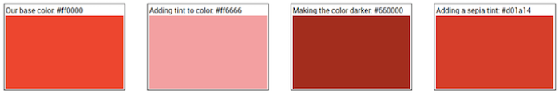

这样做的好处是简单，它允许我们减少需要默认分配的基础颜色的数量；剩下的颜色可以在前面创建的颜色的基础之上自动创建。如果我们需要改变某一种基础颜色，那么任何动态创建的颜色都可以继续工作。

幸好，我们可以在PostCSS中达到同样的效果，我们需要使用`postcss-color-function`插件，地址：https://github.com/postcss/postcss-color-function。我们还可以使用`css-color-converter`插件，来帮助管理不同颜色格式之间的转换。

我们用一个简单的案例来看一下：

第一步：我们先从下载的代码附件中，找到`Tutorial25`文件夹，复制到我们的项目文件中。

第二步：如果项目已经有一个`package.json`文件，或者`gulpfile.js`文件，删除；然后把从`Tutorial25`文件夹中复制对应的文件放过来。

第三步：有了正确的配置文件之后，我们还需要安装插件——启动一个Node.js窗口，然后把工作路径切到我们的项目中。

第四步：在命令行窗口中，输入以下命令，然后回车：

    npm install postcss-color-function --save-dev
    npm install css-color-converter --save-dev

第五步：在这里，我们可以直接编译我们的样式表了——找到`css - completed version`文件夹中的`styles-pre-compile.css`文件，保存到我们项目的`src`文件夹中，重命名为`style.css`。

第六步：切换到前面的Node.js窗口中，输入`gulp`，然后回车。

第七步：如果一切顺利，我们应该可以看到编译后的样式表出现（包括未压缩版和压缩版），以及`dest`文件夹中的资源映射文件。复制这个文件夹的内容到`Tutorial25`文件夹中的`css`文件夹中。

在浏览器中预览一下结果，如果编译成功，我们可以看到四个盒子，带不同深浅的红色，和这个练习最开始的图片一样。问题是，我们现在看到结果了，那PostCSS究竟是如何创建这些颜色的呢？

### 来解析一下案例

这是一个好问题，转换的过程非常简单。诀窍是，不在编译，而是在如何实现颜色。奇怪的是，选择颜色并不是看起来那么容易。我解释一下：

编译的过程是，和其它PostCSS插件一样，非常简单——首先创建一个变量，定义`color-function`插件：

    var colorfunction = require('postcss-color-function');

接下来，添加一个引用到我们主要的`gulp`任务，这里我们使用了`autoprefixer`和`color-function`插件，但是前者并不是严格意义上需要的，因为我们没有添加任何前缀：

    gulp.task('autoprefixer', function() {
	    return gulp.src('src/*.css')
		    .pipe(postcss([ autoprefixer, colorfunction() ]))
		    .pipe(gulp.dest('dest/'));
    });

真正神奇的地方，在于我们样式表中指定的颜色，第一个盒子是一个控制器，定义了标准的红色：

    #box0 {
    	background-color: #ff0000;
    }

接下来，我们向`box1`添加`60%`的浅色，把它变成亮粉色：

    #box1 {
    	background-color: color(red tint(60%));
    }

`box2`则往另一个方向，尽管我们已经使用了一个`lightness`滤镜（你可能觉得看到的应该是类似于`box1`的效果），但是负值使得它变成了暗红色：

    #box2 {
    	background-color: color(red lightness(-20%));
    }

最后一个盒子，`box3`，继续`box2`的棕色主题，但是更亮一点。注意，在评论，这个阴影是我们应用了sepia tone生成的：

    #box3 {
    	background-color: sepia(red, 0.7);
    }

问题是，我们如何知道它是否确实应用了sepia滤镜？

表面上看，像我们选择的红色，通过改变每个通道的一个特定值来得到最后的结果。

使用这个插件的一个缺点是，它没有可以支持所有等效CSS3滤镜的函数；它意味着我们必须纠结更多来计算直接应用的颜色应该是多少。我们在下一个案例中改变这一点——因为有时候我们需要创建自定义滤镜；一个很好的例子是`sepia`。但是它也意味着更多的前期工作，但是这样我们可以至二级调用`sepia()`函数，而不是拿到近似的最终结果。

如果你很难确定一个颜色是否应用了某个滤镜，看一下http://jackiebalzer.com/color；这是一个很棒的网站，允许我们需选择一种颜色，看看它应用了滤镜之后的结果。这是为Sass写的，但是最终的结果可以拿来在PostCSS中使用。还有如ColorHexa.com（http://www.colorhexa.com）这样的网站，可以提供很多帮助，我们可以使用它来验证是否应用了滤镜。

好了，我们在练习中发现，`postcss-color-function`插件并没有覆盖所有的CSS3滤镜；比如`sepia`，我们必须指定一个计算过后的颜色值，而不是直接应用滤镜。我们现在来解决这个问题。在案例开始前需要一写前期工作，创建自己的自定义函数。也就是说，如果我们需要一个`sepia`效果，那么我们就直接调用`sepia()`，而不是去计算最后的颜色值应该是多少。

### 使用PostCSS滤镜创建颜色

在前面的案例中，我们看了一些以编程方式改变颜色的方法——这是已经存在大多数CSS处理器中（如Sass和LESS）有一段时间了。

在可能的情况下，我们需要更精细地控制颜色的变化，而仅仅使用现有`postcss-color-function`插件提供的函数，还不够，还有些滤镜没有办法用。如果我们想要，可以创建自己的颜色函数；为此，可以使用`postcss-function`插件，地址：https://github.com/andyjansson/postcss-functions，在我们的任务文件中使用更多的JavaScript函数。

不过，值得注意的是，如果是不存在的CSS3滤镜，大多数可以用不同计算的结果来创建（如前面案例中的`sepia`）。这可能技术上是可行的，但是直接通过名字引用`sepia`滤镜更容易，`#box3`同样有`sepia`效果。

再来一个案例吧，闲话少说，这里是我们接下来要创建的案例的截图：

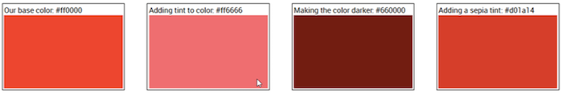

简而言之，我们使用一个标准的红色（`#ff000000`，方便大家对比），然后使用浅色、深色和`sepia`滤镜来计算出不同的颜色。

我们来看看如何创建这些颜色：

第一步：我们首先从下载的代码附件中复制`Tutorial26`文件夹，保存到我们项目文件的根目录中。

第二步：接下来，删除项目根目录中的`gulpfile.js`和`package.json`文件。

第三步：从`Tutorial26`文件夹中，复制`package.json`和`gulpfile.js`文件到我们的项目根目录中。

第四步：有了这些配置文件之后，我们还需要安装插件。在Node.js命令行窗口中，把工作路径切到我们的项目，然后输入下面的命令，回车：

    npm install postcss-functions --save-dev
    npm install css-color-converter --save-dev

第五步：从`Tutorial26`文件夹中，复制`style—pre-compile.css`到`src`文件夹中，重命名为`style.css`。

第六步：回到Node.js命令行窗口中，输入`gulp`，然后回车。

第七步：如果一切顺利，我们应该会看到一个映射文件和两份编译完成的样式出现在`dest`文件夹中，复制它们到`Tutorial26`文件夹中的`css`文件夹中。

第八步：在浏览器中跑一下这个案例。如果一切顺利，我们应该会看到四个盒子出现，带不同深浅的红色，如这个练习最开始的截图一样。

如果我们看一下`gulp`任务文件中的内容，会发现它比前面的练习要大一些，看起来我们好像做了更多工作，但实际上，很多我们在在前面的案例中已经看过了。下面我们更详细地探讨一下。

#### 研究一下这个案例细节

打开`gulp`任务文件，我们可以看到它包含了一系列函数，以及各种我们在前面的案例中用过的函数，如`lint-styles`。这个案例的关键在于三个颜色函数，以及`autoprefixer`任务的主体。

我们从`color`函数开始，使用`darkenColor`作为示例：

    function darkenColor (value, frac) {
    	var darken = 1 - parseFloat(frac);
    	var rgba = color(value).toRgbaArray();
    	var r = rgba[0] * darken;
    	var g = rgba[1] * darken;
    	var b = rgba[2] * darken;
    	return color([r,g,b]).toHexString();
    }

我们首先提取出十进制值，然后用`1`减去这个值，拿到调整值，或者说我们要把我们的颜色变暗多少的值。接下来，我们把使用的颜色（这里，红色）变为有效的RGBA值，然后分割为RGBA数组。然后我们把数组中每个值乘以`darken`值（也就是调整值），把它变成一个有效的颜色值，在把它转换为十六进制值之前。

在每个函数创建好了之后，我们就可以在`gulp`任务中引用了，如下：

    gulp.task('autoprefixer', function() {
	    return gulp.src('src/*.css')
		    .pipe(postcss([ autoprefixer, functions({
			    functions: {
				    tint: tintColor,
				    darken: darkenColor,
				    sepia: sepiaColor
			    }
			 })]))
			.pipe(gulp.dest('dest/'));
    });

所有的函数处理过程都是相似的，主要的区别在于，从`rgba[]`数组，通过添加一个浅色（`tintColor`），或一个`sepia`效果（`sepiaColor`），会产生不同的效果的计算值。

你可能会问，我们是如何计算的呢？好的，网上有大量的资源，如StackOverflow：http://stackoverflow.com/questions/6615002/given-an-rgbvalue-how-do-i-create-a-tint-or-shade。另一个值得一看的是ChrisCoyiers的CSS技巧的网站，https://css-tricks.com/snippets/javascript/lighten-darken-color/。事实上，到目前为止，我看过的最好的是CamanJS库，在http://www.camanjs.com。这个demo中的示例使用的函数是基于这个库的，http://camanjs.com/docs/filters.html。

> 一个有用的小技巧，如果你想要查看使用了特定的浅色或者阴影展示的颜色值，看一下这个网站：http://highintegritydesign.com/tools/tinter-shader/。

#### 和CSS3滤镜对比

这个时候我们可能会问“为什么我们要去创建单独的函数，我们明明直接用一个类似于`CamanJS`这样的库就可以了？”好的，我们在案例中这样做是有一些重要原因的：

- `CamanJS`确实是一个非常棒的库，能生成一些很精彩的效果，但是归根结底它是一个外部的依赖；使用有一定的风险，这个库可能以后发展会停止，会影响我们的代码。
- 使用PostCSS意味着我们可以移除外部依赖库，我们对于展示出来的效果可以进行完全的控制，而不需要依赖。如果我们使用一个类似CamanJS这样的库，那么我们可能还需要引入更多额外的不需要的包，会影响我们的代码。
- 不是所有的浏览器都支持标准CSS3滤镜——使用PostCSS给了我们一个机会来设计我们自己的滤镜，应用类似的效果。
- 我们可以使用现有的预处理器，如Sass，但是我们仍然有一个外部依赖库。使用PostCSS意味着我们可以应用相同的标准，而不需要依赖。

这里的关键就是，浏览器中滤镜的支持是非常棒的，除了IE。我们一般首先考虑使用CSS3滤镜，虽然还要为IE单独创建特定的样式表，允许我们在PostCSS中使用我们自己的版本。

### 给你的照片添加Instagram效果

使用PostCSS创建滤镜一点都不无聊，我们可以找到一些乐趣。一个快速简单的给图像应用额外的样式的方法，是使用Instagram滤镜——幸好我们有一个预构建的插件可以用。

进入`Instagram`插件，地址：https://github.com/azat-io/postcss-instagram。我们现在来创建一个简单的案例：

第一步：首先，我们从本书附带的代码中找到`Tutorial27`文件夹，保存到我们的项目文件中。

第二步：接下来，复制`gulpfile.js`和`package.json`，保存到我们的项目的根目录中。

第三步：我们现在需要安装`postcss-instagram`插件，启动一个Node.js命令行窗口，然后把工作路径切到我们的项目中。

第四步：在命令行窗口中，输入下面的命令，然后回车：

    npm install postcss-instagram --save-dev

第五步：复制`style-pre-compile.css`到我们项目根目录的`src`文件夹中，重命名为`style.css`。

第六步：插件安装完成之后，在命令行窗口中输入`gulp`，然后回车。

第七步：PostCSS将会编译我们的代码，如果一切顺利，我们会看到`dest`中生成的几份文件，复制这些文件到`Tutorial27`文件夹中的`css`文件夹中，

这里，我们在浏览器中预览一下，应该可以看到如下面截图所示的内容：

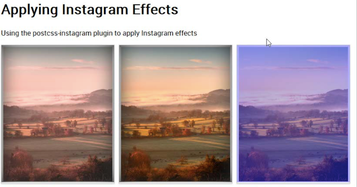

这里的关键是在main CSS样式表中，我们只是用了下面的规则，应用所需的滤镜：

这里应用了`1977`滤镜（插件中提供的一种滤镜）。如果我们看一下编译完成的代码，我们可以看到插件已经加入了一些额外的规则；创建滤镜的规则，以及将滤镜应用到图片上。

如果我们看下编译完成的代码，我们可以看到插件做的改变：

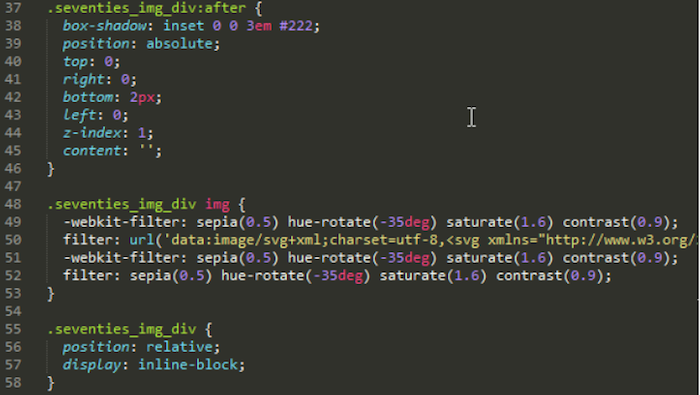

如果你真的想要深入学习，那么可以看下这个插件的源码，地址：https://github.com/azat-io/postcss-instagram/blob/master/index.js。相当复杂，深入研究一下，你会看到滤镜代码是如何应用到我们的图像的。

## 小结

管理图像和颜色可以是非常方便的，也可以是非常麻烦的，取决于这个过程是简单还是复杂。幸运的是，PostCSS可以帮助我们在相当程度地自动化这个过程，我们现在来看看这一章我们都讲了哪些内容。

我们从添加媒体资源开始，使用PostCSS来自动更新媒体链接，这有助于消除我们无意中使用错误链接的风险。

然后我们开始操作图像，我们首先创建雪碧图，使用Sass，过渡到使用PostCSS。然后更深入看了如何切换图像，我们使用了Evil Icons SVG库，设置PostCSS在编译的时候改变每个icon的颜色。然后我们学习了如何切换使用WebP图像格式；当大多数人使用标准格式图像时，我们了解了如何很方便地切换为WebP图像，在支持的浏览器中。

然后，我们注意力放到了通过使用指定调色板来操作颜色上，我们讨论了如何使用PostCSS来手动编译，可读性强的颜色名，然后在样式表中对它们进行混合或者操作。我们接下来展露了一点不同的东西，讨论了使用PostCSS应用指定的颜色滤镜，在选中了颜色之后改变色度。我们接下来探讨了使用标准插件的缺点，以及我们为什么需要创建自己的自定义滤镜，可以在编译过程中应用到代码上。然后我们快速地看了一下使用Instagram滤镜的效果，这里我们可以很容易看到我们网沾上不同滤镜放在一起操作图像的效果。

哇，我们已经讲了这么多的内容。但是，药不能停：下一章，我们来看看创建网格内容，我们可以在我们的项目中使用不同的构造布局。