# 第6章：创建网格

我们在创建基本的网站布局时，有几种不同的思路，在许多情况下，开发人员可能决定使用CSS网格。

使用CSS预处理器是一个典型例子，其中Bourbon Neat就是一个非常强大的Sass网格系统，但是需要安装Ruby。我们可以在PostCSS中通过使用可用的插件可以很容易解决这一点，而且不需要额外的依赖。在这一章中，我们来看看有什么可用的资源，通过一些例子，使用PostCSS的中一个插件创建网格。我们会在这章中讨论几个主题，包括：

- 介绍使用CSS网格的基本原则
- 探索PostCSS中提供的网格插件
- 使用Bourbon Neat一些简单的例子
- 使用PostCSS插件——PostCSS-Neat，仿制纯SCSS实例，
- 使用PostCSS-media-minmax插件添加响应能力

开始吧...!

## 网格设计的介绍

使用网格设计的原则并不新鲜，可以追溯到第二次世界大战，许多平面设计师质疑传统页面布局的设计，喜欢设计能够提供灵活的、连贯的布局系统。

同样的原则现在已经被转移到Web，从普通的HTML，到基于CSS的设计，甚至有些框架接管这方面的工作，帮助和简化整个创建。

这和如何设计无关，我们可以使用HTML和CSS，或者可能倾向于图像模板方法（使用如Photoshop这样的软件），特别是负责设计和前端的是不同的团队。

这些完全是可以接受的方法，但需要大量的手动工作——Web设计发展到现在，时间是至关重要的。我们可以使用更新的框架（如Sass，Bourbon Neat或Bootstap）来创建网格，如下面的示例所示（使用了纯Sass）：

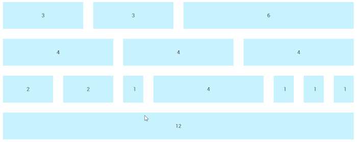

我们可以在实际中看到这种类型的布局。从本书附带下载的代码中找到`Tutorial28`文件夹，在浏览器中预览。我们会看到网格效果，这个Demo中使用的`style.css`文件是使用在线Sass生成工具——Sassmeister（http://www.sassmeister.com）创建的。

这个demo中使用的大部分代码，都是关于列宽和整个 `.wrapper` 容器；如果你看过这块代码，你应该会注意到列宽都不是静态值。有几个静态值，但是它们的大小并不是整体效果的关键。

这个demo的关键在于这块CSS样式：

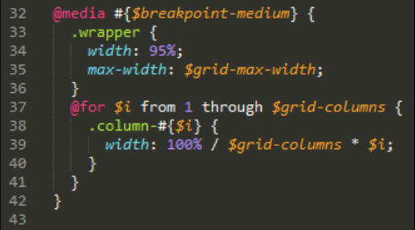

在这里，我们使用了Sass的插值，首先建立了媒体查询（构建响应式），其次是一系列网格的样式。编译后的样式会应用到每一个网格上：

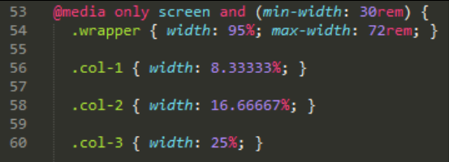

这是简单的按照网格数量匹配样式。如果想要改变宽度，只需要简单地增加列数，在这里写的声明将会在下一次编译的时候自动计算出一组新的值。

好，在闲聊了这么多之后，我们是时候看一下demo了。在这一章中，在换成使用PostCSS插件之前，我们将通过一些使用Sass创建的基本例子，过渡到使用Bourbon Neat。我们开始吧，首先使用Sass来自动化编译。

### 自动化编译过程

“安装Sass？”这本书是关于PostCSS的，我们为什么要讨论Sass呢？

这是一个好问题，我解释一下：

当我们安装Sass的时候，我们不需要按标准方法来安装；相反，我们可以使用`gulp-sass`插件。这允许我们转换到使用gulp；这是使用PostCSS插件的第一步。使用gulp文件提供了一个方便的框架，当我们要过渡到使用PostCSS时，可以很方便添加或者移除相应组件。

在第12章，混合预处理器中，我们会看到PostCSS如何与其它预处理器一起工作，使用一致的方法来编译代码。

所以，闲话少说，在工作之前，我们先安装`gulp-sass`插件：

第一步：我们先启动一个Node.js命令行窗口，然后把工作路径切换到我们的项目。

第二步：在命令行窗口中，输入下面的命令，然后回车：

	npm install gulp-sass --save-dev

不要关闭窗口，后面还会用到。

第三步：Node会自动安装`gulp-sass`；在安装完成之后，它会自己返回到命令行。

第四步：插件安装好之后，现在需要编译我们的代码了，复制`Tutorial29`文件夹到我们的项目中。

第五步：复制`sass–pre-compile`文件夹的内容到项目的根目录下`src`文件夹中。

第六步：需要从`Tutorial29`文件夹中复制`gulpfile.js`和`package.json`文件到我们项目的根目录中。

第七步：回到前面打开的Node.js命令行窗口中，输入`gulp`并回车。

第八步：文件将进行编译，编译完成之后，将它们复制到`Tutorial29`文件夹中的`css`文件夹中。

第九步：尝试在浏览器中预览结果，如果一切顺利，我们应该会看到下图所示的效果：

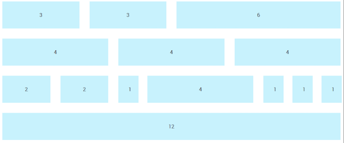

Right, we now have automatic support for compiling in place; "What next?" I hear you ask. We're one step closer, in that our code can now be compiled automatically:

没错，我们现在支持自动编译了。我想你会问：“下一步呢？”相比之前，我们更进了一步，我们的代码已经可以自动编译了：

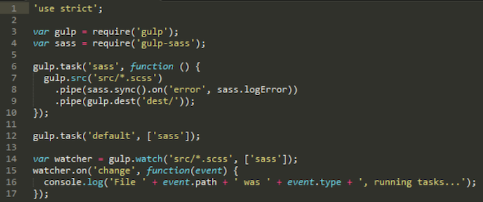

然而，还是需要手动构建我们的网格。我们现在就是要改变这一点，有几个可用的框架。但在我看来，最干净的是Sass的Bourbon Neat。我们将使用它作为我们下一步的练习，在过渡之前先使用这个框架的PostCSS版本。

### 为Bourbon Neat添加支持

在外行人眼中，Sass版网格功能是由Bourbon Neat另外提供的（地址：http://neat.bourbon.io/）。我们接下来练习的目的就要使用这个框架的Node版本——这需要安装两个东西，我们下面来安装：

第一步：如果你还没有关掉上一个demo的Node.js命令行窗口，就可以直接用。如果关掉了，就重启一个，切换工作路径到当前项目下。

第二步：在命令行窗口中，依次输入下面两行命令，每一行输入完都回车：

	npm install node-bourbon --save-dev
	npm install node-neat --save-dev

第三步：如果看到如下的截图，表示两个插件都已经安装成功了：

第四步：现在插件已经安装好了，我们需要改一下`gulp`文件，打开`gulpfile.js`文件并在第五行加上下面这行代码：

	var neat = require('node-neat').includePaths;

第五步：接着，在第7行输入如下的代码：

	var paths = {
		scss: 'src/*.scss'
	};

第六步：初始的Sass任务会被下面的这个新任务代替：

	gulp.task('styles', function () {
		return gulp.src(paths.scss)
			.pipe(sass({
				includePaths: require('node-neat').includePaths
			}))
			.pipe(gulp.dest('dest/'));
	});

第七步：默认任务中对Sass的引用现在是不正确的，将其改为：`gulp.task('default', ['styles']);`

第八步：最后，修改下面这行：

	var watcher = gulp.watch('src/*.scss', ['styles']);

第九步：现在我们准备测试编译过程了，从随书下载的代码中复制`style–pre-compile.scss`文件，并保存到`src`文件夹中。

第十步：在这里，我们可以在命令行窗口中执行`gulp`。如果一切顺利，我们会在`dest`文件夹中得到一个`style.css`文件。打开它，我们会看到编译完成的样式，如下所示，证明Neat已经正确安装并且可以工作：

	@media only screen and (min-width: 30rem) {
		.wrapper {
			width: 95%;
			max-width: 72rem; }
		.col-1 {
			width: 8.33333%; }

在这一点上，我们现在有一个可工作的自动编译过程，我们接下来要创建一个网站。现在，不要纠结编译后的`test.css`文件中的单独的样式，我们会在接下来几页更详细地介绍这一块。我们可以实践新的编译过程，然后实现一个工作案例，这样我们可以在实践中看到网格的原理~

## 使用Bourbon Neat创建一个实例

使用Bourbon Neat创建一个网站是一个简单的过程，它不需要任何特殊的标签，重点在编译之后的样式表中。

为了证明这一点，我们将构建一个简单的Web页面，可以很简单地成为任何网站的一部分——我已经在页面使用了一个Japanese主题作为基础，但是我们使用的原则可以应用于其他任何的网站。你会看到（除了使用标准Sass的）只有三个实例，我们使用了Bourbon Neat——特定的代码。

下面开始吧：

第一步：从这本书附带下载的代码中，复制一份`Tutorial30`文件夹，保存到我们项目的根目录中。

第二步：复制`Tutorial30`文件夹中的`sample site – pre-compile`的内容，到我们项目的`src`文件夹中，重命名为`sample.scss`。

第三步：接下来，启动一个Node.js命令行窗口，然后把工作路径切换到我们的项目下。

第四步：在命令行窗口中，输入`gulp`，然后回车。Node.js将会编译代码，如果一切顺利，我们会在`dest`文件夹中看到两份编译完成的样式表和一份资源映射文件。

第五步：复制`dest`文件夹中的内容到`Tutorial30`文件夹的根目录中的`css`文件夹中。

如果我们在浏览器中预览它，会看到一个已经应用了样式的页面，包括我们的Japanese主题：

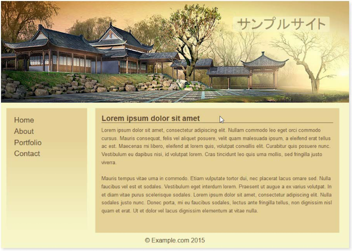

这个demo覆盖了几个关键点和有用的技巧，我们接下来深入地了解一下。

### 深入了解我们的demo

在这里，首先令人惊讶的一点是，我们的第一个关键点是：和Sass甚至Bourbon Neat都没有直接关系，是配色方案。

“为什么”，你一定想这么问，“我们讨论的是配色方案吗？”这里有一个充分的理由，我们已经使用了变量来引用我们的颜色，同样也可以使用Sass函数来创建颜色值。我们在《第五章：管理颜色、图像和字体》中已经讲了，使用`postcss-color-function`插件来创建这些值；我们会在这一章的后面再次使用它。

真正的第一个技巧是，使用一个漂亮的小程序，作者是Lokesh Dhakar，名字为Color Thief（地址为：http://lokeshdhakar.com/projects/color-thief/）。我们可以直接地拖拽我们网站的主要图片进来，然后得到一个完整的合适的配色样本：

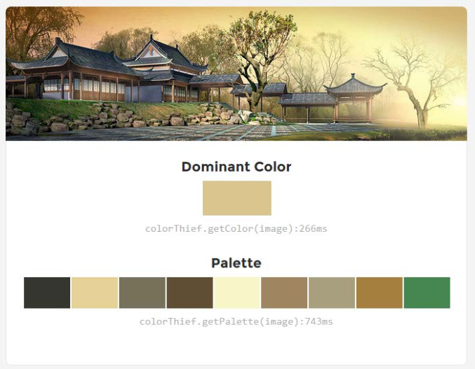

唯一的缺点是它没有提供颜色值；但我们可以从页面的源代码中拿到。

> 如果你比较喜欢使用RGB(A)色值，那么你可以看下Color Hexa这个网站（地址：http://colorhexa.com）。

我们Demo的关键在第33、63、69行，这些是Bourbon Neat mixins控制了外层的容器的样式（第33行）：

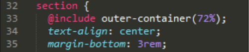

They also control the format of each of the two content areas within (lines 63 and 69):

它们还控制里面两块主要内容的样式（第63、69行）：

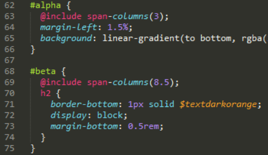

在编译时，`outer-container`混合宏给`.wrapper`类添加了一个`max-width: 72%;`，控制了主要的样式，`span-columns()`混合宏添加了`float`、`display`、`width`、`margin-right`属性，如下：

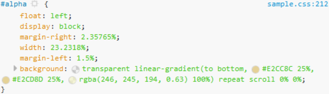

除了`outer-container()`和`span-columns()`混合宏，Demo尽可能地使用了百分比，并指定了`rem`或者`px`值，当页面resize时，这些元素可以保持一个有凝聚力的设计。

然而，在这一章后面还有一些提升，提高Demo的响应式能力。现在，我们继续我们的过渡过程，把PostCSS插件引入到我们的过程。

## 探索PostCSS中的网格插件

这一章我们已经使用了Sass和Bourbon Neat来生成网格。这是一个正确有效的选择，但是并不是唯一的选择。我们可能更想用一些类似于Bootstrap或Semantic网格系统。我们最终选择使用哪个网格系统，还是根据我们的喜好和需求。

直到现在，我们一直都是使用Neat。这主要是因为熟悉和易用性。终有一天，当我们需要过渡到使用PostCSS，最好是可以有一个专用的插件来让我们在PostCSS中使用Neat，地址：https://github.com/jo-asakura/postcss-neat。这不是唯一可供PostCSS使用的网格系统插件，所以我们看下其它我们可以使用的插件。

- `Grid`：地址https://github.com/andyjansson/postcssgrid，这个插件分割了一些PostCSS和样式表之间的配置，有助于简化列格式的配置。
- `Lost`：地址为https://github.com/corysimmons/lost，它自称是网格系统的Autoprefixer。它提供了大多数预处理器的支持，如Less、SASS和Stylus。
- `Simple-grid`：地址https://github.com/admdh/postcss-simple-grid，这个插件用的是不同的思路：所有的配置在CSS中完成，而不是在task配置中。

闲话少说，是时候开始做转换了。我们从安装插件以及配置使用开始。

## 过渡到使用PostCSS-Neat

过渡到使用PostCSS是相对简单的。当然，我们需要更新我们的编译过程，移除Sass的链接，引入我们的PostCSS插件。

> 转换的过程我们在这里和接下来的两节完成。

从改变CSS的角度而言，这其实是有点复杂的，因为我们必须计算出每个网格块需要多少列。幸运的是，我们这里的实例是相对简单的，因为我们给原来的块编号配置了正确的列数，所以我们可以使用它作为基础来改变我们的CSS。

我们首先来更新我们的编译过程：

第一步：我们首先从随书下载的代码中复制`Tutorial31`文件夹，保存到我们项目的根目录中。

第二步：在`Tutorial31`文件夹中，复制`package.json`和`gulpfile.js`文件，保存到我们项目的根目录中。

第三步：接下来，我们需要安装`postcss-neat`插件。为此，启动一个Node.js命令行窗口，然后把工作路径切换到我们的项目中。

第四步：在命令行中，输入如下的命令，然后回车：

	npm install postcss-neat --save-dev

第五步：Node会安装好我们需要的插件，当看到如下的信息，表示我们的插件已经安装完成：

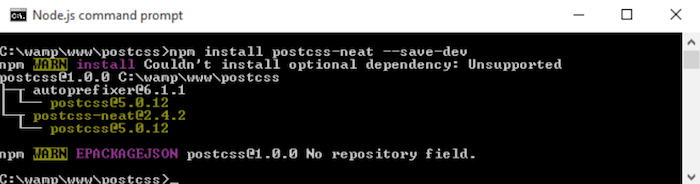

我们现在已经安装好了插件并配置使用。我们再创建一个测试来确认它能否工作之前，我们先快速看一下在项目根目录中的`gulp`文件。

如果你期待的是一个复杂的配置，可能会让你失望了——甚至比它们的网站上提供的方法安装Bourbon Neat还容易。我们的`gulp`文件在开始的时候包含了每个必要的变量，用于调用每个插件，在文件的末尾有个`watch`任务。我们感兴趣的部分是：

	gulp.task('neat', function () {
		var processors = [
		require('autoprefixer-core')({ browsers: ['last 1 version']
		}),
		require('postcss-neat')(/* { options } */)
		];
	return gulp.src('src/*.css')
		.pipe(require('gulp-postcss')(processors))
		.pipe(gulp.dest('dest/'));	
	});

这个设置应该满足了大多数情况，默认`12`列。如果需要重写，我们可以通过在我们的配置对象中指定适当的选择：

	postcss([
		...
		require('postcss-neat')({
		neatMaxWidth: '128em'
		})
		...
	])

当我们创建测试实例时，我们将在这章中的**测试我们的配置一节**使用这个选项。

> 完整的可修改的属性列表，可以在这里查看：https://github.com/jo-asakura/postcssneat#custom-settings

现在我们已经有了基本的配置，但是...它看起来还没有噢。机智的你应该注意到了，我们已经引入了前面练习的`gulp`文件中的选项，如创建资源映射、压缩CSS文件。我们现在解决这个问题，通过修改我们的`gulp`文件来引入这些选项。一切就位之后，我们开始创建实例网站了。

### 完善我们的任务列表

我们的`gulp`文件，目前是完全可用的，但是并不是非常好用 —— 我们前面练习中有的几个任务，这里并没有。

比如资源映射，那么在压缩代码方面呢？我们花点时间来完善我们的任务列表，然后添加那些遗漏的任务：

第一步：第一个任务是加入一些变量，作为我们要使用的不同插件的引用。`gulp`文件顶部的`var`声明：

	var cssnano = require('cssnano');
	var sourcemaps = require('gulp-sourcemaps');
	var rename = require('gulp-rename');
	var stylelint = require('stylelint');
	var reporter = require('postcss-reporter');

第二步：添加的第一个任务是检查我们的样式：

	gulp.task("lint-styles", ['neat'], function() {
		return gulp.src("dest/css/*.css")
			.pipe(postcss([ stylelint({
				"rules": {
					"color-no-invalid-hex": 2,
					"declaration-colon-space-before": [2, "never"],
					"indentation": [2, 2],
					"number-leading-zero": [2, "always"]
				}
			}),
			reporter({
				clearMessages: true,
			})
		]))
	});

第三步：检查完样式的准确性和一致性之后，我们现在可以压缩代码了。添加以下的内容：

	gulp.task('rename', ['lint-styles'], function () {
		return gulp.src('dest/css/*.css')
			.pipe(postcss([ cssnano() ]))
			.pipe(rename('style.css'))
			.pipe(gulp.dest("dest/css"));
	});

第四步：下一步是添加一个资源映射选项：

	gulp.task('sourcemap', ['rename'], function () {
		return gulp.src('dest/css/*.css')
			.pipe(sourcemaps.init())
			.pipe(sourcemaps.write('maps/'))
			.pipe(gulp.dest("dest/css"));
	});

第五步：增加了这些内容到`gulp`文件，我们需要调整一下`default`任务，来调用这些新增的任务：

	gulp.task('default', ['neat', 'lint-styles', 'rename', 'sourcemap']);

第六步：我们没有对应的`watch`任务，它就无法知道这些额外的任务。我们现在把它们加上：

	var watcher = gulp.watch('src/*.css', ['default', 'lintstyles', 'rename', 'sourcemap']);

我们现在有一个可工作`gulp`文件，引入了我们练习中需要的所有配置任务。我们把它放到测试环境中，通过编译一些简单的代码示例，确认它们是否如预期运行。

### 测试我们的配置

我们过程的一个关键部分是测试`gulp`文件，确保它能够工作。不仅是能够跑所有需要的任务，还要按照正确的顺序，并生成预期的结果。尽管我们已经重用了`gulp`文件中已有的代码，我们还做了一些主要的改变，我们花了点时间使用了我们前面Demo中的代码测试了它能否工作。

为了让Demo在PostCSS中工作，我们需要对代码做出一些调整：

第一步：我们先保存`style.scss`（从`Tutorial31`文件夹中的`css`文件夹复制）为一个纯CSS文件，而不是一个Sass样式表，我们在上一个Demo中已经不使用Sass，所以使用`.scss`后缀变得冗余了。

第二步：接下来，我们在前面的Demo中使用`.wrapper`类。这需要改为：

	.wrapper {
		@neat-outer-container;
		margin: 0 auto;
	}

第三步：我们的`col-*`类规则也需要修改。相对于前面的Demo中使用的静态百分比值，我们用下面的值：

	.col-1 { @neat-span-columns 1; }
	.col-2 { @neat-span-columns 2; }
	.col-3 { @neat-span-columns 3; }
	.col-4 { @neat-span-columns 4; }
	.col-5 { @neat-span-columns 5; }
	.col-6 { @neat-span-columns 6; }
	.col-7 { @neat-span-columns 7; }
	.col-8 { @neat-span-columns 8; }
	.col-9 { @neat-span-columns 9; }
	.col-10 { @neat-span-columns 10;}
	.col-11 { @neat-span-columns 11; }
	.col-12 { @neat-span-columns 12; }

第四步：我们的代码已经准备好了，现在复制`style.css`文件到我们项目根目录中的`src`文件夹中。

第五步：接下来，启动一个Node.js命令行窗口，然后把工作路径切换到我们的项目中。

第六步：在命令行窗口中，输入`gulp`然后回车。

第七步：如果一切顺利，我们应该会看到一个编译完成的`style.css`文件出现在`dest`文件夹中。如果我们打开这个文件，我们应该会看到一系列针对每一列的样式块，如下面的截图所示：

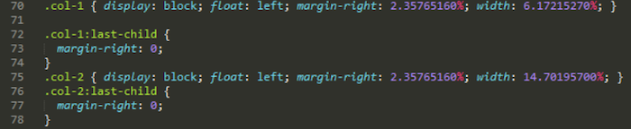

第八步：如果我们在浏览器中预览这个Demo，我们应该会看到类似于下面这张截图的内容。注意它和原始版本是相似的，也就是我们在Sass中创建的：

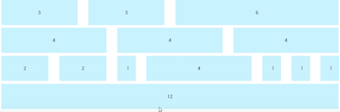

创建的Demo和原始版本几乎是相同的。这证明了它是可以工作的，我们可以将它应用于我们的网站。我们对代码的修改非常简单，添加了一个`@neat-outer-container`来定义我们的网站宽度，其次是`@neatspan-columns`的多个实例，定义每个元素应该占多少列。

让我们把这些新知识应用到构建更有用的东西上，在有内容的示例站点。我们将重用这一章前面的示例站点，并转换为使用PostCSS插件来完成。

## 使用Neat和PostCSS来创建一个站点

还记得我们使用Japanese主题的Demo吗，在“使用Bourbon Neat创建一个实例”一节中。这是一个简单的Demo，使用Bourbon Neat来帮助创建网格。当然，缺点在于依赖Sass。

我们可以解决这个问题：PostCSS有一个可用的插件，模拟Bourbon Neat，但是它完全使用JavaScript编写的，所以没有依赖Sass。安装和使用非常简单，在接下来的几页，我们将通过一些修改来转换到使用这个插件。

首先，我们设置一些内容：

第一步：我们首先从随书下载的代码中复制一份`Tutorial32`文件夹，并保存到我们项目的根目录中。

第二步：复制`sample pre-compile.css`文件到我们项目根目录的`src`文件夹中。

第三步：复制`gulpfile.js`、`samplesite.html`和`package.json`文件到我们项目的根目录。替换当前文件夹中已存在的文件。

第四步：接下来，我们需要安装两个插件，尽管我们已经在这本书的前面讨论了使用`postcss-css-varialbes`，确保它们安装并在`package.json`中添加了正确的引用。启动一个Node.js命令行窗口，然后把工作目录切换到我们的项目。

第五步：在命令行窗口中，依次输入以下两行命令，回车：

	npm install postcss-css-variables --save-dev
	npm install postcss-nested

第六步：在两个插件都安装完成之后，输入`gulp`，然后回车，编译我们的样式表。

第七步：如果一切顺利，我们应该会看到两个样式表和一个资源映射文件出现在`dest`文件夹中。复制这三份文件到我们项目根目录中的`css`文件夹中。

第八步：如果我们打开`samplesite.html`的副本，我们会看到我们的Demo和之前一样，只是这次我们没有依赖Sass：

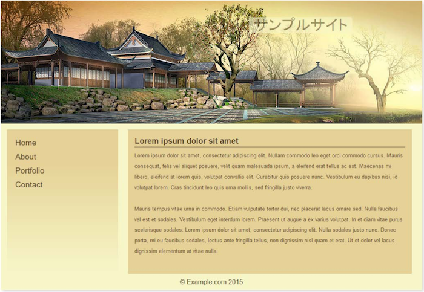

你有注意到这个Demo和之前Sass版本的差异吗？应该没有吧。虽然它可能不是和原始像素相同，也差不多了。但是，它确实表明了一点独创性，我们共度到使用PostCSS，并保持相同的结果是可以的。它需要修改我们的代码和过程，让我们更详细地看一看，从样式表开始。

### 转换成PostCSS

首先需要修改`gulp`任务文件和样式表。这些改变的不是页面样式，而是相对原始Demo保持相同的主题。修改样式表的关键在于：

我们引入的`_reset.scss`部分样式表不会再工作，因为我们要移除Sass的依赖。为了维持这些样式的使用，使用Sassmeister（地址：http://www.sassmeister.com）在线编译器创建了编译后的版本。我们可以在标签页面中链接到它。

如果你看一眼`sample.css`的源代码，你会看到一个文件顶部的`:root`模块，它取代了我们之前使用的`import`声明。这一块可以用来存储任何要使用的变量，我们会在后面讨论修改`gulp`任务文件中更详细地介绍。

我们不再需要下面这三行声明，它们是用于Sass版本Bourbon Neat的debug，后面会移除：

	$visual-grid: true;
	$visual-grid-color: #E6F6FF;
	$visual-grid-opacity: 0.4;

我们使用PostCSS替换所有变量声明。Sass版本可以使用搜索和替换来修改，从`$...` 到`var(--...)`，`...`表示变量名。

我们的原始代码中有一些`Bourbon` mixins的引用，需要更新。我们使用了一些搜索和替换规则，这次修改`@include outer…`为`@neat-outer…`

为简单起见，我们手动计算引用了`$body-line-height`的地方，并替换计算结果。我们可以一直使用计算后的结果，但是它需要使用另一个插件，在我们的代码中已经过度使用的。

我们还需要调整页面主要模块的宽度；这有点奇怪，但需要确保我们有两块内容并排，而不是一个覆盖另一个。

除了修改样式表，我们还需要修改`gulp`任务文件。主要是修改主要的编译任务，添加额外的任务来管理生产和压缩我们的资源文件：

我们添加了前面demo中提到的`rename`，`lint-styles`，和`sourcemap`任务。这些已经工作的很好了，不需要修改。

我们删除了原来的`styles`任务，并替换为：

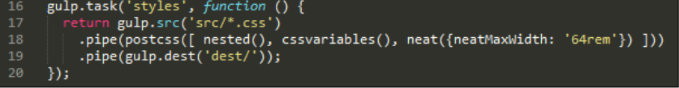

这次，我们命名为`nested()`，`cssvariables()`和Neat插件。这些被引用的变量，在我们`gulp`文件的顶部被添加。

我们最后一步修改是在`gulp`文件的末尾处，这里我们需要调整`default`和`watcher`任务，因为我们引入了额外的任务。

在这个阶段，我们有可以用的Demo吗？嗯，但是如果尝试调整页面尺寸：

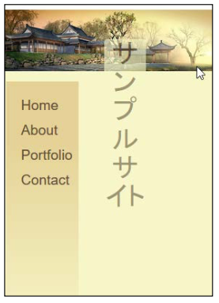

嗯，我们的内容怎么了？看起来好像不太好，是吧？我们可以很简单地修复好它，它只是需要额外引入一些媒体查询，来重新指定我们的内容应该在屏幕上如何显示。我们下面来一探究竟，看看如何在小尺寸上使得我们的Demo更好看。

## 添加响应式能力

尽管Bourbon给我们的代码加上了一定程度的响应式，它还是不足以满足我们的需求。如果我们尝试调整Demo页面的尺寸，它马上就会变得乱七八糟，跟我们想的不一样。

最快的来看出在小屏设备上页面如何的方法，是使用Google Chrome浏览器，按*Shift + Ctrl + I*打开开发者面板：

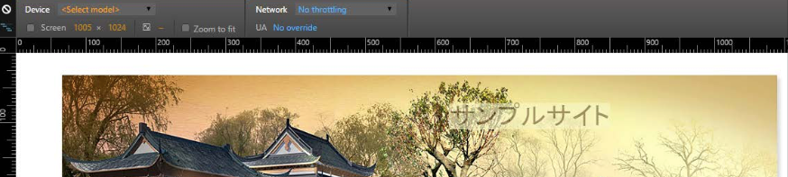

这个设计适用于`1280px x 1024px`的尺寸，但是如果我们把它放到大小为`375px x 627px`的苹果6上，马上又变了:

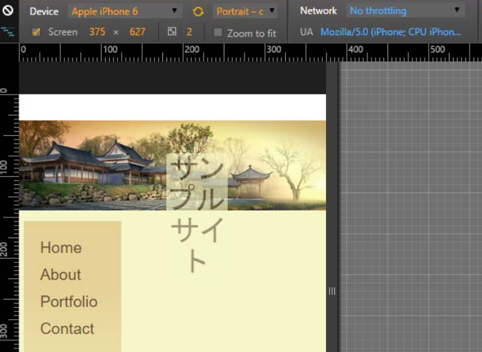

明白我的意思了吗？它看起来问题很大，是吧？幸运的是，我们可以是使用PostCSS来解决这个问题，所以我们接着一探究竟，看看有什么好方法。

### 纠正设计稿

要让我们的设计在小屏幕，如iPhone上也看起来正常，在PostCSS中我们可以是使用`postcss-media-minmax`插件，地址为https://github.com/postcss/postcss-media-minmax。

“PostCSS能怎么帮助我们呢？”你应该有这个疑问。很简单，很多人在处理媒体查询的时候重点在于设置断点，或者在某些特定的尺寸上修改设计。`postcss-media-minmax`插件可以使得文本更有可读性；毕竟，如果一个设计作品在尺寸大于或等于一个数量时是可行的，为什么代码不行呢？

明白了我的意思后，我们来看看如何修改代码吧。为简单起见，我们把注意力集中到如何在iPhone6上重置我们的内容，即使用`375px x 627px`作为我们的断点（使用Google Chrome的响应式设计视图）。我们从上一个Demo继续往下：

第一步：首先我们要安装`postcss-media-minmax`插件。启动一个Node.js命令行窗口，并输入如下的命令，回车：

	npm install postcss-media-minmax --save-dev

第二步：接下来，打开我们项目的`src`文件夹中的`sample.css`文件的副本。我们首先添加媒体查询，调整并获取正确的断点：

	/* media queries */
	@media screen and (width >= 370px) and (width <= 630px) {
	
	}

第三步：在查询中，添加如下规则。设置最小宽度为`375px`：

    body {
	    min-width: 375px;
    }

第四步：标题图像文本需要调整大小，以适应更小的空间，我们需要把它变小，并往左移一点点：

	header {
		width: 50%;
		font-size: 2rem;
		margin-left: 45%;
	}

第五步：`#alpha`内容（或菜单）会自动调整自身，但是主要内容区域(`#beta`)还是太宽了，我们调整大小来适应。我们的区域不能容下所有的文本，所以我们添加了一个`overflow`属性，隐藏超出可视区域的文本。

	#beta {
		margin-right: 2.35765160%;
		width: 55.1748%;
		overflow: auto;
	}

第六步：在这里，我们需要安装`postcss-media-minmax`插件。启动一个Node.js命令行窗口，把工作目录切换到我们的项目中。

第七步：在命令行窗口中，输入如下的命令，然后回车：

	npm install postcss-media-minmax --save-dev

第八步：在插件安装完成之后，输入`gulp`，并回车：

第九步：PostCSS会编译我们的代码，如果一切顺利，我们会看到更新的样式表以及资源映射文件出现在`dest`文件夹中。

第十步：复制这三份文件到`Tutorial32`文件夹中的`css`文件夹中，然后尝试在浏览器中预览结果。

如果一切顺利，我们应该会看到如下面截图所示，开启Chrome的响应式视图。并切换设备为苹果6：

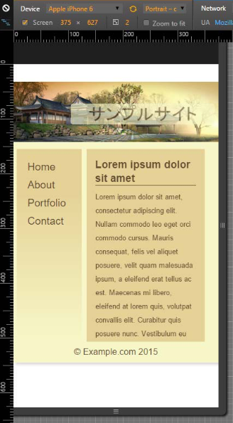

我们在代码中做的修改其实非常简单，仅对iPhone有支持。这只是冰山一角，我们还有更多可以做的。

例如，不要使用`mix-width`属性指定一个确切的宽度值（或`#beta`的宽度），我们可以考虑使用`@neat-spancolumns`来为我们提供这个值。当然，我们不可以只用一个媒体查询，我们需要用足够的媒体查询来确保所有设备都可以显示正常。

这并不意味着我们需要去一个设备就对应一个媒体查询。经过仔细设计，我们可以设置几个设备。不过，道理都是一样的，所以相比标准的冒号符号，我们可以使用更容易理解的`>=`和`<=`符号，来更方便地定义媒体查询的断点，在PostCSS中使用媒体查询时。

## 小结

对于很多开发人员和设计师，使用基于网格的响应式是他们工作中很重要的一部分。许多人对Bootstrap或Bourbon Neat比较熟悉，我们可以很容易地在PostCSS复制相同的功能。接下来我们花点时间来回顾一下这章中，我们讨论的内容。

最开始我们对基于网格开发做了简单的介绍，在介绍如何过渡到使用PostCSS之前。我们首先看了切换到使用Gulp来完成自动化编译过程。

接下来，我们看了如何从使用基于纯SASS的网格系统——Bourbon Neat切入，我们讲了如何在Bourbon中最简单快速地构建网格系统。

然后，我们开始探索PostCSS中可以使用的插件，在过渡到使用`postcss-neat`插件之前。我们接下来探索了完善Gulp任务的过程其实不难，早些时候我们在这本书中介绍了，添加我们需要的任务，来创建一个更紧密的代表实际开发的过程。为确保这个过程可以工作，我们使用Bourbon Neat中的原始demo进行了改变，在转换到Japanese主题demo之前，使用PostCSS等价的插件。然后我们简单介绍了在设计中改进响应式能力，确保它能在更小的设备上正常显示。

噢，它看起来可能不是很多，但我们确实讲了很多页。一如既往，我们接着往下讲，在下一章，我们会讲到动画（这是个双关语），看一下PostCSS如何添加动画内容。