# 第7章：动画元素

问题：如果有三种网站风格给你选择：一是静态的，二是动画效果做得很差的，三是使用了动画增加了一些微妙精细地效果，你会选择哪个？好吧，结果显而易见应该是第三个：动画如果做得好，可以让一个网站脱颖而出，但如果做得不好就非常糟糕了。

到目前为止，我们的内容讲得都是相对静态的东西，除了使用媒体查询。是时候，来看看PostCSS如何让做动画变得更容易了。我们首先快速回顾一下基本的动画，然后从纯动画，进入到Sass，最后到达PostCSS。我们会在这一章探讨以下一系列主题，将包括：

回顾使用jQuery动画：

- 切换到基于CSS的动画
- 探讨预构建库的使用，例如`Animate.css`
- 探索在转换到使用PostCSS时可用的选项
- 使用PostCSS创建一个动画Demo
- 学习如何使用PostCSS优化动画

开始吧~！

## 回顾基本动画

在Web开发领域，动画正在迅速发展，越来越多的网站使用动画来让页面的内容更有趣。如果做得好，它们可以添加更上一层的用户体验；做得不好，那么网站将会大量流失用户。

在这一章的课程中，我们将从写标准动画开始，然后进入到使用Sass的预处理器，最后切换到使用PostCSS，在这个过程中我们需要做些什么。我不能向你保证，我们要创建复杂的基于JavaScript的Demo，如*Caaaat* 动画（*http://roxik.com/cat *，缩放浏览器的窗口试试看），但我们会看到在浏览器中创建动画时，使用PostCSS其实是非常简单的。

现在来开始我们的学习之旅，我们首先快速浏览一下传统动画 —— 这么多年来，你应该在jQuery中使用了很多次`.animate()`吧？幸好，我们现在可以用CSS3来创建简单的动画了，不需要一定使用JavaScript，但是总是有那么些时候我们不得不使用jQuery来做动画。

作为一个快速提醒，可以跑一下随书下载的代码中的`T34 – Basic animation using jQuery animate()`文件夹中的`animate.html`文件。它并不是说非常成功，但是提醒我们，在我们不知不觉中一个时代过去了：

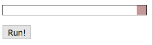

如果我们在浏览器（如Firefox）中看一看这个动画的DOM结构，应该如下面截图所示：

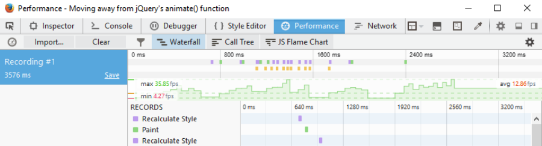

数字并不重要，关键在于两条绿色虚线，结果显示一个高度不一致的活动。这是一个很好的指标，帧数很少，导致动画有点卡顿，没有达到100%流畅。

有一件非常棒的事情，可以提供平滑动画的选项；在切换到使用PostCSS之前，先来简单看一下这些选项。现在，先从远离使用jQuery开始，看一下减少使用`.animate()`和jQuery依赖的方案。

## 摆脱jQuery

动画内容可是一个有争议的话题，特别是如果使用了jQuery或JavaScript——如果我们对100个人进行调查，询问他们使用了哪一个，我们应该会得到各种各样的答案。很多人会认为动画内容应该使用CSS来完成，而另一部分人认为基于JavaScript的方案仍有一定价值。

先不说这个，我们来纠结下一个问题，如果我们要彻底抛弃jQuery，特别是`.animate()`，那么我们应该先有一些可用的方案：

- 升级你的jQuery版本。是的！这听起来可能有点和本章主题不符，但是大多数jQuery的新版本引入了`requestAnimationFrame`，改善了性能，特别是在移动设备上。
- 一个比较快速的方法是使用`jQuery Animate Enhanced`插件，地址：*http://playground.benbarnett.net/jquery-animateenhanced/*，虽然有点旧，但它仍有用。它把`.animate()`调用，转换为等价的CSS3动画；但不是所有的动画都能转换，不能转换的仍然保留为`.animate()`调用。
- 用相同的原理，我们甚至可以利用JavaScript动画库，`GSAP`——Greensock团队制作的插件，（地址：*https://greensock.com/jquery-gsap-plugin*），把`jQuery .animate()`替换为它们自己的GSAP库。后者被认为比标准jQuery要快20倍。花一点时间，重建我们之前的代码——而不是使用`.animate()`，我们可以在样式表中添加等价的CSS3样式，把现有的`.animate()`调用适当地替换为`.removeClass()`或`.addClass()`。
- 我们可以切换到使用如`Transit`（地址：*http://ricostacruz.com/jquery.transit *）这样的库，它仍然需要使用jQuery，但是相比使用标准`.animate()`命令，性能更好。
- 另一个选择是`Velocity JS`，作者：Jonathan Shapiro，地址为*http://julian.com/research/velocity/*。优点是没有依赖jQuery。有传言说会将这个库的全部或者部分，纳入jQuery，作为`.animate()`的替换——更多详情，可以查看这里的日志：*https://github.com/jquery/jquery/issues/2053*。

很多人会理所当然地认为CSS动画的速度比JavaScript块（甚至jQuery）。毕竟，我们不需要调用外部的库（jQuery）；我们可以使用已经嵌入浏览器的样式，是吧？事实上它并不是个这么简单的理儿——也就是说，如何正确使用取决于你的需求和每个方法的局限性。例如，CSS动画对于简单的状态改变动画是非常棒的，但是如果涉及到排序，那么你可能还是使用JavaScript比较好。

然而，关键还是使用越少的方法，让每一秒有多少帧显示在屏幕上。大多数人无法辨别60FPS（帧/秒）以上——所以60以上可以生成非常平滑的体验。而任何少于25FPS的动画会产生模糊以及偶尔卡顿——这取决于我们选择的可用的最佳方法，以生成最有效的解决方案。

> 看看不同帧速率的差异，可以看下*https://framesper-second.appspot.com/*，这个页面的动画可以被控制；可以很容易看到为什么60FPS生成了更优质的体验！

所以，我们应该采取哪一种方法呢？在接下来的几页，我们会简要地看一下这些选项。在这一点上，你可能会问：“这和PostCSS有什么关系呢？这是这本书接下来的主题？”

简而言之，它们都是可用的方法，要么提高动画运行，要么允许我们删除对`.animate()`的依赖，这个我们知道不是非常高效！确实，这些方法依然在依赖jQuery，但这里的关键是你现有的代码可以使用任何或者这些方法的混合。在这一章的后面，我们会看看我们如何开始删除jQuery，并注重使用CSS3动画，使用PostCSS插件系统。

> 有一点需要注意的，接下来几页的所有Demo都是在YouTube视频在播放的时候运行的；这是为了模拟一个负载，获得一个更现实状态的比较。在负载下运行动画意味着更小的图形处理能力，也会到时较低的FPS数量。

我们来看看第一个选择，`Transit.js`库。

### 使用Transit.js制作动画

在现实世界中，我们创建的任何项目都会尽量少地使用依赖库；这同样适用于JavaScript或者基于jQuery的内容对CSS样式的操作。

要减少依赖，我们可以使用如`TransitJS`或者`Velocity`库来构建我们的动画。这里的关键是使用这些库创建的动画，作为我们应用样式的基础，使用`.addClass()`或`.removeClass()`来操作。明白我的意思了吗，我们用一个简单的demo来探索这个概念：

第一步：首先打开`animate.html`的副本——为了使其更容易，我们需要将`square-small`的引用从`class`变为选择器：

	

第二步：接下来，添加一行`Transit`库的引用，放在`</head>`之前：

	

第三步：`Transit`库使用一种稍微有点不同的语法，先更新`.animate()`的调用，如下：

	smallsquare.transition({x: 280}, 'slow');

保存文件，然后尝试在浏览器中预览结果 —— 如果一切顺利，我们应该会看到Demo中没有任何变化：

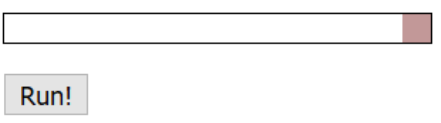

但是，动画其实明显更平滑 —— 帧数更高，在44.28FPS，停顿也更少：

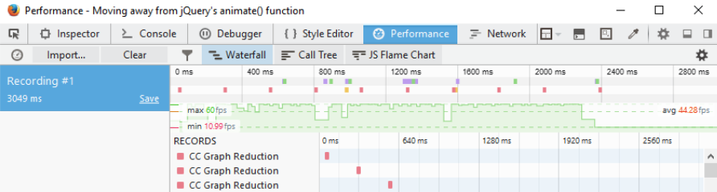

让我们来比较一下同一文件的截图，在这一章的前面的**回顾基本动画**一节，注意到了吗？

分析浏览器活动行为是很复杂的，但是这里我们只有两件事需要关心：FPS值和绿线的状态。FPS值，即帧/秒，超过三倍，有很大一部分绿线是比较一致的，更少更短的下降。

这意味着我们有一个更平稳、更一致的性能。约44FPS，平均帧速率明显比使用标准jQuery更好——但我们使用的其实还是jQuery！

这里有一个区别，尽管如`Transit`或`Velocity`这些库，尽可能将动画转换成等同的CSS3——如果我们留意一下后台，我们会看到这些不同：

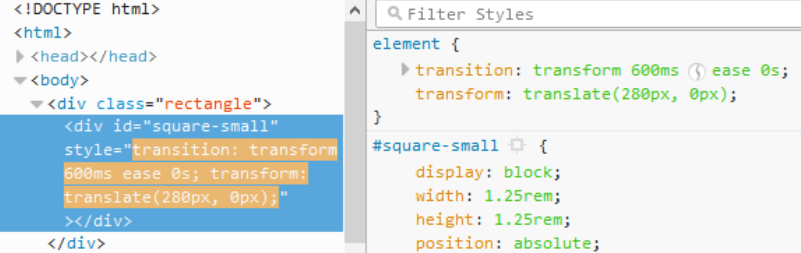

我们利用这个优势，通过删除使用`.animate()`，简单地使用`.addClass()`或`.removeClass()`——我们会在这一章的后面的**使用jQuery切换类名**一节，看到运行结果。

> 如果你想要在使用`Transit`或`Velocity`时对比我们简单的动画，下载的代码中有提供示例，分别在demos中T35A和T35B。

下一步，我们可以使用`Velocity`库来创建一个demo，使用纯JavaScript——我们会看到如何作为下一个demo的一部分。当心——虽然这不是使用JavaScript的理由；如我们所见，在帧数上会有一点不同！

### 使用纯JavaScript添加动画

很多开发人员会使用jQuery来处理动画——毕竟，可以更方便操纵页面上的元素！但是有时候，最好在原生JavaScript中操作，可能是速度的原因。如果我们只需要支持比较新的浏览器（如IE11或Edge，Chrome或Firefox的最新版本），那么添加jQuery作为依赖并不总是必要的。

使用`Transit`（或`Velocity`）这些库意味着我们不总是一定要使用jQuery来达到相同的效果；我们很快会看到，删除jQuery可以帮助改善！我们把它放到测试中，然后更新我们前面的demo：

第一步：我们首先复制一份`T35B`文件夹中的内容，保存到我们项目的根目录中。

第二步：接下来，我们需要修改`animate.html`文件，删除jQuery的引用，删除`velocity.ui.min.js`链接，`<head>`中只剩下下面这条：

		<link rel="stylesheet" type="text/css" href="css/style.css">
		
	</head>

第三步：进一步修改`

第四步：保存文件，然后在浏览器中预览结果——如果我们使用一个DOM检测器来检测性能，我们会看到如下图所示的帧速率记录：

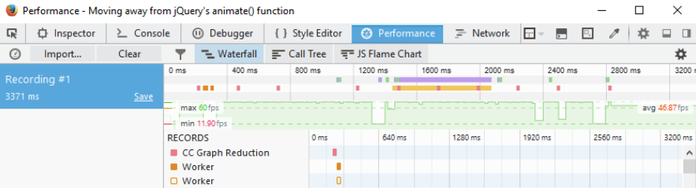

图中我们不再依赖jQuery，我们可以清楚地看到帧速率提高了；然而，一些浏览器支持还是减少了，如IE8/9.这对你的网站来说可能不是一个问题——Microsoft和jQuery Core Team已经宣布放弃对`IE8-10`和`IE8`的支持，这有助于鼓励用户升级到新的浏览器。

不过，它必须说是使用CSS3在速度上更好，并且能尽可能保持页面比较轻量级时，在你的项目中使用`Velocity`可能提供了大量额外的机遇。不过这里的关键是，允许你使用PostCSS的时候之前需要认真考虑是否确实需要它们，或者CSS3就已经足够了。

### 使用jQuery来切换class

在这一点上，想到一个问题：使用基于`class`的动画？我的本意是删除外部动画依赖库，切换到使用纯jQuery，只使用`.addClass()`和`.removeClass()`方法。

理论上讲，这听起来像一个很棒的想法——我们可以删除使用`.animate()`的需要，只需要简单地切换类，是吧？好的，这是一个进步，但仍逊色于使用纯JavaScript和切换class的结合。这应该归结到使用jQuery来引用元素，和纯JavaScript的速度之间的一个权衡：

第一步：我们将首先打开`animate.html`的副本，在`<head>`标签内将`Velocity.js`的调用更换为下面这行，：

	

第二步：接下来，删除`<script>`标签中的代码，替换为：

	var smallsquare = $('.rectangle').find('.square-small');
	$('#animation-button').on("click", function() {
		smallsquare.addClass("move");
		smallsquare.one('transitionend', function(e) {
			$('.rectangle').find('.square-small')
			.removeClass("move");
		});
	});

第三步：保存文件，如果我们在浏览器中预览，我们会看到demo几乎没有什么明显的变化，但是性能略微超过使用jQuery和Transit的结合：

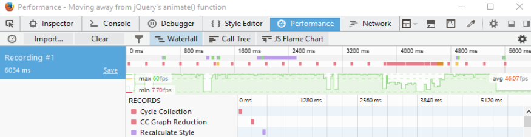

使用DOM检测器来查看，可以看到我们代码中真正的改变：

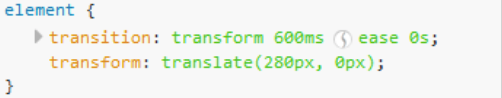

相对于使用`.animate()`，我们使用CSS3动画样式来移动我们的`
`。大多数浏览器会接受`transition`和`transform`，但是需要使用如`Autocomplete`，以确保我们在代码中应用了正确的前缀。

使用CSS3的好处在于，尽管它不适合大型、复杂的动画，我们至少可以开始结合使用外部样式表，如`Animate.css`，或者甚至使用一个预处理器，如Sass来创建样式。

这一节要改的东西其实很简单，下面我们言归正传，下一步是开始使用PostCSS，下接来看看如何使用。

> 如果你想要创建自定义`keyframe-based`动画，那么可以看下：http://cssanimate.com/，这提供了一个基于GUI的接口设计，并在请求时给出正确的代码。

## 使用pre-built库

到目前为止，我们所有的动画都有一个共同点，它们都是单独创建，然后保存在同一个样式表中。

这可以很好地运行，但是我们可以做得更好——毕竟，我们要创建的动画效果，可能别人之前已经创建过了。随着时间的推移，我们可能自己也创建了一系列动画，可以组成一个基本的库，在未来的项目中重用。

许多开发人员已经在做这项工作了。Dan Eden创建的`Animate.css`库就是一个例子。这个库值得我们去学习了解，因为我们在这本书的后面会使用这个库，PostCSS中的`postcss-animation`插件。同时，我们快速过一下这个demo是如何工作的，作为在PostCSS中处理它的一个预热。

> 这个demo中使用的图像是直接引用LoremPixem网站的，作为图像占位。

我们开始吧：

第一步：我们首先从随书下载的代码中找到`T37`文件夹，复制并保存到我们项目的根目录中。

第二步：下一步，创建一个新文件，并添加如下的代码：

	body {
		background: #eee;
	}
	#gallery {
		width: 745px;
		height: 500px;
		margin-left: auto;
		margin-right: auto;
	}
	#gallery img {
		border: 0.25rem solid #fff;
		margin: 20px;
		box-shadow: 0.25rem 0.25rem 0.3125rem #999;
		float: left;
	}
	.animated {
		animation-duration: 1s;
		animation-fill-mode: both;
	}
	.animated:hover {
		animation-duration: 1s;
		animation-fill-mode: both;
	}

第三步：保存为`style.css`，放在`T37`文件夹中的`css`子文件夹中，

第四步：在浏览器中预览代码，如果一切顺利，那么我们会看到如截图所示的内容：

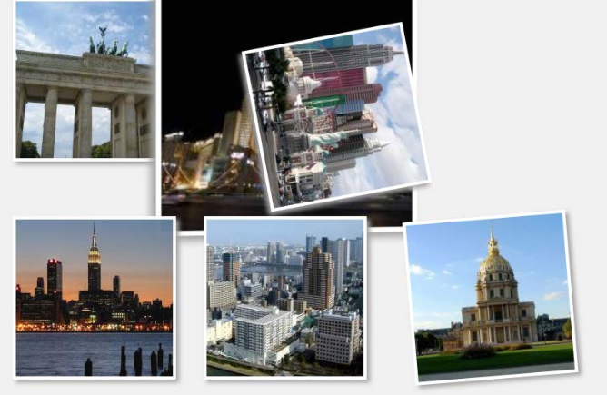

如果我们运行demo，我们应该会看到图像通过不同类型的动画在运行。没有特殊或者复杂的东西，这里的关键是，如何将它搬到PostCSS中呢？

这里有一个充分的理由——有一些开发者过去使用过`Animate.css`，依然熟悉它是如何工作的。我们后面还将使用`postcss-animation`插件，在*过渡到使用PostCSS*一节中，它其实就是基于`Animate.css`样式库的。对于那些还不熟悉的样式库的同学，我们可以在我们demo的上下文中快速过一下它是如何工作的。

### 解析Demo中的代码

如果我们需要用很多复杂的JavaScript来实现的话，我们Demo中使用的效果相当明显，确实也是如此。

然而，事实上是`Animate.css`文件包含了一系列基于`@keyframe`的动画，类似于：

	@keyframes bounce {
		0%, 20%, 50%, 80%, 100% {transform: translateY(0);}
		40% {transform: translateY(-1.875rem);}
		60% {transform: translateY(-0.9375rem);}
	}

我们在代码的`<head>`标签中引用这个库，就把动画引用进来了。这样我们后面就可以在代码中直接根据动画名来调用动画了：

		

			
			...
		

	</body>

你会注意到我们代码中添加的`.animated`类——它控制了动画的`duration`和`timing`，根据代码中添加的动画名来设置。

不使用JavaScript的缺点（或jQuery）意味着动画只能在demo加载时运行一次；我们可以通过添加`.infinite`类在要添加动画的元素上（这是Animate库的一部分）设置它不断运行。我们可以在CSS中伪造一个点击选项，但这是一个是试验性的hack，并不是所有浏览器都支持——如果想要其它任何控制形式的效果，我们还是需要使用JavaScript（甚至jQuery）。

> 如果你对这个hack的细节感兴趣，可以看下Stack Overflow的这个问题，地址：http://stackoverflow.com/questions/13630229/can-i-have-an-onclick-effectin-css/32721572#32721572。

好的，我们接着看：我们已经讲了预构建库的基本使用，如`Animate`。是时候加快脚步，看一下过渡到使用PostCSS。作为开始，我们会使用Gulp作为我们task的执行构建工具，即Sass。后者是一个完美的选择，因为它符合我们在这一章后面要使用的插件，我们看一下在转换到使用PostCSS的过程中，有什么为其转换打好了基础。

## 切换到使用Sass

作为一名开发人员或者设计师，如果我们的开发过程中包含使用Sass，那么有一部分原因大概是可以使用`mixins`，来构建我们的样式：

	@mixin transition ($value...) {
		@if length($value) >= 1 { // If we set value
			@include prefixer($property: transition, $value: $value);
		} @else { // If value is not set, return default value
			@include prefixer($property: transition, $value: all 0.15s ease-in 0.05s);
		}
	}

这并没有什么不对，但是仍然需要花费精力管理我们的`mixins`。另一个更方便的选项是使用预构建动画库，也是减少我们开发工作的方法。

许多开发人员创建`mixin`库来处理动画；一个完美的例子是*@Geoff Graham的Animation.scss*，下载地址：*https://github.com/geoffgraham/animate.scss*。

在处理`mixins`的时候，有一些需要注意的地方——使用它们来管理前缀，如：

	@mixin prefixer($property, $value) {
		-webkit-#{$property}: $value; // Attach webkit prefix (Chrome, Safary, Some Android native browsers)
		-moz-#{$property}: $value; // Attach moz prefix (FireFox)
		-o-#{$property}: $value; // Attach o prefix (Opera)
		#{$property}: $value; // no prefix (modern browsers and latest IE versions)
	}

尽管它会在代码编译的完成之后增加相关前缀，但这并不是最佳做法。

我们有责任确保每个动画包含了所有相关的前缀——这是最好的情况，但也是一个挑战！还有添加不会有任何效果的规则——例如，在transition添加-o作为前缀是没有任何意义的，这个前缀已经不再需要了。

幸运的是，有一个更好的处理前缀的方法——我们可以使用`Autoprefixer`（地址：https://twitter.com/autoprefixer）来为我们自动处理浏览器前缀。Autoprefixer的厉害之处在于它使用Can I Use (http://www.caniuse.com)数据库，来让所有的内容保持最新。

我们有各种插件可以使用来执行任务，如Grunt和Gulp。当然我们可以使用一个独立的GUI编译器，但是使用任务管理工具，在运行的时候可以像这样在任务中绑定更多的功能吗？我们甚至可以使用这几个插件中的其中一个，在执行新的编译之前删除前缀，以确保消除了冗余的前缀。

出于考虑，我们来实践一下。在下一个demo中，我们将构建一个简单的画廊效果，展示我们前面看到的动画，但是这是使用Sass版本的`Animate.css`。我们将使用Gulp作为我们的任务构建工具来编译Sass代码，在添加一个新的`source map`之前，检查我们代码的一致性，添加前缀，等等。你懂的！

其实我们可以使用任务构建工具来完成很多工作，但是闲话少说，先开始构建我们的画廊吧。

### 创建一个动画画廊

动画内容可是一把双刃剑。小心使用，它可以提升网站的水平到一个新的层次。如果做得不好，可能会让网站变得渣渣。

在最后一个demo中，我们构建了一个简单的画廊效果——用来展示我们可以添加的不同类型的动画效果，而不是生成那些会赢得奖项的东西。在接下来的几页，我们会继续我们的demo，但是这次重新配置，使用Sass版本的`Animate.css`。我们同时会介绍使用任务构建工具来编译我们的代码——这是使用PostCSS的需要。它似乎是一个完美的开始，作为我们过渡到使用动画和PostCSS的最后一步。

> 本教程的文件在随书下载的代码中可以找到，T38文件夹。

闲话少说，我们来修改前面的demo吧：

第一步：我们需要下载Sass版本的`Animate`——地址：https://github.com/geoffgraham/animate.scss/archive/master.zip。提取其中的`Animate.scss-master`，放到我们项目根目录中的`src`文件夹中。

第二步：在`src`文件夹中，重命名`Animate.scss`文件为`_animate.scss`——声明它是一个组件，防止它被Sass编译器编译成一个单独的文件。

第三步：在`src`文件夹中，重命名为`style.scss`——这把它变成一个Sass文件，在后面的练习中编译的时候会用到。我们`src`文件夹的东西应该如下面的截图所示：

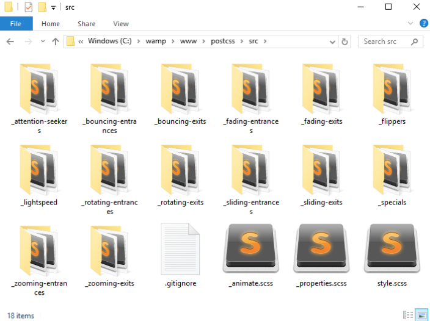

第四步：打开`style.scss`文件。在样式表的顶部加上下面这行内容：

	@import "_animate.scss";

第五步：接下来，在样式表的末尾处添加下面几行内容——引入了`Animate.css`的Sass版本的动画。`timing`已经扩展为`5s`，因为原始示例太快了：

	.bounce { @include bounce(); }
	.flip { @include flip(); }
	.hinge { @include hinge(); }
	.flash { @include flash(); }
	.shake { @include shake(); }
	.swing { @include swing(); }
	.animated:hover {
		animation-duration: 5s;
		animation-fill-mode: both;
	}

第六步：保存文件，然后复制`T38`文件夹下的`src`文件夹的内容到我们项目中的`src`文件夹，我们将很快编译这个文件。

第七步：在新文件中，复制并添加下面的代码，然后保存为`gulpfile.js`，放到我们项目的根目录中——这是我们的gulp文件，我们用来编译代码的：

	'use strict';
	var gulp = require('gulp');
	var postcss = require('gulp-postcss');
	var sass = require('gulp-sass');
	gulp.task('sass', function () {
		return gulp.src('src/*.scss')
			.pipe(sass().on('error', sass.logError))
			.pipe(gulp.dest('dest/'));
	});
	gulp.task('default', ['sass']);
	var watcher = gulp.watch('src/*.scss', ['sass']);
	watcher.on('change', function(event) {
		console.log('File ' + event.path + ' was ' + event.type + ', running tasks...');
	});

第八步：我们还需要一个`package.json`文件——用来保存我们使用的插件的详细内容。目前为止，我们都是使用`gulp-sass`，但是很快会改变的。将下面的内容添加到新文件中，保存为`package.json`在我们项目的根目录中：

	{
		"name": "postcss",
		"version": "1.0.0",
		"description": "Configuration file for PostCSS",
		"main": "index.js",
		"scripts": {
			"test": "echo \"Error: no test specified\" && exit 1"
		},
		"author": "Alex Libby",
		"license": "ISC",
		"dependencies": {
			"postcss": "^5.0.8"
		},
		"devDependencies": {
			"gulp": "^3.9.0",
			"gulp-postcss": "^6.0.0",
			"gulp-sass": "^2.1.1"
		}
	}

第九步：机智的你应该已经发现，我们还没有安装`gulp-sass`插件。我们现在来安装，启动一个Node.js命令行窗口，然后将工作路径切换到我们项目中。输入如下的命令，并回车：

	npm install gulp-sass --save-dev

第十步：在窗口中，输入`gulp`，然后回车——Gulp现在开始编译我们的文件。如果一切顺利，我们会看到一个编译完成的样式表出现在我们项目的`dest`文件夹中。

第十一步：现在，尝试在浏览器中打开`animate.html`——如果一切顺利，我们会看到我们的画廊效果没有改变，但是我们使用的是`Animate.css`的S版本。

我们的demo现在已经转换为使用`Animate.scss`——我们可以很容易选择使用任何一个编译器（如Koala——http://www.koalaapp.com），但是我们选择了使用Gulp。它是一个完美的转换到使用PostCSS的方案，我们已经在前面的demo中看过了，我们将使用Gulp作为我们的任务构建工具。这允许我们来逐步过渡，在所有的SASS元素已经被转换之后，我们只需要简单地删除gulp文件中配置的任务，就可以完成转换了。

### 添加收尾工作

所以，下一步是什么？我们已经创建了一个基础的gulp任务文件，用来编译我们的Sass代码为合法的样式。

这只是故事的一小部分。我们需要添加更多东西，让我们的编译过程更适应PostCSS，并准备转换过去。

开始吧：

第一步：我们要改的是`package.json`文件，将以下高亮的内容添加进去：

			"cssnano": "^3.2.0",
			"gulp": "^3.9.0",
			"gulp-postcss": "^6.0.0",
			"gulp-rename": "^1.2.2",
			"gulp-sass": "^2.1.1",
			"gulp-sourcemaps": "^1.5.2",
			"postcss-reporter": "^1.3.0",
			"stylelint": "^2.3.7"
		}
	}

第二步：我们需要配置我们的gulp文件，增加额外的东西——首先是增加一些额外插件，我们在这本书的前面几章已经用过的。增加下面高亮的内容：

	var sass = require('gulp-sass');
	var autoprefixer = require('autoprefixer');
	var cssnano = require('cssnano');
	var sourcemaps = require('gulp-sourcemaps');
	var rename = require('gulp-rename');
	var stylelint = require('stylelint');
	var reporter = require('postcss-reporter');

第三步：增加了额外的插件之后，我们现在在Sass任务下面需要增加额外的task。增加下面这个任务用于管理代码的一致性：

	gulp.task("lint-styles", ['sass'], function() {
		return gulp.src("dest/*.css")
			.pipe(postcss([ stylelint({
				"rules": {
					"color-no-invalid-hex": 2,
					"declaration-colon-space-before": [2, "never"],
					"indentation": [2, 2],
					"number-leading-zero": [2, "always"]
				}
			}),
			reporter({
				clearMessages: true,
			})
		]))
	});

第四步：在上一步完成之后，添加下面这个task——用于重命名文件，将其作为压缩文件过程的一部分：

	gulp.task('rename', ['lint-styles'], function () {
		return gulp.src('dest/*.css')
			.pipe(postcss([ cssnano() ]))
			.pipe(rename('style.min.css'))
			.pipe(gulp.dest("dest/"));
	});

第五步：我们的下一个任务是生成下一代`source maps`——这可以在Sass中自动完成，但使用一个单独的插件可以在编译过程中具有灵活性。在上一步完成之后将下面的task加上：

	gulp.task('sourcemap', ['rename'], function () {
		return gulp.src('dest/*.css')
			.pipe(sourcemaps.init())
			.pipe(sourcemaps.write('maps/'))
			.pipe(gulp.dest("dest/"));
	});

第六步：修改下面几行，我们已经完成得差不多了：

	gulp.task('default', ['sass', 'lint-styles', 'rename', 'sourcemap']);

	var watcher = gulp.watch('src/*.scss', ['sass', 'lint-styles', 'rename', 'sourcemap']);
	watcher.on('change', function(event) {
		console.log('File ' + event.path + ' was ' + event.type + ', running tasks...');
	});

第七步：保存文件，启动一个Node.js命令行窗口，然后切换工作路径到我们的项目中。

第八步：在窗口中，输入`gulp`，并回车——Gulp将会编译我们的文件。

第九步：如果我们看一看`dest`文件夹，会看到编译后的`style.css`文件，但是这次还包括压缩版本的source map和样式表：

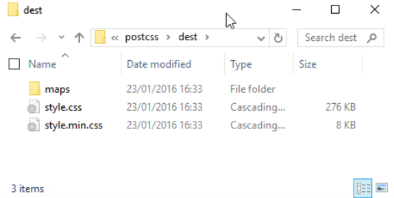

如果我们预览结果，会看到demo在功能上并没有什么改变，但是我们知道，我们现在使用的文件是压缩版本——毕竟，生产环境还是使用压缩版的代码比较好。

我们已经为转换到使用PostCSS打好了基础——机智的你应该已经注意到那些为了PostCSS引用的插件，已经添加到gulp文件中，为下一阶段的转换过程做准备。gulp文件中的一切已经安排妥当，除了Sass任务——在适当的时间点，我们会删除Sass任务，并替换为同等的PostCSS。在我们去做之前，值得花一点时间去探索PostCSS生态系统中提供了什么——尽管这不是一个大需求，我们仍然可以在PostCSS中生成可用的代码供编译。

## 切换到使用PostCSS

好吧，是时候切换到使用PostCSS了。

在我们探索有什么可用的东西之前，有一个关键问题，我相信你一定有疑问——我们前面一直在将使用JavaScript创建动画，但这本书明明是关于PostCSS的呀？

一个非常好的问题——我们不仅仅是探索可以转换为PostCSS的方案，还有在一个更基本的层面上，我们是否有必要做出改变。这听起来可能有点矛盾，让我来解释一下：

动画有一个重要的限制是帧数，或帧/秒，jQuery的标准`.animte()`方法是出了名的慢，而且没有优化速度。在这一章的开头，动画的帧数和速度明显很低。`Transit`库也是一样，我们在这一章的前面已经讲过了。

切换到使用CSS可以提高帧速率，但是基于CSS的动画还没有足够强大到可以管理复杂的动画。这意味着我们作为开发者，必须评估任何一个项目的需求，权衡一下CSS动画能否胜任，或者我们不得不退回到使用JavaScript的库。

这转换到使用PostCSS——它可能会在项目中使用基于CSS的动画，只有我们的动画需求并不是非常复杂的时候可以工作，这样不会导致过于复杂，难以管理。

## 探索PostCSS可用的插件选项

假设我们的项目是可以使用CSS3动画的，那么在这一点上我们可以开始过渡到使用PostCSS了。

如果你期待看到的是一组插件，那么我可能要让你失望了——目前，动画这块只用到了四个插件：

- **Animation**：地址：https://github.com/zhouwenbin/postcssanimation，它从`Animate.css`添加`@keyframes`。这个插件使用https://github.com/zhouwenbin/postcss-animation-data，保存转换后的动画。
- **PostCSS Easings**：可以从https://github.com/postcss/postcss-easings获取，这个插件从http://www.easings.net，将`easing`名转换为等效的 `cubic-bezier()`值。
- **PostCSS Transform Shortcuts**：这个插件允许我们指定单独值，当创建`transform`声明时——这个插件可以从这里下载：https://github.com/jonathantneal/postcss-transformshortcut。
- **PostCSS MQ Keyframes**：这个插件会将媒体查询中所有的`keyframes`移动到我们CSS文件的底部。

一个比较好奇的是，这么小范围的插件？我们稍后将会给这个列表增加一些新的内容。在这一章的末尾，我们将创建`postcss-animation-data`插件的一个版本，允许我们使用Magic动画，地址：http://www.minimamente.com/example/magic_animations/。

我们要把其中一些拿来使用：是时候放个demo了！

## 更新代码以使用PostCSS

虽然PostCSS生态系统的动画插件选项还不充足，这并不能阻止我们使用它编译动画样式。为了证明这一点，我们将修改我们前面demo中的jQuery和`.add/remove`类名等——换成使用PostCSS来添加一个动画easing，来自Dan Eden创建的`Animate.css`库。

我们需要的插件是`postcss-animation`插件，地址：from https://github.com/zhouwenbin/postcss-animation，使用`postcssaimation-data`插件，地址：https://github.com/zhouwenbin/postcssanimation-data。安装插件是小事一桩，和我们前面安装其它插件一样的。

我们现在开始demo：

第一步：我们从安装`postcss-animation`插件开始——启动一个Node.js命令行窗口，切换工作路径到我们的项目。

第二步：在命令行中，输入如下的命令，并回车：

	npm install postcss-animation --save-dev

如果一切顺利，我们会看到插件安装完成：

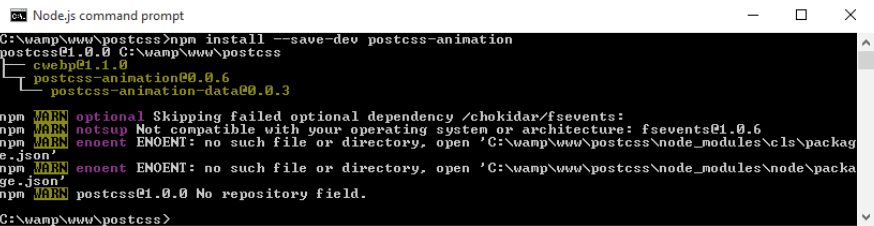

第三步：从随书下载的代码中，找到`T39`文件夹并复制它的内容到我们的项目中——我们将使用它作为转换到PostCSS的基础之一。

第四步：打开我们的教程文件夹中`css`子文件夹中的`style.css`，在底部，修改`.move`规则如下：

	.move {
		animation-name: bounce;
		transform: translate(17.5rem, 0rem);
		transition-duration: 3.5s;
	}

第五步：将这个文件保存到`src`文件夹中，然后启动一个Node.js命令行窗口，切换工作路径到我们的项目。

第六步：在命令行中，输入`gulp`，然后回车——如果一切顺利，我们会看到下面这些文件出现在`dest`文件夹中：

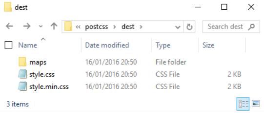

第七步：复制这个文件夹的内容到`T39`文件夹中的`css`文件夹中。

现在我们可以测试demo了——预览一下，我们会看到我们的demo外观没有变化，但是我们知道，现在使用的是PostCSS编译的代码。

### 测试我们修改的代码

虽然我们在demo的外观上看不出任何改变，但是运行方式显然不同。所以，我们需要在代码层面看一下我们的demo。

在这个demo中，我们添加了一个`animation-name`属性，并指定了动画名为`bounce`。在编译的时候，PostCSS会将正确的`@keyframes`规则加入到代码中：

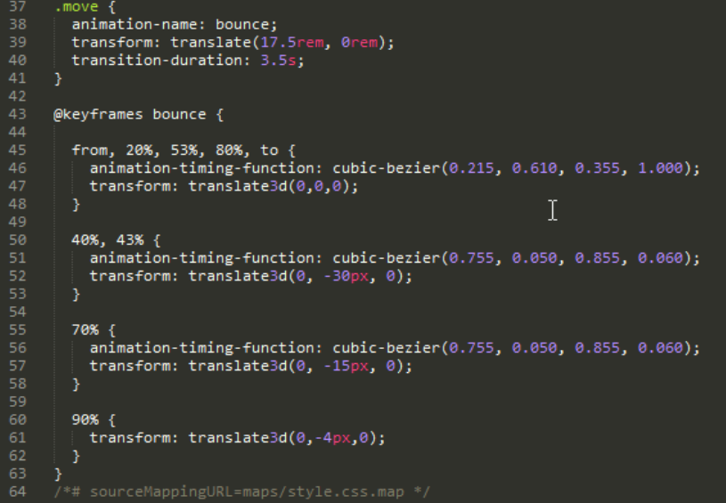

所以，如果我们要看一下性能层面的东西，如何进行比较呢？即使指定了额外的动画属性，它的帧率仍然为48.29FPS，相比使用标准`.animate()`的时候：

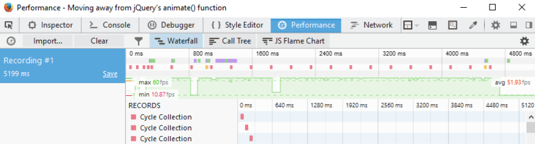

在可能的情况下，我们可以通过删除代码中使用`.animate()`的依赖来提高性能。使用CSS样式来给内容添加动画还不能完全取代JavaScript动画，但是它会慢慢进步的。

好的，接下来：我们简要看看给内容添加动画的几种不同方法。是时候跨出过渡到PostCSS的最后一步了。有多少次你看到一些表单，`label`元素在每个`field`的上面或者左边？当然，它有时候是比较无聊的，总是看到相同的老旧的设计。这其实很容易改变，没有理由不去做。为了证明这一点，我们将使用PostCSS来让每个`label`在获取到焦点的时候上滑。是的，你没有听错，上滑。让我们看看如何通过上面提到的这些零碎的相关联的功能来提供一个全新的网站。

## 使用PostCSS创建一个demo

作为前面练习的一个补充，我提出了一个问题：“有多少次你看到一些表单，上面有label元素，或者在每个field的左边？”如果我每个答案都拿到一毛钱，那么我现在应该在一些异国的岛屿上度假了（开玩笑）。我已经记不清有多少次我看见这些表单了，更不用说其它使用Internet的人。

不是抱怨，这样的表单确实挺无聊的。为了证明这一点，我们将使用`psotcss-transform-shortcut`插件（作者：Jonathan Neal）创建一个简单的demo，地址：https://github.com/jonathantneal/postcss-transformshortcut。这是一个简单的插件，允许我们指定单独的属性，插件会结合成一行单独的代码放在我们的样式表中。我们先来快速安装：

第一步：首先，启动一个Node.js命令行窗口，然后切换工作路径到我们的项目。

第二步：在命令行中，输入如下的命令，然后回车：

	npm install postcss-transform-shortcut --save-dev

第三步：接下来Node会去安装插件，当它返回一个如下的提示，表示它已经正确安装了。

不需要配置其它东西，但是在使用它之前，我们还有个小任务需要完成。

### 更新插件

在写本书的时候做了一些研究，我遇到的一个问题，在当前版本(1.0.0)时，如果样式表中有多个规则，不能正常编译；可能会有情况是，插件可能在你的环境中不能运行，而我碰到的这是其中一个原因。

幸好，这并不难解决——如果我们看一下我们项目的`node_modules`文件夹中的`postcss-transform-shortcut`文件夹，我们会看到：

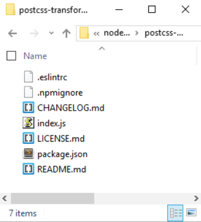

只需复制`https://raw.githubusercontent.com/pc035860/postcss-transform-shortcut/07af8a78d1fb5e7fdeebc8c7f56c0c9ecdd83efb/index.js`的内容，直接贴到`index.js`文件的顶部，就可以解决这个问题了。

> 这是开发人员的GitHub网站上已经被记录的一个问题，地址：https://github.com/jonathantneal/postcss-transformshortcut/issues/4，如果你想要看到更多关于这个问题的细节，可以看看上面的的链接。

### 创建demo

现在我们准备好了更新的插件，可以继续构建我们的demo了！下一个练习会创建一个简单的信用卡表格——我不建议你在生产环境中使用它，因为它纯粹是设计来展示动画效果的，没有任何关于表单的安全性的内容。

这里不谈，有一个我们有生成的截图，使用PostCSS：

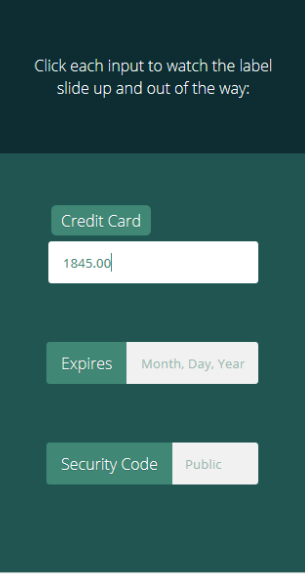

这是一个简单的demo，基于Michael Arestad在codepen上创建的实例，地址在：http://codepen.io/MichaelArestad/pen/ohLIa——我已经将这个演示简化，并重新设计，来说明我们可以如何使用PostCSS来编译代码成有效的CSS样式。

好的，我们接下来开始建立我们的demo：

第一步：首先从随书下载的代码中提取一份`T40 – Creating a demo in PostCSS`文件夹的副本，保存到我们项目中。

第二步：从文件夹中，将`package.json`和`gulpfile.js`文件移动到我们项目的根目录。

第三步：在`css – completed versions`文件夹，复制`style - pre-compile version.css`文件到`src`文件夹，重命名为`style.css`。

第四步：接下来，启动一个Node.js命令行窗口，将工作路径切换到我们项目中。

第五步：在命令行窗口中，输入gulp，然后回车。PostCSS将会开始编译我们的代码；如果一切顺利，我们会看到我们编译完成的样式表文件和`source maps`出现在`dest`文件夹中。

第六步：复制`dest`文件夹的内容到原来的`T40 – Creating a demo in PostCSS`的`css`文件夹中。

第七步：在浏览器中预览一下结果——如果一切顺利，我们会看到如我们的练习开始那里的截图一样的内容。

这是一个简单的demo，但是它展示了我们可以如何完美地使用动画——它给`label`增加了一个微妙的效果，并且不破坏表格整体的使用。插件的使用确实有一些实用的点，所以我们现在花点时间来看看我们刚刚创建的东西的更多细节。

### 详细解析一下我们的demo

在PostCSS中，一个成功的插件的关键是遵循1:1原则——一个插件对应一个任务。`postcss-transform-shortcut`插件也不例外：它需要多种元素来组成一个transition规则，并将它们排好正确的顺序。要理解我的意思，先看看我们编译之前的样式表：

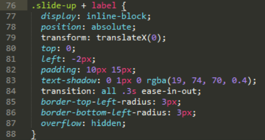

我们的`transform`声明在哪呢？好的，在使用插件的时候，并不需要声明`transform`——相反，我们只需要简单地指定各种属性，如下：

	.transform {
		transform: skewX(25deg);
		rotate: 180deg;
		scale: 2 2;
		translate: 10px 10px;
	}

这个插件设置了识别这四个属性，并将它们编译成单独的规则，如下面的代码片段所示：

	.transform {
		transform: skewX(25deg) rotate3d(180deg,0,1) scale3d(2,2,1) translate3d(10px,10px,0px);
	}

属性中的任何差距，都将会经由插件来自动填写默认值。我们甚至可以使用这个插件作为`transitions`效果的等效基础——我们会在下一章的末尾处进行。

## 优化动画

使用动画时，有时候我们需要使用定制的效果；一种方法是通过使用`@keyframes`。问题是，有一些浏览器不支持在媒体查询中使用它们（没错，我说的就是IE10和IE11，哼！）。

那么这又会对我们有什么影响呢？好吧，如果你创建过响应式网站，那么这绝对是我们需要记住的。媒体查询是任何响应式功能的基础。

解决方法很简单——开发者Andy Walpole创建了一个简单的PostCSS插件，叫`mq-keyframes`，地址：https://github.com/TCotton/postcss-mq-keyframes。

假设我们有如下的样式表：

	@media only screen and (min-width: 375px) {
		.custom-bounce {
			animation: side-bounce 5s;
		}
		@keyframes side-bounce {
			100% {
				opacity: 0;
			}
		}
	}

这个插件要完成的就是将代码移动到我们样式表的底部，使它可读性更好，并允许IE继续正常工作：

	@media only screen and (min-width: 375px) {
		.pace {
			animation: pace-anim 5s;
		}
	}
	@keyframes pace-anim {
		100% {
			opacity: 0;
		}
	}

这可能是PostCSS中最简单的插件之一了，特别是对于动画内容而言，如果你要支持这些版本的IE，值得一用。这个插件的安装方法和前面一样，不需要在配置过程增加任何额外的属性。

> 作为一个挑战，你不放看看这个的demo：*http://urbaninfluence.com/2015/05/make-abackground-image-slider-with-css-keyframes/*。

## 使用我们自己的动画插件

这一章的整个过程中，我们已经使用了几个PostCSS中可用的动画插件，并演示了一些可能的效果。这是不错的，但是还是觉得有点限制——我们还能用它来做点什么呢？

PostCSS的美妙之处在于，如果需要一个插件，那么我们可以创造一些东西来填补这一空白。一个很好的例子是缺乏可用的基于CSS的动画插件；目前，我们有且仅有`postcss-animations`，用来从Dan Eden创建的`Animate.css`样式表中提取动画插入。我已经使用这个作为一个新的插件的基础——我们将使用相同的框架，但是把它转换成使用Magic动画，地址：*http://www.minimamente.com/example/magic_animations/*。

我们将在*《第八章：创建PostCSS插件》*中介绍更多关于创建PostCSS插件的细节。我们现在先开个小头：

第一步：从随书下载的代码中找到并复制`T41`文件夹，保存我们项目的根目录中。

第二步：复制`postcss-animation`和`postcss-animation-data`文件夹到我们项目的`node_modules`文件夹中。

第三步：复制`gulpfile.js`和`package.json`文件到我们项目的根目录中——如果已经有了，直接替换（或者保存为副本）。

第四步：打开你的文本编辑器，添加如下的代码，保存为`style.css`，放到我们项目的`src`文件夹中。

	.foo {
		animation-name: openDownLeft;
	}

第五步：启动一个Node.js命令行窗口，将工作路径切换到我们的项目。

第六步：在命令行中，输入`gulp`，然后回车。PostCSS将会编译代码。如果一切顺利，我们会看到编译完成的样式中已经增加了`@keyframes`代码（在`dest`文件夹中），如下面的截图所示：

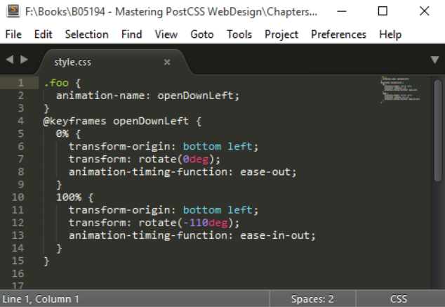

尽管我们的实例只是展示了单独的样式，但这并不影响——所有使用`animate-name`的样式表都可以使用，只需匹配`postcss-animation-data`插件中对应的`animation-name`。有几个要点，虽然我们应该讲到，所以我们花点时间来详细探讨一下。

### 更详细地探索插件

我们的新插件是一个完美的例子，关于如何改编现有的框架来使用不同的值——在使用这个插件的时候，一些我们应当注意的关键点：

一个关键点是，考虑当构建任何插件的时候：不要担心添加前缀的问题。这应该是在编译阶段的问题了，如果你在项目中使用了插件，它必然会注意到哪些浏览器前缀是必须的。

目前，插件只列出了两种来自Magic动画库的动画类型——原始动画效果可以在Magic Animations的GitHub库上看到，地址：*https://github.com/miniMAC/magic/blob/master/magic.css*。我们可以很容易地添加我们需要的内容，使用`"<name of animation>" : "<keyframe to use>"`的格式，如下面的截图所示：

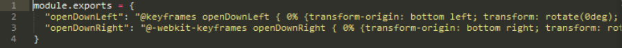

作为一个试验，我们可以尝试转换Motion UI库（地址：*http://zurb.com/playground/motion-ui*）的动画？或者我们可以尝试AngularJS的动画，这完全取决于你自己。

另外，可以将相同的原理应用到`postcss-easings`插件上，地址：*https://github.com/postcss/postcsseasings*；这里有一些知名的`easing`，但它们可以很容易地被更换。这里推荐一个很棒的工具：*http://www.cubicbezier.com*。例如，如果我们需要`easeInExpo` easing，我们创建一个如下所示的贝塞尔曲线：

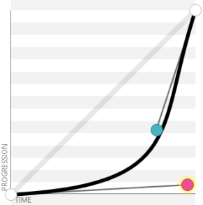

> 这将`cubic-bezier(.95,.05,.79,.35)`值转换为我们可以在代码中使用的值。值得注意的是，有一些网站会把这个easing展示为`(0.05, 0.795, 0.035)`，*http://cubicbezier.com/*只显示两位小数。

扩展、修改、或创建新插件的方法有很多——关键是如何保持插件的简单，限制一个插件对应一个任务，在可能的情况下，你应该使用PostCSS插件的样板作为创建插件的基础。我们在这一节中使用的插件是手动创建的——如果你是因为自己的需要创建的这个插件，这不是问题，但是切记不要为了发布插件而创建插件。在下一章，我们将探索使用样板代码来创建插件，其实并不难——以后也可以避免很多问题。

## 小结

动画内容几乎是构建现代网站的必要元素——它可以简单到只是提供一些表单标签的细微效果，也可以达到为幻灯片提供复杂的背景。我们在这一章中已经讲了很多有用的秘诀和技巧，所以我们花点时间来回顾一下我们前面都学习了什么。

这一章的主题是如何从使用vanilla CSS或Sass过渡到使用PostCSS。我们从快速回顾可用的动画类型开始。

之后，我们看了有哪些可用的方法，让我们开始远离标准CSS，如使用预构建的动画库，或使用CSS3 transition。我们接下来切换主题讲到，如何在Sass中创建出相似效果的动画，所以我们可以对比使用如`Animate.css`的库，在开始切换到使用PostCSS之前。

作为这个旅程的一部分，我们探索了各种可用的插件，在将代码转换成使用PostCSS同等样式的之前。然后我们向前一步，通过使用PostCSS创建一个简单的demo，再在PostCSS创建一个简单的动画插件作为这一章的结尾，也就是最后的基于Magic Animation的动画。

噢~原来我们都讲了这么多东西了。但是我们接下来还有很多要讲的。在下一章中，我们将探讨一些可以用来在PostCSS中创建插件的，窍门和技巧。我们将不再受限制于别人提供给了我们什么插件，我们现在可以开始创建自己的插件了~