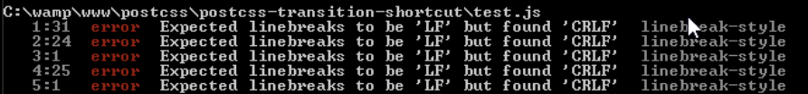

# 第8章：PostCSS 插件开发

插件，插件，我们的开发环境已经离不开它们了！到目前为止，你应该已经了解了插件在 PostCSS 开发环境中举足轻重的地位。插件的插拔特性是 PostCSS 模块化结构的核心，也是提高开发环境执行效率的重要因素。

在本章中，我们将会先概述 PostCSS 插件的结构，分析几个 PostCSS 预置的插件示例，然后创建我们自己的插件，最终在完成测试的基础上提交到 PostCSS 的插件系统中。

本章主要包含以下主题：

- 了解如何使用插件扩展 PostCSS
- 解析一个插件的基本结构
- 使用插件模版创建 PostCSS 插件
- 创建一些插件示例
- 测试并将插件提交到 PostCSS 的插件库
- 深入探索 PostCSS 已有的几个插件

让我们开始吧！

## 使用插件扩展 PostCSS

在你使用插件的过程中，有多少次感觉到某个插件是完全无用的呢？

我感觉这种情况会很少，甚至是没有，当然这里不包括在某些限制性条件下才会生效的插件！PostCSS 的强大不是在于其核心系统，而是在于其插件系统赋予开发者操作 CSS 样式的无限可能。

在撰写本章的时候，PostCSS 社区中已经拥有了 200 多插件，有些用于扩展 PostCSS 的功能（比如 `postcss-nested` 和 `postcss-mixins`），有些用于处理颜色值（比如 `postcss-color-hcl` 和 `postcss-rgba-hex`），还有一些用于实现未来的 CSS 语法（比如支持 `@extend` 语法）。

> PostCSS 完整的插件列表请参考 [https://github.com/postcss/ postcss/blob/master/docs/plugins.md](https://github.com/postcss/ postcss/blob/master/docs/plugins.md)，或者使用 [http://www.postcss.parts](http://www.postcss.parts) 从已经归类好的列表中检索 PostCSS 插件。

到目前为止，我们在之前的示例中已经使用了相当多的插件，虽然已经掌握了配置和使用它们的方式，但是其工作原理和执行方式对我们来说仍是一个秘密。现在时候来揭开这层神秘的面纱了。首先，让我们先来了解一下用于创建插件的工具集，也就是 PostCSS 的 API。

所有的 PostCSS 插件都是构建在这套 API 之上的。PostCSS API 的核心是 Node 和 Container 方法，一旦插件 postcss 对象初始化完成之后，就可以使用这两个方法操作样式内容。在本章中我们会深入分析和学习这两个方法，但在这之前，先让我们探索一下 PostCSS 插件的基本结构。

## 解析插件的基本结构

创建一个 PostCSS 插件的流程非常简单，而且对于开发者来说，开发和设计插件完全没有任何限制，可以随心所欲的发挥。当然，这在侧面也埋下了一个隐患，那就是插件之间的质量各不相同，需要用户仔细辨别。

这些暂且不提，让我们回到开发 PostCSS 插件的话题上，开发插件的推荐方式使用插件模版（[https://github.com/postcss/postcss- plugin-boilerplate;](https://github.com/postcss/postcss- plugin-boilerplate;)）。下面是该模版在 GitHub 的项目主页截图：

如果我们去检查 GitHub 上所有 PostCSS 插件的源码，会发现有很多文件并没有出现在上面的截图中，因为这些文件是由开发者自有配置的，各个插件不尽相同。

虽然如此，但如果你深入查看项目的源代码，会发现有一些文件是每个插件都必备，它们是：

- `index.js`：该文件包含了插件的入口方法
- `package.json`：该文件用于配置和管理使用 NPM 安装的第三方依赖
- `test.js`：该文件包含了测试用例，用于保障插件的可用性

接下来就让我们从 `index.js` 文件开始，深入、细致地了解插件的结构。

### index.js

`index.js` 是所有插件的核心和入口，其中包含一个 `exports` 方法，用于向外界抛出操作当前插件的接口：

    var postcss = require('postcss');

    module.exports = postcss.plugin('myplugin', function(options) {
        return function (css) {
            options = options || {};

            // Processing code will be added here
        }
    });

### package.json

`package.json` 用于配置和管理使用 NPM 安装的第三方依赖。由于 PostCSS 本身就是基于 Node.js 的，所以我们可以在任何 PostCSS 插件中看到类似如下所示的 `package.json` 内容：

    {
        "name": "PLUGIN_NAME",
        "version": "0.0.0",
        "description": "PostCSS plugin PLUGIN_DESC",
        "keywords": [
            "postcss",
            "css",
            "postcss-plugin"KEYWORDS
        ],

上面内容包含了插件的基本信息，比如名字、描述信息和版本号。扫一眼上面的内容，你会很快发现这里有一个全大写的 “KEYWORDS”，有人可能会认为这是无效的 JSON 数据。

之所以存在这个标志符，是因为使用该模版插件的时候会执行一个脚本，该脚本会将 “KEYWORDS” 替换为真正的关键字，最终将 `package.json` 转换为有效的 JSON 数据。在后面的《创建过渡插件》一节，我们将会对此再做详细介绍。现在，让我们假设该文件经过构建流程已经被转换为了有效的 JSON 数据。

接下来是作者、授权证书类型、插件的项目仓库地址和问题反馈地址等信息：

        "author": "AUTHOR_NAME <AUTHOR_EMAIL>",
        "license": "MIT",
        "repository": "GITHUB_NAME/PLUGIN_NAME",
        "bugs": {
            "url": "https://github.com/GITHUB_NAME/PLUGIN_NAME/issues"
        },
    "homepage": "https://github.com/GITHUB_NAME/PLUGIN_NAME",

下面的内容是最重要的部分，它使用 `dependencies` 字段保存了和线上环境（in prodution）中用到的第三方依赖的信息，使用 `devDependencies` 字段保存了开发环境（in development）中所用到的第三方依赖的信息：

        "dependencies": {
            "postcss": "^5.0.10"
        },
        "devDependencies": {
            "ava": "^0.7.0",
            "eslint": "^1.10.2"
        },
        "scripts": {
            "test": "ava && eslint *.js"
        }
    }

PostCSS 团队强烈建议所有的插件都应该经过严格的测试，确保插件的稳定性和用户体验。接下来让我们看一下模版代码中用于测试的 `test.js` 文件。

### test.js

测试对所有的插件都极其重要，模版代码中的 `test.js` 如下所示：

    import postcss from 'postcss';
    import test from 'ava';

    import plugin from './';

    function run(t, input, output, opts = { }) {
        return postcss([ plugin(opts) ]).process(input)
            .then( result => {
                t.same(result.css, output);     
                t.same(result.warnings().length, 0);
            });
        }

    /* Write tests here
    test('does something', t => {
        return run(t, 'a{ }', 'a{ }', { });
    });
    */

在后面有关测试和提交插件的章节中，我们会再对 `test.js` 文件进行详细介绍。现在，让我们先专注于创建 PostCSS 插件。首先，我们会快速浏览一下 PostCSS 所提供的 API，然后就进入到 PostCSS 插件开发阶段——这个插件的功能是根据开发者选择的字体插入样式信息，如果当前样式中没有引入相关字体，那么该插件还会添加相应的引用声明。

合理使用 PostCSS 的 API，有助于我们顺利构建自己的插件。PostCSS API 提供了一系列的类、模块和方法公我们使用，所有的这些接口都挂载在 `postcss` 对象上，供所有的 PostCSS 插件调用和执行：

    var postcss = require('postcss');

接下来，就让我们从 Vendor 模块开始，快速了解一下 PostCSS 都提供了哪些 API。

### Vendor 模块

Vendor 模块包含一系列用于处理浏览器前缀的辅助方法，使用方式如下:

    var vendor = postcss.vendor;

Vendor 模块主要包含两个方法：

| 模块              | 返回值类型 | 返回值 |
|:------------------|:-----------|:-------------------------------------|
| vendor.prefix     | 字符串     | 从字符串中提取到的浏览器前缀：// 提取浏览器前缀得到 '-webkit-' var vp = postcss.vendor; vp.prefix('-webkit-clip-path') |
| vendro.unprefixed | 字符串     | 去除浏览器前缀后的字符串： // 去除浏览器前缀后得到 'tab-size' var vp = postcss.vendor; vp.unprefixed('-moz-tab-size')  |

### List 模块

List 模块包含一系列用于分离 CSS 属性值的辅助方法，这些方法在分离属性值时可以准确保留相关的括号和引号，使用方式如下：

    var list = postcss.list;

List 模块主要包含两个方法：

| 模块       | 返回值类型 | 分离目标  |
|:-----------|:-----------|:----------------------------|
| list.space | 字符串     | 使用空格分隔的属性值（比如 background、border-radius 和其他简写属性）：// 提取后的值: // ['1px', 'calc(10% + 1px)'] var ls = postcss.list; ls.space('1px calc(10% + 1px)')  |
| list.comma | 字符串     | 使用逗号分割的属性值（比如 transition-* 和 bacground 属性）：// 提取后的值: // ['black', 'linear-gradient(white, black)'] var ls = postcss.list; ls.comma('black, linear-gradient(white, black)') |

### API 中的类

在组件中引入 `postcss` 对象后，我们就可以使用 `postcss` 对象提供的一系列辅助类了：

| 类名 | 功能                                    |
|:------|:--------------------------------------|
|Processor| 用于创建 Porcessor 实例并初始化插件，然后就可以在指定 CSS 文件中直接使用该实例了 |
|LazyResult| 用于异步获取 PostCSS 转换过程中生成的所有数据，操作上类似于 Promise。Pormise 是 Node.js 中的一个核心概念，详细信息请参考 https://www. promisejs.org/    |
|Result| 用于获取 PostCSS 转换过程中生成的所有数据   |
|Warning| 用于向用户发出提醒信息   |
|CssSyntaxError| 用于获取 CSS 解析器在解析 CSS 过程中产生的错误信息  |
|Input| 用于获取传递给 PostCSS 插件的原始 CSS 数据 |

### API 中的节点

在 PostCSS 插件中对 CSS 数据的操作实际上就是对每个 CSS 属性节点的操作。PostCSS API 中包含了一系列有用的节点帮助开发者解析和操作 CSS 数据：

| 节点 | 介绍 |
|:----|:-----|
| Root | 表示一个 CSS 文件和该文件解析后的节点集合： var root = postcss.parse('a{color: darkred}'); root.type //=> 'root' root.nodes.length //=> 1|
| AtRule | 表示 CSS 中的 @ 指令节点，比如 @media print {…} |
| Rule | 表示一条 CSS 规则，包含一个选择器和一个声明块：var root = postcss.parse('h1{}'); var rule = root.first; rule.type //=> 'rule' rule.toString() //=> 'h1{}' |
| Declaration | 表示一条 CSS 样式信息：var root = postcss.parse('a{color: darkred}'); var decl = root.first.first; decl.type //=> 'decl' decl.toString() //=> 'color: darkred' |
| Comment | 表示一个位于样式属性或属性值之间的注释：var root = postcss.parse('a { color: /* inner */ darkred; /* outer */ }'); var decl = root.first.first; var comment = root.first.last; comment.type //=> 'comment' decl.between //=> ': /* inner */' |

### API 中的方法

插件的核心作用就是遍历所有的节点并对指定的节点执行某些操作。PostCSS API 包含了一系列用于操作节点的方法：

| 方法组 | 用途 |
|:------|:-----|
| Nodes | 用于处理 CSS 节点，包含如下方法： node.type: 以字符串的形式返回节点的类型信息 node.parent: 以字符串形式返回节点的父节点 node.next() 或 node.prev()：返回同一父节点下的相邻节点，分别是下一个节点和上一个节点 更多详细信息请参考 https://github.com/postcss/ postcss/blob/master/docs/api.md#nodes-common- methods |
| Containers | 用于处理 Root、AtRule 和 Rule 容器内部的子节点，包含如下方法： container.nodes：以数组形式返回当前容器的子节点 container.first：返回容器的的第一个子节点 container.last：返回容器的最后一个子节点 更多详细信息请参考 https://github.com/postcss/ postcss/blob/master/docs/api.md#containers-common- methods |

对于 PostCSS API 中方法和类的更多实例和更详细信息，请参考 PostCSS 的官方网站和官方文档，熟悉相关文档有助于提高开发者的开发效率。

> 有关 PostCSS API 中类和方法的详细介绍请前往 https://github.com/postcss/postcss/blob/master/docs/api.md。

我们已经熟悉了基础的理论知识，接下来就使用它们创建一些 PostCSS 插件吧——这些插件会混合使用前几节介绍的 API。我们第一个开发的插件是一个处理简写属性的插件，使用该插件可以简化编写 CSS 过渡样式的过程。

## 创建过渡插件

开发一个过渡插件的灵感源自于 Jonathan Neal 开发的 `postcss-transform-shortcut`（https://github.com/ jonathantneal/postcss-transform-shortcut）插件。过渡插件的核心不在于简化编写过渡样式的方式，而在于简化开发者独立控制每一个属性值。当开发者编写完过渡属性值之后，过渡插件会自动将其插入到 CSS 样式的恰当位置。

> 该插件的源码托管在 GitHub 上，地址是 https://github.com/alexlibby/postcss-transition-shortcut；NPM 地址是 https://www. npmjs.com/package/postcss-transition-shortcut。

下面就让我们分步骤了解一下插件的开发过程：

第一步：安装 Git，便于后续安装插件模版。各个操作系统的安装方式，请参考 https://git-scm.com/book/en/v2/Getting-Started-Installing-Git 上的详细介绍。

第二步：打开命令行工具并切换到项目的根目录下。

第三步：在命令行中输入以下命令并按回车键执行：

    git clone https://github.com/postcss/postcss-plugin-boilerplate.git

第四步：上述命令使用 Git 工具将 `postcss-plugin-boilerplate`模版拷贝到了我们的项目中，如下所示：

第五步：该插件模版自带一个脚本工具，可用于自动生成项目结构，使用方式如下所示：

    node ./postcss-plugin-boilerplate/start

第六步：自动生成过程中命令行会提问几个问题，需要开发者根据问题填写适当的项目信息，相关问题如下图所示。值得注意的是，虽然命令行中会询问开发者的 GitHub 账户信息并将起写入 `package.json` 文件，但并不强制你必须拥有一个 GitHub 账户；如果你以后会持续不断的维护和改善插件，建议你创建一个 GitHub 账户并将插件托管在 GitHub 上：

第七步：项目结构初始化完成之后，就可以从项目根目录中删除 `postcss-plugin-boilerplate` 文件夹了。

第八步：如果上面的步骤进行的一切顺利，我们将看到如下图所示的项目结构：

第九步：到这一步，我们就可以往插件的 `index.js` 文件添加代码了——拷贝一份下面的代码并替换 `index.js` 中的代码（代码的具体意义在后面的小节解释），代码如下：

    var postcss = require('postcss');

    module.exports = postcss.plugin('postcss-transition-shortcut', function (opts) {
        opts = opts || {};

        div { 
            property: all; 
            duration: 1s; 
            timing: ease-in-out; 
            delay: 1s; 
        }

        return function (css) {

            css.walkRules(function (rule) {
                var transitionRule;
                var transitionValues = [];
                var index = -1, node;
                var attributes = /^(property|duration|timing|delay)$/;

                while (node = rule.nodes[++index]) {
                    if (attributes.test(node.prop)) {
                        transitionRule = transitionRule ||
                            node.cloneBefore({ prop: 'transition' });

                        var transValues = postcss.list.space(node.value);
                        transitionValues.push(transValues.join(','));
                        node.remove();
                        --index;
                    }
                }
                transitionRule.value = transitionValues.join(' ');
            });
        };
    });

现在，我们的插件就可以工作了，那么如何证明插件的功能符合预期效果呢？没有比动手试一试更好的方法了，接下来就让我们写一个实例测试插件的使用效果。在此之前，还有一件很重要的事情要做，这件事情将会影响 PostCSS 插件后续的功能迭代和维护。

### 创建测试

相信读者中目光敏锐的人已经发现了，如果我们不指定四个值中的任何一个，那么过渡插件就不会使用默认值，希望在未来的插件版本中修正这个问题吧。

在这里，我们使用 AVA（https://github.com/sindresorhus/ava）测试插件，而且在使用插件模版生成项目结构的时候安装好了这个工具，我们只需要将测试用例写入到 `test.js` 文件中即可。下面是详细的测试步骤：

第一步：我们将从安装 AVA 测试工具开始做起，在此之前，先打开命令行工具并切换到项目的根目录下。

第二步：在命令行中输入以下两行命令，每行输入完成后按下回车键执行。第一行命令用于安装 AVA，第二行命令用于将 AVA 命令添加到 `package.json` 文件中：

    npm install --global ava
    ava --init

第三步：在编辑器中打开 `test.js` 文件，并将下面代码中高亮的行添加到 `test.js` 中：

            t.same(result.warnings().length, 0); 
        });
    }

    test('transitionShtct', t => { 
        return run( 
            t, 
            'div { property: all; duration: 1s; timing: ease-in-out; delay: 1s; }', 
            'div { transition: all 1s ease-in-out 1s; }', 
            { }
        ); 
    });

第四步：离开编辑器打开命令行，回到插件所在项目的根目录。

第五步：在命令行中输入 `npm test` 并按下回车键执行。

第六步：首先会调用 AVA 执行测试用例，然后调用 ESLint 审查代码是否符合规范。如果一切正常，那么就会看到如下图所示的结果：

到目前位置，我们使用一个实例证明了插件是可以工作，但是这个插件满足预期结果吗？插件通过了测试，看起来是不错的，但是再进一步就会发现有一些其他问题，错误如下图所示：

测试用例通过了，但也揭示了其他方面的错误：

这里抛出了一些和测试有关的要点，所以在继续开发插件之前先修复一下这些错误。

### 修复错误

数量最多的错误是 “Exported linebreaks to be 'LF'…”，这些错误实际上非常容易修复。当我们在 Windows 上使用 Sublime Text 时，由于默认的行尾换行规则就会导致这些错误。假设我们使用的就是 Sublime Test，让我们使用它解决这个错误：

- 启动 Sublime Text，打开 index.js 文件
- 依次点击“View”和“Line Endings”选项
- 修改“Line Endings”的选项为“Unix”，然后保存文件
- 打开 test.js，重复步骤 1 到 3，完成后关闭文件

如果重新执行测试，就会发现错误已经少了很多，剩下需要修复的错误如下图所示：

大部分的错误都是一目了然的，在这里稍微不好理解的是 “Expected indentation of X spaces…” 和 “Line X exceeds the maximum line length….”。对于第一个错误，解决方法是将每个制表符替换为四个空格符；对于第二个错误，解决方法是将过长的代码行切换为两行。

我们需要修复所有的剩余错误，虽然这里的错误和你的项目抛出对错误并不完全相同，但大多数是相似的。

> 如果你想了解某个错误的详细信息，请参考 https://jslinterrors. com/，这里记录了每个错误的产生原因。

假设我们已经修复了大部分的错误，只剩下如图所示的错误：

我们是否需要修复这个错误呢？这取决于代码审查报告的结果。代码审查是开发中非常重要的一环，我们将在后面的章节对此做进一步介绍。

### 清除最后的错误

审查报告中的最后一个错误有些棘手：代码是有效的，但是 ESLint 却认为它是有问题的。背后的原因是 ESLint 发现在 `while` 语句的入口条件中使用了赋值表达式，而这种方式很有可能产生某种错误或对代码造成不可预知的影响。

在某些情况下，使用这种方式只会警告，而不会被认为是错误。在 2013 年七月之前，我们可以通过配置信息忽略这一错误，但在此之后使用 ESLint 时，只能重构代码才能解决这个问题。

> 如果你想了解更多有关这个错误的信息，请参考 http://jslinterrors.com/unexpected- assignment-expression/。

在我们的插件中，代码是有效的，也不会在使用过程中产生任何错误，所以我们有几种方案来解决 ESLint 的错误提示：

- 直接忽略这个错误继续开发。这种方式不完美，但也不会影响现有代码。
- 忽略检查此类错误。这种方式减少了对错误类型的检查，但最终得到了一个 100% 完全通过的测试结果。
- 重构代码以解决这个错误。这是最理想的解决方式，但会花费一定的时间成本，具体的成本取决于需要重构的代码数量。

在这里，我们就简单忽略此类错误的检查吧，具体做法是使用编辑器打开项目中的 `.eslintrc` 文件，然后 `no-conf-assign` 的值修改为 `0`，如下图所示：

这只是一个短期的解决方式，未来应该通过重构去除这种歧义性。

### 执行测试

插件已经开发完成了，让我们来测试它吧。在这里我们需要使用本书的配套代码，本节所使用的代码保存在 `T43 – building a transition shortcut plugin` 文件夹下：

第一步：前往该文件夹并复制一份 `gulpfile.js` 和 `package.json` 文件，将它们粘贴到过渡插件的根目录。

第二步：新建文件并添加如下代码，完成后保存到项目根目录的 `src` 文件夹中，并命名为 `style.css`：

    div { 
        property: all; 
        duration: 1s; 
        timing: ease-in-out; 
        delay: 1s; 
    }

第三步：打开命令行工具并切换到项目的根目录下。

第四步：在命令行中输入 `gulp` 并按下回车键执行，该命令会调用 PostCSS 并编译 CSS 代码。如果一切顺利，我们将会在项目根目录下的 `dest` 文件夹中看到编译后的 CSS 文件。

目前，我们已经测试了过渡插件，接下来我们可以为该插件添加集成测试服务，比如 Travis CI (at https://travis-ci.org)。虽然这是插件开发流程中强制完成的一部分，但因其学习曲线陡峭，或者用户使用的是 Windows 系统，所以使用时遇到一些困难。如果你是一名 Windows 用户，那么你必须在命令行中执行 `test.js`——这里需要了解一些 Git 的使用知识，不在本书的讲解范围内。

因为我们的插件比较简单，使用 `test.js` 文件做本地测试已经足够满足开发需求，所以暂时先忽略配置 Travis CI 的开发流程。我们的插件中使用大量 PostCSS API，接下来让我们逐行分析这些代码的作用。

### 分析代码

创建这个插件的初衷来自两个方面：一是在此之前，PostCSS 尚没有一些优秀的动画插件；二是受插件 `postcss-transform-shortcut` 的影响。

首先，我们需要使用如下代码初始化 PostCSS 插件：

    var postcss = require('postcss');

接下来，需要初始化 `postcss.plugin`，用于向外开放功能：

    module.exports = postcss.plugin('postcss-transition-shortcut', function (options) {

我们的插件中不包含可选项，所以可选项会被设为空对象，如果我们传入可选项，那么可选项就会被存储在 `options` 变量中：

    options = options || {};

在插件中一个很重要的事情是设置默认值——当没有指定任何值的时候，默认值就会生效：

    var defaults = { 
        property: 'all', 
        duration: '1s', 
        timing: 'ease-in-out', 
        delay: '1s' 
    };

下面是过渡插件的关键代码，用于返回处理后的结果：

    return function (css) {
        css.walkRules(function (rule) { 
            var transitionRule; 
            var transitionValues = []; 
            var index = -1, node; 
            var attributes = /^(property|duration|timing|delay)$/;

上面代码使用 `css.walkRules()` 遍历了每一条 CSS 样式，在 `css.walkRules()` 内部定义了多个变量和一个数组，此外还定义了一个正则表达式用于检测包含过渡属性的 CSS 样式。

如果插件检索到了一个包含相关属性的 CSS 样式，那么复制该属性，并在该 CSS 样式之前添加 `transition` 样式。然后遍历每一个包含指定属性的样式，最后将它们的值合并到一个 `transition` 定义之中：

                while (node = rule.nodes[++index]) {
                    if (attributes.test(node.prop)) {
                        transitionRule = transitionRule || node.cloneBefore({ prop: 'transition' });
                        var transValues = postcss.list.space(node.value);
                        transitionValues.push(transValues.join(','));
                        node.remove();
                        --index;
                    }
                }
                transitionRule.value = transitionValues.join(' ');
            });
        };
    });

总结一下，我们的第一个插件比较简单直接，虽然它还需要做进一步的开发，但已经具有了实用性。在下一节中，我们将会使用新的开发方式：基于已有的插件作为新插件的开发基础。下一个插件与过渡插件有所不同，它将不会被发布到 GitHub 上，我们将在下一节解释这么做的原因，更多内容请阅读下一章节。

## 创建字体插件

对于即将开发的新插件，我们不会再从头开始搭建了，而是基于现有的 PostCSS 插件进行二次开发（基于 Seane King 开发的插件 `postcss-fontpath`，插件地址 https://github.com/ seaneking/postcss-fontpath）。新插件将会增加一个自动补全功能，根据用户输入的字体名称和 http://www.cssfontstack.com 提供的字体列表自动生成相应的字体样式。

为什么要做二次开发呢？因为我们并不总需要重新发明轮子，虽然现有工具并不能完全符合我们的需求，但适当使用现有工具比重新开发一个工具更高效。在这里，我们会向现有工具添加一些代码，使其更符合我们的需求，此外还需要增加部分用于检查错误的代码，使其更好的服务于我们的需求。

> 值得注意的是，虽然最佳实践是使用前几节介绍的插件模版，但对于即将开发的新插件，我们将会手动创建项目结构，顺便演示从零搭建项目结构的过程。

话不多说，开始开发新的插件：

第一步：首先创建一个名为 `postcss-custom-fonts` 的文件夹。

第二步：接下来，我们需要配置 Node.js 开发环境。打开命令行并切换到 `postcss-custom-fonts` 文件夹所在的路径。

在命令行输入 `npm init` 命令，随后会创建 `package.json` 文件，该文件保存了如下图所示的信息：

第三步：在命令行中输入以下命令，输入完成后按回车键执行。第一行命令安装了开发插件所需的依赖 PostCSS，第二行命令安装了工具库 `underscore.js`（用于扩展 JavaScript 的方法）：

    npm install postcss --save 
    npm install underscore --save

不要关闭命令行窗口，在最后几步中我们还将会使用它。

第四步：从随书附带的代码中，复制一份 `index.js` 文件到插件的项目目录下。

第五步：如果一切顺利，我们将会看到类似下图所示的项目结构：

第六步：插件准备好了，接下来就对它进行测试。测试时需要使用随书代码 `T42 – Building a custom font` 目录下的 `gulpfile.js` 和 `package.json` 文件，请手动复制这两个文件到当前开发的插件根目录下。

第七步：在插件的根目录下，新建文件并添加以下 CSS 代码，完成后将文件保存到 `src` 目录下，保存的文件名是 `style.css`：

    @font-face { 
        font-family: 'robotoregular'; 
        font-path: '/fonts/Roboto-Regular-webfont'; 
        font-weight: normal; 
        font-style: normal; 
    }

    h1 {
        font-family: robotoregular, fontstack("Extra Stack");
    }

第八步：回到上面打开的命令行界面，确保当前命令行的路径是项目的根路径。

第九步：在命令行中输入 `gulp` 命令并按回车键执行。执行该命令后，PostCSS 会自动处理相关逻辑，最终完成对 CSS 的解析。如果一切顺利，我们将会在项目的 `dest` 目录下看到编译后样式文件：

现在，我们的插件已经可以工作了。虽然它并非是完全原创的，但也涵盖了大量开发 PostCSS 插件所必须了解的核心概念。接下来就让我们探索一下插件的具体功能。

### 插件功能分析

插件的代码第一眼看上去比较复杂，但实际上是直白易懂的，接下来我们将分小节介绍插件的代码。首先我们引入了开发插件所必备的 `postcss` 对象，此外还定义了后文使用到的变量 `fontstacks_config`，用于存储相关的配置信息：

    var postcss = require('postcss'); 
    var _ = require('underscore');

    // Font stacks 官方网址 http://www.cssfontstack.com/ 
    var fontstacks_config = { 
        'Arial': 'Arial, "Helvetica Neue", Helvetica, sans-serif', 
        'Times New Roman': 'TimesNewRoman, "Times New Roman", Times, Baskerville, Georgia, serif' 
    }

然后，我们创建了一个辅助函数，用于将字体名称转换为首字母大写的形式。`fontstacks_config` 中声明的字体名称对大小写敏感，使用时如果大小写有误，则无法匹配：

    // 函数出处: http://stackoverflow.com/a/196991 
    function toTitleCase(str) { 
        return str.replace(/\w\S*/g, function(txt){
            return txt.charAt(0).toUpperCase() + txt.substr(1).toLowerCase(); 
        }); 
    }

下面这段代码是插件真正开始的地方。前两行代码是每个插件必须执行的初始设置，接下来的一行定义了一个保存配置信息的对象。然后我们使用 `_.extend` 函数扩展了 `fontstacks_config` 中预定义的值，并返回一个新的配置对象，供插件在运行中检测相关的字体信息：

    module.exports = postcss.plugin('customfonts', function (options) { 
        return function (css) {

        options = options || {}; 
        fontstacks_config = _.extend(fontstacks_config, options.fontstacks);

在下面的代码中，我们通过遍历每一条规则和节点，先检测了规则中是否定义了字体，然后检测了定义的字体是否属于预定义的字体集。如果匹配这两个条件，则插件会将字体名称转换为恰当的字体集；如果声明的字体不在预定义的字体集中，则将字体插入到声明中：

    css.walkRules(function (rule) { 
        rule.walkDecls(function (decl, i) { 
            var value = decl.value; 
            if (value.indexOf( 'fontstack(' ) !== -1) { 
                var fontstack_requested = value.match(/\(([^)]+)\)/)[1]. replace(/["']/g, ""); 
                fontstack_requested = toTitleCase(fontstack_requested);

                var fontstack = fontstacks_config[fontstack_requested]; 
                var first_font = value.substr(0, value.indexOf('fontstack('));

                var new_value = first_font + fontstack; 
                decl.value = first_font + fontstack;
            } 
        }); 
    });

在下面的代码中，我们只执行了一个简单操作：遍历所有规则和声明信息，查找样式中的 `@font-face` 实例。然后定义了一个名为 `fontpath` 的变量，该变量的值是已经去除单引号的值；还定义了一个名为 `fontmat` 的数组，用于管理不同的字体格式：

    css.walkAtRules('font-face', function(rule) { 
        rule.walkDecls('font-path', function(decl) { 
            var fontPath = decl.value.replace(/'/g, ''), 
                src = '', 
                formats = [
                    { type: 'woff', ext: '.woff' }, 
                    { type: 'truetype', ext: '.ttf' }, 
                    { type: 'svg', ext: '.svg' } 
                ];

最后，使用下面的代码遍历所有的自定义字体声明，然后为每一个字体创建恰当的声明信息并插入到样式文件中：

                   formats.forEach(function(format, index, array) { 
                        if (index === array.length - 1) { 
                            src += 'url("' + fontPath + format.ext + '"); 
                            format(\'' + format.type + '\')'; 
                        } else { 
                            src += 'url("' + fontPath + format.ext + '"); 
                            format(\'' + format.type + '\'),\n ';
                        } 
                    });

                    decl.cloneBefore({ prop: 'src', value: src }); 
                    decl.remove(); 
                }); 
            });
        } 
    });

上面的代码中演示了 PostCSS 中一些核心 API 的使用方式，其中最主要的是 `.WalkDecls` 和 `.WalkRules`（或 `.WalkAtRules`）的使用方式。强烈建议阅读 PostCSS API 的官方文档（https://github. com/postcss/postcss/blob/master/docs/api.md），该文档详细列述了所有的 API，并对每一个 API 的设计初衷做了简短的介绍。

暂且不论什么是有用的插件，就目前插件的完成度而言，我不建议将它发布出去。看到这里你也许会认为我不可理喻，但我想说，一切皆事出有因。不发布该插件有很多充分的理由，下面就让我们来看一下为什么不应该在当前的完成度上发布该插件。

### 发布的风险

经过前面几个小节的动手实践，我们已经创建了一个可以处理自定义字体的插件——该插件能够根据预定义的配置信息创建字体样式，并且会自动生成 `@font-face` 样式内容。既然功能已经完成了，我们是不是就应该向外发布插件供大家使用呢？

答案是，对也不对。虽然该插件已经具有了实用性，我仍然不建议发布它。下面就是这一观点背后的理由，它们从侧面也证明了使用模版代码的优势：

- 插件缺少 `test.js` 文件或配置文件。一个插件能够发布的前提就是经得起测试，通常测试用例保存在 `test.js` 文件夹中。理想情况下，我们会使用类似 Travis CI 的集成测试服务对插件进行测试，但其具有一定的局限性，那就是只适用于 Unix 的开发环境。
- 插件本身担当了两种角色，这种做法是不值得提倡的。开发 PostCSS 插件的最佳实践是让每个任务专注于一件事。这种最佳实践的优势体现在使用构建工具的时候——通过构建工具，开发者可以按需选择插件，避免引入额外非必需的功能。
- 代码执行效率不够理想——主要是因为使用了 `css.WalkRules (第 16 行)` 和 `css.WalkAtRules (第 28 行)`。这两个方法完整遍历了容器中的每一个节点，它们对区别在于，前者只会对一般节点调用回调函数，而后者会对 @ 节点调用回调函数。因为它们插件代码中是串行、不可交替的，所以在编译过程中会影响执行效率。
- 如果我们不使用模版代码，那么插件要达到发布标准的话，还需要许多必备的文件。这些文件可以手动创建，也可以通过提交到 GitHub 创建。如果我们使用模版代码，那么这些文件都会被自动生成，其中包括已经配置好的 `package.json` 文件，剩下需要做的事情就是添加一个合适的构建工具，比如 Gulp 和 Grunt。

有人也许会问，为什么我们在开发这个插件时没有使用模版代码？从上面列出的几点看，不使用模版代码在开发中是不是会抛出很多问题？简单的回答就是，不使用模版代码有助于我们理解插件的构建过程。如果我们开发插件仅供个人使用，那么就无需像对外发布插件一样使用模版代码中的诸多文件和流程了。

## 简化开发流程

暂且不谈插件所面向的用户，虽然我们在开发过程中使用了一堆不同的技术，但它们唯一的共同点都是：插件的依赖很少。我们必须明白，依赖发生变化会对插件开发造成严重影响。

不过，有时候缺乏某些依赖则会让开发者在合理的开发时间上花费更多的精力，这也就是我们使用第三方插件处理某些工作的原因。一个典型的例子就是解析 `font` 规则，使用第三方插件可以让我们直接获得组成规则的各个元素。下面是一些值得了解的第三方插件：

| 解析器或辅助插件的类型  | 插件地址     | 插件功能     |
| :------------- | :------------- | :------------- |
| 选择器       | https://github.com/ postcss/postcss- selector-parser      | 管理选择器字符串       |
| 值      | https://github.com/ TrySound/postcss-value- parser       | 将 CSS 的值和 @ 规则中的参数转换为树上的节点，便于遍历处理       |
| 属性       | https://github.com/ jedmao/postcss-resolve- prop       | 解析规则的属性值，对操作有多个值的属性非常有用       |
| 字体      | https://github.com/ jedmao/parse-css-font     | 解析 `font` 属性，并返回每一个节点的 `font` 属性值，包括 font-size、family、style 和 lineHeight 等       |
| 尺寸       | https://github.com/ jedmao/parse-css- dimension       | 解析 CSS 中的尺寸，比如数值、长度、百分比，最后返回一个 JavaScript 对象   |
| 边       | https://github.com/ jedmao/parse-css-sides  | 解析元素中和边有关的属性，比如 margin、padding、border，最终以字符串形式返回四个边的属性值  |
| 字体辅助插件  | https://github.com/ jedmao/postcss-font- helpers | 操作 CSS 中的 `font` 规则，最终根据需要返回一个独立的元素，或返回一个合成的 font 对象    |
| 外边距辅助插件  | https://github.com/ jedmao/postcss-margin- helpers  | 操作所有元素的 marign 属性 |

我们是否应该使用它们呢？不强制使用，但要明白使用它们可以有效降低开发插件的工作量。如果我们使用了某些插件，那么就需要密切注意该插件的开发动向，便于及时修复和插件有关的问题。简而言之，没人喜欢无人维护的插件。

在开发插件中有一点十分重要，那就是一致性。PostCSS 的强大之处就在于允许开发创建任意类型对插件，所以保持统一显得尤为重要。为了帮助开发者保持一致的开发风格，PostCSS 的开发者发布了一系列的开发规范，接下来就让我们深入地了解一下规范的细节。

## 插件开发规范

PostCSS 生态的一大优势就在于它的灵活性，它允许任何开发者创建任意类型的插件，甚至只要授权许可，开发者还可以修改现有的插件。

为了保持插件的一致性，开发者制定了一系列强制性的规范。每一个插件开发者都应该遵守这些规范：

- 插件名称应该见名知意，比如你开发的是一个模拟 CSS 4 `:hover` 伪类的插件，那么名字应该类似于 `postcss-hover`。
- 插件最好只专注于做好一件事，而不是同时兼具多种功能。
- 坚持使用 `postcss.plugin` 创建插件，然后就可以使用通用的插件 API 开发插件了。
- 如有可能，使用异步方法。为每一个节点设置 `node.source`，便于 PostCSS 生成精确的 source map。
- 不要使用 `console` 输出错误，某些 PostCSS 够构建工具不允许使用 `console`。建议使用 `result.warn` 管理错误信息。
- 为 Node.js 平台开发的插件应该在 `package.json` 文件中添加 `postcss-plugin` 关键字信息，便于收集有关 PostCSS 生态的反馈信息。

> 更多规范细节请参考 https://github.com/postcss/postcss/blob/master/docs/guidelines/plugin.md。

此外，我们还会使用一些构建工具，比如 Broccoli、Grunt、Brunch 以及本书中使用的 Gulp。为了保持一致性，开发者制定了一系列的在开发过程中需要遵守的规范：

- 如果插件中使用了 `config` 文件，那么必须基于 JavaScript 编写，而且能够作为参数传递给函数。
- 当使用构建工具时，即使该工具不会往磁盘写入数据，也必须在参数中指定编译前资源的来源和编译后资源的去向。这是为了确保 PostCSS 能够生成准确的 source map 并优化语法错误的显示效果。
- PostCSS 构建工具只能使用公开的异步 API，不应该依赖于未出现在文档中的方法和属性，因为未来这些方法和属性有可能会被删除。
- 不要直接将 `CssSyntaxError` 信息以 JavaScript 调用栈的形式完整显示出来，因为并不是每一个开发者都熟悉 JavaScript。因此，要确保所有的错误信息都得到了恰当、有效地处理。
- 任何由 `result.warnings()` 抛出的提醒信息都应该由 PostCSS 构建工具显示出来。如果需要，可以使用插件 `postcss-logs-warnings` 或 `postcss-messages` 快速处理此类信息。
- 如果你的插件使用了 source map，那么默认情况下，应该使用 PostCSS 生成 inline map。构建工具必须提供一个可选功能，将这些 inline map 保存到独立的文件中。

> 更多规范细节请参考 https://github.com/postcss/postcss/blob/master/docs/guidelines/runner.md。

这些插件规范虽然是强制的，但在某些情况下可以只作为项目开始的参考。举例来说，每个插件都应该由记录版本变化的文件，但该文件的具体形式可以由开发者决定，比如 `HISTORY.md`、`CHANGELOG.md` 或者 GitHub 的发布文档。在项目逐渐复杂时，推荐的做法是细心规划，保持简洁，优先专注于基础功能。我们应该清楚每个插件所要提供的最基本功能，然后才是在构建工具中使用它。

现在让我们来换个话题：上面的规范中提到一条，每一个插件都必须将测试作为开发的一部分。现在就让我们来深入地理解这一句话背后的深意。

## 发布插件

开发插件的一个重要过程就是测试。一旦插件经过了测试，我们就可以决定是否将其发布到 GitHub 或 Node.js 社区中，供其他开发者使用。这并不是一个强制执行的流程，但是如果我们开发了对别人有用的工具，那也就侧面证明了它的可用性。

发布插件的过程可以分成三个步骤：测试插件、添加最终的信息（托管到 GitHub）和提交到 PostCSS 插件目录。下面，我们就以前面开发的 `postcss-transition-shortcut` 为基础，将其发布到社区供其他开发者使用。

我们在前面已经完成了测试插件的工作，所以直接从接下来的步骤开始吧。第一步是将我们的插件托管到 GitHub 上，介绍该步骤的详细信息远超本书的能力范围，其主要流程包含以下内容：

- 向 `README.md` 文件添加示例代码，该示例代码应该包含编译前的源代码和经过插件编译后的代码。
- 向 `CHANGELOG.md` 文件添加插件的初始版本信息。
- 所有的变动都应该通过提交更新的方式记录在 GitHub 上。就我个人而言，偏爱使用 GitHub 桌面客户端，该客户端可用于 Windows 和 Mac 操作系统，地址是 https://desktop. github.com/。对于 Linux 用户，可以选用 https://git-scm.com/download/gui/linux 里提供的客户端。
- 现在，我们需要将插件发布到 Node.js 社区中。首先需要注册一个 NPM 账户，然后将所有的文件发布到 NPM 上，完整的操作信息请参考 https://docs.npmjs.com/getting-started/publishing-npm-packages。

一旦插件完成开发、通过测试并托管到 GitHub 之后，剩下的就是要从 PostCSS 仓库拆分出新的分支，然后将插件的名称添加到 `README.md` 文件的 `Plugins` 一节中，最后向 PostCSS 的官方仓库提交合并请求。一切完成后，我们还可以关注 PostCSS 网站的 Twitter 账户，收听有关插件的更新信息。

> 如果你对此感兴趣，可以前往阅读 Achilleas Pipinellis 的 GitHub Essentials 一书，地址是 https://www.packtpub.com/。

## 总结

与其他处理器不同的是，在 PostCSS 中插件处于核心地位。开发者可以按需选择插件，如果插件不存在，还可以自由创建插件。本章介绍了开发插件的核心概念，最后让我们回顾一下这些知识点。

首先，我们快速介绍了有关 PostCSS 使用的尝试，然后探索了一个标准插件的项目结构，并介绍了其中的核心文件，进而了解了 PostCSS API 中常用的类、模块和方法。

接下来，我们开发了一个基础的插件，并为它创建了测试流程。针对测试结果中的问题，我们也演示了修复的要点。完成这些后，我们酒神入到代码中，学习了插件开发及其背后的核心概念。

紧接着，我们又创建了第一个插件，但是这次是手动创建构建流程，最终解释了为什么这种方式不是推荐的做法。从这个插件中，我们还认识到了可能存在的问题，进而意识到使用模版代码开发插件的便利。

在本章的结尾部分，我们介绍了可以简化开发过程的辅助插件，以及插件开发的规范，最后还介绍了发布插件到开源社区给其他开发者使用的流程。

从本书开始到现在，我们已经使用过了许多类型的插件，其中有三类插件是最有用的：提供降级方案的插件，提供简写方案的插件，以及聚合了多个插件的包型插件。我们将会在下一章中详细介绍这三类插件。