# 第9章：简写、降级和包型插件

如果你写过一段时间的 CSS 代码，就会发现在某些情况下，自己需要一种工具快速生成 CSS 代码块，比如为现有样式添加浏览器前缀，或者为某个页面元素生成一个边框样式。

使用 PostCSS 中简写、降级和包型插件，我们可以轻松解决这一问题。在本章中，我们将会探索一些插件的使用场景，然后在下一章中学习如何创建这些插件。本章的主要内容包括以下几个主题：

- 了解和使用 PostCSS 中的简写和包型插件
- 使用插件审查和优化 CSS 代码
- 二次修改 PostCSS 中的现有简写插件
- 通过为 PostCSS 生成的代码添加降级代码，进而支持低版本浏览器

让我们开始吧！

## 简写型插件

开发一个网站或网页应用是一个漫长的过程，既需要考虑方方面面的开发工作，还要花时间创建富有诱惑力的内容信息。

通常来说，一个优秀的开发者或设计师通常会利用适当的工具减少工作量节省时间——如果使用工具可以节省一般的时间，那么我们何乐而不为呢？PostCSS 的一个优势就是它提供了许多便利的简写型插件；下面是简写型插件的示例：

- `postcss-focus`：该插件的功能是为样式表中的拥有 `:hover` 伪类的元素添加 `:focus` 伪类选择器，仓库地址是 [https://github.com/postcss/postcss-focus](https://github.com/postcss/postcss-focus)。
- `postcss-border`：该插件的功能是根据见简写的 `border` 属性，生成相应的 `border-width` 属性，仓库地址是 [https://github.com/andrepolischuk/postcss-border](https://github.com/andrepolischuk/postcss-border)。
- `postcss-short-data`：该插件的功能是简化自定义数据属性选择器，简化的属性在编译后会生成以 `data-` 为前缀的选择器，仓库地址是 [https://github.com/jonathantneal/postcss-short-data](https://github.com/jonathantneal/postcss-short-data)

在本书中，我们实际上已经使用和介绍了多种简写型插件，比如用于创建响应式页面的 `postcss-responsive-type`、`easings`，已经第七章中使用的 `postcss-transform-shortcut`。

PostCSS 社区中有很多插件可以使用，在本章中我们将会继续介绍简写型插件，另外还会介绍包型插件，用于增强预处理器的功能。学习这些插件最好的入门方式就是了解包型插件的架构，下面就让我们花一些时间来渗入地理解它们。

## 包型插件

请仔细回忆一下，我在之前的章节讲到插件时，曾经说到在理想情况下，每一个插件应该只专注于解决一个问题。

有人也许会认为当我们讨论包型插件时就会忘记这些原则。实际上，我们并没有违背这一原则。PostCSS 中的包型插件都提供了一个简单的接口，用于操作多个单一的插件。目前常见的包型插件有以下几个：

- **Oldie：**该插件内部包含了九个独立的插件，用于为低版本 IE 浏览器提供降级处理，仓库地址是 [https://github.com/jonathantneal/oldie](https://github.com/jonathantneal/oldie)。
- **Short：**该插件提供了开发者自定义简写属性的能力，仓库地址是 [https://github.com/jonathantneal/postcss-short](https://github.com/jonathantneal/postcss-short)。
- **AtCSS：**该插件类似于 Sass 中的 `@extend` 功能，允许开发者创建基础样式并使用到其他样式中，仓库地址是 [https://github.com/morishitter/atcss](https://github.com/morishitter/atcss)。
- **precss：**该插件允许开发者使用类似 Sass的语法，我们将会在第十一章中对此做详细介绍，仓库地址是 [https://github.com/jonathantneal/precss](https://github.com/jonathantneal/precss)。
- **Stylelint：**该包型插件应该成为每个 PostCSS 开发者的必备工具，便于对样式代码进行自动化的规范审查，仓库地址是 [https://github.com/stylelint/stylelint](https://github.com/stylelint/stylelint)。
- **Cssnano：**该插件也应该成为每个 PostCSS 开发者的必备工具，用于压缩和优化代码，仓库地址是 [https://github.com/ben-eb/cssnano](https://github.com/ben-eb/cssnano)。
- **Rucksack：**该插件被开发者描述为 “CSS 超能力背包”，可用与支持 `font`、`src` 等函数，生成 `RGBA` 颜色值的兼容代码以及 `clearfix` 代码等。

这些包型插件提供了一系列的组合功能，至于要使用包中的哪个插件，则完全却决于开发者的需求。也许有人会疑问：“为什么要使用包型插件呢？我们不是一直倡导不要堆砌功能，避免无用插件吗？”

问得好！简而言之，这是否会带来冗余完全取决于你的需求。如果我们的需求是添加浏览器前缀，然后审查和压缩代码，那么我们需要的可能就是 `autoprefixer`、`cssnano` 和 `stylelint` 插件。如果我们想要添加自定义属性，那么就可以使用 `Rucksack` 替换 `autoprefixer`，然后搭配 `cssnano` 和 `stylelint`。这里的原则就是，就是认真评估自己的需求，然后从 PostCSS 的插件库中选择恰当的插件并将它们组合起来使用。

在接下来的几个小节中，我们将会从 `postcss-short` 这个包型插件开始，探索一下上面介绍的几个包型插件。

### 使用简写属性

`postcss-short` 的托管地址是 [https://github.com/jonathantneal/postcss-short](https://github.com/jonathantneal/postcss-short)，其内部封装了多个 PostCSS 插件，比如 `border`、`color`和 `size` 的简写插件。安装该插件的方式和之前一样，需要我们在命令行中输入以下命令：

    npm install postcss-short --save-dev

像其他包型插件一样，这一插件的优势就在于打包了多个插件，无需用户再独立安装多个分散的插件。在我们使用包型插件的时候，应该牢记只有包型插件内部的大部分的插件是我们的必备工具时，使用包型插件才会有价值，如果我们只使用到了包型插件内部的几个插件，那么就不应该使用 `postcss-short` 插件，而是应该独立地安装这些插件。

暂且抛开这些担忧，让我们先来看看怎样使用这一插件。体验该插件的最好方式是使用 [http://jonathantneal.github.io/postcss-short/](http://jonathantneal.github.io/postcss-short/) 提供的在线编辑器。通过这一在线编辑器，我们可以预览样式编译后的代码：

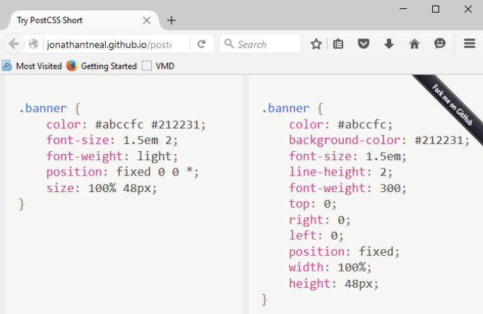

在上图中的代码中，我们使用了该包型插件内部除文本和数据简写插件之外的所有插件。在我们的代码中，已经使用了该包型插件中指定的简写型插件，PostCSS 根据每个插件的配置信息编译出有效的 CSS 样式。

至于我们使用哪些插件，则完全取决于实际的项目需求——最终你会发现，自己会有一组常用的插件。当你使用简写插件的经历越来越多之后，就会发现自己常用的插件都可以在 Rucksack 中找到。在这里提到 Rucksack，并不是建议你直接使用它然后一劳永逸，而是向你推荐一个优秀的 PostCSS 包型插件。

## Rucksack 和简写型插件

提起 Rucksack（译者注：英文中有旅行包的意思）这个词，有些人可能以为我们要去度假了。这么说有几分正确，不过我们首先要讨论一些现实的技术问题。

使用 PostCSS 就像是旅行一样轻松惬意，尤其是学会使用插件之后，那么整个工作就会变得非常简捷。在 Postcss 中你最有可能使用的包型插件就是 Rucksack（http://simplaio.github.io/rucksack/），其内部打包了多个简写插件用于提供多种不同的功能，比如：

- 别名（Alias）：该插件提供了开发者创建简写 CSS 属性的功能，仓库地址是 [https://github.com/seaneking/postcss-alias](https://github.com/seaneking/postcss-alias)。
- 清除浮动（Clearfix）：作为一个前端开发者，你一定熟悉 `clearfix` 代码。该插件是由 Sean King 创建的，用于生成 `clearfix` 代码，仓库地址是 [https://github.com/seaneking/postcss-clearfix](https://github.com/seaneking/postcss-clearfix)。
- 扩展字体（Font src expansion）：你还记得使用过多少次自定义字体吗？自定义字体的代码写起来挺伤的，所以这一插件的作用就是生成自定义字体的代码，其作者也是 Sean King，仓库地址是 [https://github.com/seaneking/postcss-fontpath](https://github.com/seaneking/postcss-fontpath)。

说起来有趣的是，其实在了解 Rucksack 之前，我们使用过 Rucksack 了：还记得第四章使用的 `postcss-responsive-type` 吗？还记得每个章节都会用到的 `autoprefixer` 吗？这些插件都被打包进了 Rucksack。Rucksack 实际上是一个建立在多个插件之上的抽象层，最终提供了一个统一的接口给我们使用。

聊天就到此为止，接下来让我们实战演练一下 Rucksack 的能力。在接下来的示例中，我们将会使用基础的 HTML 标签和 CSS3 属性创建一个简单的轮播图，而且不会使用任何的 JavaScript 代码。首先让我们快速了解一下要创建的轮播图，然后在介绍使用 Rucksack 编译 CSS 代码的方式。

### 示例讲解

对于接下来的示例，我们将打破传统，不再是一上来就安装插件，而是使用最原始的方式创建它，然后在此基础上确定哪些地方可以使用 Rucksack 进行改造和优化。

我们的示例只是一个简单的轮播图，其动画效果是由纯 CSS3 样式控制的。下图是即将创建的轮播图的截图：

为了查看该示例的效果，需要你打开随书代码中的 `T45 – converting to use Rucksack` 目录，拷贝其内部的文件到新建的项目目录中，然后点击其中的 `slider.html` 文件并在浏览器中打开即可预览轮播图效果。通过点击轮播图底部左侧的数值，可以手动切换不同的图片。

> 你需要将 `post-completed.css` 文件重新命名为 `style.css` 才能使示例正常运行。

### 安装 Rucksack

假设我们已经完成了示例，接下来就是安装 Rucksack，并确定示例中的哪些地方可以使用 Rucksack 进行处理。和大多数的 PostCSS 插件一样，我们可以使用 NPM 安装 Rucksack：

第一步：打开命令行窗口，将当前路径跳转到项目的根目录下。

第二步：在命令行中输入 `npm install rucksack-css --save-dev`，输入完成后按下回车键执行。

第三步：NPM 将会自动安装插件——如果一切顺利，我们将会看到类似下图的信息：

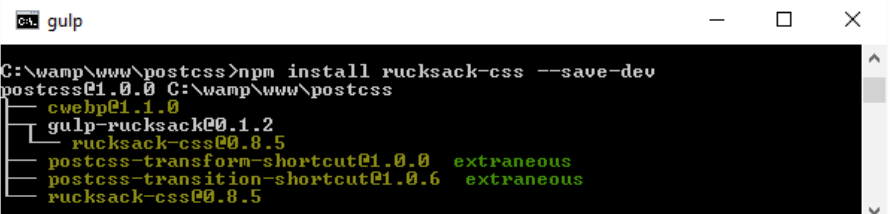

值得注意的是，Rucksack 名下有多个插件，确保安装的就是自己需要的插件。虽然我们使用了 Gulp 作为任务管理器，并且 Rucksack 提供了 Gulp 插件，但是该插件似乎并不能与 PostCSS 协同工作。

接下来，我们将使用 Racksack 创建一个简单的缓动动画，然后再使用它转换轮播图的代码。

### 缓动动画

如果一个开发者做过与网页内容相关的动画效果，那么他一定会写过控制页面内容缓进缓出的代码。为了让网页内容在缓进缓出之间取得平衡和协调，开发者需要做大量的工作，最终导致页面变得臃肿。

这些糟糕的事情，就是 Rucksack 展现威力的地方，它内部集成了一个专门用于处理缓动动画的插件——`postcss-easings`，该插件的托管地址是 [https://github.com/postcss/postcss-easings](https://github.com/postcss/postcss-easings)。在第七章中，我们已经见识到了它的作用：将任何有效的缓动动画名称转换为相应的 `cubic-bezier` 函数表达式。

> 有关贝赛尔曲线的示例，可以参考 [http://cubic-bezier.com/#.17,.67,.83,.67](http://cubic-bezier.com/#.17,.67,.83,.67)。

这么做对开发有什么帮助吗？我认为主要有两点好处：保持代码的一致性和提高程序的内聚性。

内聚性借鉴了类似 Sass 等预处理器的做法，即在文件的开始部分定义一些常量，然后在文件内部引用这些常量，最终预处理器将这些常量替换为实际的值。这有助于提高代码的一致性：我们可以在配置文件中定义任意的缓动动画，然后在编译期间替换为实际的值。

这意味着我们只需要定义和修改最顶部的常量就可以更新所有的节点，避免了对多处欢动值的多次修改。

接下来让我们了解一下即将要创建的这个示例：示例中包含四个正方形，只使用 HTML 和 CSS 为其添加动画效果。我们将会运用一系列的动画效果，比如如下所示的 `easeOutBack`：

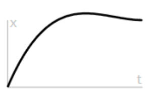

> 有关 `easeOutBack` 缓动动画的更多知识，请参考 [http://easings.net/#easeOutBack](http://easings.net/#easeOutBack)，该动画效果最终会被编译为 `cubic-bezier(0.175, 0.885, 0.32, 1.275)`。

让我们开始创建这个示例吧！

### 内容动画

如果你希望看到一个激动人心的动画效果，那么我可能让你失望了，因为我们的目标是用尽量少的代码，演示 Rucksack 创建缓动动画是有多么简单！之前我们提到在示例中只有四个正方形，它们的样式如下所示：

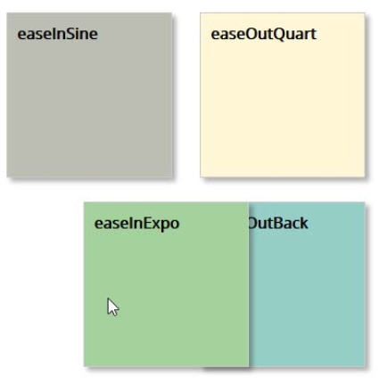

使用 Rucksack 创建该动画有一个严重的问题，我们将会在后文中讲到，先让我们来看一下开发步骤：

第一步：拷贝随书代码 `T44 - postcss-easings` 目录下的文件，并保存到新建的项目目录下。

第二步：拷贝 `T44 - postcss-easings` 目录下的 `gulpfile.js` 和 `package.json` 文件，并保存到新建项目的根目录下——如果目录下已经有这两个文件了，可以直接替换到它们或者将已有文件保存到其他地方。

第三步：将 `css – completed versions` 目录下的 `style – pre-comile.css` 文件拷贝到 `src` 目录下，然后将其重命名为 `style.css`。

第四步：打开命令行窗口并将路径跳转到项目的根目录下。

第五步：在命令行中，输入 `gulp` 并按下回车键执行——该命令用于编译相关的文件，编译过程如下所示：

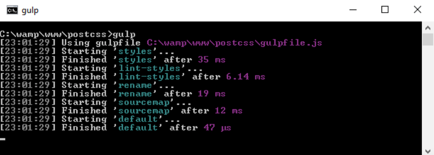

第六步：假设编译一切顺利，接下来需要将 `dest` 目录下的所有内容拷贝到 `T44 - postcss-easings` 目录下的 `css` 目录中。

第七步：打开浏览器预览示例效果——当鼠标悬停到正方形上时，就会触发动画效果；这些正方形的样式应该和上面的图例一致。

我们的示例非常简单，其目标就是演示通过提供恰当的配置信息，创建一致性的动画效果是多么的简单。不过，这里在选择插件上有一个非常重要的问题，接下来我们就谈谈这个问题。

#### 剖析代码

这个示例实际上被刻意简化了很多。`postcss-esaings` 插件通常不需要额外的配置信息，只有当你使用自定义的缓动动画时才需要定义配置信息。我们在这个示例中使用的缓动动画实际上已经预定义在了插件之中，如果打开编译后的样式文件，就会看到如下所示的代码：

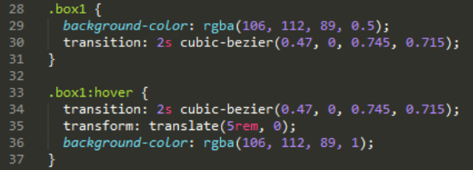

配置该插件的核心代码只有两行，大概是配置文件中的第十一行和第十六行：

    var rucksack = require('rucksack-css'); 
    .pipe(postcss([ rucksack() ]))

Gulp 配置文件中的绝大部分代码我们已经在之前的章节了解过了。Gulp 的任务配置通常都是经过深思熟虑的，便于开发者在未来继续复用配置信息。配置完插件信息之后，所有的缓动动画代码都会在编译过程中被转换为有效的 CSS 代码。

如果我们要使用一个自定义的缓动动画，那么只需要更新配置对象即可：

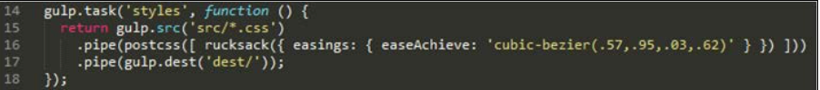

该插件通过配置对象的属性名自动推测了缓动动画的名称，便于开发者在编译之后比对结果，当编译出现问题时也可以及时定位问题。

在进行下一步的练习前，应该回答一个之前提出的一个问题了：我们应该选择哪一个插件？等等，我们正在使用的不就是 `postcss-easings` 插件吗？

实际上，`postcss-easings` 即可以独立安装，也可以通过安装 Rucksack 间接安装。关键之处在于，如果我们只会使用到 `postcss-easings`，那么就没有必要使用 Rucksack——在这种情况下，安装 Rucksack 只会增加整个工作流的负担。所以，我们可以将 Gulp 配置信息中的第十一行修改为：

    var easings = require('postcss-easings');

然后将第十六行修改为：

    .pipe(postcss([ easings() ]))

现在使用的插件和之前一样，编译后的文件也一样，唯一不同的是我们去除了冗余的 Rucksack 和其他插件。

### 使用 Rucksack 修改轮播图

如果我们正在使用 Rucksack，那么就应该认识到正确的使用方式是尽量少的向 Gulp 配置文件添加配置信息，多去选择合适的插件。看一看《示例讲解》一节的代码，就会发现我们可以使用一系列的插件改善现有的功能：

- **响应式排版：**我们的示例本身是响应式的，但是其中的标签文本在轮播图尺寸发生变化时却不能重新设置尺寸。通过使用 Rucksack 中的响应式字体即可解决这一问题。
- **简写位置：**该插件用于添加 `position` 属性。通过单行样式声明 `top`、`left`、`right` 和 `bottom` 四个属性，然后使用 PostCSS 插件处理繁重的工作，将我们从中解脱出来。
- **属性别名：**使用该插件可以设置任意属性的简写版本，这意味着只需要输入一两个字母，就可以让 PostCSS 编译出复杂的样式代码。
- **字体源扩展：**如果我们仔细查看样式信息i，就会在第六行发现一个小问题。样式中调用了 `Open Sans` 字体，当该字体并不是一个标准的网页字体。幸运的是，我们可以通过向浏览器声明字体源地址修改这个问题。Rucksack 提供了一个便捷的简写插件，用于生成与自定义字体相关的代码。
- **HEX RGBA 简写：**在样式文件中我们混合使用 `HEX` 和 `RGBA` 颜色，不幸的是某些低版本浏览器并不支持这些颜色值。通过使用 Rucksack，可以自动对此做出修卦，从而无需担心使用这两种颜色值的问题。
- **缓动动画：**我们已经在轮播图示例中使用了一些简单的缓动效果。在这个示例中，我们使用了 `postcss-easings` 插件，将动画名称转换为 `cubic-bazier` 值。在更新轮播图时，我们将会继续这一个话题。
- **自动添加浏览器前缀：**默认情况下不会使用这一插件，所以这取决于我们是否使用它。它引用我们在前几章中介绍的 `autoprefixer` 插件。如果我们想要充分使用 Rucksack 的功能，那么就可以直接使用它并移除代码中的与浏览器前缀相关的代码。我们将会使用 Rucksack 中的大部分插件，所以将会开启该插件的功能。不过，如果我们需要处理的只有一到两个属性，或者不需要支持低版本浏览器，那么就可以关闭它。
- **降级措施：**Rucksack 插件中引用的 laggard 专注于对低版本浏览器的支持。它提供了一系列的降级机制，比如为 `rem` 值添加降级方案，为 `RGBA` 值使用 `HEX` 降级方案，为 `will-change` 属性添加 3D transform 降级方案。我们需要使用这里的 `rem` 降级放哪，所以会启用该插件。

现在我们已经了解需要使用的插件，接下来就让我们修改代码吧：

第一步：拷贝随书代码 `T45 - converting to use Rucksack` 目录下的内容并保存到新建的项目目录中。

第二步：拷贝 `T45 - converting to use Rucksack` 目录下的 `gulpfile.js` 和 `package.json` 文件到新建的项目中。

第三步：接下来，拷贝 `T45 - converting to use Rucksack` 目录下的 `css-completed` 版本目录下的内容到新建项目根目录下的 `src` 目录下。重命名预编译的 `version.css` 文件为 `style.css`，然后在文本编辑器中打开该文件准备对其做一些修改。

第四步：第一个需要修改的地方就是将字体变成响应式的。查找 `font-size` 属性，然后将所有的属性值都修改为 `font-size: responsive`。这一改变应该覆盖所有的五个数值标签，其 HTML 结构是 `div.slide-content > figcaption`。

第五步：是添加简写版的 `position` 属性。在这个示例中，我们只需要第 42 行的一个地方。`botto`、`left`、`right` 和 `top` 属性在样式的第 33~36，需要使用以下代码替代：

    position: 427px 0 0 0;

> 注意，其他 `position` 属性的位置信息不能使用这种方法进行替换，因为我们没有为这些规则指定独立的位置。

第六步：然后我们需要为属性添加一些别名，在这里这些别名只是现有属性的一个简写。对于我们的示例，需要在样式文件的顶部添加以下别名：

    @alias { 
        pb: padding-bottom; 
        bs: box-shadow; 
        bgc: background-color; 
    }

接下来，查找并替换包含这三个属性的样式，将所有的属性名替换为 `@alias` 中定义的别名。

第一步：还记得上面提到的 `Open Sans` 字体问题吗？修改这一问题很简单，只需要在样式文件的顶部添加以下代码块即可，改代码块的作用是声明自定义字体：

    @font-face { 
        font-family: 'open_sansregular'; 
        font-path: '../fonts/OpenSans-Regular-webfont'; 
        font-weight: normal; 
        font-style: normal; 
    }

第二步：在前几节我们已经提到 Rucksack 可以根据缓动动画的名称转换为相应的 `cubic-bezier` 值。当前示例使用了一个缓动动画，并且 Rucksack 也内置了该动画效果，所以无需再修改我们的代码。Rucksack 也内置了将 `RGBA` 值转换为 `HEX` 值的功能，所以有关 `RGBA` 颜色值的代码也无需修改。

第三步：剩余需要改动的是降级处理和添加浏览器前缀。通过修改 Gulp 的配置文件即可完整这两项工作，修改内容如下图所示：

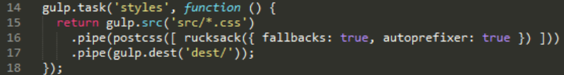

第四步：保存修改后的玩呢加你，然后打开命令行并确保当前路径是我们新建项目的根目录。

第五步：在命令行中，输入 `gulp` 命令并按下回车键执行。通过该命令，PostCSS 会自动编译源文件，如果一切顺利，我们将会在 `dest` 目录内看到编译后生成的文件：

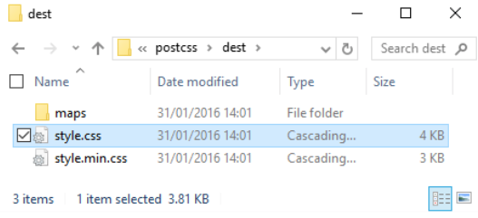

到目前为止，我们已经编译完成了一系列的文件。为了确认我们的示例运行正常，需要将生成后的文件拷贝到 `T45 - converting to use Rucksack` 目录下的 `css` 目录中。通过点击 `slider.html` 即可在浏览器中预览最终的结果。如果一切顺利，我们将会看到如下图所示的效果：

我们已经拥有了一个可以正常运行的示例，而且整个编译过程也很成功，那么就让我们开始下一个任务！

### 代码分析

我们有必要看一看编译后的代码，这是因为 Rucksack 在编译代码的过程中可能做了我们并不了解的改动。

举例来说，在下面的代码中可以看到 Rucksack 提供了将 `rem` 值转换为像素值、将 `RGBA` 值转换为 `HEX` 值的功能，转换之后还会保留原始的值：

    body { 
        font-family: "open_sansregular"; 
        line-height: 25.888px; 
        line-height: 1.618rem; 
        background-color: #ecf0f1; 
        background-color: rgba(236, 240, 241, 1.0); 
        color: #44466a; 
        color: rgba(68, 68, 618, 1.0);
    }

接下来，让我们看看第 96 行。还记得我们修改过的 `font-size: responsive` 吗？下面是它编译后的值：

    font-size: calc(12px + 9 * ( (100vw - 420px) / 860));

在样式文件的底部——大约整个文件三分之二的地方，生成了大量的媒体查询语句。这些媒体查询语句也是构成响应式字体样式的一部分。在第 226 行，我们发现了以下代码：

    -ms-filter: "progid:DXImageTransform.Microsoft.Alpha(Opacity=0)";
    -webkit-transition: opacity 0.35s;
    transition: opacity 0.35s;

第一次看到这个代码，你可能会疑问这些代码是从哪里来的，因为我们从没有在写过类似 `ms-filter` 的代码。这全都得感谢 Rucksack，它自动为 `opacity` 属性添加了 IE 浏览器可以识别的代码。

这个探索的核心是将对插件的选择作为工作流迭代演进的一部分，只有网站不再需要某些插件时，才会停止这种迭代。举例来说，我们可以轻松添加另一个流程将 `calc()` 转换为静态的数值（可以使用 `postcss-calc` 插件）。我们应该考虑周期性地使用 `postcss-remove-prefixed` 插件使代码保持最新状态。也许在未来，我们将不会再需要浏览器前缀，甚至会将现有的浏览器前缀视为负担。

除了这些改动之外，还有很多地方值得思考：你会发现在我们的 Gulp 配置文件中 Autoprefixer 所在的那一行已经被注释了：

之所以这么做，是因为 Rucksack 内置了 `autofixer`，所以无需调用两次。但实际上，它们调用的都是同一个插件。在 Rucksack 内部调用和独立调用该插件都没有问题。具体的做法很大程度上取决于 Rucksack 中其他插件的调用方式，以及添加 `autoprefixer` 是否有助于增强使用 Rucksack 的健壮性。

## 审查和优化代码

带宽的使用量往往成为一个网站成功与否的关键。还记得那些使用 56K 调制解调器的日子吗？虽然那些日子已经过去了很久，但我们仍然不能随意浪费带宽。

降低带宽的一种方式就是在发布网站之前对样式代码进行审查和压缩——并不是每个开发者的工作流都需要包含它们。我们可以手动处理这两步，但手动处理太浪费时间，并让最终的代码失去了一致性。

借助 PostCSS，我们可以从这些繁重的工作中脱身出来。`stylelint` 和 `cssnano` 两个包型插件就是非常强大的性能优化工具。如果仔细查看我们最近创建的大多数 Gulp 配置文件，就会发现这两个工具已经配置好了，`stylelint` 在第 22 行，`cssnano` 在第 38 行：

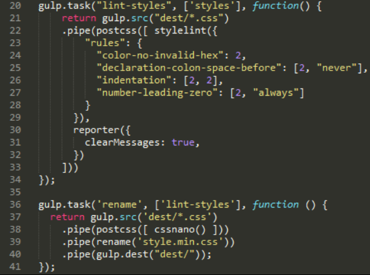

### 使用 cssnano

对于第一次接触 PostCSS 的开发者，通过指定 `cssnano()` 作为 PostCSS 的处理器即可满足基本需求：

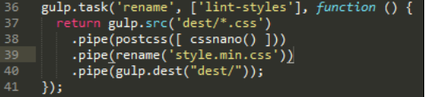

如果我们查看一下随书代码 `T45 – converting to use Rucksack` 中的示例，就会发现 4KB 的原始代码编译之后减少了 3KB。虽然它只是一个小文件，但是编译后体积仅为之前的 25%，这种结果还是很可观的。

> 在这里值得一提的是，虽然我们使用的任务管理器是 Gulp，但我们使用插件是 PostCSS 版本，并不是 `gulp-cssnano`。

`cssnano` 插件并不是一个单一插件，而是打包了多个插件的包型插件，其内部主要包含了以下插件：

- `postcss-reduce-idents`：该插件用于减少自定义的标志符名称（比如 `@keyframes` 中用到的标志符名称），最终会将其压缩成两个字母的名称，从而实现压缩代码体积。
- `postcss-zindex`：该插件会将所有的 `z-index` 值调整到合理地值，从而减少字符量。
- `postcss-convert-values`：如果 CSS 使用了不同的单位，使用该插件可以根据压缩需要进行单位转换。举例来说，使用该插件之后 `400ms` 会被转换为 `.4s`（减少了两个字符）。有些人可能认为这有些极端，但是每一点压缩都有助于节省带宽。
- `postcss-colormin`：使用该插件可以减少颜色值的长度。举例来说，如果我们在代码中使用了 `rgba(255, 0, 0, 1)`，那么它就会被转换为 `red`。虽然这种方式压缩了文件体积，但是让颜色值失去了一致性，这可能并不是我们想要的结果。

使用 `cssnano` 时，有一些关键概念需要值得注意：

第一：你会发现我们在 Gulp 配置文件中使用了 `gulp-rename` 插件，这是因为 `cssnano` 没有对压缩后的文件进行重命名的功能。通过使用 `gulp-rename` 插件，开发者可以创建一个压缩版本的文件，该文件是源文件的复制品，并不影响源文件的存在。

第二：`cssnano` 中的大多数选项默认都是启用的，通过配置信息我们可以决定关闭或启用这些独立的选项：

    var nano = require('gulp-cssnano'); 

    gulp.task('default', function () { 
        return gulp.src('./main.css') 
            .pipe(nano({discardComments: {removeAll: true}})) 
            .pipe(gulp.dest('./out')); 
    });

> 完整的编译选项，请参考 [http://cssnano.co/options/](http://cssnano.co/options/)，点击该链接可以查看 `cssnano` 的所有配置选项。

第三： 该插件内部包含了 `autoprefixer`。严格地说，已经无需再像前一个练习中那样安装独立版本的 `autoprefixer`。我们将会在第十章中优化处理器的话题，对此再做深入讨论。

第四： cssnano 中有一些编译选项默认是禁用的。这些选项被认为是不安全的，只有开发者认为 100% 不影响代码的情况才可以使用它们。有关不安全编译选项的更多信息，请参考 [http://cssnano. co/options/](http://cssnano. co/options/) 的 `options` 页面。

接下来，我们将要介绍 `stylelint` 包型插件。与 `cssnano` 不同的是，`stylelint` 使用另一种截然不同的方法，并且允许开发者自由启用 100 多条规则中的任意规则。

### 配置 Stylelint

在你没有听说过 Stylelint 之前，你还记得别人是什么介绍它的吗？引用其官方网站的一句话来形容，“Stylelint 是一个全能、现代化的 CSS 代码审查工具”。

无论对此是否认同，Stylelint 作为一款 CSS 代码审查工具都值得我们了解，其官方地址是 [http://stylelint.io/](http://stylelint.io/)。该插件的核心并不在于插件自身，而在于我们所选择的审查规则。目前，我们可以使用 100 多条规则中的任意规则，甚至随意搭配规则。这些规则即可以单独配置在 `.stylelintrc` 文件中，也可以配置在 `package.json` 文件中，还可以写在 `stylelint.config.js` 文件中作为 JavaScript 对象引入到其他文件中。

其实，在之前的项目中我们已经使用过了 stylelint。为了方便起见，我们将要审查的规则写在了 Gulp 的配置文件中：

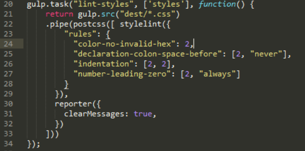

为了演示如何使用 Stylelint，我禁用了一些规则。当前，具体需要使用哪些规则对代码进行审查完全取决于开发者自己。Stylelint 默认情况下并不启用任何规则，所有的代码审查都严格遵循配置文件中指定的规则。

> Stylelint 的官网 [http://stylelint. io/](http://stylelint. io/) 列述了在代码编译之前所有可用的审查规则。

举例来说，当我们依据黄金法则创建响应式网站时，往往会希望限制百分比数值小数位不要多于三个或四个。为此，我们可以使用 `number-max-precision` 插件，该插件接收一个整数参数。当我们指定小数位多余 3 个就发出警告信息时，那么以下两条语句都会触发该警告信息：

    .foo { top: 3.2456px; } 
    .foo { top: 3.245634px; }

但该插件不会对下面的代码发出警告：

    @media (min-width: 3.234em) {...}

我强烈建议开发者阅读 Stylelint 的审查规则，了解这些规则的可用性。阅读这些规则会花费一定的时间，但是这有助于我们在发布网站前更好地优化和审查代码。有一点需要指出的是，无论如何优化代码，我们都会在代码中包含为了兼容低版本浏览的降级样式。

在理想情况下，我们会建议客户放弃对低版本浏览器的支持。如果客户坚持兼容低版本浏览器，那么使用 PostCSS 就可以轻松实现兼容性。接下来让我们探索一下兼容性问题，其中主要是对 IE 的兼容性处理，当然大部分的兼容性方法也适用于其他浏览器。

## 降级处理

设计网页时的最值得关心的一个问题就是浏览器的兼容性，换言之，我们的代码要支持哪些浏览器？如果我们支持的浏览器是 Firfox、Chrome，那么开发工作就会轻松很多。问题在于，我们还要考虑 IE、Safari、Edge……更不要说品种繁多的移动设备了。

对于与规范不符合的低版本浏览器，我们将会提供部分功能的支持或者提供优雅降级的代码。幸运的是，PostCSS 社区为我们提供了一系列处理此类问题的插件，比如我们之前使用过的 autoprefixer。PostCSS 社区还有其他可用插件，我们将会在接下来的几个小节深入了解这些插件。在此之前，先让我们来了解一个有用的技巧，那就是如何检测和支持低版本浏览器。

### 检测兼容性

开发流程的重要一环就是确保代码可以在需要支持的浏览器上正常运行。如果我们需要支持的浏览器都是现代浏览器，那么很少会存在兼容性问题。

但是对于部分开发者，他们的工作要求必须支持低版本的浏览器，尤其是基于低版本浏览器开发的应用，完全不可避免的需要解决兼容性问题。

检测浏览器的兼容，我们可以使用类似 Modernizr（[http://www.modernizr.com](http://www.modernizr.com)）的工具库，但更高效的方式是使用 CSS 的 `@supports` 指令。简而言之，该指令类似于媒体查询语句，首先需要为所有浏览器提供一个基础属性，然后当浏览器支持增强型属性时，就使用增强型属性替代基础属性：

    section {
        float: left; 
    }

    @supports (display: -webkit-flex) or (display: flex) { 
        section { 
            display: -webkit-flex; 
            display: flex; 
            float: none; 
        } 
    }

总体来说，使用该指令处理低版本浏览器的兼容性问题会非常有用。理想情况下，我们会建议客户放弃对低版本浏览器的支持。如果我们必须支持低版本浏览器，那么使用该指令并配合 autoperfixer 插件，解决兼容性问题也会手到擒来。

### oldie

在处理兼容性问题时，最大的问题就是微软的 IE 浏览器。尽管微软的新版本浏览器份额在不断增长，但由于微软操作系统的市场占用率高，仍然有大量低版本浏览器需要进行兼容性处理。

值得赞扬的是，微软预警宣布不再支持 IE8~10 版本的浏览器。虽然微软在激励用户升级浏览器上迈出了正确的一步，但是在这些浏览器占领大部分市场份额之前还有一段漫长的时间。

所以，如果需要兼容低版本的 IE 浏览器，我们该做么做呢？一个好的方案是使用 oldie 包型插件，该插件的名称包含了术语 oldIE，也就是那些很久以前使用过的低版本 IE 浏览器。

该插件的仓库地址是 [https://github.com/jonathantneal/oldie](https://github.com/jonathantneal/oldie)，其内部打包了一系列的 PostCSS 插件：

- `post-calc`：该插件会尽可能将所有的 `cacl()` 转换为数值，对于混合使用了多种度量单位的 `cacl()` 有可能不会被转换。
- `post-unroot`：如果我们的样式中使用了 `:root` 选择器，那么低版本 IE 浏览器将无法识别它；该插件的作用就是使用 `html` 选择器替代 `:root` 选择器。
- `post-unnot`：如果我们的样式中使用了 `:not` 选择器，那么该插件就会将此类选择器移除。
- `post-unopacity`：该插件的作用是将所有的 `opacity` 属性转换为 `filter: alpha(opacity=XX)`，其中 `xx` 是原始不透明度属性值转换后的值。

oldie 还包含了其他插件，详细的插件列表可以通过 oldie 项目中的 `index.js` 文件查看：

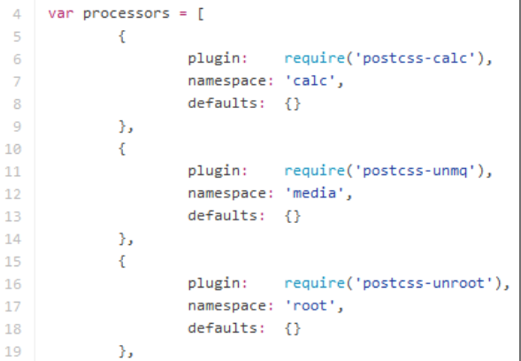

如果我们创建的样式恰好避开了这些存在兼容性问题的属性，那么我们就不用安装完整的 oldie，只需从中选择需要的插件进行选择即可。

这种情况是有可能出现的，所以一切都取决于开发的需求程度，但通常来说最终我们会安装 oldie 中的全部插件。当然，我们还是应该说服客服放弃低版本浏览器——这做起来确实不简单……

### 删除兼容性代码

如果我们运气好遇到了能够理解兼容性问题的客户，那么我们的首要工作就是删除不再支持的浏览器的兼容性代码。如果我们的代码总量很少，那么通过手动删除即可完成这项工作。但是通常来说，我们面对的会是经过长时间开发的大型样式，其内部包含了各种兼容性代码。

实际上，我们可以通过 `stylehacks` 插件来完成这件事，该插件还可以和本书中经常使用的 `stylelint` 配合使用。`stylehacks` 的仓库地址是 [https://github.com/ben-eb/stylehacks](https://github.com/ben-eb/stylehacks)，该插件运行时的依据是 [http://browserhacks.com](http://browserhacks.com) 列出的兼容性代码列表。接下来就让我们安装和使用它吧：

第一步：拷贝随书代码 `T47 - using stylehacks` 目录下的内容到新建项目的目录中。

第二步：拷贝 `gulpfile.js` 和 `package.json` 为到新建项目的根目录下。

第三步：在文本编辑器中新建文件并输入以下代码，输入完成后保存到新建项目的 `src` 目录中（不是 `T47 - using stylehacks` 目录），并命名为 `style.css`：

    h1 { 
        _color: white; 
        color: rgba(255, 255, 255, 0.5); 
    }

第四步：打开命令行窗口，将路径跳转到项目的根目录下。

第五步：在命令行中输入以下命令，输入完成后按回车键执行——该命令用于安装插件 stylehacks：

    npm install stylehacks --save-dev

第六步：插件安装完成后，在命令行中输入 `gulp` 命令并按下回车键执行。

第七步：PostCSS 会自动编译代码。如果一起顺利，我们将在项目根目录下的 `dest` 目录中看到如图所示的文件：

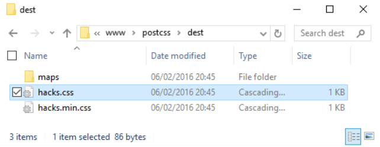

假设现在我们已经编译成功了，接下来使用编辑器打开 `style.css` 文件就看到：文件底部包含了 source map；有关颜色的兼容性代码已经被删除的。

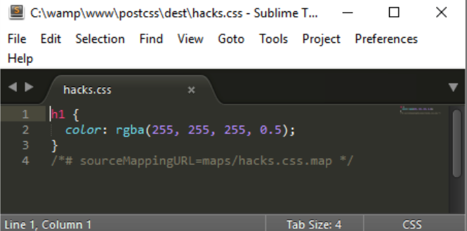

该任务的核心流程写在了 Gulp 的配置文件中：

    gulp.task('styles', function () { 
        return gulp.src('src/*.css') 
        .pipe(postcss([ stylehacks({browsers: 'last 1 version, >10%'}) ])) 
        .pipe(gulp.dest('dest/')); 
    });

在 Gulp 配置文件中，我们添加了 `browsers` 属性，该属性用于告知 `stylehacks` 删除高级浏览器或者市场份额超过 10% 的浏览器所不需要的兼容性代码。该配置参数参考了浏览器查询列表 [https://github.com/ai/browserslist](https://github.com/ai/browserslist) 的数据—— autoprefixer 内部也使用了该数据。

> 如果项目中的多个插件都使用了浏览器查询列表的数据，可以使用一个变量保存这些查询数据，从而便于统一管理和更新。更多信息请参考 GitHub 上浏览器查询列表的介绍。

虽然这只是一个简单的插件，但回到本书的探索精神上来说还有一个不得不问的问题：在现实中这个插件真的具有实用性吗？某人人可能觉得我的思维有些混乱，请容我对此做详细的解释。

如果你使用过 jQuery，那么你应该知道从 jQuery 2.x 开始，它已经不再支持 IE6~8 浏览器了，从此之后只有 1.x 分支会支持低版本浏览器。jQuery 1.x 中的很多代码包袱都是为了解决浏览器的兼容性问题，而兼容性问题最严重的就是 IE！

在编写本书的时候，微软已经公开表示放弃对 IE10 及以下版本的支持，它们指挥只会支持 Windows 8.1 平台的 IE11 以及新的浏览器 MS Edge。

由于之前的很多 CSS 兼容性代码都是为 IE 开发的，所以我们不得不思考未来 stylehacks 插件是否还有实用价值。我们也应该扪心自问：使用兼容性代码是否是一个好的设计方案；使用兼容性代码是否是在为未来遗留问题；我们是否应该重新思考原始设计；我们是否需要将兼容性代码合并到一个单独的文件中，而不是将其与常规代码写在一起？

## 总结

使用 PostCSS 就是在不断探索社区中持续增长的插件库。从某些方面来说，这可以被视为是一场探索之旅。无论是独立的插件还是打包了多种插件的包型插件，都值得我们不断去探索。下面让我们花一些时间回顾一下本章的主要内容。

首先，我们了解了使用插件是如何减少开发时间的，比如使用简写属性和自动生成缺失的样式。此外，还有一些插件帮助我们为兼容低版本浏览器提供了兼容性代码。

然后，我们以 `postcss-short` 插件为例，演示了如何减少开发时间，进而了解了 Rucksack 包型插件自动添加开发中所需要的样式。为了探索 Rucksack 的工作机制，我们做了一个简单的缓动动画示例，并使用 Rucksack 对轮播图代码进行了优化和完善。此外，我们还总结一些使用 Rucksack 包型插件提高项目开发效率的方法。

接下来，我们了解了对任何开发者的工作流都非常重要的一项工作——一致性代码审查和优化。我们介绍了 `cssnano` 和 `stylelint` 插件的使用方式，以及如何将它们融合进我们的项目中。

最后，我们重新讨论了对低版本浏览器的兼容性处理，并了解了如何使用 PostCSS 插件处理兼容性问题，弥补了之前的不足。我们还阐述了兼容性处理的首要目标就是 IE 浏览器，并讨论了我们是应该继续支持旧版本浏览器，还是考虑任其在历史的流逝中慢慢消失。

这真是一次匆忙的 PostCSS 包型插件的学习之旅！我们的学习之旅不会到此为止，在下一章中我们将会总结前几章的知识，创建一个功能完备的自定义处理器。
