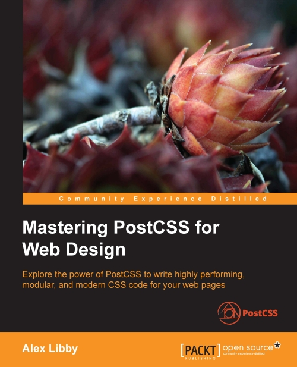

# 深入PostCSS Web设计

深入PostCSS Web设计是@Packt Publishing发布的《[Mastering PostCSS for Web Design](https://www.packtpub.com/web-development/mastering-postcss-web-design)》。该中文版本由 电子工业出版社 委托社区同学：@大漠、@孙崇升、@姬忠静 和 @肖少彦 几位同学所译。

目前该书已在中国市场上架，感兴趣的同学可以购买实体书一阅。

> **特别声明，由于我们水平有限，如果翻译不对之处还请各路大婶拍正。如果您英文阅读无障碍，更建议您直接购买英文版本阅读！**

## 目录

- [第1章：PostCSS简介](Ch1.md)
- [第2章：创建变量和混合宏](Ch2.md)
- [第3章：嵌套规则](Ch3.md)
- [第4章：创建媒体查询](Ch4.md)
- [第5章：管理颜色、图片和字体](Ch5.md)
- [第6章：创建网格](Ch6.md)
- [第7章：动画元素](Ch7.md)
- [第8章：PostCSS 插件开发](Ch8.md)
- [第9章：简写、降级和包型插件](Ch9.md)
- [第10章：自制处理器](Ch10.md)
- [第11章：管理自定义语法](Ch11.md)
- [第12章：混合处理器](Ch12.md)
- [第13章：排除解决PostCSS相关问题](Ch13.md)
- [第14章：为将来新特性做准备](Ch14.md)

## 勘误

由于我们水平有限，书中难免有不对之处，如果您是该书的阅读者，发现书中不对之处，欢迎在此给我们提[Issues](https://github.com/airen/Mastering-PostCSS-for-Web-Design/issues)。

## 版权声明

> **特别声明：如果未得到授权，严禁转载本仓库下的任何内容，包括代码和图片！如有造成侵权，出版方有权追究相关的法律责任！**